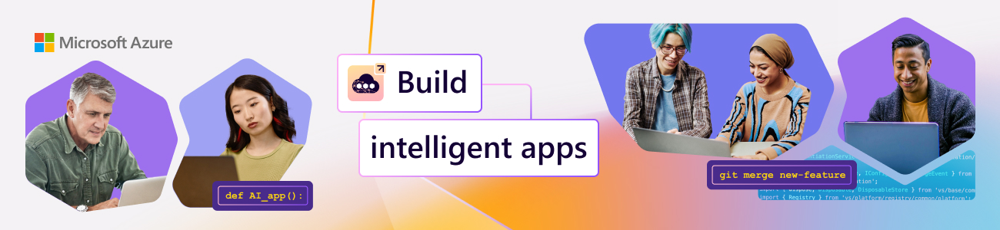
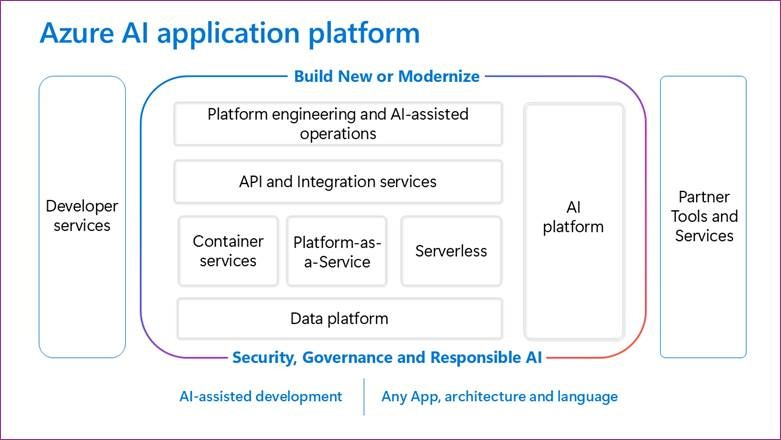
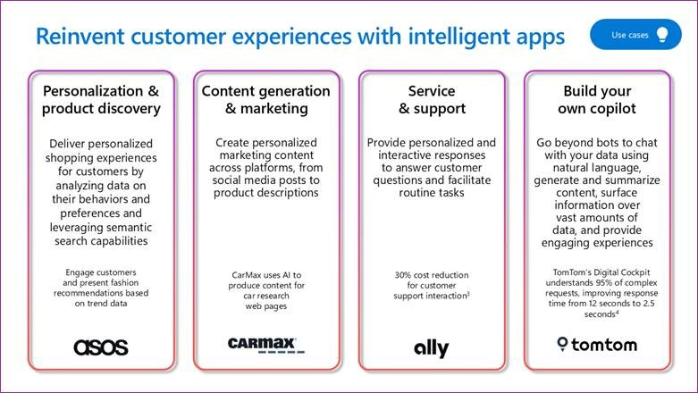
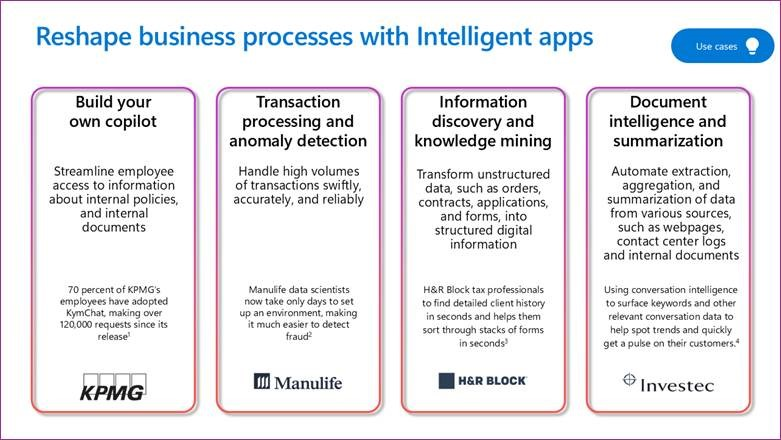

<head> 
  <meta property="og:url" content="https://azure.github.io/cloud-native/30-days-of-ia-2024/kick-off"/>
  <meta property="og:type" content="website"/>
  <meta property="og:title" content="Build Intelligent Apps | AI Apps on Azure"/>
  <meta property="og:description" content="Join us on a learning journey to build intelligent apps on Azure. Read all about the upcoming #BuildIntelligentApps initiative on this post!"/>
  <meta property="og:image" content="https://github.com/Azure/Cloud-Native/blob/main/website/static/img/ogImage.png"/>
  <meta name="twitter:url" content="https://azure.github.io/Cloud-Native/30-days-of-ia-2024/kick-off" />
  <meta name="twitter:title" content="Build Intelligent Apps | AI Apps on Azure" />
  <meta name="twitter:description" content="Join us on a learning journey to build intelligent apps on Azure. Read all about the upcoming #BuildIntelligentApps initiative on this post!" />
  <meta name="twitter:image" content="https://azure.github.io/Cloud-Native/img/ogImage.png" />
  <meta name="twitter:card" content="summary_large_image" />
  <meta name="twitter:creator" content="@devanshidiaries" />
  <link rel="canonical" href="https://azure.github.io/Cloud-Native/30-days-of-ia-2024/kick-off" />
</head>

<!-- End METADATA -->

In today’s fast-paced digital world, staying ahead means harnessing the power of technology to create smarter, more responsive applications. We’re excited to introduce you to our new edition of Build '#IntelligentApps', your go-to destination for skilling up on how to leverage AI to transform your applications and drive innovation.

We’re bringing together a comprehensive suite of content designed to guide you through the latest in AI powered application development. Our goal is to empower developers, data scientists, and business leaders with the knowledge and tools needed to leverage AI effectively. Follow along for a sneak peek at what to expect.

## What We’ll Cover

* What is Build Intelligent Apps?
* How can you *participate*?
* How can you *skill up*? (in just 30 Days)

## Get Ready to Build #IntelligentApps starting September 16!

Today, we kick-off with new content and activities for you to skill up on all things Intelligent Apps on Azure with “how-to” blogs, events, and community interactions! Read on to learn about what is coming!

## Explore Our Initiatives

We have a number of initiatives exclusively curated to build an engaging learning journey for you to skill up on relevant technologies for building intelligent apps.

* [#30Days of IA](https://azure.github.io/Cloud-Native/30-days-of-ia-2024) - 4 themed weeks of blogs on AI led application development in Java or Python using Azure Application Platform, Azure Data Platform and Azure AI.
* [Learn Live Series](https://aka.ms/FallForIA/LearnLive) – 5 weekly livestream episodes on AI app development in Python or .NET.
* [Demo Bytes](https://azure.github.io/Cloud-Native/Build-IA/DemoBytes) – snackable demo playlist on building intelligent apps in Java, Python, .NET and using GitHub Copilot.
* [AI Skills Challenge](https://aka.ms/build-ia/csc) – show your skills by competing with peers to complete learn modules and earn a badge.

:::info

## [Register for the events!](https://aka.ms/bia/events?ocid=biafy25h1_30daysofia_webpage_azuremktg)

What are 4 things you can do today, to jumpstart your learning journey?

* **Register**  for [Learn Live](https://aka.ms/bia/events?ocid=biafy25h1_30daysofia_webpage_azuremktg) (free, online) – weekly live learning with SMEs
  * September 12 | Episode 1: [Data-driven AI applications and multi-modal search](https://developer.microsoft.com/reactor/events/23495/?ocid=biafy25h1_30daysofia_webpage_azuremktg)
  * September 18 | Episode 2: [Containerizing and Deploying AI Workloads on AKS](https://developer.microsoft.com/reactor/events/23702/?ocid=biafy25h1_30daysofia_webpage_azuremktg)
  * September 25 | Episode 3: [Operational Excellence with AKS](https://developer.microsoft.com/reactor/events/23497/?ocid=biafy25h1_30daysofia_webpage_azuremktg)
  * October 2 | Episode 4: [Get Started Incorporating AI into Your .NET Applications and Service](https://developer.microsoft.com/reactor/events/23656/?ocid=biafy25h1_30daysofia_webpage_azuremktg)
  * October 9 | Episode 5: [Modernize Your Apps Using GenAI Without Rewriting the Code](https://developer.microsoft.com/reactor/events/23657/?ocid=biafy25h1_30daysofia_webpage_azuremktg)
* **Register** for [Demo Bytes](https://aka.ms/bia/events?ocid=biafy25h1_30daysofia_webpage_azuremktg) (free, online) - snackable demo playlist
  * September 16 | Episode 1: [AKS Automated Deployments - Streamlining Kubernetes Deployments](https://developer.microsoft.com/reactor/events/23702/?ocid=biafy25h1_30daysofia_webpage_azuremktg)
  * September 17 | Episode 2: [Deliver AI infused app innovation with Open Liberty on AKS](https://developer.microsoft.com/reactor/events/23587/?ocid=biafy25h1_30daysofia_webpage_azuremktg)
  * September 19 | Episode 3: [Fine-tuning open-source models made easy with KAITO](https://developer.microsoft.com/reactor/events/23697/?ocid=biafy25h1_30daysofia_webpage_azuremktg)
  * September 23 | Episode 4: [Get your on-prem apps AI-ready using GitHub Copilot](https://developer.microsoft.com/reactor/events/23588/?ocid=biafy25h1_30daysofia_webpage_azuremktg)
  * September 24 | Episode 5: [Add Generative AI Capabilities to your Web Apps](https://developer.microsoft.com/reactor/events/23590/?ocid=biafy25h1_30daysofia_webpage_azuremktg)
  * September 26 | Episode 6: [Apply Auto-Scaling and Load Testing to your AI Applications](https://developer.microsoft.com/reactor/events/23592/?ocid=biafy25h1_30daysofia_webpage_azuremktg)
  * September 30 | Episode 7: [Configure & Deploy Intelligent Java SpringBoot Apps on Azure App Service](https://developer.microsoft.com/reactor/events/23593/?ocid=biafy25h1_30daysofia_webpage_azuremktg)
  * October 1 | Episode 8: [End-to-End AI application deployments with GitHub Copilot](https://developer.microsoft.com/reactor/events/23594/?ocid=biafy25h1_30daysofia_webpage_azuremktg)
  * October 3 | Episode 9: [Extending GitHub Copilot to chat with your Postgres Database](https://developer.microsoft.com/reactor/events/23595/?ocid=biafy25h1_30daysofia_webpage_azuremktg)
  * October 7 | Episode 10: [Architecting a Unified AI Stack: Secure, Responsible, and Scalable](https://developer.microsoft.com/reactor/events/23596/?ocid=biafy25h1_30daysofia_webpage_azuremktg)
  * October 8 | Episode 11: [10x Developer with GitHub Copilot](https://developer.microsoft.com/reactor/events/23597/?ocid=biafy25h1_30daysofia_webpage_azuremktg)
  * October 10 | Episode 12: [Building and Running Intelligent Spring Apps on Azure Container Apps](https://developer.microsoft.com/reactor/events/23598/?ocid=biafy25h1_30daysofia_webpage_azuremktg)
  * October 14 | Episode 13: [Ingest your own content using Azure Functions OpenAI Triggers & Bindings](https://developer.microsoft.com/reactor/events/23599/?ocid=biafy25h1_30daysofia_webpage_azuremktg)
  * October 15 | Episode 14: [GenAI Gateway Capabilities in Azure API Management](https://developer.microsoft.com/reactor/events/23600/?ocid=biafy25h1_30daysofia_webpage_azuremktg)
  * October 17 | Episode 15: [Elevate Policy Authoring Experience in API Management](https://developer.microsoft.com/reactor/events/23601/?ocid=biafy25h1_30daysofia_webpage_azuremktg)
* **Register** for the [AI Skills Challenge](https://aka.ms/intelligent-apps/csc?ocid=biafy25h1_30daysofia_webpage_azuremktg) to earn a Microsoft Learn badge – ends on *November 1*!.

:::

## #30Days Of Intelligent Apps

[#30Days of IA](https://azure.github.io/Cloud-Native/30-days-of-ia-2024) is a series of “how-to” blog posts grouped into themed weeks - taking you from core concepts to end-to-end solution examples in 30 days. Each blog will provide conceptual lessons paired with exercises and resources to help you reinforce learnings and take next steps.

This series takes you through learning journey in **four stages**, each building on the previous week to help you skill up in a beginner-friendly way:

* **Week 1**: Build AI powered content generation [intelligent app in Java on Azure Kubernetes Service (AKS)](https://azure.microsoft.com/blog/build-next-generation-ai-powered-applications-on-microsoft-azure/?ocid=biafy25h1_30daysofia_webpage_azuremktg)
* **Week 2**: Build AI powered content generation [intelligent app in Java on Azure App Service](https://azure.microsoft.com/blog/build-next-generation-ai-powered-applications-on-microsoft-azure/?ocid=biafy25h1_30daysofia_webpage_azuremktg)
* **Week 3**: Build your own copilot with [Azure AI Studio](https://azure.microsoft.com/products/ai-studio/?msockid=115fb720d83d62ad12f8a380d9876328&ocid=biafy25h1_30daysofia_webpage_azuremktg), [Prompty](https://github.com/microsoft/prompty) and AKS
* **Week 4**: Infuse AI-assisted development tools to [enhance your efforts](https://www.microsoft.com/research/publication/the-space-of-developer-productivity-theres-more-to-it-than-you-think/?msockid=115fb720d83d62ad12f8a380d9876328&ocid=biafy25h1_30daysofia_webpage_azuremktg) and experience.

We will start with defining intelligent apps and then expand on how to build with cloud technologies like [Azure Kubernetes Service (AKS)](https://azure.microsoft.com/products/kubernetes-service/?ocid=biafy25h1_30daysofia_webpage_azuremktg), [Azure App Service](https://azure.microsoft.com/products/app-service/?ocid=biafy25h1_30daysofia_webpage_azuremktg), [Secure API Management](https://azure.microsoft.com/products/api-management/?ocid=biafy25h1_30daysofia_webpage_azuremktg), and [GitHub Copilot](https://github.com/features/copilot?ef_id=_k_77f1fde05f071240ccbe9b3b760f8c57_k_&OCID=AIDcmmb150vbv1_SEM__k_77f1fde05f071240ccbe9b3b760f8c57_k_&msclkid=77f1fde05f071240ccbe9b3b760f8c57) as well as integrate AI and cloud-scale data. You will learn how to build end-to-end scenarios for real world application development based on [reference architectures](https://learn.microsoft.com/azure/architecture/?ocid=biafy25h1_30daysofia_webpage_azuremktg). Before we dive deep on intelligent apps, here is a high-level overview of the **Intelligent Apps** landscape on Azure for you to leverage the most comprehensive, trusted cloud to prime the customer and employee experiences.

The Azure application platform is designed to help you deliver on the promise of intelligent applications. It’s an [integrated platform](https://azure.microsoft.com/solutions/build-modernize-intelligent-apps?ocid=biafy25h1_30daysofia_webpage_azuremktg) that encompasses developer services, application services, databases, and [AI](https://azure.microsoft.com/solutions/ai/?ocid=biafy25h1_30daysofia_webpage_azuremktg) services. Leveraging Azure’s robust security capabilities and principles around governance and [responsible AI](https://www.microsoft.com/ai/responsible-ai?ocid=biafy25h1_30daysofia_webpage_azuremktg), the platform supports what you already use to help you make your apps intelligent. The developer stack on Azure also integrates AI, enhancing productivity for developers’ efficiency.

There are eight key areas in which you can reinvent experiences for external customers as well as reshape internal processes to derive high productivity.

Bring your applications to a modern application platform in the cloud for AI, which leverages a cloud data platform at scale, and agile development methods with DevOps. Embrace the most effective approaches to enhance both customer and employee experiences. Azure offers the latest apps, data, AI and is the most comprehensive, trusted cloud.

To start with the basics for understanding AI app development concepts, explore [#30Days of IA (2023)](https://azure.github.io/Cloud-Native/30DaysOfIA/) and [#60Days of IA](https://azure.github.io/Cloud-Native/60DaysOfIA/).

## Let’s Get Started

Now you know everything! We hope you are as excited as we are to dive into a full month of active learning and doing! Don't forget to [subscribe](https://azure.github.io/Cloud-Native/30-days-of-ia-2024/rss.xml) for updates in your favorite feed reader. **And, look out for our first Intelligent Apps blog on Monday, September 16!**