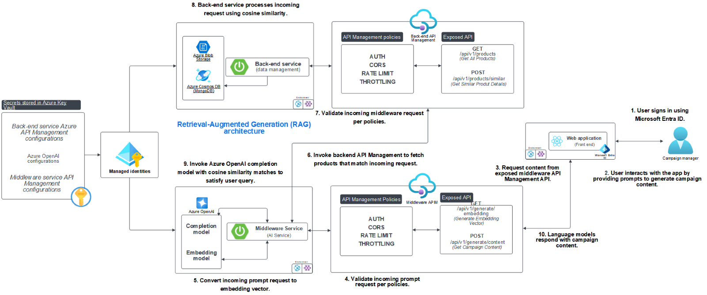
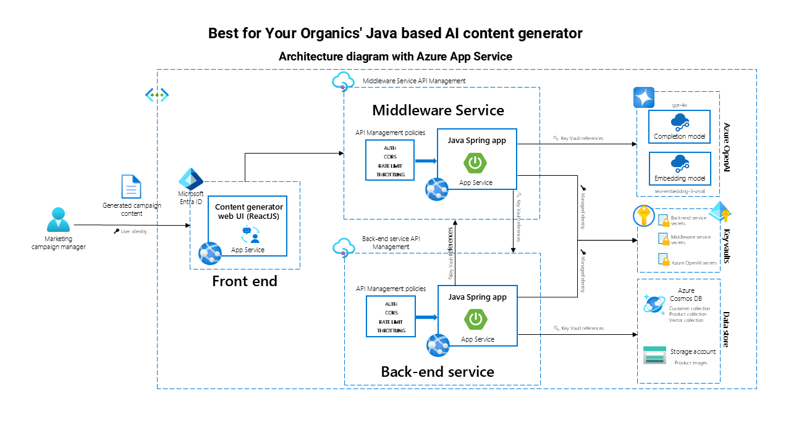
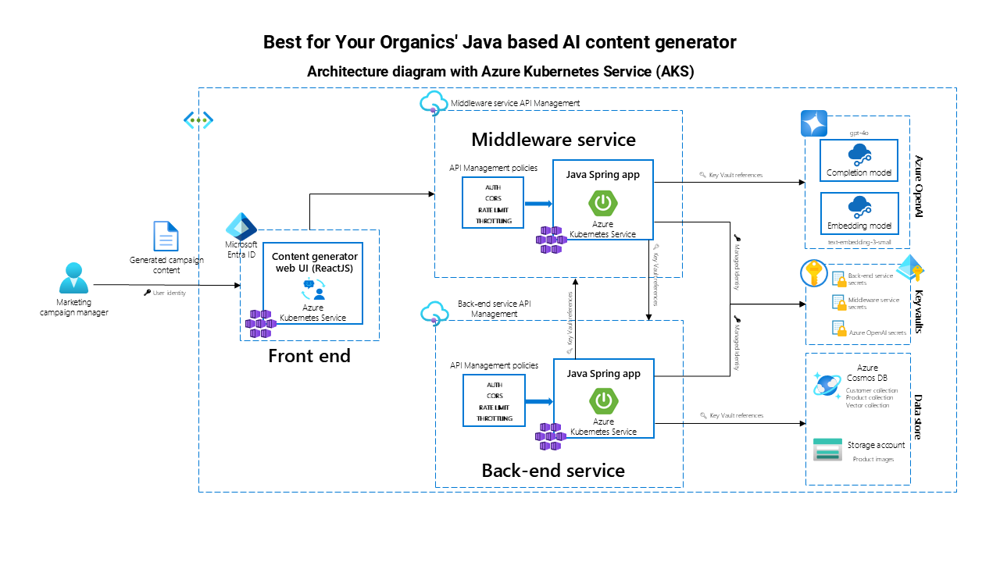

<head> 
  <meta property="og:url" content="https://azure.github.io/cloud-native/30-days-of-ia-2024/use-generative-ai-to-build-intelligent-apps"/>
  <meta property="og:type" content="website"/>
  <meta property="og:title" content="**Build Intelligent Apps | AI Apps on Azure"/>
  <meta property="og:description" content="Join us on a learning journey to build intelligent apps on Azure. Read all about the upcoming #BuildIntelligentApps initiative on this post!"/>
  <meta property="og:image" content="https://github.com/Azure/Cloud-Native/blob/main/website/static/img/ogImage.png"/>
  <meta name="twitter:url" content="https://azure.github.io/Cloud-Native/30-days-of-ia-2024/use-generative-ai-to-build-intelligent-apps" />
  <meta name="twitter:title" content="**Build Intelligent Apps | AI Apps on Azure" />
  <meta name="twitter:description" content="Join us on a learning journey to build intelligent apps on Azure. Read all about the upcoming #BuildIntelligentApps initiative on this post!" />
  <meta name="twitter:image" content="https://azure.github.io/Cloud-Native/img/ogImage.png" />
  <meta name="twitter:card" content="summary_large_image" />
  <meta name="twitter:creator" content="@devanshidiaries" />
  <link rel="canonical" href="https://azure.github.io/Cloud-Native/30-days-of-ia-2024/use-generative-ai-to-build-intelligent-apps" />
</head>

<!-- End METADATA -->

In this series, we show you how you can combine multiple Azure products and services to effectively build an example generative AI application that supports marketing teams.  

In this blog series, discover how you can use Azure services to take advantage of generative AI capabilities to build an intelligent application.   

## What We’ll Cover

* Why generative AI?
* A high-level overview of our example scenario
* An overview of the deployment options  

## Why generative AI?
Unlike traditional AI systems that follow predefined rules, generative AI models use deep learning techniques to generate outputs such as text, images, music, and even code in a way that mimics human creativity. If you’re reading this, you’re likely interested in how you can harness these capabilities to build new and innovative solutions for your organization or your customers. But what benefits does this new technology bring, and when would you use it?  

For businesses, one of the main benefits of generative AI is enhanced productivity. By automating tasks such as content creation, customer service responses, and data analysis, you can significantly reduce tasks that your teams previously had to do manually, and this automation can result in radically increased efficiency. Marketing teams, for instance, can use generative AI to draft personalized content or generate ideas for campaigns, accelerating time to market. Similarly, customer support teams can make the most of AI-powered chatbots that provide accurate responses based on large datasets, supporting faster and more consistent handling of customer requests or issues.  

In addition to the productivity benefits, intelligent apps built by using generative AI can scale to meet the needs of growing businesses, allowing these businesses to meet increased demand for personalized solutions and messaging. AI helps your business to do this without sacrificing quality or capabilities.  

In this series, we show you how you can combine multiple Azure products and services to effectively build an example generative AI application that supports marketing teams.  

## The example application
In our example scenario, we’re building a solution for the **Best For You Organics Company**, which is releasing an innovative, new skin-care product designed to enhance natural beauty and promote skin health. In a competitive market, it’s crucial for marketing efforts to create engaging content that captures the attention of potential customers and aids the marketing team in market penetration.  

Through this blog series, you can learn to use Azure services to build an application that supports the Best For You Organics Company marketing team, making the most of the capabilities of Azure to create exceptional customer experiences and generate engaging marketing content.   

Our solution generates the following types of content to assist the marketing team:  
* **Social media posts**. Announcements, product highlights, customer testimonials, and promotional offers, with the hashtags #Skincare #NaturalBeauty #BestForYouOrganics  

* **Blog articles**. In-depth articles on skin-care tips, the benefits of natural ingredients, and product usage guides  

* **Email content**. Product launches, exclusive offers, skin-care routines, and collateral  

The application is built using a three-part architecture consisting of a **back end**, **middleware**, and **front end**, deployed on either **Azure Kubernetes Service (AKS)** or **Azure App Service**. This architecture forms the foundation for integrating modern cloud and AI technologies, which is our focus throughout this case study.  

BLUE BACKGROUND START

### AI and .Net
In this series, we’ll walk through the basics of building a Java based content generation application. However, if you’re also interested in building intelligent apps using .Net, you can learn more from the following resources:  

* [AI for .NET Developers | Microsoft Learn](https://learn.microsoft.com/dotnet/ai)  
* [Building Generative AI apps with .NET 8 | .Net Blog](https://devblogs.microsoft.com/dotnet/build-gen-ai-with-dotnet-8/) 
* [Develop Generative AI solutions with Azure OpenAI Service - Training | Microsoft Learn](https://learn.microsoft.com/training/paths/develop-ai-solutions-azure-openai/) 
* [Dive deeper into .NET + AI collection | Microsoft Learn](https://learn.microsoft.com/collections/qp6xfmodr6q6px)
* [Develop AI agents using Azure OpenAI and the Semantic Kernel SDK - Training | Microsoft Learn](https://learn.microsoft.com/training/paths/develop-ai-agents-azure-open-ai-semantic-kernel-sdk/) 
* [Add AI to Your .NET Apps Easily with Prompty | .Net Blog](https://devblogs.microsoft.com/dotnet/add-ai-to-your-dotnet-apps-easily-with-prompty/)   
* [Using Phi-3 & C# with ONNX for text and vision samples | .Net Blog](https://devblogs.microsoft.com/dotnet/using-phi3-csharp-with-onnx-for-text-and-vision-samples-md/)   
* [AI Samples for .NET | GitHub](https://github.com/dotnet/ai-samples)  
* [Azure Samples: ChatGPT + Enterprise data with Azure OpenAI and Azure AI Search (.NET) | GitHub](https://github.com/Azure-Samples/azure-search-openai-demo-csharp)   
* [.NET AI Community Standup playlist | YouTube](https://www.youtube.com/playlist?list=PLdo4fOcmZ0oX0Hrq9KqhQfZNAcDF5VPNt)  

BLUE BACKGROUND END?

#### Application flow
The content generation process in the application is simple yet powerful. Here's how the flow works, from the user's perspective:  

1. **User input**. The user provides details, such as the type of content they need—whether it's an email campaign, social media post, or blog article (steps 1-4 in the diagram below).  

1. **Back-end processing**. The system retrieves necessary data, such as customer demographics, product details, and relevant information stored in the back end (steps 5-6 in the diagram).  

1. **Content generation**. The **middleware** communicates with **Azure OpenAI Service** to generate content based on the provided input and back-end data, helping to ensure that the content is contextually relevant (steps 7-9 in the diagram).  

1. **Result display**. The generated content is then displayed on the **ReactJS front end**, where the user can review, copy, and implement it directly into their marketing campaigns (step 10 in diagram).  

Let’s now look at the data flow for this application flow to understand how Azure OpenAI can be used in a Retrieval-Augmented Generation (RAG) architecture pattern.  

This flow allows for fast and efficient content creation while tailoring the output to specific campaign needs, all powered by AI.  

#### GitHub repository

The project’s full source code can be found in the [GitHub repository for the Java AI-based content generator](https://github.com/Azure-Samples/Java-AI-Based-Content-Generator).

#### Technologies used 
Our application makes the most of several cutting-edge technologies, each serving a critical role in the system:  
  

* [Azure OpenAI Service](https://learn.microsoft.com/azure/ai-services/openai/overview). At the core of content generation is Azure OpenAI, which uses GPT models to create coherent and relevant content based on user input. The Chat Completion API (GPT-4o) generates the text, while the embedding model helps ensure that data retrieved for content is semantically relevant to the user's needs.  
* [Azure Key Vault](https://learn.microsoft.com/azure/key-vault/general/overview). For secure storage of secrets such as API keys, credentials, and sensitive configuration data, Key Vault is integrated into the system. This helps ensure that all sensitive data is stored securely and retrieved only when needed.  
* [Microsoft Entra ID](https://learn.microsoft.com/entra/fundamentals/whatis) (formerly Azure Active Directory). Microsoft Entra ID is used for authentication and identity management, supporting secure access to the back end and to APIs. It helps effectively manage user roles and access permissions.  
* [Managed identity](https://learn.microsoft.com/entra/identity/managed-identities-azure-resources/overview). The application uses managed identity to securely access Azure resources without hard-coding credentials. This simplifies the authentication process when interacting with services like Key Vault and Azure Cosmos DB.  
* [Azure App Service]](https://learn.microsoft.com/azure/app-service/overview) and [Azure Kubernetes Service (AKS)](https://learn.microsoft.com/azure/aks/what-is-aks).The application supports two deployment models: App Service and AKS. Both provide scalable infrastructure but differ in flexibility and complexity (more on this in the “Choosing the right deployment technology for you<<anchor to that section below>>” section).  
* [Azure API Management](https://learn.microsoft.com/azure/api-management/api-management-key-concepts). API Management manages the API gateway, controlling access between the front end, middleware, and back end. With features like Cross-Origin Resource Sharing (CORS), throttling, rate limiting, and authentication, API Management supports efficient communication and security across the system.

BLUE BACKGROUND START

Learn more on Technical leaders’ [guide to building intelligent apps](https://aka.ms/AAI_TDMApps_Plan).

BLUE BACKGROUND END

## Choosing the right deployment technology for you

The application can be deployed by using either **Azure App Service** or **Azure Kubernetes Service (AKS)**, depending on your business needs. Both options provide advantages, but the choice often depends on the application’s complexity and scale.

#### Azure App Service
* **Simplicity**. App Service is a fully managed platform as a service (PaaS) that abstracts the underlying infrastructure. This allows for quick deployments with less overhead.  

* **Cost-effective**. For small to medium-sized applications, App Service can reduce operational costs by automating much of the infrastructure management.  

* **Use case**. The service is ideal for businesses looking for rapid deployment without the need for extensive control over infrastructure. It works well for straightforward applications with predictable workloads.

#### Azure Kubernetes Service (AKS)
* **Flexibility**. AKS offers more control over infrastructure, allowing for fine-tuned customization of containerized microservices.  

* **Scalability**. The service is ideal for applications with large-scale operations or high customization requirements. It allows for horizontal scaling and integration with multiple cloud-native tools.  

* **Use case**. AKS is best suited for enterprise-level applications or businesses requiring multi-container orchestration and complex workloads.

Both options are scalable and robust, and businesses can select the one that aligns best with their operational needs and scale of application.  

## Summary
In today’s post, we introduced you to the example app that we’ll build in this series—the Best For You Organics content generation app. We discussed our goals, overall approach, and the architecture that we’re using to create this app.   

In our next post, we cover the **environment you’ll set up** to prepare for the development of the application. Learn how to configure your local environment; set up Java, Spring Boot, and ReactJS; and integrate with Azure services, like Azure OpenAI, Key Vault, and more.  

Each subsequent post will dive deeper into the specific technologies that power this AI-driven application. Stay tuned as we explore everything from back-end data management to deploying on AKS or App Service.  

## Additional resources
* To help you build the skills you need to create intelligent apps by using Azure OpenAI, complete the [Get started with Azure OpenAI Service](https://learn.microsoft.com/training/modules/get-started-openai/) module.  

* Register for live learning or a demo playlist on [Build Intelligent Apps](https://aka.ms/bia/events) on Azure.  