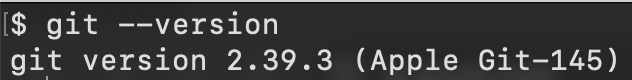

<head> 
  <meta property="og:url" content="https://azure.github.io/cloud-native/30-days-of-ia-2024/use-generative-ai-to-build-intelligent-apps"/>
  <meta property="og:type" content="website"/>
  <meta property="og:title" content="**Build Intelligent Apps | AI Apps on Azure"/>
  <meta property="og:description" content="Join us on a learning journey to build intelligent apps on Azure. Read all about the upcoming #BuildIntelligentApps initiative on this post!"/>
  <meta property="og:image" content="https://github.com/Azure/Cloud-Native/blob/main/website/static/img/ogImage.png"/>
  <meta name="twitter:url" content="https://azure.github.io/Cloud-Native/30-days-of-ia-2024/use-generative-ai-to-build-intelligent-apps" />
  <meta name="twitter:title" content="**Build Intelligent Apps | AI Apps on Azure" />
  <meta name="twitter:description" content="Join us on a learning journey to build intelligent apps on Azure. Read all about the upcoming #BuildIntelligentApps initiative on this post!" />
  <meta name="twitter:image" content="https://azure.github.io/Cloud-Native/img/ogImage.png" />
  <meta name="twitter:card" content="summary_large_image" />
  <meta name="twitter:creator" content="@devanshidiaries" />
  <link rel="canonical" href="https://azure.github.io/Cloud-Native/30-days-of-ia-2024/use-generative-ai-to-build-intelligent-apps" />
</head>

<!-- End METADATA -->
## 2.a. Setting up your development environment

Learn what you need to set up and configure your development environment before we start to build our example generative AI app.

### What we cover:

- Installing required development tools and services on your local machine
- Configuring the Azure Cosmos DB that the back-end application uses
- Setting up the Azure Key Vault that will store application secrets
- Creating a Microsoft Entra ID app registration to enable Microsoft Account sign-in for our app

## Introduction

As we introduced in the previous post, this series walks you through building an example AI-powered content generation app for Best For You Organics Company. This app will help our fictitious company support a new skin-care product by generating a variety of marketing materials, including social media posts, blog articles, and email campaigns. Tailored specifically for the skin-care industry, the app will allow them to efficiently create and customize content for different platforms, enabling them to more effectively reach their target audience.

In this blog, we take you through setting up your local development environment and configuring several essential services in the Azure portal. You install tools, such as Git, Java, and Node.js, and set up Azure resources, such as Azure Cosmos DB and Azure Key Vault.

## Local machine setup

Before diving into the Azure components, let’s ensure that your local development machine is equipped with all the tools you need to build the app.

### Step 1. Install Git.

Git is essential for version control and managing your project’s source code.

1. Download Git. Go to Install and set up Git, and download the installer for your operating system.
2. Installation. Run the installer. Unless you have specific preferences, use the default settings.
3. Verify installation. Open your terminal and run:

  ```
   git --version
  ```

   

### Step 2. Install Java (17 and 21).

Your Spring Boot back end requires both Java 17 and 21.

1. Download. Obtain both versions from Download the Microsoft Build of OpenJDK.
2. Configure. You can manage multiple Java versions using update alternatives (Linux) or SDKMAN (for Linux/Mac). For Windows, use Java Development Kit (JDK) tools, like JDKTool.
3. Verify installation. Open your terminal and run:

   java -version

   ![alt: image of terminal response]

### Step 3. Install the Azure CLI.

The Azure CLI is essential for managing your Azure resources from the terminal.

1. Download the Azure CLI. Follow the instructions in How to install the Azure CLI.
2. Sign in to Azure. After installing the Azure CLI, sign in. Open your terminal and run:

   az login

   ![alt: image of terminal response]

### Step 4. Install Node.js and set up React.

We use Node.js for managing front-end dependencies and running the React development server.

1. Install Node.js. Go to Node.js, and download the appropriate version for your system.
2. Verify installation. Confirm that Node.js is correctly installed. Open your terminal and run:

   node -v && npm -v

   ![alt: image of terminal response]

### Step 5. Install an integrated development environment.

You can use your preferred integrated development environment (IDE), but we recommend Visual Studio Code and IntelliJ IDEA for Java and JavaScript development.

- Install Visual Studio Code.
- or
- Install IntelliJ IDEA.

Both IDEs support Azure integrations through plugins for managing Azure resources and services.

## Azure setup

Now that your local environment is ready, let’s configure the Azure resources you need to build and run the app.

### Step 1. Set up Azure basics.

Before you start configuring resources, choose the Azure account you want to use. If you want to use the Azure CLI to configure Azure resources, perform a few configuration steps:

- Create a new account—unless you already have one (optional).  
  If you don’t have an existing Azure account that you want to use when creating Azure resources, create a new one. Go to the Azure portal and sign up. Choose the subscription plan that fits your business needs.
- Configure the Azure CLI, if you want use it (optional).  
  The steps throughout this series include instructions for using either the browser-based Azure portal or the command-line Azure CLI tool. If you want to use the Azure CLI but don’t already have it installed, follow these steps:
  - Follow the instructions provided at Install Azure CLI.
  - Verify the installation. Open your terminal or command prompt and run:

    az --version

    ![alt: image of terminal response]

After installing and verifying the Azure CLI, follow these steps to sign in, list your subscriptions, and select a subscription:

1. Sign in to Azure. Run the following command:

   az login

   This opens a web browser for you to authenticate your Azure account. After successful authentication, the CLI automatically lists your subscriptions and asks you to select one by number.

2. Select a subscription. After you sign in, a prompt is displayed.

   ![alt: image of terminal response]

3. Type the number corresponding to the subscription you want to select, and press Enter. After you select the subscription, it is set as the default for your current session.

### Step 2. Create Azure Cosmos DB resource (MongoDB API).

Cosmos DB will serve as the database for storing your application data, such as customer information and product details.

#### Azure portal instructions

1. Go to the Azure Portal and search for "Cosmos DB".
2. Click on "Create" and select MongoDB API.
3. You will see two options: Request unit (RU) database account and vCore cluster (Recommended). Choose Request unit (RU) database account.
4. Configure the Request Units per second (RU/s) based on your application's scale (e.g., 400 RU/s as a starting point for small applications). The RU/s determines how many operations Cosmos DB can handle per second, so adjust it according to your expected load and usage.
5. Proceed with the rest of the setup, such as specifying the resource group, region, and database name.
6. Once the Cosmos DB account is created, you can add a database and collections to organize your data.

   ![alt: image of Cosmos DB setup in Azure Portal]

#### CLI instructions

1. Create a resource group (if you don’t already have one) by running the following command:

   az group create --name <resource-group-name> --location <location>

   ![alt: image of terminal response]

2. Create an Azure Cosmos DB account with MongoDB API.  
   Use the following command to create an Azure Cosmos DB account with the MongoDB API, and specify throughput in Request Units per second (RU/s):

   az cosmosdb create \
     --name <cosmos-account-name> \
     --resource-group <resource-group-name> \
     --kind MongoDB \
     --locations regionName=<location> failoverPriority=0 isZoneRedundant=False \
     --default-consistency-level Eventual \
     --enable-automatic-failover false

3. Create a MongoDB database with a specific throughput.  
   After creating the Azure Cosmos DB account, create a MongoDB database and set the throughput (RU/s):

   az cosmosdb mongodb database create \
     --account-name <cosmos-account-name> \
     --name <database-name> \
     --resource-group <resource-group-name>

   ![alt: image of terminal response]

### Step 3. Create Azure Storage account.

Our Azure Storage account is used to store any static files (for example, product brochures or images).

#### Azure portal instructions

1. In the Azure portal, search for storage account and create a new one.
2. Choose Blob Storage for storing documents and media.
3. Complete the resource creation wizard, and select Create to deploy the storage account.

   ![alt: image of storage account in Azure Portal]

#### CLI instructions

1. Determine whether resource group exists (optional).  
   Use the following command:

   az group show --name <resource-group-name>

   - If the resource group exists, it returns the details.
   - If it doesn't exist, it throws an error.

2. Create the resource group (optional).  
   If the resource group doesn't exist, create it using the following command, replacing `<resource-group-name>` with your desired name for the resource group and `<location>` with the Azure region where you want to deploy the resource, (for example, eastus, westus):

   az group create --name <resource-group-name> --location <location>

3. Create the storage account.  
   Use the following command to create the Azure Storage account, replacing `<storage-account-name>` with a globally unique name for your storage account; replacing `<resource-group-name>` with the name of the resource group you created or chose; and replacing `<location>` with the Azure region where you want to deploy the storage account (for example, eastus, westeurope):

   az storage account create \
     --name <storage-account-name> \
     --resource-group <resource-group-name> \
     --location <location> \
     --sku Standard_LRS \
     --kind StorageV2

   ![alt: image of terminal response to creating the Azure Storage account]

4. Verify storage account creation.  
   To ensure that the storage account was created successfully, list all storage accounts in the resource group:

   az storage account list --resource-group <resource-group-name> --output table

   ![alt: image of terminal response to verify storage account creation]

### Step 4. Set up Azure Key Vault.

To securely store our secrets, like API keys and connection strings, we use Azure Key Vault.

#### Azure portal instructions

1. Create a key vault. In the portal, search for key vault and create one.
2. Register an application. In Microsoft Entra ID, register your application to grant it access to the key vault.
3. Assign managed identity. Enable Managed Identity to allow secure access from your application.
4. Complete the resource creation wizard, and select Create to deploy the key vault.

   ![alt: image of key vault in Azure Portal]

#### CLI instructions

1. Create a resource group (optional).  
   If you need to create a resource group (like we did in the Azure Cosmos DB steps), use the following command, replacing `<resource-group-name>` with your desired name and `<location>` with the region (for example, eastus, westeurope):

   az group create --name <resource-group-name> --location <location>

2. Create the Azure key vault.  
   Now, use the following command to create the Azure key vault, replacing `<key-vault-name>` with a globally unique name for the key vault; replacing `<resource-group-name>` with the name of the resource group created or selected in the previous step; and replacing `<location>` with your preferred Azure region. Note that “--sku standard” is a common pricing tier. You can also use premium if you need additional features like Hardware Security Module (HSM) support.

   az keyvault create \
     --name <key-vault-name> \
     --resource-group <resource-group-name> \
     --location <location> \
     --sku standard

   ![alt: image of terminal response to creating the Azure key vault]

3. Verify key vault creation.  
   To verify that the key vault was created, you can list all key vaults in the specified resource group:

   az keyvault list --resource-group <resource-group-name> --output table

   ![alt: image of terminal response to verifying key vault creation]

### Step 5. Use Microsoft Entra ID to create an app registration for Microsoft account sign-in.

To support multi-user access, including sign-in from any Microsoft account, register your application in Microsoft Entra ID.

#### Azure portal instructions

1. Navigate to Microsoft Entra ID.  
   In the Azure portal, search for Microsoft Entra ID, and select **Manage → App registrations**.
2. Register a new application.
   1. Select **New registration**.
   2. **Name**. Enter a name for your application (for example, ContentGenApp).
   3. **Supported account types**. Select **Accounts in any organizational directory (Any Microsoft Entra ID tenant - Multitenant) and personal Microsoft accounts (e.g. Skype, Xbox)**.
   4. **Redirect URI**. Set this to the front end's callback URL.
      - For local development (React app running locally), use `http://localhost:3000`.
      - For production (when deployed on Azure Kubernetes Service (AKS) or Azure App Service), add the URL for the App Service or AKS deployment you plan to create for this app (We’ll create these in our next post). For example, `https://your-app.azurewebsites.net` for App Service or `https://your-aks-domain.com` for AKS.
      - If you plan to use a custom domain for your application, add that domain here (for example, `https://your-custom-domain.com`).

   **Important**: Ensure that all potential URLs (local, deployed, and custom domain) are listed as redirect URIs.

   ![alt: image of application registration in Microsoft Entra ID]

3. Configure API permissions.
   1. Go to the **API permissions** tab, and select **Add a permission**.
   2. Choose **Microsoft Graph → Delegated permissions**, and then select the following permissions:
      - **User.Read**. Allows users to sign in and read their profile.
   3. Grant admin consent. After permissions are added, select **Grant admin consent for your organization**.

   ![alt: image of API permissions configuration]

4. Configure authentication settings.
   1. Go to the **Authentication** tab, and add your redirect URIs (both local and production URLs).
   2. Enable ID tokens to authenticate users.

   ![alt: image in Azure Portal of authentication settings configuration]

This revision integrates Microsoft Entra ID and highlights the navigation flow for app registration through the Manage section. It also ensures that you're set up for both local development and production environments using AKS, App Service, or a custom domain.

#### CLI instructions

You’ll use the following script when performing these instructions.

**Shell script: create-azure-ad-app.sh**

```bash
#!/bin/bash

# Function to display help
function display_help() {
  echo "Usage: $0 --name <App Name> --redirect-uris <Redirect URI 1> <Redirect URI 2> ... [options]"
  echo
  echo "Options:"
  echo "  --name              The display name of the Azure AD App."
  echo "  --redirect-uris     Space-separated list of redirect URIs to configure."
  echo "  --help              Display this help message and exit."
  echo
  exit 0
}

# Function to check if the user is logged in
function check_azure_login() {
  echo "Checking Azure CLI login status..."
  az account show &> /dev/null
  if [ $? -ne 0 ]; then
    echo "You are not logged in. Logging in now..."
    az login
    if [ $? -ne 0 ]; then
      echo "Azure login failed. Exiting script."
      exit 1
    fi
  else
    echo "You are already logged in."
  fi
}

# Parse command line arguments
APP_NAME=""
REDIRECT_URIS=()

while [[ $# -gt 0 ]]; do
  case "$1" in
    --name)
      APP_NAME="$2"
      shift 2
      ;;
    --redirect-uris)
      shift
      while [[ $# -gt 0 && ! "$1" =~ ^-- ]]; do
        REDIRECT_URIS+=("$1")
        shift
      done
      ;;
    --help)
      display_help
      ;;
    *)
      echo "Unknown option: $1"
      display_help
      ;;
  esac
done

# Ensure required arguments are provided
if [[ -z "$APP_NAME" || ${#REDIRECT_URIS[@]} -eq 0 ]]; then
  echo "Error: Both --name and --redirect-uris are required."
  display_help
fi

# Step 0: Check if logged in
check_azure_login

API_PERMISSION="e1fe6dd8-ba31-4d61-89e7-88639da4683d"  # User.Read permission ID
GRAPH_API="00000003-0000-0000-c000-000000000000"        # Microsoft Graph API ID
SIGN_IN_AUDIENCE="AzureADandPersonalMicrosoftAccount"    # Supported account types

# Define the required resource accesses in JSON format
REQUIRED_RESOURCE_ACCESS=$(cat <<EOF
[
  {
    "resourceAppId": "$GRAPH_API",
    "resourceAccess": [
      {
        "id": "$API_PERMISSION",
        "type": "Scope"
      }
    ]
  }
]
EOF
)

# Step 1: Check if the app already exists
APP_ID=$(az ad app list --filter "displayName eq '$APP_NAME'" --query "[0].appId" -o tsv)

if [ -z "$APP_ID" ]; then
  echo "App doesn't exist. Creating the app registration..."

  # Step 2: Create the app registration
  APP_ID=$(az ad app create \
    --display-name "$APP_NAME" \
    --required-resource-accesses "$REQUIRED_RESOURCE_ACCESS" \
    --web-redirect-uris "${REDIRECT_URIS[@]}" \
    --enable-id-token-issuance true \
    --enable-access-token-issuance true \
    --sign-in-audience "$SIGN_IN_AUDIENCE" \
    --query appId -o tsv)

  if [ -z "$APP_ID" ]; then
    echo "App creation failed. Exiting script."
    exit 1
  fi

  echo "App created with ID: $APP_ID"

else
  echo "App already exists with ID: $APP_ID. Updating the redirect URIs..."

  # Step 3: Update the redirect URIs
  az ad app update --id "$APP_ID" \
    --web-redirect-uris "${REDIRECT_URIS[@]}"

  if [ $? -ne 0 ]; then
    echo "Failed to update redirect URIs. Exiting script."
    exit 1
  fi

  echo "Redirect URIs updated for app ID: $APP_ID"
fi

# Display the app details
echo "Here are the details of the app:"
az ad app show --id "$APP_ID"
```

