<head> 
  <meta property="og:url" content="https://azure.github.io/cloud-native/30-days-of-ia-2024/setting-up-your-development-environment-2"/>
  <meta property="og:type" content="website"/>
  <meta property="og:title" content="**Build Intelligent Apps | AI Apps on Azure"/>
  <meta property="og:description" content="Join us on a learning journey to build intelligent apps on Azure. Read all about the upcoming #BuildIntelligentApps initiative on this post!"/>
  <meta property="og:image" content="https://github.com/Azure/Cloud-Native/blob/main/website/static/img/ogImage.png"/>
  <meta name="twitter:url" content="https://azure.github.io/Cloud-Native/30-days-of-ia-2024/setting-up-your-development-environment-2" />
  <meta name="twitter:title" content="**Build Intelligent Apps | AI Apps on Azure" />
  <meta name="twitter:description" content="Join us on a learning journey to build intelligent apps on Azure. Read all about the upcoming #BuildIntelligentApps initiative on this post!" />
  <meta name="twitter:image" content="https://azure.github.io/Cloud-Native/img/ogImage.png" />
  <meta name="twitter:card" content="summary_large_image" />
  <meta name="twitter:creator" content="@devanshidiaries" />
  <link rel="canonical" href="https://azure.github.io/Cloud-Native/30-days-of-ia-2024/setting-up-your-development-environment-2" />
</head>

<!-- End METADATA -->
Learn what you need to set up and configure your development environment before we start to build our example generative AI app.

## 2.b. Setting up your development environment

## Day 2: Part 2. Preparing the Azure OpenAI Service resource
Learn how to create and configure the Azure OpenAI Service resource that we’ll use in our example app.

### What we cover:
- Creating an Azure OpenAI instance
- Setting up Azure API Management
- Exploring the options for creating our app hosting environments on Azure

## Introduction
In our previous post, we discussed setting up your local development environment and creating the Azure-based database, storage, and secret management services that you’ll use when running our application. In this post, we set up the Azure OpenAI instance that provides the core of our content generation capabilities. After you’ve created the Azure OpenAI instance, we’ll finish our preparation tasks by setting up Azure API Management and then finally creating our preferred app hosting resources (Azure Kubernetes Service [AKS] or Azure App Service).

## Step 1. Set up Azure OpenAI
Create two Azure OpenAI deployments—one for **GPT-4o** (chat completion) and another for **text embedding**.

1. **Create a new Azure OpenAI resource**. Go to the Azure portal, and search for **Azure OpenAI**.
2. Deploy two separate instances:
   - **Chat completion (GPT-4o)** for generating content.
   - **Embedding model** for semantic search functionality.

### Create the Azure OpenAI resource

#### Azure portal instructions
1. Use the Azure portal to deploy **Azure OpenAI**.

   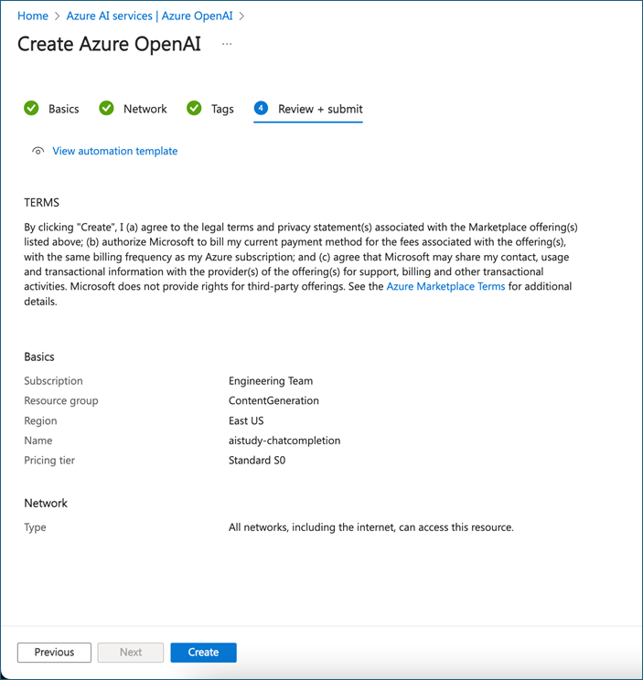

2. After provisioning Azure, open Azure OpenAI and go to **Azure OpenAI Studio**.

   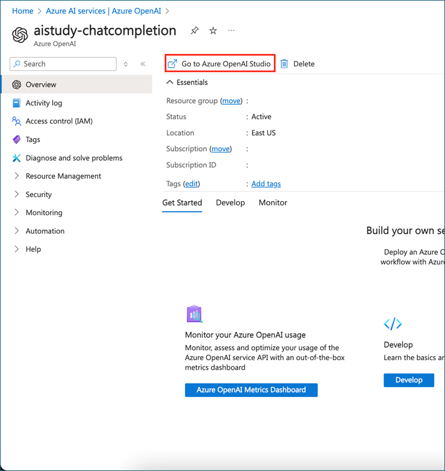

3. Go to **Deployments**, and then deploy the models.

   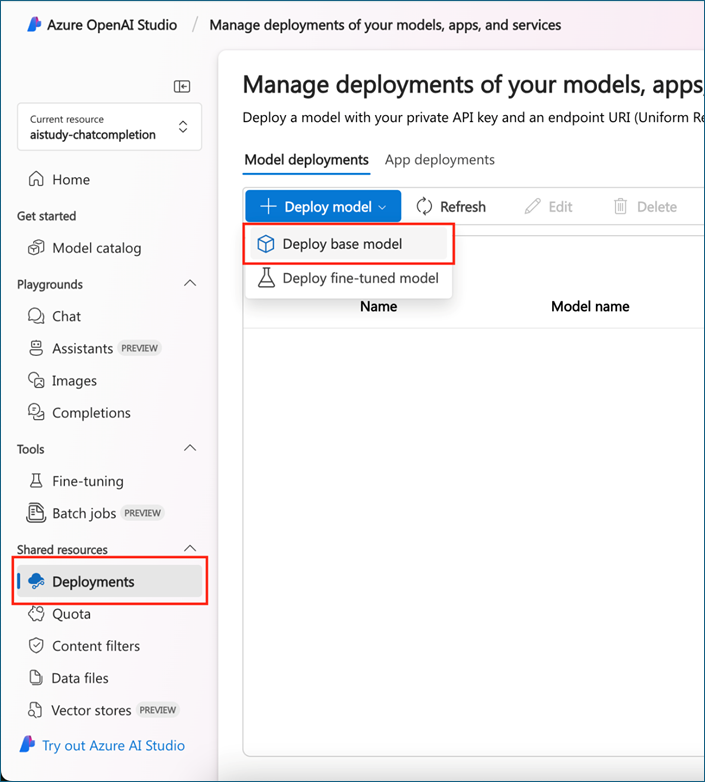

4. Search **GPT-4o** for chat completion. Set tokens-per-minute rate limit (depending on response length), and deploy.

   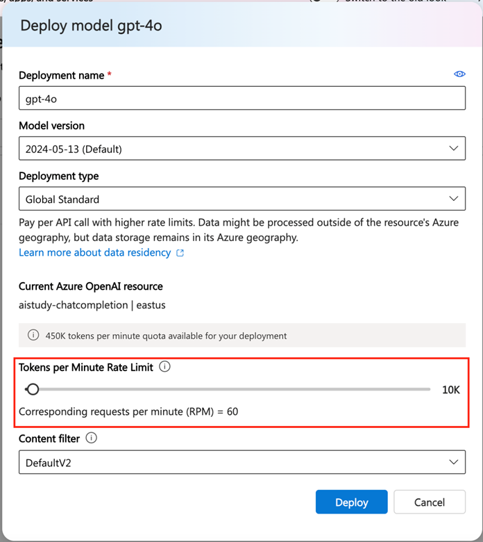

   Make sure to save the **Target URI** and **Key** for future use.

   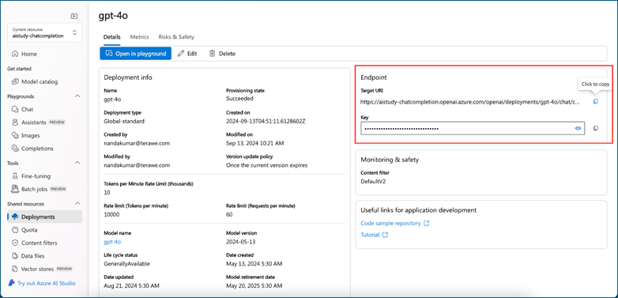

   Deploy the **text-embedding-3-small** model to embed the data in the same way.

   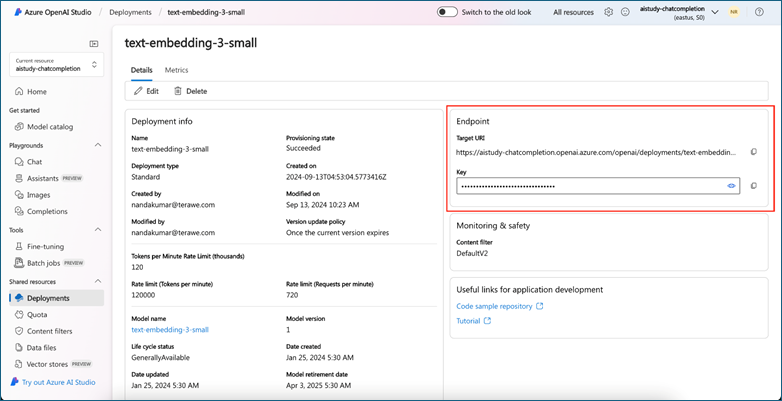

#### CLI instructions
Use the following script when performing these instructions:

Shell script: `create-openai-resource.sh`

```
#!/bin/bash

# Function to display help
function display_help() {
  echo "Usage: $0 --name <OpenAI Account Name> --resource-group <Resource Group Name> --location <Location> [--help]"
  echo
  echo "Options:"
  echo "  --name              The display name of the Azure OpenAI account."
  echo "  --resource-group    The name of the Azure resource group."
  echo "  --location          The Azure region/location for the resource. (e.g., eastus, westus)"
  echo "  --help              Display this help message and exit."
  echo
  exit 0
}

# Function to check if the user is logged in
function check_azure_login() {
  echo "Checking Azure CLI login status..."
  az account show &> /dev/null
  if [ $? -ne 0 ]; then
    echo "You are not logged in. Logging in now..."
    az login
    if [ $? -ne 0 ]; then
      echo "Azure login failed. Exiting script."
      exit 1
    fi
  else
    echo "You are already logged in."
  fi
}

# Parse command line arguments
OPENAI_ACCOUNT_NAME=""
RESOURCE_GROUP=""
LOCATION=""

while [[ $# -gt 0 ]]; do
  case "$1" in
    --name)
      OPENAI_ACCOUNT_NAME="$2"
      shift 2
      ;;
    --resource-group)
      RESOURCE_GROUP="$2"
      shift 2
      ;;
    --location)
      LOCATION="$2"
      shift 2
      ;;
    --help)
      display_help
      ;;
    *)
      echo "Unknown option: $1"
      display_help
      ;;
  esac
done

# Ensure required arguments are provided
if [[ -z "$OPENAI_ACCOUNT_NAME" || -z "$RESOURCE_GROUP" || -z "$LOCATION" ]]; then
  echo "Error: --name, --resource-group, and --location are required."
  display_help
fi

# Step 0: Check if logged in
check_azure_login

# Step 1: Create resource group (if not exists)
echo "Creating resource group $RESOURCE_GROUP (if it doesn't already exist)..."
az group create --name "$RESOURCE_GROUP" --location "$LOCATION"

# Step 2: Create OpenAI resource
echo "Creating Azure OpenAI resource..."
az cognitiveservices account create \
  --name "$OPENAI_ACCOUNT_NAME" \
  --resource-group "$RESOURCE_GROUP" \
  --kind OpenAI \
  --sku S0 \
  --location "$LOCATION" \
  --yes

# Step 3: Deploy GPT-4o model with increased token limit (10K capacity)
echo "Deploying GPT-4o model..."
az cognitiveservices account deployment create \
  --name "$OPENAI_ACCOUNT_NAME" \
  --resource-group "$RESOURCE_GROUP" \
  --deployment-name "gpt-4o-deployment" \
  --model-name "gpt-4o" \
  --model-version "2024-05-13" \
  --model-format OpenAI \
  --sku-capacity 10 \
  --sku-name "Standard"

# Step 4: Deploy text-embedding-3-small model
echo "Deploying text-embedding-3-small model..."
az cognitiveservices account deployment create \
  --name "$OPENAI_ACCOUNT_NAME" \
  --resource-group "$RESOURCE_GROUP" \
  --deployment-name "text-embedding-3-small-deployment" \
  --model-name "text-embedding-3-small" \
  --model-version "1" \
  --model-format OpenAI \
  --sku-name "Standard" \
  --sku-capacity 120

# Verify deployments
echo "Listing deployed models..."
az cognitiveservices account deployment list \
  --name "$OPENAI_ACCOUNT_NAME" \
  --resource-group "$RESOURCE_GROUP"

```

Run the script.

**Save the script**. Save the script as `create-openai-resource.sh`.

Make the script executable:

```
chmod +x create-openai-resource.sh 
```

Run the script: 

```
./create-openai-resource.sh --name <NAME> --resource-group <RESOURCE_GROUP_NAME> --location <LOCATION>
```

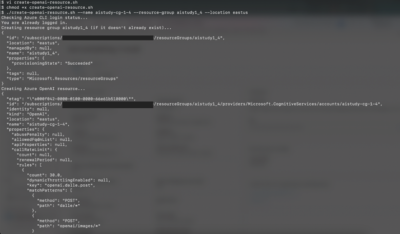

## Step 2. Set up Azure API Management
API Management serves as the gateway between your front-end, middleware, and back-end services.

1. **Create an API Management instance**. Search for **API Management**, and create a new instance.
2. **Configure two services (back-end service API Management and middleware service API Management)**:
  - Back end for data management (Azure Cosmos DB, storage account)
  - Middleware for Azure OpenAI Service

### Azure portal instructions
In the Azure portal, search for **API Management**.

Choose **Create**, and complete the resource creation wizard.

Select **Create** to deploy the API Management service.

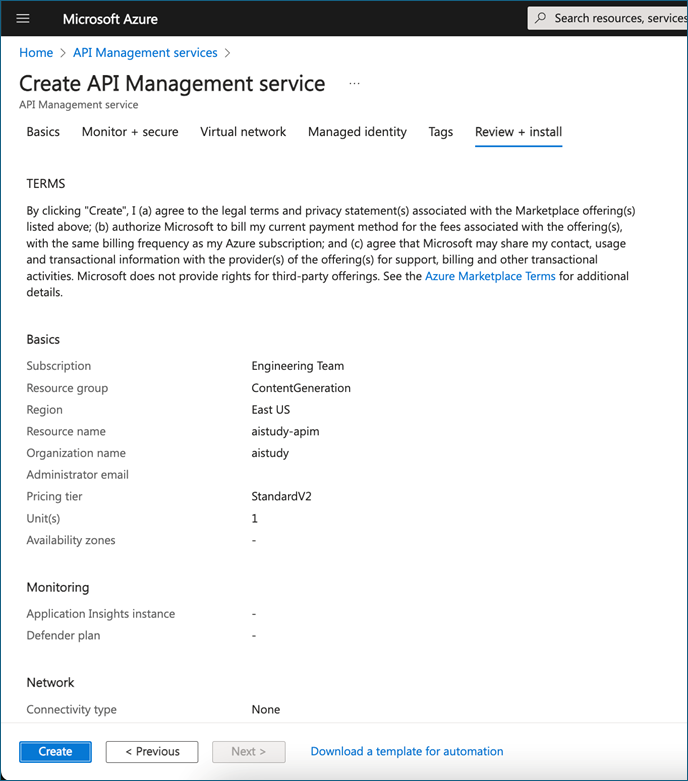

#### CLI instructions
1. Create a resource group (optional).

   If you need to create a resource group, use the following command, replacing `<resource-group-name>` with your desired name and `<location>` with the region (for example, eastus, westeurope):

```
az group create --name <resource-group-name> --location <location>
```

2. Create the API Management service using the following command:

```
az apim create \
  --resource-group <your-resource-group-name> \
  --name <your-apim-name> \
  --publisher-email <your-email-address> \
  --publisher-name <your-publisher-name> \
  --location <your-location> \
  --sku-name <sku-type>
```

**Parameters**

* `--resource-group`: The name of the resource group where the API Management instance will be created. 
* `--name`: The name of your API Management instance. 
* `--publisher-email`: The email address of the API publisher. 
* `--publisher-name`: The name of the API publisher. 
* `--location`: The region where your API Management service will be deployed. 
* `--sku-name`: The pricing tier for the API Management instance (`Developer`, `Basic`, `Standard`, or `Premium`). Default value is `Developer`.

**SKUs**

* `Developer`: Best for non-production use.
* `Basic`: Entry-level production tier.
* `Standard`: Mid-range production tier.
* `Premium`: Enterprise-level tier with additional features like multiregion support.

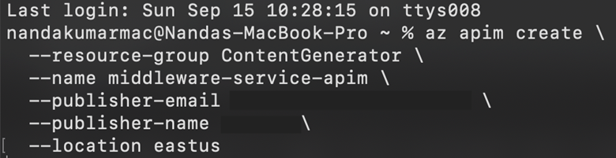

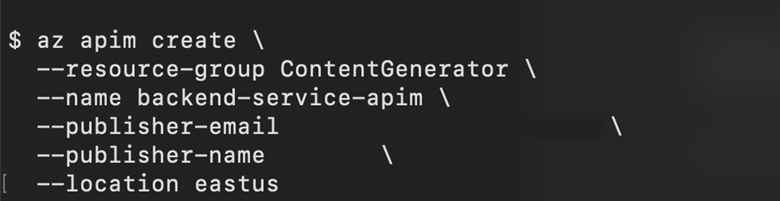

## Step 3. Prepare your app hosting environments—AKS or App Service

With the Azure OpenAI instance in place and our API Management configuration created, we have one more piece to set up before we can start building and deploying our app. We need to determine what type of service we’re going to use in Azure for hosting the front-end, middleware, and back-end app code.

### Choose your deployment technology

Depending on your preferences or business requirements, you can choose either **Azure Kubernetes Service (AKS)** or **Azure App Service** when deploying your app to Azure.

To recap, here’s a quick high-level overview of the **AKS** versus **App Service**.

| Feature      | AKS                                    | App Service                                   |
|--------------|----------------------------------------|-----------------------------------------------|
| Flexibility  | More control, containerized apps       | Simplified, fully managed                     |
| Scalability  | High customization and scalability     | Easy scaling for small to medium-sized apps   |
| Use case     | Ideal for complex, enterprise apps     | Ideal for rapid deployment                    |

Both are robust options, and you can select the one that best fits your business needs.

### Use the Azure App Service path

Create a separate App Service instance for the front-end, middleware, and back-end services.

#### Azure portal instructions

**Create a web app**. In the Azure portal, search for **App Service** and create a new app. 

In the first section of the resource creation wizard, select the correct **Runtime stack**:  

* For the back-end service, select **Java 21**.
* For the middleware service, select **Java 17**.
* For the front-end service, select **Node 20 LTS**.

Complete the resource creation wizard, and select **Create** to deploy the App Service instance.

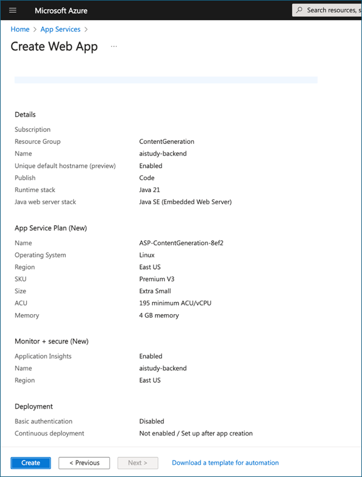

### CLI instructions

  1. Create a resource group (optional).

  If you need to create a resource group, use the following command, replacing <resource-group-name> with your desired name and <location> with the region (for example, eastus, westeurope):

```
az group create --name <resource-group-name> --location <location>
```

  2. Create an App Service plan.

  First, create an App Service plan, which defines the region, pricing tier, and scaling options of your App Service instance:

```
az appservice plan create \
  --name <your-app-service-plan-name> \
  --resource-group <your-resource-group-name> \
  --sku B1 \
  --is-linux 
```

  * `--sku B1`: Specifies the pricing tier (Basic B1).
  * `--is-linux`: Specifies that the app will run on Linux.

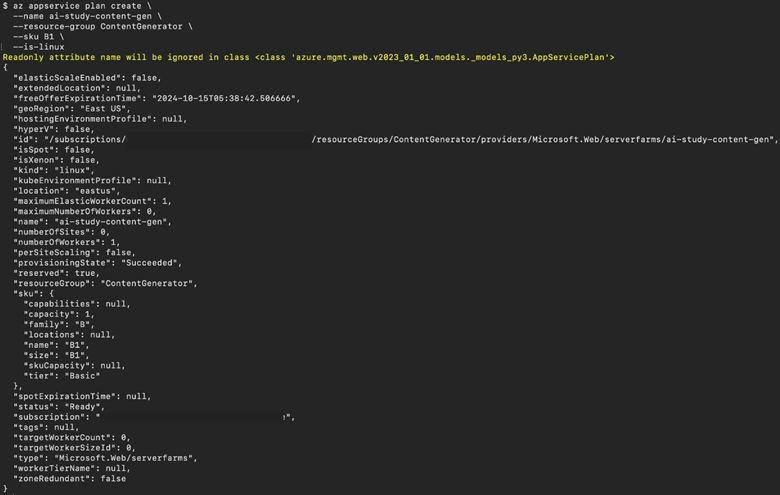

  3. Create a web app.

  To create a web app, use the following command:

```
az webapp create \
  --resource-group <your-resource-group-name> \
  --plan <your-app-service-plan-name> \
  --name <your-backend-app-service-name> \
  --runtime "JAVA:21-java21"
```

  **Runtime specifications** 

  * Back end:
  `--runtime "JAVA:21-java21"`: Specifies the Java 21 runtime.
  * Middleware:
  `--runtime "JAVA:17-java17"`: Specifies the Java 17 runtime. 
  * Front end:
  `--runtime "NODE:22-lts"`: Specifies the Node.js 22 runtime. 

  Use these runtime values in your `az webapp` create commands when setting up the respective services for back-end, middleware, and front-end applications. 

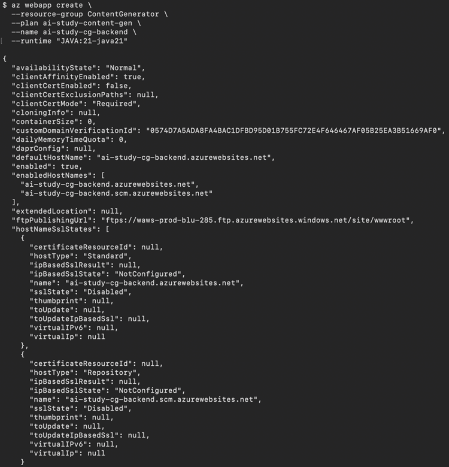

### Use the Azure Kubernetes Service (AKS) path
To deploy your Kubernetes-based resources, you need to perform two actions: 

Set up a **container registry** to host your application’s container images. 

**Create a Kubernetes cluster**.

#### Azure portal instructions
Create a container registry. 

In the Azure portal, search for **Kubernetes Service** and create a new AKS cluster. 

Complete the resource creation wizard, and select **Create** to deploy the container registry.

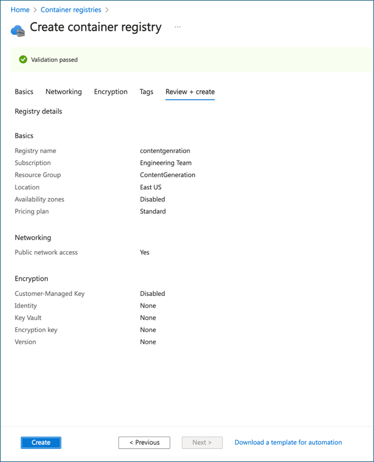

Create a Kubernetes cluster. 

In the Azure portal, search for **Kubernetes Service** and create a new Kubernetes cluster. 

Complete the resource creation wizard, and select **Create** to deploy the cluster.

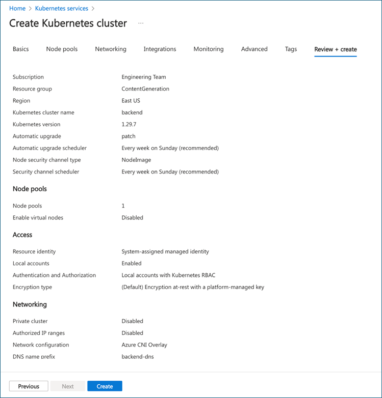

#### CLI instructions

  1. Create a resource group (optional).
  
  If you need to create a resource group, use the following command, replacing <resource-group-name> with your desired name and <location> with the region (for example, eastus, westeurope): 

```
az group create --name <resource-group-name> --location <location> 
```

  2. Create an Azure container registry. 

```
  az acr create \
  --resource-group <your-resource-group-name> \
  --name <your-acr-name> \
  --sku Standard \
  --admin-enabled true 
``` 

  Replace `<your-acr-name>` with the name you want for your container registry. The `--sku Standard` specifies the Azure Container Registry tier, and `--admin-enabled true` enables admin access. 

  **Command parameters** 

  * `--sku Standard`: Specifies the pricing tier for the Azure container registry. (**Standard** is a good default option.)
  * `--admin-enabled true`: Enables admin access for easier management of the Azure container registry.

  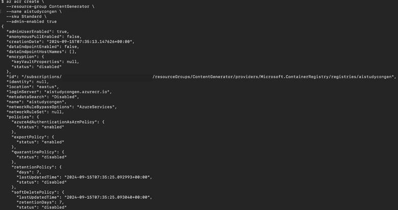

  3. Create an AKS cluster:

```
az aks create \
  --resource-group <your-resource-group-name> \
  --name <your-frontend-aks-cluster-name> \
  --node-count 3 \
  --enable-addons monitoring \
  --generate-ssh-keys \
  --node-vm-size Standard_DS2_v2
```

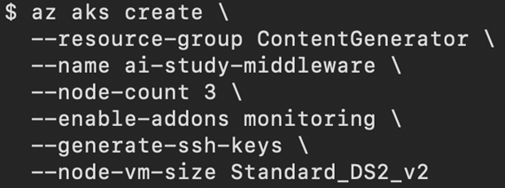

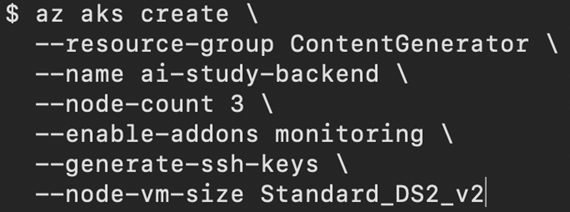

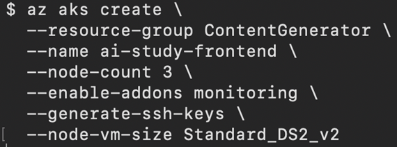

## Summary

In this post, we walked through creating the Azure OpenAI instance that will serve as the core of our app’s content generation capabilities. We finished up our setup tasks by configuring Azure API Management, and then we created the hosting resources we need to deploy our app to Azure.

In our next post, we’ll discuss how you can start building and running the app on your local dev machine.

### Additional resources
* [Register for Demo Bytes](https://developer.microsoft.com/reactor/series/S-1381/?ocid=biafy25h1_30daysofia_webpage_azuremktg), a snackable playlist of demos designed to help you skill up on AI powered app development. 