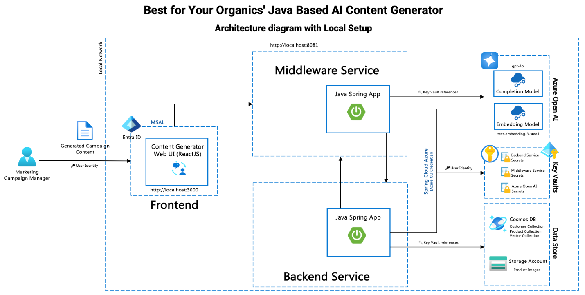
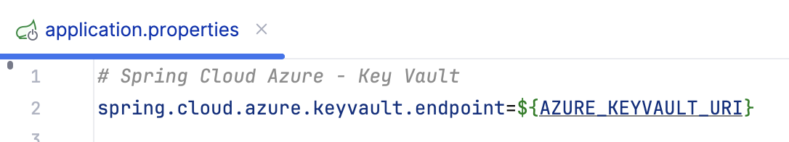

<head> 
  <meta property="og:url" content="https://azure.github.io/cloud-native/30-days-of-ia-2024/build-content-generation-app-part-1"/>
  <meta property="og:type" content="website"/>
  <meta property="og:title" content="**Build Intelligent Apps | AI Apps on Azure"/>
  <meta property="og:description" content="Join us on a learning journey to build intelligent apps on Azure. Read all about the upcoming #BuildIntelligentApps initiative on this post!"/>
  <meta property="og:image" content="https://github.com/Azure/Cloud-Native/blob/main/website/static/img/ogImage.png"/>
  <meta name="twitter:url" content="https://azure.github.io/Cloud-Native/30-days-of-ia-2024/build-content-generation-app-part-1" />
  <meta name="twitter:title" content="**Build Intelligent Apps | AI Apps on Azure" />
  <meta name="twitter:description" content="Join us on a learning journey to build intelligent apps on Azure. Read all about the upcoming #BuildIntelligentApps initiative on this post!" />
  <meta name="twitter:image" content="https://azure.github.io/Cloud-Native/img/ogImage.png" />
  <meta name="twitter:card" content="summary_large_image" />
  <meta name="twitter:creator" content="@devanshidiaries" />
  <link rel="canonical" href="https://azure.github.io/Cloud-Native/30-days-of-ia-2024/build-content-generation-app-part-1" />
</head>

<!-- End METADATA -->

## Part 1: Download and configure app code

Learn how to create and configure the Azure OpenAI Service resource that we’ll use in our example app.

## What we cover:

- Downloading the app code from GitHub to your local machine
- Setting up app secrets and connecting them to Azure Key Vault

## Introduction

In the previous topic, we finished setting up the local tools and Azure services we need to run our app in your local development environment. In this blog, we walk you through getting the app code set up on your dev machine. This involves cloning the app code’s GitHub repository to your local machine. In addition, we’ll securely configure the app’s connection strings and other secrets using a key vault that will be used in both your local environment and in the Azure Kubernetes Service (AKS) or Azure App Service hosting environments that you’ll use when deploying to Azure.

## System Architecture Diagram – Local Setup

Before diving into the setup and configuration details, let's take a look at the overall architecture of the Content Generation System. The architecture diagram below illustrates the key components and their interactions, including the backend, middleware, and frontend services, as well as how they integrate with Azure Key Vault and other Azure services.



**In the diagram:**  

- **Frontend Service:** Users interact with this component through the web interface. It communicates with the backend and middleware services.
- **Middleware Service:** Acts as an intermediary, handling requests between the frontend and backend services.
- **Backend Service:** Contains the core logic and data access layers for the content generation functionality.
- **Azure Key Vault:** Stores and manages secrets used by the services for secure access to configuration and credentials.
- **Azure Cosmos DB:** Database service used for storing and retrieving content data.
- **Azure Storage:** Manages storage of files and other data used by the application.
- **Azure OpenAI:** Provides AI-based services for content generation and embedding.

Now that you have a high-level understanding of the architecture, let’s proceed with the steps to set up and run the application locally.

## Step 1. Clone the GitHub repository

Begin by cloning the repository for the **Java AI-Based Content Generator**.

```
git clone https://github.com/Azure-Samples/Java-AI-Based-Content-Generator
```

:::info
Join the next snackable AI Demo Bytes to explore how to [apply auto-scaling and load testing to your AI applications](https://aka.ms/demo-bytes/ep6?ocid=biafy25h1_30daysofia_webpage_azuremktg).
:::

## Step 2: Set Up Azure Key Vault Secrets and User Identity (Local Setup)

### 1. Set Key Vault URL and Authentication Environment Variables

Before running the services, you must set the environment variables required to access Azure Key Vault securely.

- **Azure Key Vault URL**:
  - Set this in your environment as `AZURE_KEYVAULT_URI` using the URL of your Key Vault.
- **Configure Spring Cloud Azure**:
  - Ensure that you have the [Spring Cloud Azure](https://spring.io/projects/spring-cloud-azure#overview) dependencies added to your project. Spring Cloud Azure provides integration with Azure services and supports using different credential types.
  - By default, Spring Cloud Azure will attempt to use multiple credential builders to authenticate, including:
    - `EnvironmentCredential`
    - `WorkloadIdentityCredential`
    - `ManagedIdentityCredential`
    - `SharedTokenCacheCredential`
    - `IntelliJCredential`
    - `VSCodeCredential`
    - `AzureCliCredential`
  - For local development, the application will use `AzureCliCredential` if no other credentials are configured. This ensures that your local environment can authenticate and interact with Azure services seamlessly.

For more details on configuring and using Spring Cloud Azure with Key Vault, refer to the [Spring Cloud Azure authentication documentation](https://learn.microsoft.com/azure/developer/java/spring-framework/authentication?ocid=biafy25h1_30daysofia_webpage_azuremktg).



### 2. Assign Key Vault Administrator Role

- Go to the **Azure Portal**.
- In the left-hand menu, select **Resource groups** and choose the resource group that contains your Key Vault.
- Select your **Key Vault** from the list of resources.
- In the Key Vault menu, navigate to **Access control (IAM)**.
- Click on the **+ Add button** at the top and select Add role assignment.
- In the **Role** dropdown, search for and select **Key Vault Administrator**.
- In the **Assign access to** field, choose **User, group, or service principal**.
- Search for your user (or the user who will manage secrets) and click **Select**.
- Finally, click **Review + assign**.

This role gives the user permission to manage secrets in the Key Vault.

### Configure User Identity for Local Development

For local development, you can use Azure CLI credentials to authenticate with Azure Key Vault. Follow these steps:

1. **Install Azure CLI:** Ensure that the [Azure CLI](https://docs.microsoft.com/cli/azure/install-azure-cli?ocid=biafy25h1_30daysofia_webpage_azuremktg) is installed on your local machine.
2. Open your command-line interface (CLI) and run the following command to login:

    ```
    az login
    ```

3. Follow the prompts to complete the authentication process. This command authenticates your local CLI session and stores the necessary credentials.
4. **Access Key Vault Secrets:** After running `az login`, your application will use the Azure CLI session to authenticate with Azure Key Vault and retrieve secrets during local development.

:::info
Join live experts to dive into [operational excellence with AKS](https://aka.ms/learn-live/ep3?ocid=biafy25h1_30daysofia_webpage_azuremktg) 
:::

## Summary

In this blog, we cloned our example app code onto your local development machine, and we set up the required environment variables needed to run the app. In addition, we configured the Azure Key Vault settings to securely store the secrets, such as connection strings and keys, that you’ll use when running the app.   

In our next blog, we’ll walk through adding those secrets to your key vault and then we’ll build and run the app for the first time in your local development environment.


