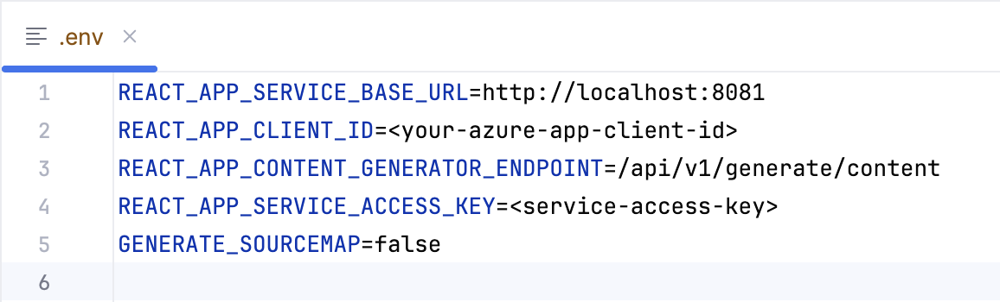

<head> 
  <meta property="og:url" content="https://azure.github.io/cloud-native/30-days-of-ia-2024/build-content-generation-app-part-2"/>
  <meta property="og:type" content="website"/>
  <meta property="og:title" content="**Build Intelligent Apps | AI Apps on Azure"/>
  <meta property="og:description" content="Join us on a learning journey to build intelligent apps on Azure. Read all about the upcoming #BuildIntelligentApps initiative on this post!"/>
  <meta property="og:image" content="https://github.com/Azure/Cloud-Native/blob/main/website/static/img/ogImage.png"/>
  <meta name="twitter:url" content="https://azure.github.io/Cloud-Native/30-days-of-ia-2024/build-content-generation-app-part-2" />
  <meta name="twitter:title" content="**Build Intelligent Apps | AI Apps on Azure" />
  <meta name="twitter:description" content="Join us on a learning journey to build intelligent apps on Azure. Read all about the upcoming #BuildIntelligentApps initiative on this post!" />
  <meta name="twitter:image" content="https://azure.github.io/Cloud-Native/img/ogImage.png" />
  <meta name="twitter:card" content="summary_large_image" />
  <meta name="twitter:creator" content="@devanshidiaries" />
  <link rel="canonical" href="https://azure.github.io/Cloud-Native/30-days-of-ia-2024/build-content-generation-app-part-2" />
</head>

<!-- End METADATA -->

## Part 2: Build and run the application locally

Learn how to make the final configuration updates and run our example application for the first time.

## What we cover:

- Adding required connection strings and other secrets to Azure Key Vault
- Starting the back-end service locally
- Starting the middleware service locally
- Starting the front-end service locally
- Managing application secrets when transitioning from local to Azure Kubernetes Service (AKS) or Azure App Service deployments  

## Introduction

Throughout the last three days of topics, we’ve been working on getting your local dev environment prepared to run our example app and on creating and configuring the Azure services that the app depends on. In our previous topic, we completed this prep work by cloning our example app code from GitHub and then getting our Azure Key Vault configured.

Now we’re ready to run the application for the first time in your local development environment. In today’s post, we walk through adding your app connection secrets to the key vault and finally running the app’s back-end, middleware, and front-end service components.

## Step 1. Add key vault secrets.

After access is granted, add the following secrets into **Azure Key Vault** to securely configure the back-end and middleware services.

**Back-end service secret keys:**

- `AzureCosmosConnectionString`
- `MongoDBDatabaseName`
- `AzureStorageConnectionString`
- `StorageContainerName`
- `MiddlewareServiceBaseUrl`
- `MiddlewareServiceProductEmbeddingEndpoint`
- `MiddlewareServiceAccessKey`

**Middleware service secret keys:**

- `BackendServiceBaseUrl`
- `BackendServiceProductEndpoint`
- `BackendServiceSimilarProductEndpoint`
- `BackendServiceAccessKey`
- `AzureOpenAiEndpointUrl`
- `AzureOpenAiAccessKey`
- `AzureOpenAiEmbeddingEndpointUrl`

### CLI instructions  

Use the following script when performing these instructions:  

Shell script: `add-secrets-to-keyvault.sh`

```
#!/bin/bash

# Function to display usage information
usage() {
  echo "Usage: $0 --keyvault-name <keyvault-name> --resource-group <resource-group> --cosmosdb-name <cosmos-mongo> --mongodb-name <dbname> --storage <sa-name> --storage-container <container-name> --openai-name <openai-details> --openai-completion-model <ai-service-completion-deployment-name> --openai-embedding-model <embedding-deployment-name> [options]"
  echo
  echo "Options:"
  echo "  --keyvault-name                     Azure Key Vault name (required)"
  echo "  --resource-group                    Azure resource group name (required)"
  echo "  --cosmosdb-name                     CosmosDB name (required)"
  echo "  --mongodb-name                      MongoDB database name (default: ContentGenerator)"
  echo "  --storage                           Azure storage account name (required)"
  echo "  --storage-container                 Storage container name (default: contentgen)"
  echo "  --openai-name                       Azure OpenAI service name (required)"
  echo "  --openai-completion-model           OpenAI chat completion deployment name (default: gpt-4o)"
  echo "  --openai-embedding-model            OpenAI embedding deployment name (default: text-embedding-3-small)"
  echo "  --middleware-base-url               Middleware service base URL (default: http://localhost:8081)"
  echo "  --middleware-product-embedding-endpoint Middleware product embedding endpoint (default: /api/v1/generate/embeddings)"
  echo "  --backend-base-url                  Backend service base URL (default: http://localhost:8080)"
  echo "  --backend-product-endpoint          Backend product endpoint (default: /api/v1/products)"
  echo "  --backend-similar-product-endpoint  Backend similar product endpoint (default: /api/v1/products/similar)"
  echo "  -h, --help                          Show this help message and exit"
  exit 1
}

# Check for help flag
if [[ "$1" == "-h" || "$1" == "--help" ]]; then
  usage
fi

# Function to set or update secrets in Azure Key Vault
set_or_update_secret() {
  local secret_name="$1"
  local secret_value="$2"

  echo "Checking secret: $secret_name"

  # Check if the secret already exists in the Key Vault
  secret_exists=$(az keyvault secret show --vault-name "$KEYVAULT_NAME" --name "$secret_name" --query "id" --output tsv 2>/dev/null)

  if [[ -n "$secret_exists" ]]; then
    echo "Secret $secret_name already exists. Updating it..."
  else
    echo "Secret $secret_name does not exist. Creating it..."
  fi

  # Add the Azure CLI command to set or update the secret
  az keyvault secret set --vault-name "$KEYVAULT_NAME" --name "$secret_name" --value "$secret_value" >/dev/null
}

# Default values
MONGO_DB_DATABASE_NAME="ContentGenerator"
STORAGE_CONTAINER_NAME="contentgen"
OPENAI_COMPLETION_MODEL="gpt-4o"
OPENAI_EMBEDDING_MODEL="text-embedding-3-small"
BACKEND_BASE_URL="http://localhost:8080"
BACKEND_PRODUCT_ENDPOINT="/api/v1/products"
BACKEND_SIMILAR_PRODUCT_ENDPOINT="/api/v1/products/similar"
MIDDLEWARE_BASE_URL="http://localhost:8081"
MIDDLEWARE_PRODUCT_EMBEDDING_ENDPOINT="/api/v1/generate/embeddings"

# Parse arguments
while [[ $# -gt 0 ]]; do
  case "$1" in
    --keyvault-name)
      KEYVAULT_NAME="$2"
      shift 2
      ;;
    --resource-group)
      RESOURCE_GROUP="$2"
      shift 2
      ;;
    --cosmosdb-name)
      COSMOSDB_NAME="$2"
      shift 2
      ;;
    --mongodb-name)
      MONGO_DB_DATABASE_NAME="$2"
      shift 2
      ;;
    --storage)
      STORAGE_ACCOUNT_NAME="$2"
      shift 2
      ;;
    --storage-container)
      STORAGE_CONTAINER_NAME="$2"
      shift 2
      ;;
    --openai-name)
      OPENAI_NAME="$2"
      shift 2
      ;;
    --openai-completion-model)
      OPENAI_COMPLETION_MODEL="$2"
      shift 2
      ;;
    --openai-embedding-model)
      OPENAI_EMBEDDING_MODEL="$2"
      shift 2
      ;;
    --middleware-base-url)
      MIDDLEWARE_BASE_URL="$2"
      shift 2
      ;;
    --middleware-product-embedding-endpoint)
      MIDDLEWARE_PRODUCT_EMBEDDING_ENDPOINT="$2"
      shift 2
      ;;
    --backend-base-url)
      BACKEND_BASE_URL="$2"
      shift 2
      ;;
    --backend-product-endpoint)
      BACKEND_PRODUCT_ENDPOINT="$2"
      shift 2
      ;;
    --backend-similar-product-endpoint)
      BACKEND_SIMILAR_PRODUCT_ENDPOINT="$2"
      shift 2
      ;;
    *)
      echo "Unknown option: $1"
      usage
      ;;
  esac
done

# Validate required arguments
if [[ -z "$KEYVAULT_NAME" || -z "$RESOURCE_GROUP" || -z "$COSMOSDB_NAME" || -z "$STORAGE_ACCOUNT_NAME" || -z "$OPENAI_NAME" || -z "$OPENAI_EMBEDDING_MODEL" ]]; then
  echo "Error: Missing required arguments."
  usage
fi

# Generate UUIDs for access keys
BACKEND_SERVICE_ACCESS_KEY=$(uuidgen)
MIDDLEWARE_SERVICE_ACCESS_KEY=$(uuidgen)

# Fetch Azure OpenAI service endpoint and keys using az cli
AZURE_OPENAI_ENDPOINT_URL=$(az cognitiveservices account show --name "$OPENAI_NAME" --resource-group "$RESOURCE_GROUP" --query "properties.endpoint" --output tsv)
AZURE_OPENAI_ACCESS_KEY=$(az cognitiveservices account keys list --name "$OPENAI_NAME" --resource-group "$RESOURCE_GROUP" --query "key1" --output tsv)

# Construct the completion and embedding endpoints dynamically
AZURE_OPENAI_COMPLETION_ENDPOINT_URL="$AZURE_OPENAI_ENDPOINT_URL/openai/deployments/$OPENAI_COMPLETION_MODEL/chat/completions?api-version=2023-03-15-preview"
AZURE_OPENAI_EMBEDDING_ENDPOINT_URL="$AZURE_OPENAI_ENDPOINT_URL/openai/deployments/$OPENAI_EMBEDDING_MODEL/embeddings?api-version=2023-05-15"

# Retrieve other secrets using Azure CLI
AZURE_COSMOS_CONNECTION_STRING=$(az cosmosdb keys list --resource-group "$RESOURCE_GROUP" --name "$COSMOSDB_NAME" --type connection-strings --query "connectionStrings[0].connectionString" --output tsv)
AZURE_STORAGE_CONNECTION_STRING=$(az storage account show-connection-string --resource-group "$RESOURCE_GROUP" --name "$STORAGE_ACCOUNT_NAME" --query connectionString --output tsv)

# List of secrets to set
secrets=(
  "BackendServiceBaseUrl" "$BACKEND_BASE_URL"
  "BackendServiceProductEndpoint" "$BACKEND_PRODUCT_ENDPOINT"
  "BackendServiceSimilarProductEndpoint" "$BACKEND_SIMILAR_PRODUCT_ENDPOINT"
  "BackendServiceAccessKey" "$BACKEND_SERVICE_ACCESS_KEY"
  "AzureOpenAiEndpointUrl" "$AZURE_OPENAI_ENDPOINT_URL"
  "AzureOpenAiAccessKey" "$AZURE_OPENAI_ACCESS_KEY"
  "AzureOpenAiCompletionEndpointUrl" "$AZURE_OPENAI_COMPLETION_ENDPOINT_URL"
  "AzureOpenAiEmbeddingEndpointUrl" "$AZURE_OPENAI_EMBEDDING_ENDPOINT_URL"
  "MiddlewareServiceBaseUrl" "$MIDDLEWARE_BASE_URL"
  "MiddlewareServiceProductEmbeddingEndpoint" "$MIDDLEWARE_PRODUCT_EMBEDDING_ENDPOINT"
  "MiddlewareServiceAccessKey" "$MIDDLEWARE_SERVICE_ACCESS_KEY"
  "AzureCosmosConnectionString" "$AZURE_COSMOS_CONNECTION_STRING"
  "MongoDBDatabaseName" "$MONGO_DB_DATABASE_NAME"
  "AzureStorageConnectionString" "$AZURE_STORAGE_CONNECTION_STRING"
  "StorageContainerName" "$STORAGE_CONTAINER_NAME"
)

# Loop through the array and set or update each secret
for ((i=0; i<${#secrets[@]}; i+=2)); do
  secret_name="${secrets[$i]}"
  secret_value="${secrets[$i+1]}"

  # Call the set_or_update_secret function
  set_or_update_secret "$secret_name" "$secret_value"
done

echo "Secrets have been set or updated successfully." 
```

### Script overview  

#### Required arguments

These arguments are mandatory for the script to run successfully:

- `--keyvault-name <keyvault-name>`: The name of the Azure key vault where secrets will be set or updated.

- `--resource-group <resource-group>`: The Azure resource group that contains the resources (for example, Key Vault, Azure Cosmos DB) to be used.

- `--cosmosdb-name <cosmos-mongo>`: The name of the Azure Cosmos DB instance (MongoDB API).

- `--storage <sa-name>`: The name of the Azure Storage account used for storing data.

- `--openai-name <openai-details>`: The name of the Azure OpenAI Service instance.

- `--openai-embedding-model <embedding-deployment-name>`: The deployment name for the Azure OpenAI embedding model.


#### Optional arguments

These arguments have default values and can be overridden if needed:

- `--mongodb-name <dbname>`: Name of the MongoDB database.  
  **Default value**: `ContentGenerator`

- `--storage-container <container-name>`: Name of the storage container within the Azure Storage account.  
  **Default value**: `contentgen`

- `--openai-completion-model <ai-service-completion-deployment-name>`: Deployment name for the Azure OpenAI chat completion model.  
  **Default value**: `gpt-4o`

- `--middleware-base-url <url>`: Base URL for the middleware service.  
  **Default value**: `http://localhost:8081`

- `--middleware-product-embedding-endpoint <endpoint>`: Endpoint for the product embedding service in the middleware.  
  **Default value**: `/api/v1/generate/embeddings`

- `--backend-base-url <url>`: Base URL for the back-end service.  
  **Default value**: `http://localhost:8080`

- `--backend-product-endpoint <endpoint>`: Endpoint for accessing product data in the back-end service.  
  **Default value**: `/api/v1/products`

- `--backend-similar-product-endpoint <endpoint>`: Endpoint for accessing similar product data in the back-end service.  
  **Default value**: `/api/v1/products/similar`


Save this script, and then run it using the following command:

```
./add-secrets-to-keyvault.sh \
    --keyvault-name <keyvault-name> \
    --resource-group <resource-group> \
    --cosmosdb-name <cosmos-mongo> \
    --mongodb-name <dbname> \
    --storage <sa-name> \
    --storage-container <container-name> \
    --openai-name <openai-details> \
    --openai-completion-model <ai-service-completion-deployment-name> \
    --openai-embedding-model <embedding-deployment-name>
```


:::info
[Ingest your own content](https://aka.ms/demo-bytes/ep13?ocid=biafy25h1_30daysofia_webpage_azuremktg) using the Azure Functions OpenAI extension into a Cosmos DB vector database to enable OpenAI query on your data.
:::

## Step 2. Run the back-end service locally

1. **Navigate to the back-end folder**. In your terminal, navigate to the back-end folder in the cloned repo.

2. **Open the folder in your IDE**. Use [Visual Studio Code](https://code.visualstudio.com/) or [IntelliJ IDEA](https://www.jetbrains.com/idea/) to open the back-end folder.

3. **Add Key Vault environment variables**. Be sure that the following variable is set in your local environment:
   - `AZURE_KEYVAULT_URI`: The URL of your Key Vault.

4. **Run the back-end service**. To start the back-end service, run the following command:

   ```
   ./mvnw spring-boot:run
   ```

    

    The back-end service will run on port **8080**.

## Step 3: Run the middleware service locally

1. **Navigate to the middleware folder**. Open another terminal window, and navigate to the middleware folder.

2. **Change the port for middleware**. Open the `application.properties` file in the middleware folder, and change the default port to `8081` by adding:

      

3. **Add key vault environment variables.** Set the environment variables as itemized `(AZURE_KEYVAULT_URI)`. 

4. **Run the middleware service.** Use the following command:

    ```
    ./mvnw spring-boot:run  
    ```

      

  The middleware will run on port **8081**.

## Step 4: Run the front-end service locally

1. **Navigate to the front-end folder**. Go to the front-end folder in your cloned repo.

2. **Copy the `.env.example file`**. Copy the `.env.example` file, and rename it to `.env`:

   ```
   cp .env.example .env
   ```

3. Configure the `.env file`. Update the following variables in the `.env` file:

    

4. **Install dependencies.** Run npm install or yarn install to install the necessary front-end dependencies.  

5. **Run the front-end service.** Start the front-end service using one of the following commands:

    ```
    npm start  
    ```

    or

    ```
    yarn start  
    ```

**Note:** At this point, you’re prompted to sign in with your Microsoft Entra ID credentials. The front end authenticates the user with Microsoft Entra ID (user identity). After you sign in, the following screen appears.


The front end runs on `http://localhost:3000`.

### Local vs. deployment environments

For local development, you can set the **endpoint URLs** directly in `.env` or `application.properties` files. However, after deployment to **AKS** or **App Service**, you need to update the **Key Vault secrets** to reflect the public-facing URLs and credentials:

- **Back-end and middleware URLs:** Replace `localhost` with the public URL of your deployed services.

- **API Management:** When deployed, make sure that API keys and exposed API URLs are managed through **API Management**.

We’ll cover the details of deploying to AKS or App Service and using API Management in subsequent topics.

:::info
Learn more on Technical leaders’ [guide to building intelligent apps](https://aka.ms/AAI_TDMApps_Plan?ocid=biafy25h1_30daysofia_webpage_azuremktg).
:::

## Summary

In today’s topic, we finished configuring the app’s connection strings and other secrets in Azure Key Vault. Then we got the back-end, middleware, and front-end services running on your local machine, allowing you to test the app in your browser.  

Now that you’ve got a running app, our next topic will cover deploying it to Azure using either **Azure Kubernetes Service (AKS)** or **Azure App Service**, along with configuring **Azure API Management** to help ensure that your APIs are secured using key-based authentication.


