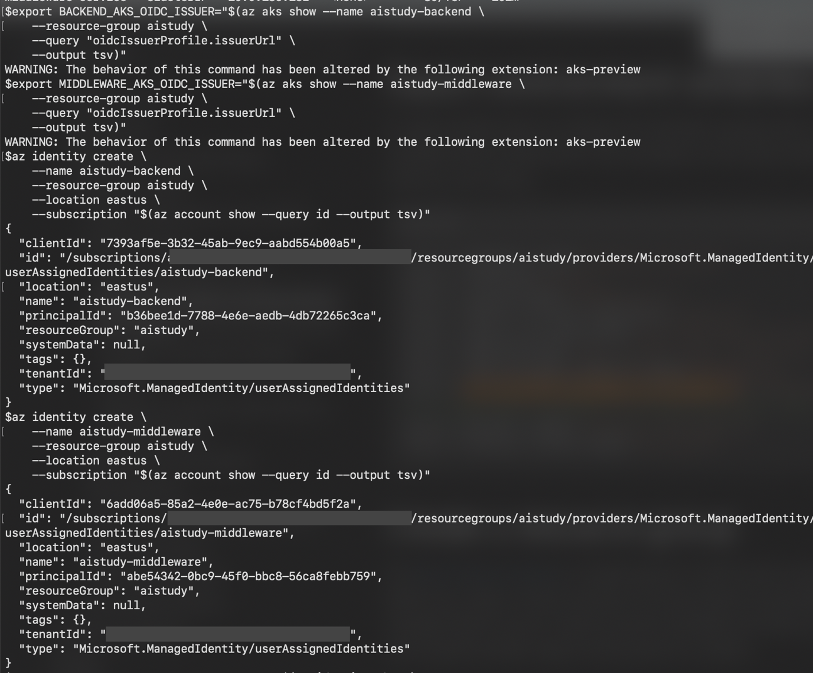
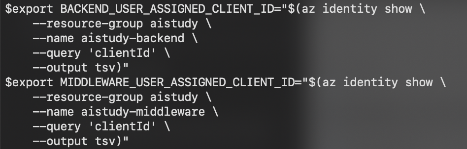
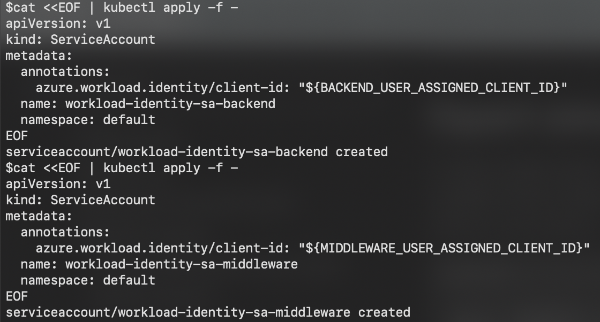
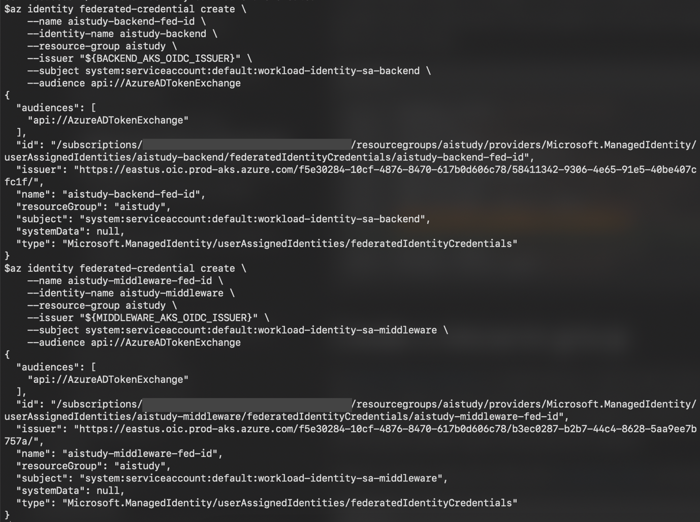
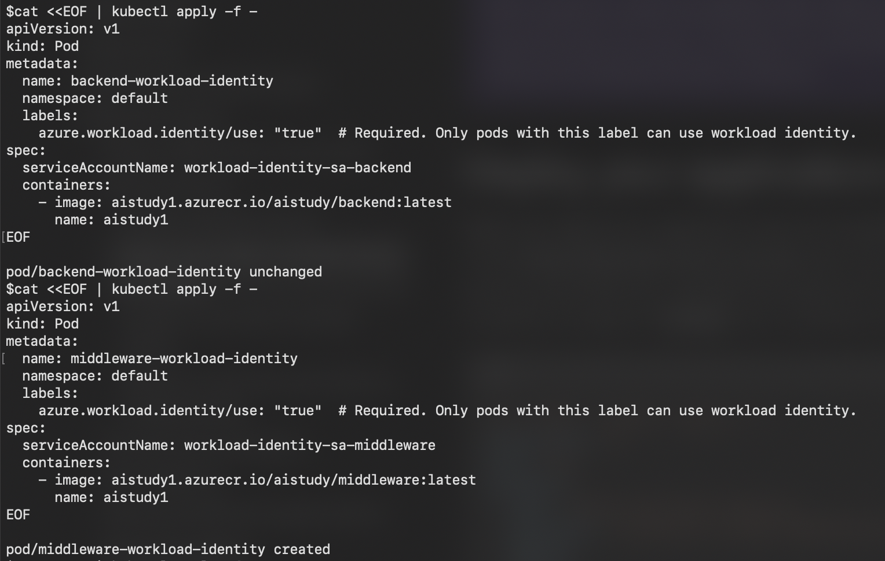
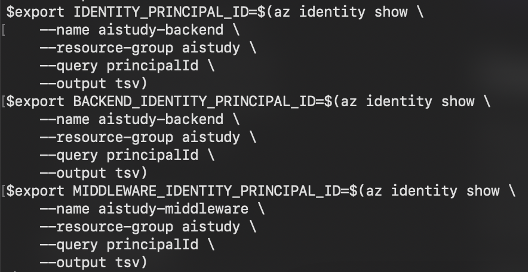
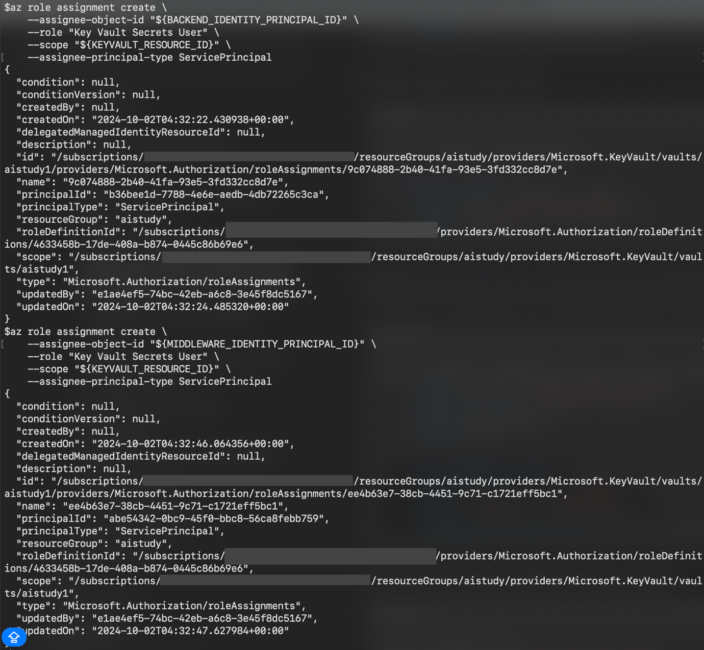
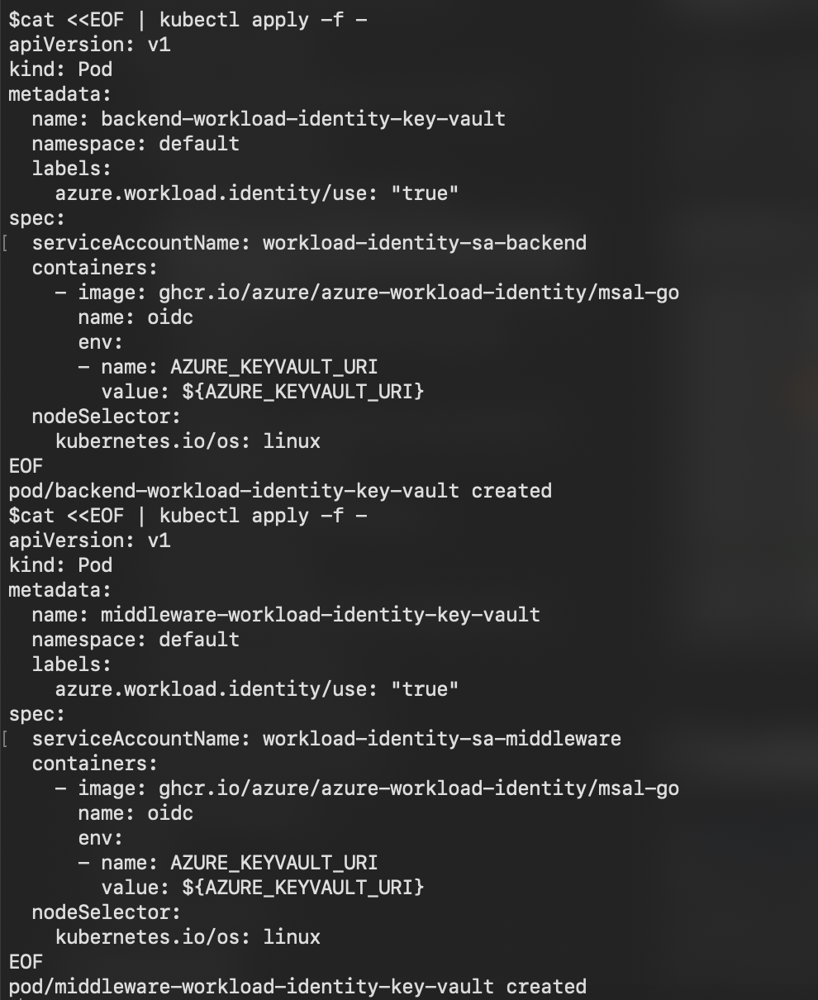
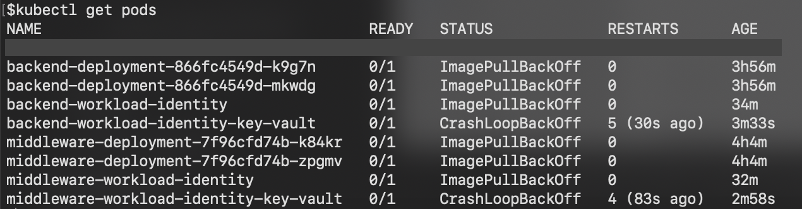

<head> 
  <meta property="og:url" content="https://azure.github.io/cloud-native/30-days-of-ia-2024/deploy-application-with-AKS-part-1"/>
  <meta property="og:type" content="website"/>
  <meta property="og:title" content="**Build Intelligent Apps | AI Apps on Azure"/>
  <meta property="og:description" content="In this blog, we will set up APIM, Key Vault, and Managed Identity for the Middleware and Back-end services. We will also include the necessary Azure CLI commands and create a Kubernetes pod to integrate with Key Vault using Managed Identity."/>
  <meta property="og:image" content="https://github.com/Azure/Cloud-Native/blob/main/website/static/img/ogImage.png"/>
  <meta name="twitter:url" content="https://azure.github.io/Cloud-Native/30-days-of-ia-2024/deploy-application-with-AKS-part-1" />
  <meta name="twitter:title" content="**Build Intelligent Apps | AI Apps on Azure" />
  <meta name="twitter:description" content="In this blog, we will set up APIM, Key Vault, and Managed Identity for the Middleware and Back-end services. We will also include the necessary Azure CLI commands and create a Kubernetes pod to integrate with Key Vault using Managed Identity." />
  <meta name="twitter:image" content="https://azure.github.io/Cloud-Native/img/ogImage.png" />
  <meta name="twitter:card" content="summary_large_image" />
  <meta name="twitter:creator" content="@devanshidiaries" />
  <link rel="canonical" href="https://azure.github.io/Cloud-Native/30-days-of-ia-2024/deploy-application-with-AKS-part-1" />
</head>

<!-- End METADATA -->

## Part 1: Configuring APIM, Key Vault, and Managed Identity for Middleware and Back-end Services

In this blog, we will set up **APIM**, **Key Vault**, and **Managed Identity** for the Middleware and Back-end services. We will refer to Blog 1.4a for the APIM configuration, as it remains consistent. We will also include the necessary Azure CLI commands and create a Kubernetes pod to integrate with Key Vault using Managed Identity.

## What we cover:

1. Review of APIM Configuration
2. Setting Up Key Vault and Managed Identity
3. Creating Kubernetes Pod with Managed Identity Integration
4. Verifying Configurations  

## Prerequisites

Before proceeding, ensure that you have completed the environment setup described in **Blog 1.2b**, where we created the AKS cluster and Azure Container Registry (ACR).

## Step 1: Review of APIM Configuration

The APIM configuration for the Middleware and Back-end services remains the same as covered in **Blog 1.4a**. Please refer to Blog 1.4a for detailed steps on setting up APIM and configuring CORS policies, header checks, and other necessary configurations.

:::info
[Ingest your own content](https://aka.ms/demo-bytes/ep6?ocid=biafy25h1_30daysofia_webpage_azuremktg) using the Azure Functions OpenAI extension into a Cosmos DB vector database to enable OpenAI query on your data.
:::

## Step 2: Setting Up Key Vault and Managed Identity

In this step, we will set up Azure Key Vault and configure Managed Identity to allow secure access to the secrets stored in Key Vault.

### Create a Key Vault:
  - Use the Azure CLI to create a Key Vault if it does not already exist:

```
az aks create \
  --resource-group <RESOURCE_GROUP_NAME> \
  --name <AKS_NAME> \
  --node-count 1 \
  --enable-addons monitoring \
  --enable-oidc-issuer \
  --enable-workload-identity \
  --generate-ssh-keys
```

### Enable Managed Identity in AKS:
  - Follow the Azure documentation to enable Managed Identity for the AKS cluster using workload identity: [Workload Identity for AKS](https://learn.microsoft.com/azure/aks/workload-identity-deploy-cluster?ocid=biafy25h1_30daysofia_webpage_azuremktg).
  - Run the following commands to integrate workload identity:

```
# Retrieve the OIDC issuer URL
export AKS_OIDC_ISSUER="$(az aks show --name <AKS_NAME> \
  --resource-group <RESOURCE_GROUP_NAME> \
  --query "oidcIssuerProfile.issuerUrl" \
  --output tsv)"

# Create a Managed Identity for the AKS cluster
az identity create \
  --name <USER_ASSIGNED_IDENTITY_NAME> \
  --resource-group <RESOURCE_GROUP_NAME> \
  --location <LOCATION> \
  --subscription "$(az account show --query id --output tsv)"

export USER_ASSIGNED_CLIENT_ID="$(az identity show \
  --resource-group <RESOURCE_GROUP_NAME> \
  --name <USER_ASSIGNED_IDENTITY_NAME> \
  --query 'clientId' \
  --output tsv)"

# Create a Kubernetes service account
cat <<EOF | kubectl apply -f -
apiVersion: v1
kind: ServiceAccount
metadata:
  annotations:
    azure.workload.identity/client-id: "${USER_ASSIGNED_CLIENT_ID}"
  name: workload-identity-sa
  namespace: default
EOF

# Create the federated identity credential
az identity federated-credential create \
  --name ${FEDERATED_IDENTITY_CREDENTIAL_NAME} \
  --identity-name "${USER_ASSIGNED_IDENTITY_NAME}" \
  --resource-group "${RESOURCE_GROUP}" \
  --issuer "${AKS_OIDC_ISSUER}" \
  --subject system:serviceaccount:"${SERVICE_ACCOUNT_NAMESPACE}":"${SERVICE_ACCOUNT_NAME}" \
  --audience api://AzureADTokenExchange

# Deploy your application
cat <<EOF | kubectl apply -f -
apiVersion: v1
kind: Pod
metadata:
  name: sample-workload-identity
  namespace: ${SERVICE_ACCOUNT_NAMESPACE}
  labels:
    azure.workload.identity/use: "true"  # Required. Only pods with this label can use workload identity.
spec:
  serviceAccountName: ${SERVICE_ACCOUNT_NAME}
  containers:
    - image: <image>
      name: <containerName>
EOF
```











### Grant Access to Key Vault:
  - Use the following command to grant the Managed Identity access to the Key Vault:

```
export KEYVAULT_RESOURCE_ID=$(az keyvault show --resource-group <RESOURCE_GROUP_NAME> \
  --name <KEYVAULT_NAME> \
  --query id \
  --output tsv)

export IDENTITY_PRINCIPAL_ID=$(az identity show \
  --name <USER_ASSIGNED_IDENTITY_NAME> \
  --resource-group <RESOURCE_GROUP_NAME> \
  --query principalId \
  --output tsv)

az role assignment create \
  --assignee-object-id "${IDENTITY_PRINCIPAL_ID}" \
  --role "Key Vault Secrets User" \
  --scope "${KEYVAULT_RESOURCE_ID}" \
  --assignee-principal-type ServicePrincipal

export AZURE_KEYVAULT_URI=https://<KEYVAULT_NAME>.vault.azure.net/
```





## Step 3: Creating Kubernetes Pod with Managed Identity Integration

In this step, we will create a Kubernetes pod and integrate it with Key Vault using the Managed Identity.

### Deploy a Kubernetes Pod reference:
- To define the pod with the necessary labels and annotations for Managed Identity integration.

```
cat <<EOF | kubectl apply -f -
apiVersion: v1
kind: Pod
metadata:
  name: workload-identity-key-vault
  namespace: default
  labels:
    azure.workload.identity/use: "true"
spec:
  serviceAccountName: <SERVICE_ACCOUNT_NAME>
  containers:
    - image: ghcr.io/azure/azure-workload-identity/msal-go
      name: oidc
      env:
        - name: AZURE_KEYVAULT_URI
          value: ${AZURE_KEYVAULT_URI}
  nodeSelector:
    kubernetes.io/os: linux
EOF
```



## Step 4: Verifying Configurations

### Verify Pod Creation:
- Check if the pod is running successfully:

```
kubectl get pods
```



:::info
Join live experts to dive into [operational excellence with AKS](https://aka.ms/learn-live/ep3?ocid=biafy25h1_30daysofia_webpage_azuremktg)
:::

## Conclusion

In this blog, we configured APIM, Key Vault, and Managed Identity for the Middleware and Back-end services. We also created a Kubernetes pod with Managed Identity integration, ensuring secure access to Key Vault secrets.

## Additional Resources

- [Azure API Management Documentation](https://learn.microsoft.com/azure/api-management/?ocid=biafy25h1_30daysofia_webpage_azuremktg)
- [Azure Key Vault Documentation](https://learn.microsoft.com/azure/key-vault/?ocid=biafy25h1_30daysofia_webpage_azuremktg)
- [Managed Identities for Azure Resources](https://learn.microsoft.com/azure/active-directory/managed-identities-azure-resources/?ocid=biafy25h1_30daysofia_webpage_azuremktg)
- [Workload Identity for AKS](https://learn.microsoft.com/azure/aks/workload-identity-deploy-cluster?ocid=biafy25h1_30daysofia_webpage_azuremktg)