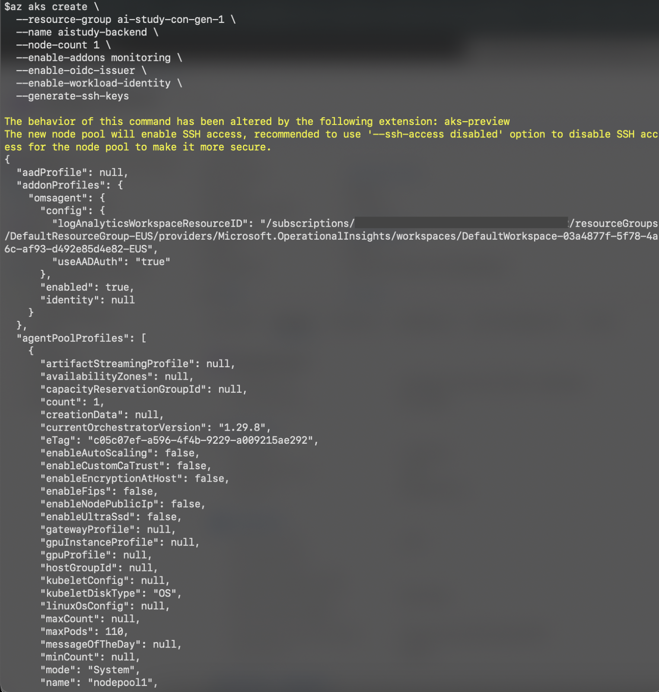

<head> 
  <meta property="og:url" content="https://azure.github.io/cloud-native/30-days-of-ia-2024/deploy-application-with-AKS-part-2"/>
  <meta property="og:type" content="website"/>
  <meta property="og:title" content="**Build Intelligent Apps | AI Apps on Azure"/>
  <meta property="og:description" content="In this blog, we will deploy our application components (Middleware, Back-end, and Front-end services) to Azure Kubernetes Service (AKS) using Azure CLI and Kubernetes configurations. This approach allows us to leverage container orchestration for better management and scalability."/>
  <meta property="og:image" content="https://github.com/Azure/Cloud-Native/blob/main/website/static/img/ogImage.png"/>
  <meta name="twitter:url" content="https://azure.github.io/Cloud-Native/30-days-of-ia-2024/deploy-application-with-AKS-part-2" />
  <meta name="twitter:title" content="**Build Intelligent Apps | AI Apps on Azure" />
  <meta name="twitter:description" content="In this blog, we will deploy our application components (Middleware, Back-end, and Front-end services) to Azure Kubernetes Service (AKS) using Azure CLI and Kubernetes configurations. This approach allows us to leverage container orchestration for better management and scalability." />
  <meta name="twitter:image" content="https://azure.github.io/Cloud-Native/img/ogImage.png" />
  <meta name="twitter:card" content="summary_large_image" />
  <meta name="twitter:creator" content="@devanshidiaries" />
  <link rel="canonical" href="https://azure.github.io/Cloud-Native/30-days-of-ia-2024/deploy-application-with-AKS-part-2" />
</head>

<!-- End METADATA -->

## Part 2: Deploying the Application to Azure Kubernetes Service (AKS)

In this blog, we will deploy our application components (Middleware, Back-end, and Front-end services) to **Azure Kubernetes Service (AKS)** using Azure CLI and Kubernetes configurations. This approach allows us to leverage container orchestration for better management and scalability.

## What we cover:

1. Understanding Azure Kubernetes Service (AKS)
2. Preparing the Application for AKS Deployment
3. Creating the AKS Cluster
4. Configuring the Application Deployment
5. Deploying the Application to AKS
6. Verifying the Deployment


## Prerequisites

Before proceeding, ensure that the Managed Identity and Key Vault configurations are completed as described in **Blog 1.5a**. Additionally, refer to **[Blog 1.2b](https://azure.github.io/Cloud-Native/30-days-of-ia-2024/setting-up-your-development-environment-2)** for details on the initial environment setup, where the AKS cluster and Azure Container Registry (ACR) were created.

## Step 1: Understanding Azure Kubernetes Service (AKS)

Azure Kubernetes Service (AKS) is a managed container orchestration service that simplifies the deployment, management, and operations of Kubernetes. It enables seamless scaling, monitoring, and management of containerized applications. With AKS, you can deploy, manage, and scale containerized applications with ease.

:::info
 [Ingest your own content](https://aka.ms/demo-bytes/ep13?ocid=biafy25h1_30daysofia_webpage_azuremktg) using the Azure Functions OpenAI extension into a Cosmos DB vector database to enable OpenAI query on your data..
:::

## Step 2: Preparing the Application for AKS Deployment

### Containerize the Application:
- Ensure that you have a separate `Dockerfile` for each service (Back-end, Middleware, and Front-end) for the containerization process. Example `Dockerfile` for Back-end:

```
# Use an official JDK base image
FROM mcr.microsoft.com/openjdk/jdk:17-mariner

# Set the working directory
WORKDIR /app

# Copy the WAR file into the container
COPY target/backend.war /app/backend.war

# Expose the port the app runs on
EXPOSE 8080

# Run the WAR file
ENTRYPOINT ["java", "-jar", "/app/backend.war"]
```


### Build and Push Docker Images:
- Build the Docker images and push them to Azure Container Registry (ACR).

#### Commands:

```
# ACR Login
az acr login --name <ACR_NAME>

# Set your image build version
VERSION=1.0.1

docker build -t aistudy/backend-service:${VERSION} .

docker tag aistudy/backend-service:${VERSION} <ACR_Name>.azurecr.io/aistudy/backend-service:${VERSION}

docker push <ACR_Name>.azurecr.io/backend-service:latest

# Build and push the Back-end service
docker tag backend-service:latest <ACR_Name>.azurecr.io/backend-service:latest
docker push <ACR_Name>.azurecr.io/backend-service:latest

# Build and push the Middleware service
docker tag middleware-service:latest <ACR_Name>.azurecr.io/middleware-service:latest
docker push <ACR_Name>.azurecr.io/middleware-service:latest

# Build and push the Front-end service
docker tag frontend-service:latest <ACR_Name>.azurecr.io/frontend-service:latest
docker push <ACR_Name>.azurecr.io/frontend-service:latest
```


## Step 3: Creating the AKS Cluster

If you have not already created the AKS cluster and ACR (Azure Container Registry), refer to **[Blog 1.2b](https://azure.github.io/Cloud-Native/30-days-of-ia-2024/setting-up-your-development-environment-2)** for details on the environment setup.

### Create AKS Cluster Using Azure CLI
- Use the following Azure CLI command to create a new AKS cluster with workload identity enabled:

```
az aks create \
  --resource-group <RESOURCE_GROUP_NAME> \
  --name <AKS_NAME> \
  --node-count 1 \
  --enable-addons monitoring \
  --enable-oidc-issuer \
  --enable-workload-identity \
  --generate-ssh-keys
```

- The `--enable-oidc-issuer` and `--enable-workload-identity` flags are required to enable workload identity on the cluster, allowing for secure and seamless integration with Azure AD and Key Vault.



### Connect to the AKS Cluster
- Use the following command to connect your local kubectl to the AKS cluster:

```
 az aks get-credentials --resource-group <RESOURCE_GROUP_NAME> --name <AKS_NAME>
```

- This command will download the credentials and configure your `kubectl` context.


## Step 4: Configuring the Application Deployment

In this step, we will create Kubernetes deployment and service YAML files for each service and configure them to run in the AKS cluster.

### Create Deployment and Service YAML Files
- Create separate `deployment.yml` files for each service.  
- `Backend-deployment.yml` for ***Back-end Service:***

```
apiVersion: apps/v1
kind: Deployment
metadata:
  name: backend-deployment
spec:
  replicas: 2
  selector:
    matchLabels:
      app: backend
  template:
    metadata:
      labels:
        app: backend
    spec:
      containers:
        - name: backend
          image: <ACR_NAME>.azurecr.io/aistudy/backend:latest
          ports:
            - containerPort: 8080
          env:
            - name: AZURE_KEYVAULT_URI
              value: https://<KEYVAULT_NAME>.vault.azure.net/

---
apiVersion: v1
kind: Service
metadata:
  name: backend-service
spec:
  selector:
    app: backend
  ports:
    - port: 80
      targetPort: 8080
  type: ClusterIP
```

## Step 5: Deploying the Application to AKS

### Apply the Deployment and Service YML Files
- Use the following commands to deploy the Back-end and Middleware services to AKS:

```
kubectl apply -f backend-deployment.yml
kubectl apply -f middleware-deployment.yml
```


### Deploy the Front-end Service


- Use similar commands to deploy the front-end service:

```
kubectl apply -f frontend-deployment.yml
```

## Step 6: Verifying the Deployment

### Check the Status of Deployments

- Use the following commands to check the status of each deployment:

```
kubectl get deployments  
kubectl get services 
```


### Access the Application
- If the front-end service is exposed as a `ClusterIP` type, use the following command to get the external IP address:

```
kubectl get services frontend-service
```

- Open the application in a browser using the external IP address.

## Cleanup

Once you have finished deploying and testing your application, it's essential to clean up the resources to avoid incurring any unnecessary costs. You can delete the Azure Resource Group that contains your resources using either the **Azure CLI** or the **Azure portal**. This will remove all the resources within that group, such as the Azure Kubernetes Service (AKS), Azure Container Registry (ACR), Azure API Management, and any other services created in the group.

### Using Azure CLI

To delete the resource group using the Azure CLI, follow these steps:

- Open your terminal or Azure Cloud Shell.
- Run the following command to delete the resource group:

```
az group delete --name <resource-group-name> --yes --no-wait
```

- Replace `<resource-group-name>` with the name of your Azure resource group.
- The `--yes` parameter confirms the deletion without a prompt.
- The `--no-wait` parameter initiates the deletion and immediately returns control to the terminal, so you don't have to wait for the deletion process to complete.

### Using the Azure Portal

If you prefer to delete the resources using the Azure portal, follow these instructions:

- **Navigate to the Azure Portal:** Go to [Azure Portal](http://portal.azure.com/) and sign in with your credentials.
- **Select "Resource Groups":** In the left-hand menu, select **Resource groups**. This will list all the resource groups available in your subscription.
- **Find the Resource Group:** Locate the resource group you want to delete (e.g., the resource group that contains your AKS and ACR resources).
- **Click on the Resource Group:** Click on the resource group name to open it.
- **Delete the Resource Group:** At the top of the resource group page, click on **Delete resource group**.
- **Confirm Deletion:** You will be prompted to type the name of the resource group to confirm deletion. Type the name exactly and click on the **Delete** button.


Deleting a resource group in the Azure portal will remove **all resources** associated with it. Be careful when performing this action, as it cannot be undone.

:::info
Learn more on Technical leaders’ [  guide to building intelligent apps](https://aka.ms/AAI_TDMApps_Plan?ocid=biafy25h1_30daysofia_webpage_azuremktg).
:::

## Conclusion

In this blog, we successfully deployed our Middleware, Back-end, and Front-end services to Azure Kubernetes Service (AKS) using Kubernetes configurations and the Azure CLI. By using the `--enable-oidc-issuer` and `--enable-workload-identity` flags, we enabled secure workload identity on the cluster, allowing for integration with Azure AD and seamless access to Key Vault secrets.

## Additional Resources

- [Azure Kubernetes Service Documentation](https://learn.microsoft.com/azure/aks/?ocid=biafy25h1_30daysofia_webpage_azuremktg)
- [Getting Started with Azure Kubernetes Service](https://learn.microsoft.com/azure/aks/get-started-aks)
- [Deploying Applications to Azure Kubernetes Service](https://learn.microsoft.com/azure/aks/deploy-application)
- [Managed Identities for Azure Resources](https://learn.microsoft.com/azure/active-directory/managed-identities-azure-resources/)
- [Workload Identity for AKS](https://learn.microsoft.com/en-us/azure/aks/workload-identity-deploy-cluster)

