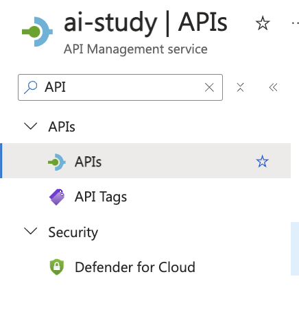
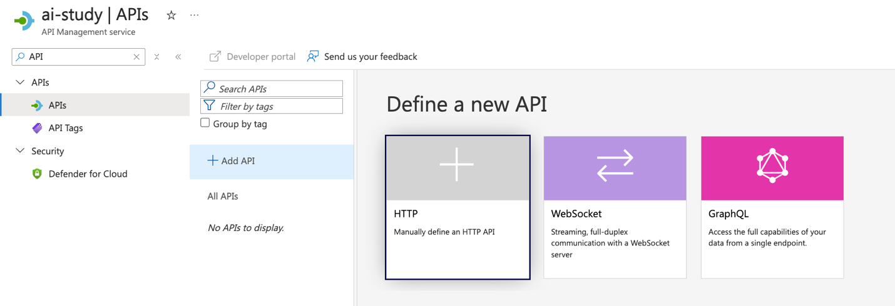
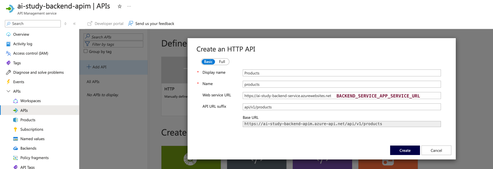
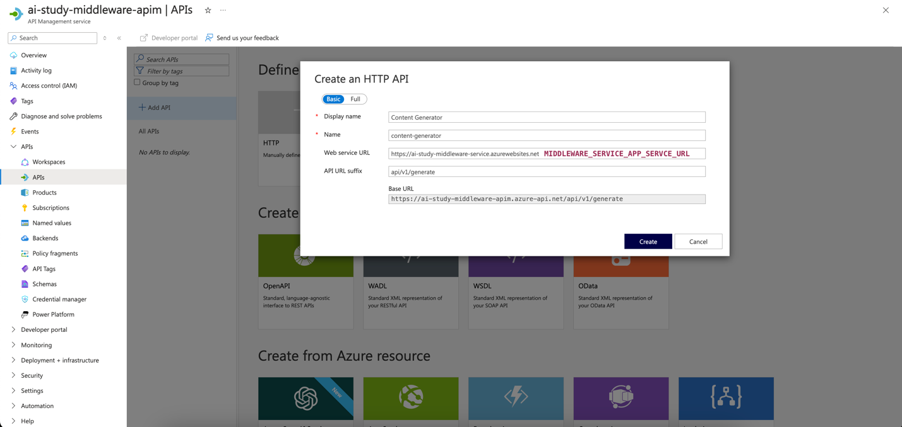
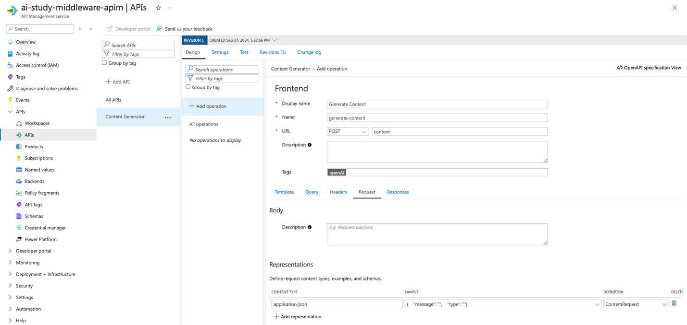
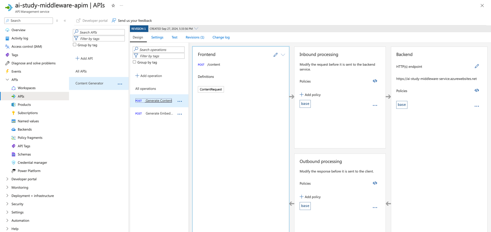
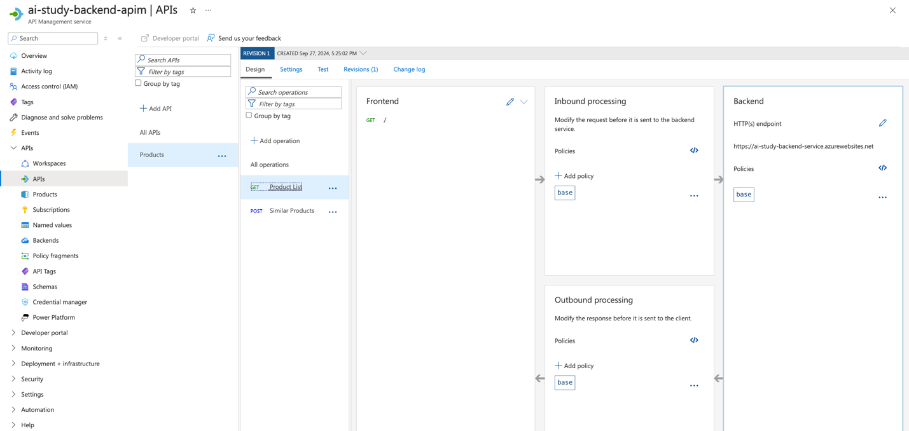

<head> 
  <meta property="og:url" content="https://azure.github.io/cloud-native/30-days-of-ia-2024/deploy-application-with-azure-app-service-part-1"/>
  <meta property="og:type" content="website"/>
  <meta property="og:title" content="**Build Intelligent Apps | AI Apps on Azure"/>
  <meta property="og:description" content="In this section, we will configure Azure API Management (APIM) to define and secure our APIs, and then use Azure Key Vault to securely store and access the required secrets for these APIs. This setup ensures that all API endpoints are protected and that sensitive information is securely managed."/>
  <meta property="og:image" content="https://github.com/Azure/Cloud-Native/blob/main/website/static/img/ogImage.png"/>
  <meta name="twitter:url" content="https://azure.github.io/Cloud-Native/30-days-of-ia-2024/deploy-application-with-azure-app-service-part-1" />
  <meta name="twitter:title" content="**Build Intelligent Apps | AI Apps on Azure" />
  <meta name="twitter:description" content="In this section, we will configure Azure API Management (APIM) to define and secure our APIs, and then use Azure Key Vault to securely store and access the required secrets for these APIs. This setup ensures that all API endpoints are protected and that sensitive information is securely managed." />
  <meta name="twitter:image" content="https://azure.github.io/Cloud-Native/img/ogImage.png" />
  <meta name="twitter:card" content="summary_large_image" />
  <meta name="twitter:creator" content="@devanshidiaries" />
  <link rel="canonical" href="https://azure.github.io/Cloud-Native/30-days-of-ia-2024/deploy-application-with-azure-app-service-part-1" />
</head>

<!-- End METADATA -->

## Part 1: Securing Application with Azure API Management and Key Vault Integration

In this section, we will configure Azure API Management (APIM) to define and secure our APIs, and then use Azure Key Vault to securely store and access the required secrets for these APIs. This setup ensures that all API endpoints are protected and that sensitive information is securely managed.

## What we cover:

1. Defining and Adding APIs to Azure API Management  
2. Configuring Azure Key Vault and Granting Access  

## Introduction

In our previous blog post, we ran the application locally to verify its functionality. Now, we will focus on securing the APIs and managing sensitive data before deploying the application. First, we will define and add the necessary APIs for the back-end and middleware services using **Azure API Management (APIM)**. After configuring APIM, we will set up **Azure Key Vault** to securely store API keys and other sensitive information and grant secure access to these secrets using [Managed Identities](https://learn.microsoft.com/azure/app-service/overview-managed-identity?tabs=portal%2Chttp?ocid=biafy25h1_30daysofia_webpage_azuremktg).

## Step 1: Defining and Adding APIs to Azure API Management (APIM)

We will start by creating and configuring the APIs for both back-end and middleware services in **Azure API Management (APIM)**. Each service will have its own set of operations that clients can interact with. 

### 1.1 Define and Add APIs to APIM 

To add and configure the APIs for both back-end and middleware services, follow these steps: 

1. **Navigate to the Azure API Management Service:**
    - Go to the **Azure portal**.
    - Select your **API Management instance**.
    - Click on **APIs** and then select **+ Add API**.

The screenshot shows the navigation to the "APIs" section in Azure API Management.

2. **Select the API Type:**

    - Choose **HTTP** as the API type since we are exposing HTTP endpoints.

The screenshot shows the "Add API" button and the selection of the **HTTP** type. 

3. **Configure the API Details**:
    - For each API, configure the following settings:
      - **Display Name:** Name of the API (e.g., `Product API` for back-end, `Generate Content API` for middleware).
      - **Name:** A unique identifier for the API (e.g., `products`, `generate-content`).
      - **URL:** The relative path for the API endpoint (e.g., `/api/v1/products` for Product List, `/api/v1/generate/content` for content generation).
      - **Method:** Choose the HTTP method (e.g., `GET`, `POST`).
    - Click **Create** to add the API.

  4. Add Operations for Each API

      - After the API is created, add operations that define specific actions for the API. Follow these steps for both back-end and middleware services:
        - **Back-end Service Operations:**
            - `GET /api/v1/products`: Retrieves a list of products.
            - `POST /api/v1/products/similar`: Returns similar products based on the request body.
        - **Middleware Service Operations:**
            - `POST /api/v1/generate/content`: Generates content based on input data.
            - `POST /api/v1/generate/embeddings`: Generates embeddings based on input data.
      - For each operation, configure the following:
          - **Operation Name**: A descriptive name for the operation (e.g., "`Get Product List`", "`Generate Content`").
          - **Method**: HTTP method (`GET` or `POST`).
          - **URL**: Relative URL path.
          - **Request Body/Parameters**: Define any request body or parameters required for the operation.
      - Click **Save** to add the operation.

  5. **Configure Security Policies for the APIs:**
      - After adding the APIs, go to the **Design** tab for each API and add security policies.
        - **Header Check Policy**: Validate the presence of an API key.
        - **CORS Policy**: Allow only specific origins to access the API endpoints.
        - **Rate Limit Policy**: Limit the number of requests a client can make to the API within a specified time frame  

:::info
Join live experts to dive into [operational excellence with AKS](https://aka.ms/learn-live/ep3?ocid=biafy25h1_30daysofia_webpage_azuremktg).
:::

## Conclusion 

In this section, we created and configured the APIs for both back-end and middleware services using **Azure API Management (APIM)**. We secured the APIs using CORS policies, header checks, and rate limits. After configuring APIM, we securely stored the API keys and other sensitive data in Azure Key Vault and granted access using Managed Identity. This setup ensures that all components interact securely and that sensitive information is managed properly.

In the next section, we will deploy the application using Azure App Service, ensuring it utilizes the secure configurations established here.

