<head> 
  <meta property="og:url" content="https://azure.github.io/cloud-native/30-days-of-ia-2024/deploy-application-with-azure-app-service-part-1"/>
  <meta property="og:type" content="website"/>
  <meta property="og:title" content="**Build Intelligent Apps | AI Apps on Azure"/>
  <meta property="og:description" content="In this section, we will configure Azure API Management (APIM) to define and secure our APIs, and then use Azure Key Vault to securely store and access the required secrets for these APIs. This setup ensures that all API endpoints are protected and that sensitive information is securely managed."/>
  <meta property="og:image" content="https://github.com/Azure/Cloud-Native/blob/main/website/static/img/ogImage.png"/>
  <meta name="twitter:url" content="https://azure.github.io/Cloud-Native/30-days-of-ia-2024/deploy-application-with-azure-app-service-part-1" />
  <meta name="twitter:title" content="**Build Intelligent Apps | AI Apps on Azure" />
  <meta name="twitter:description" content="In this section, we will configure Azure API Management (APIM) to define and secure our APIs, and then use Azure Key Vault to securely store and access the required secrets for these APIs. This setup ensures that all API endpoints are protected and that sensitive information is securely managed." />
  <meta name="twitter:image" content="https://azure.github.io/Cloud-Native/img/ogImage.png" />
  <meta name="twitter:card" content="summary_large_image" />
  <meta name="twitter:creator" content="@devanshidiaries" />
  <link rel="canonical" href="https://azure.github.io/Cloud-Native/30-days-of-ia-2024/deploy-application-with-azure-app-service-part-1" />
</head>

<!-- End METADATA -->

## Part 1: Securing Application with Azure API Management and Key Vault Integration

In this section, we will configure **[Azure API Management (APIM)](https://learn.microsoft.com/azure/api-management/api-management-key-concepts)** to define and secure our APIs, and then use **[Azure Key Vault](https://learn.microsoft.com/azure/key-vault/general/overview)** to securely store and access the required secrets for these APIs. This setup ensures that all API endpoints are protected and that sensitive information is securely managed.

## What we will cover:

1. Defining and Adding APIs to **Azure API Management**
2. Configuring **Azure Key Vault** and Granting Access  

## Introduction

In our previous blog post, we ran the application locally to verify its functionality. Now, we will focus on securing the APIs and managing sensitive data before deploying the application. First, we will define and add the necessary APIs for the back-end and middleware services using **Azure API Management (APIM)**. After configuring APIM, we will set up **Azure Key Vault** to securely store API keys and other sensitive information and grant secure access to these secrets using [Managed Identities](https://learn.microsoft.com/azure/app-service/overview-managed-identity?tabs=portal%2Chttp?ocid=biafy25h1_30daysofia_webpage_azuremktg).

## Step 1: Defining and Adding APIs to Azure API Management (APIM)

We will start by creating and configuring the APIs for both back-end and middleware services in **Azure API Management (APIM)**. Each service will have its own set of operations that clients can interact with. 

### 1.1 Define and Add APIs to APIM 

To add and configure the APIs for both back-end and middleware services, follow these steps: 

1. **Navigate to the Azure API Management Service:**
    - Go to the **Azure portal**.
    - Select your **API Management instance**.
    - Click on **APIs** and then select **+ Add API**.

The screenshot shows the navigation to the "APIs" section in Azure API Management.


2. **Select the API Type:**

    - Choose **HTTP** as the API type since we are exposing HTTP endpoints.

The screenshot shows the "Add API" button and the selection of the **HTTP** type. 


3. **Configure the API Details**:
    - For each API, configure the following settings:
      - **Display Name:** Name of the API (e.g., `Product API` for back-end, `Generate Content API` for middleware).
      - **Name:** A unique identifier for the API (e.g., `products`, `generate-content`).
      - **URL:** The relative path for the API endpoint (e.g., `/api/v1/products` for Product List, `/api/v1/generate/content` for content generation).
      - **Method:** Choose the HTTP method (e.g., `GET`, `POST`).
    - Click **Create** to add the API.


  4. **Add Operations for Each API:**

      - After the API is created, add operations that define specific actions for the API. Follow these steps for both back-end and middleware services:
        - **Back-end Service Operations:**
            - `GET /api/v1/products`: Retrieves a list of products.
            - `POST /api/v1/products/similar`: Returns similar products based on the request body.
        - **Middleware Service Operations:**
            - `POST /api/v1/generate/content`: Generates content based on input data.
            - `POST /api/v1/generate/embeddings`: Generates embeddings based on input data.
      - For each operation, configure the following:
          - **Operation Name**: A descriptive name for the operation (e.g., "`Get Product List`", "`Generate Content`").
          - **Method**: HTTP method (`GET` or `POST`).
          - **URL**: Relative URL path.
          - **Request Body/Parameters**: Define any request body or parameters required for the operation.
      - Click **Save** to add the operation.


  5. **Configure Security Policies for the APIs:**
      - After adding the APIs, go to the **Design** tab for each API and add security policies.
        - **Header Check Policy**: Validate the presence of an API key.
        - **CORS Policy**: Allow only specific origins to access the API endpoints.
        - **Rate Limit Policy**: Limit the number of requests a client can make to the API within a specified time frame  

#### Header Check Policy:

```
<check-header name="api-key"
failed-check-httpcode="401"
failed-check-error-message="API Key Invalid or Not Found" ignore-case="true">
    <value>API_ACCESS_KEY</value>
</check-header>
```

#### CORS Policy:

```
<cors allow-credentials="false">
    <allowed-origins>
        <origin>APP_SERVICE_URL</origin>
    </allowed-origins>
    <allowed-methods>
        <method>GET</method>
        <method>POST</method>
    </allowed-methods>
</cors>
```

#### Rate Limit Policy:

```
<rate-limit calls="100" renewal-period="60" />
```

- This policy limits each client to 100 requests per minute.

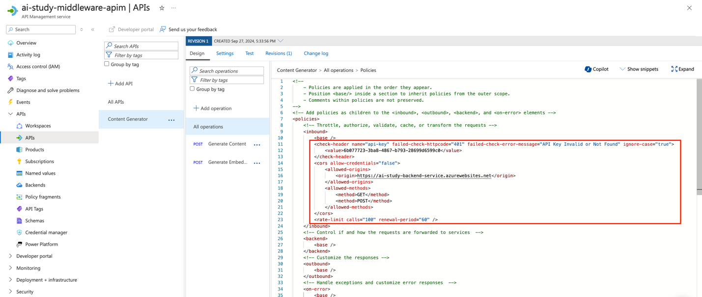

  6. **Verify the API Configuration:**
      - Once the APIs and operations are defined and secured, verify the configuration by using the **Test** feature in Azure API Management.  
      - Make a sample request to each endpoint to ensure that they respond correctly.This testing will occur after the application has been deployed for both the back-end and middleware services. 

### Azure CLI instructions

You can create and configure all of the APIs used by our back-end and middleware services by saving and running the following script:

Shell script: Create API and add policy (`create-api.sh`)

```
#!/bin/bash  

# Function to display help  
function display_help() {  
  echo "Usage: $0 -g <resource-group> -b <backend-url> -m <middleware-url> -f <frontend-url> -ba <backend-apim-name> -ma <middleware-apim-name> [--backend-api-key <backend-api-key>] [--middleware-api-key <middleware-api-key>]"  
  echo  
  echo "Options:"  
  echo "  -g, --resource-group              Azure Resource Group"  
  echo "  -b, --backend-url                 Backend service URL"  
  echo "  -m, --middleware-url              Middleware service URL"  
  echo "  -f, --frontend-url                Frontend service URL"  
  echo "  -ba, --backend-apim-name          Backend API Management name"  
  echo "  -ma, --middleware-apim-name       Middleware API Management name"  
  echo "  --backend-api-key                 (Optional) API Key for Backend service"  
  echo "  --middleware-api-key              (Optional) API Key for Middleware service"  
  echo "  -h, --help                        Display this help message"  
  exit 0  
}  

# Function to generate API key if not provided  
function generate_api_key() {  
  echo $(uuidgen)  
}  

# Parse arguments  
while [[ "$#" -gt 0 ]]; do  
  case $1 in  
    -g|--resource-group) RESOURCE_GROUP="$2"; shift ;;  
    -b|--backend-url) BACKEND_URL="$2"; shift ;;  
    -m|--middleware-url) MIDDLEWARE_URL="$2"; shift ;;  
    -f|--frontend-url) FRONTEND_URL="$2"; shift ;;  
    -ba|--backend-apim-name) BACKEND_APIM_NAME="$2"; shift ;;  
    -ma|--middleware-apim-name) MIDDLEWARE_APIM_NAME="$2"; shift ;;  
    --backend-api-key) BACKEND_API_KEY="$2"; shift ;;  
    --middleware-api-key) MIDDLEWARE_API_KEY="$2"; shift ;;  
    -h|--help) display_help ;;  
    *) echo "Unknown option: $1"; display_help ;;  
  esac  
  shift  
done  

# Check for required arguments  
if [[ -z "$RESOURCE_GROUP" || -z "$BACKEND_URL" || -z "$MIDDLEWARE_URL" || -z "$FRONTEND_URL" || -z "$BACKEND_APIM_NAME" || -z "$MIDDLEWARE_APIM_NAME" ]]; then  
  echo "Error: Missing required arguments."  
  display_help  
fi  

# Generate API keys if not provided  
BACKEND_API_KEY=${BACKEND_API_KEY:-$(generate_api_key)}  
MIDDLEWARE_API_KEY=${MIDDLEWARE_API_KEY:-$(generate_api_key)}  

echo "Using Backend API Key: $BACKEND_API_KEY"  
echo "Using Middleware API Key: $MIDDLEWARE_API_KEY"  

# Create Backend API in APIM  
az apim api create \  
  --resource-group "$RESOURCE_GROUP" \  
  --service-name "$BACKEND_APIM_NAME" \  
  --api-id backend-api \  
  --path /api/v1/products \  
  --display-name "Backend Product API" \  
  --service-url "$BACKEND_URL" \  
  --protocols https  

# Add Backend API Operations  
az apim api operation create \  
  --resource-group "$RESOURCE_GROUP" \  
  --service-name "$BACKEND_APIM_NAME" \  
  --api-id backend-api \  
  --url-template "/" \  
  --method GET \  
  --display-name "Get Product List"  

az apim api operation create \  
  --resource-group "$RESOURCE_GROUP" \  
  --service-name "$BACKEND_APIM_NAME" \  
  --api-id backend-api \  
  --url-template "/similar" \  
  --method POST \  
  --display-name "Get Similar Product List"  

# Apply Backend API Policy (CORS, API Key Validation)  
az apim api policy create \  
  --resource-group "$RESOURCE_GROUP" \  
  --service-name "$BACKEND_APIM_NAME" \  
  --api-id backend-api \  
  --xml-policy "  
<inbound>  
  <base />  
  <cors allow-credentials='true'>  
    <allowed-origins>  
      <origin>$MIDDLEWARE_URL</origin>  
    </allowed-origins>  
    <allowed-methods>  
      <method>GET</method>  
      <method>POST</method>  
    </allowed-methods>  
    <allowed-headers>  
      <header>*</header>  
    </allowed-headers>  
  </cors>  
  <check-header name='api-key' failed-check-httpcode='401' failed-check-error-message='API Key Invalid or Not Found' ignore-case='true'>  
    <value>$BACKEND_API_KEY</value>  
  </check-header>  
</inbound>"  

# Create Middleware API in APIM  
az apim api create \  
  --resource-group "$RESOURCE_GROUP" \  
  --service-name "$MIDDLEWARE_APIM_NAME" \  
  --api-id middleware-api \  
  --path /api/v1/generate \  
  --display-name "Middleware Generate API" \  
  --service-url "$MIDDLEWARE_URL" \  
  --protocols https  

# Add Middleware API Operations  
az apim api operation create \  
  --resource-group "$RESOURCE_GROUP" \  
  --service-name "$MIDDLEWARE_APIM_NAME" \  
  --api-id middleware-api \  
  --url-template "/content" \  
  --method POST \  
  --display-name "Generate Content"  

az apim api operation create \  
  --resource-group "$RESOURCE_GROUP" \  
  --service-name "$MIDDLEWARE_APIM_NAME" \  
  --api-id middleware-api \  
  --url-template "/embeddings" \  
  --method POST \  
  --display-name "Generate Embeddings"  

# Apply Middleware API Policy (CORS, API Key Validation)  
az apim api policy create \  
  --resource-group "$RESOURCE_GROUP" \  
  --service-name "$MIDDLEWARE_APIM_NAME" \  
  --api-id middleware-api \  
  --xml-policy "  
<inbound>  
  <base />  
  <cors allow-credentials='true'>  
    <allowed-origins>  
      <origin>$BACKEND_URL</origin>  
      <origin>$FRONTEND_URL</origin>  
    </allowed-origins>  
    <allowed-methods>  
      <method>POST</method>  
    </allowed-methods>  
    <allowed-headers>  
      <header>*</header>  
    </allowed-headers>  
  </cors>  
  <check-header name='api-key' failed-check-httpcode='401' failed-check-error-message='API Key Invalid or Not Found' ignore-case='true'>  
    <value>$MIDDLEWARE_API_KEY</value>  
  </check-header>  
</inbound>"  

echo "APIs created and policies applied successfully."  
```

#### What does the script do?

The script configures the following API rules:
 
- **Allowed origins in CORS:**
  - The back-end API allows only the **middleware URL** as the allowed origin.
  - The middleware API allows both **back-end URL** and **front-end URL** as allowed origins.
- **Updated `check-header` validation:**
  - Replaces `validate-header` with `check-header` for API key validation.
  - Includes failed-check-httpcode="401", `failed-check-error-message="API Key Invalid or Not Found"`, and `ignore-case="true"`.

After running the script, we’ll have created the APIs to use and will have applied the `CORS` and `check-header` policies for both back-end and middleware APIs. The script will also generate the required API keys, if you didn’t already provide them.

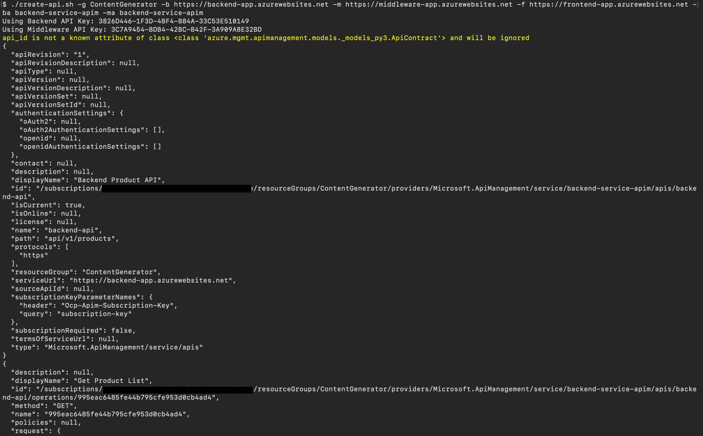

:::info
[Ingest your own content](https://aka.ms/demo-bytes/ep13?ocid=biafy25h1_30daysofia_webpage_azuremktg) using the Azure Functions OpenAI extension into a Cosmos DB vector database to enable OpenAI query on your data.
:::

## Step 2: Configuring Azure Key Vault and Granting Access

Once the APIs are defined and secured, we need to securely store the API keys and other sensitive information in **Azure Key Vault** and grant the application access to these secrets.

### 2.1 Storing API Keys in Key Vault

1. Go to your **Azure Key Vault** in the Azure portal.
2. Select **Secrets** and create a new secret for each API key (e.g., `BackendServiceAccessKey`, `MiddlewareServiceAccessKey`).
3. Update the values with the API keys configured in APIM.

### 2.2 Granting Access to Key Vault via Managed Identities

1. To allow your App Service to access the secrets in Key Vault, enable the **System-assigned Managed Identity:**
    - Navigate to your **Azure App Service**.
    - Under the **Identity** section, enable "System-assigned Managed Identity".

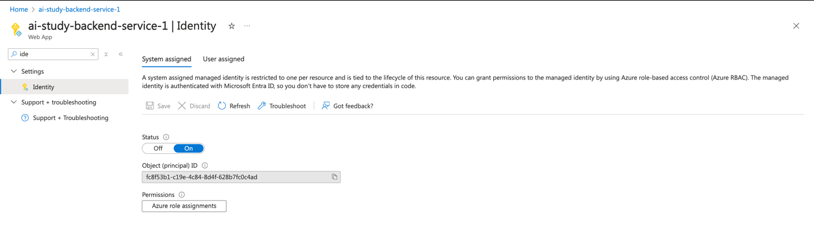

2. In the **Azure Key Vault**, navigate to **Access policies**.
3. Create a new access policy using the "Secret Management" template.
4. Select the Managed Identity of your App Service as the principal and grant it **Get** and **List** permissions for secrets.

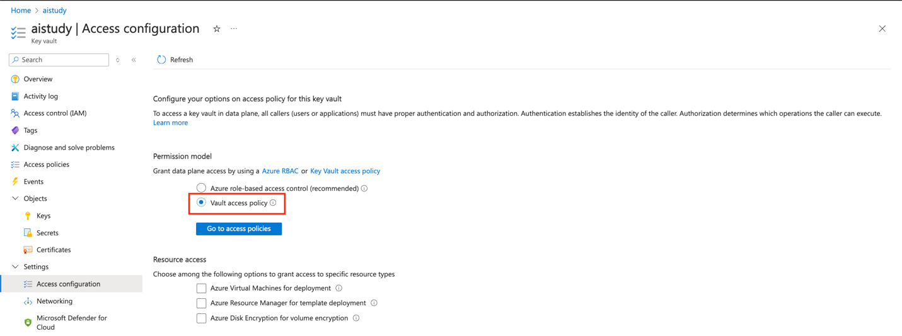

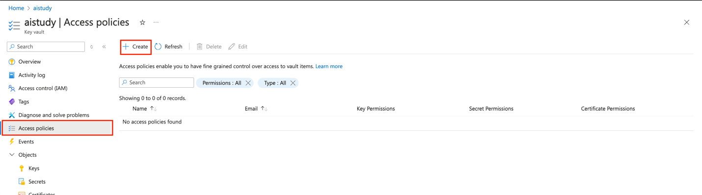

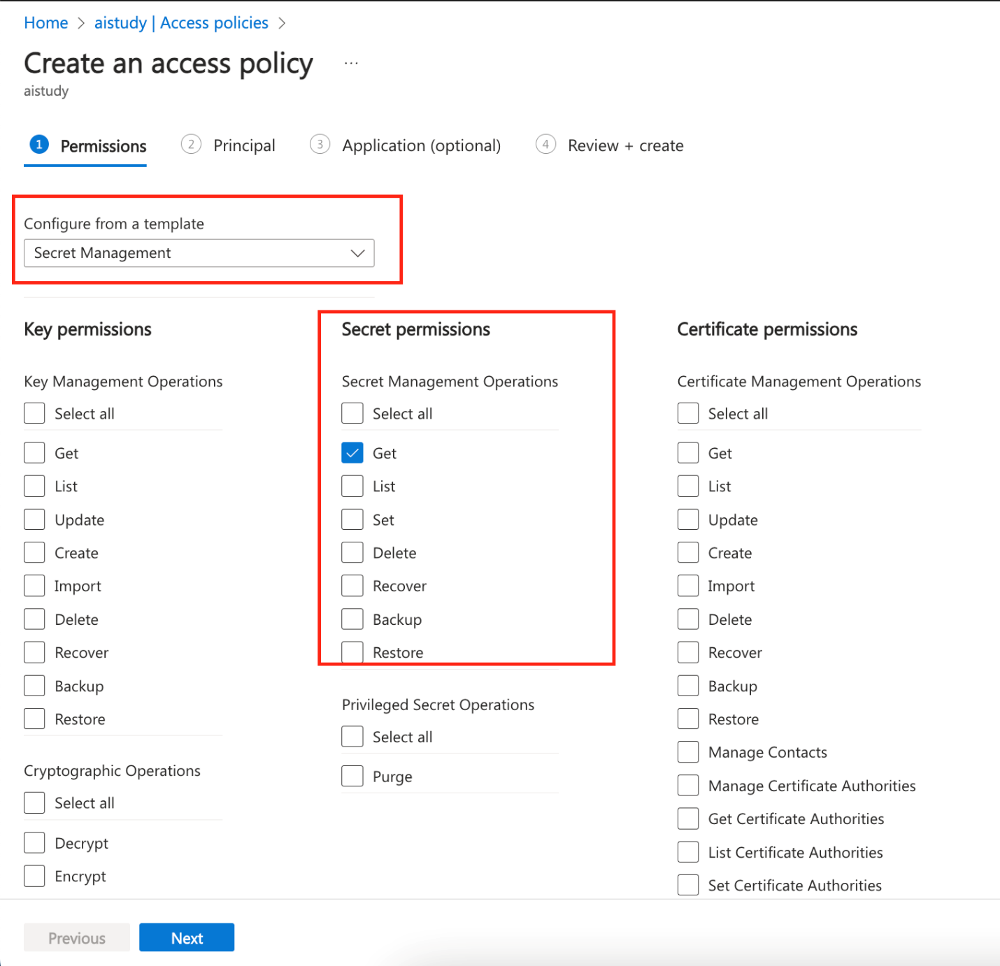

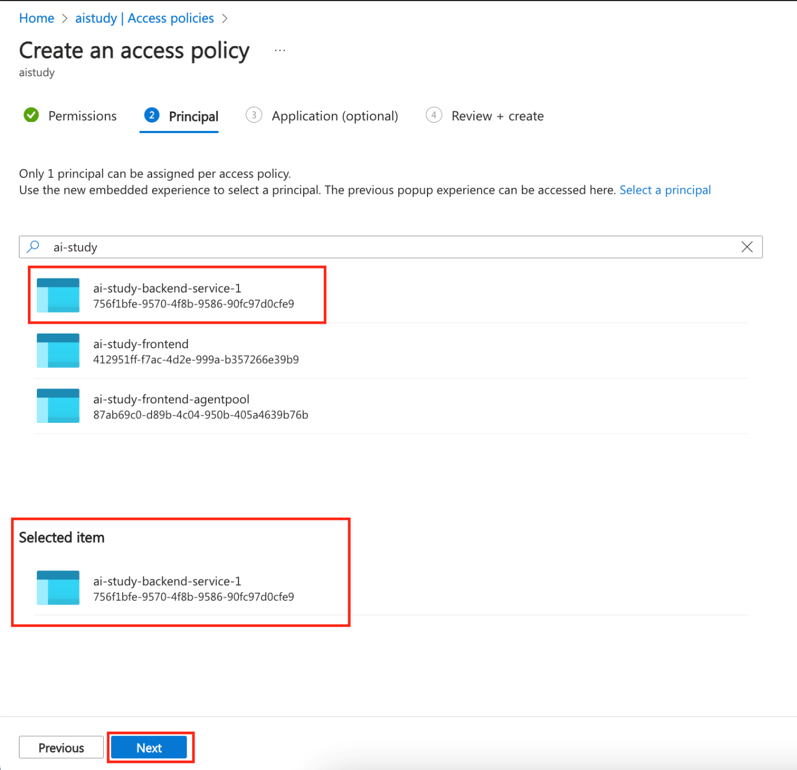

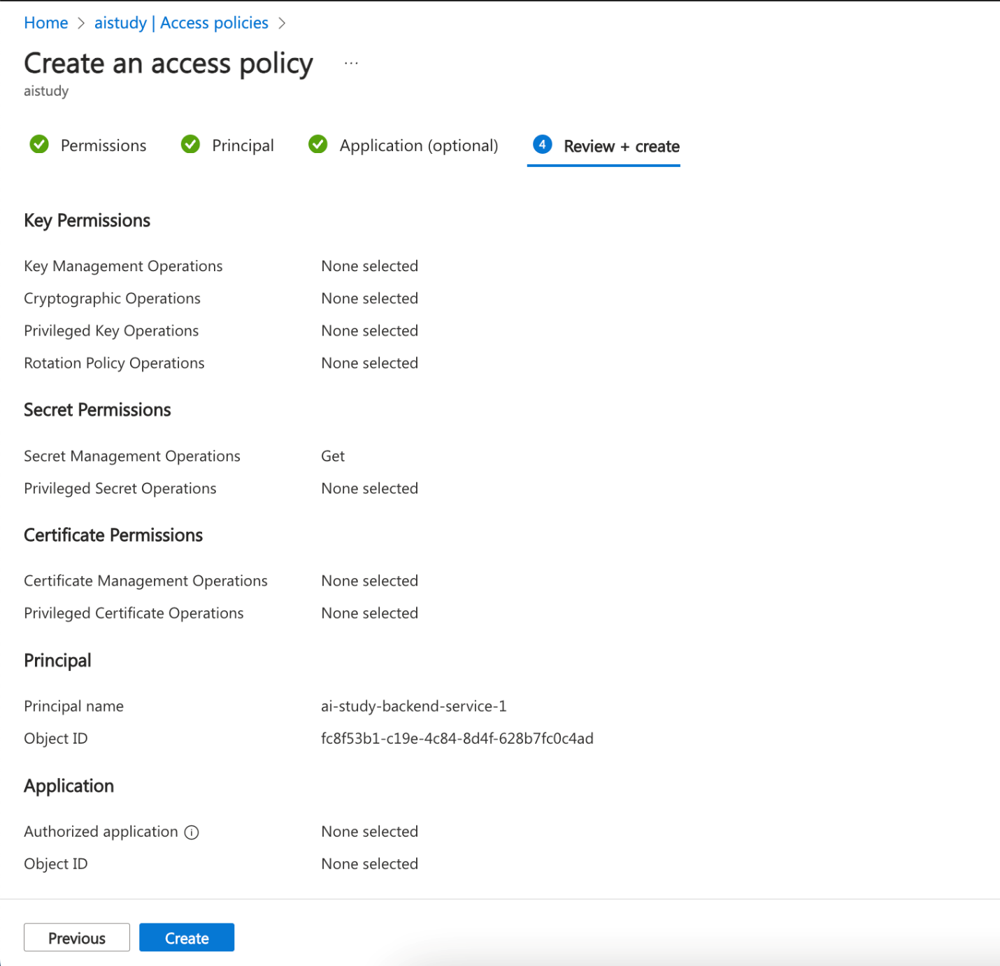

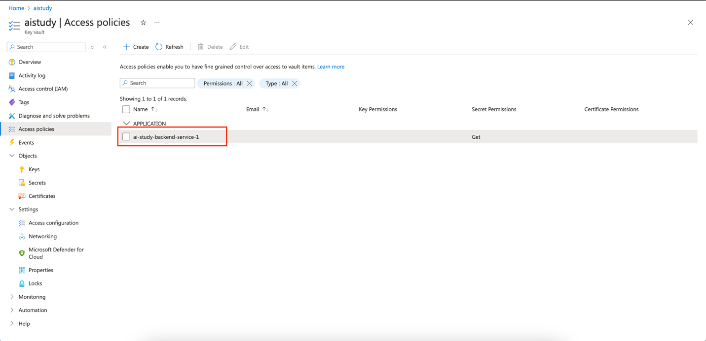

#### Azure CLI instructions

Run the following commands:

```
# Get the Managed Identity's client ID
IDENTITY_CLIENT_ID=$(az webapp identity show --resource-group <resource-group-name> --name <app-service-name> --query principalId --output tsv)

# Grant access to the Key Vault for the Managed Identity
az keyvault set-policy --name <key-vault-name> --secret-permissions get list --object-id $IDENTITY_CLIENT_ID
```

### 2.3 Configure Environment Variables in App Service

1. **Navigate to your App Service** in the Azure portal:
    - Go to the **Azure portal** and select your **App Service**.
2. **Open Configuration Settings:**
    - In the left-hand menu, select **Configuration** under the **Settings** section.

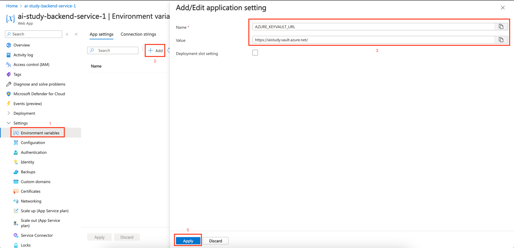

3. **Add a New Application Setting**
- In the **Application settings** tab, click on **+ New application setting**.
- Enter the following details:
   - **Name**: `AZURE_KEYVAULT_URL`
   - **Value**: `https://<your-key-vault-name>.vault.azure.net/`
4. **Save the Changes**:
   - After adding the setting, click **Save** at the top to apply the changes.

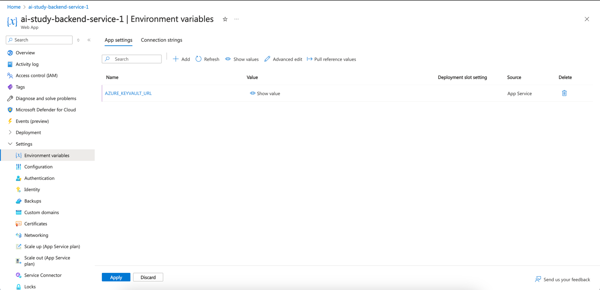

5. **Restart the App Service** (if necessary):
   - You may need to restart your App Service for the changes to take effect. You can do this by going to the **Overview** section and clicking on the **Restart** button.

#### Azure CLI instructions

Run the following command:

```
# Set the environment variable in the App Service

az webapp config appsettings set --resource-group <resource-group-name> --name <app-service-name> --settings AZURE_KEYVAULT_URL=https://<key-vault-name>.vault.azure.net/
```

:::info
Join live experts to dive into [operational excellence with AKS](https://aka.ms/learn-live/ep3?ocid=biafy25h1_30daysofia_webpage_azuremktg).
:::

## Conclusion 

In this section, we created and configured the APIs for both back-end and middleware services using **Azure API Management (APIM)**. We secured the APIs using CORS policies, header checks, and rate limits. After configuring APIM, we securely stored the API keys and other sensitive data in Azure Key Vault and granted access using Managed Identity. This setup ensures that all components interact securely and that sensitive information is managed properly.

In the next section, we will deploy the application using Azure App Service, ensuring it utilizes the secure configurations established here.

## Additional Resources

- [Understanding Azure API Management](https://learn.microsoft.com/azure/api-management/api-management-key-concepts?ocid=biafy25h1_30daysofia_webpage_azuremktg)
- [Getting Started with Azure Key Vault](https://learn.microsoft.com/azure/key-vault/general/overview?ocid=biafy25h1_30daysofia_webpage_azuremktg)
- [Configuring Managed Identities in Azure](https://learn.microsoft.com/azure/app-service/overview-managed-identity?tabs=portal%2Chttp?ocid=biafy25h1_30daysofia_webpage_azuremktg)