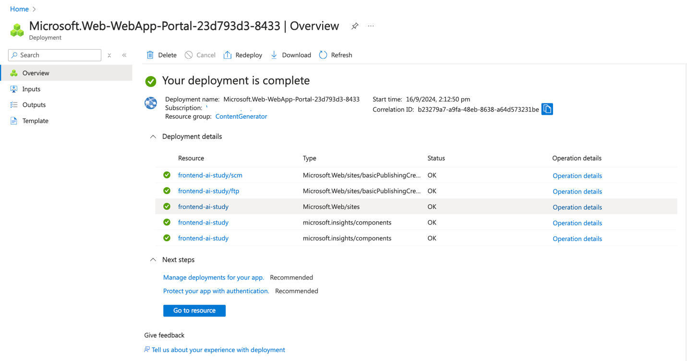

<head> 
  <meta property="og:url" content="https://azure.github.io/cloud-native/30-days-of-ia-2024/deploy-application-with-azure-app-service-part-2"/>
  <meta property="og:type" content="website"/>
  <meta property="og:title" content="**Build Intelligent Apps | AI Apps on Azure"/>
  <meta property="og:description" content="In this section, we will deploy the back-end and middleware services using Azure App Service."/>
  <meta property="og:image" content="https://github.com/Azure/Cloud-Native/blob/main/website/static/img/ogImage.png"/>
  <meta name="twitter:url" content="https://azure.github.io/Cloud-Native/30-days-of-ia-2024/deploy-application-with-azure-app-service-part-2" />
  <meta name="twitter:title" content="**Build Intelligent Apps | AI Apps on Azure" />
  <meta name="twitter:description" content="In this section, we will deploy the back-end and middleware services using Azure App Service." />
  <meta name="twitter:image" content="https://azure.github.io/Cloud-Native/img/ogImage.png" />
  <meta name="twitter:card" content="summary_large_image" />
  <meta name="twitter:creator" content="@devanshidiaries" />
  <link rel="canonical" href="https://azure.github.io/Cloud-Native/30-days-of-ia-2024/deploy-application-with-azure-app-service-part-2" />
</head>

<!-- End METADATA -->

## 4.b Deploying the Application Using Azure App Service

In the previous blog post, we configured [Azure API Management (APIM)](https://learn.microsoft.com/azure/api-management/api-management-key-concepts?ocid=biafy25h1_30daysofia_webpage_azuremktg) and [Azure Key Vault](https://learn.microsoft.com/azure/key-vault/general/overview?ocid=biafy25h1_30daysofia_webpage_azuremktg) to secure the application and manage secrets. In this section, we will deploy the back-end and middleware services using [Azure App Service](https://learn.microsoft.com/azure/app-service/overview?ocid=biafy25h1_30daysofia_webpage_azuremktg). We will leverage the [Azure Web App Maven Plugin](https://github.com/microsoft/azure-maven-plugins/blob/develop/azure-webapp-maven-plugin/README.md) for deployment. If the required App Service instances do not already exist (as discussed in blog **2.b**), the Maven plugin will automatically create them. Otherwise, it will simply deploy the application code to the existing instances.

Additionally, we will deploy the front-end ReactJS application separately to its own Azure App Service. This ensures a complete end-to-end deployment of all application components, enabling seamless communication between the front-end, back-end, and middleware services.

## What we will cover:

1. Preparing the Application for Deployment
2. Configuring Maven for **Azure Web App Deployment**
3. Deploying the Back-end and Middleware Services Using **Maven**
4. Deploying the Front-end Service
5. Verifying the Deployment

## Step 1: Preparing the Application for Deployment

Before deploying, ensure that your application is built and packaged correctly. This involves creating a WAR file for the back-end and middleware services.

1. **Build the Application:**
    - Use the Maven wrapper command to build the application:

      `./mvnw clean install`


2. **Package the Application:**
    - After building, package the application to create the necessary WAR file for deployment:

      `./mvnw clean package`
    - This will create a WAR file in the target directory of your project.


:::info
Join the next snackable AI Demo Bytes to explore how to [apply auto-scaling and load testing to your AI applications](https://aka.ms/demo-bytes/ep6?ocid=biafy25h1_30daysofia_webpage_azuremktg).
:::

## Step 2: Configuring the Azure Web App Maven Plugin

1. **Update the pom.xml File:**
    - Open the `pom.xml` file for both the back-end and middleware services and add the following plugin configuration:

```
<plugin>
    <groupId>com.microsoft.azure</groupId>
    <artifactId>azure-webapp-maven-plugin</artifactId>
    <version>2.13.0</version>
    <!-- Refer: https://github.com/microsoft/azure-maven-plugins/wiki/Azure-Web-App:-Configuration-Details -->
    <configuration>
        <!-- Optional: If not mentioned, it will pick the default subscription -->
        <subscriptionId>03a4877f-5f78-4a6c-af93-d492e85d4e82</subscriptionId>
        <resourceGroup>ai-study-con-gen-1</resourceGroup>
        <appName>ai-study-backend-service</appName>
        <region>eastus</region>
        <pricingTier>B1</pricingTier>
        <runtime>
            <os>Linux</os>
            <javaVersion>Java 17</javaVersion>
            <webContainer>Tomcat 10.0</webContainer>
        </runtime>
        <deployment>
            <resources>
                <resource>
                    <directory>${project.basedir}/target</directory>
                    <includes>
                        <include>*.war</include>
                    </includes>
                </resource>
            </resources>
        </deployment>
    </configuration>
</plugin>
```

- **Note:** If the `subscriptionId` is not specified, the Maven plugin will use the default subscription configured in your **Azure CLI** or settings. Additionally, if the App Service defined in the `appName` field does not exist (as discussed in **blog 2b**), the Maven plugin will create it automatically during deployment.


## Step 3: Deploying the Back-end and Middleware Services Using Maven

1. **Deploy the Back-end Service Using Maven:**
    - Use the following Maven wrapper command to deploy the back-end service to Azure App Service:

      `./mvnw clean package azure-webapp:deploy`

    - This command will either create the App Service instance (if it does not exist) or deploy the WAR file located in the target directory to the existing Azure Web App.


2. **Deploy the Middleware Service Using Maven:**
    - Similarly, use the Maven wrapper command for the middleware service:

      `./mvnw clean package azure-webapp:deploy`


  - Verify that the middleware service is deployed successfully to the specified Azure App Service instance.


## Step 4: Deploying the Front-end Service

In our earlier blog post [1.2b. Preparing the Azure OpenAI Service resource](https://azure.github.io/Cloud-Native/30-days-of-ia-2024/setting-up-your-development-environment-2), we discussed creating the app services that will host our app. If you didn’t create the front-end service then, you can do it now. 

If you already created a front-end app service, proceed to deploy the ZIP file in step [4.2](#deploy-the-zip-file).

### 4.1 Create App Service

#### Azure portal instructions

1. In the Azure portal, go to **App Services**.
2. Select **Create and choose the Web App**.
3. Select your subscription and resource group, and give the app a name (for example, `frontend-service`).
4. Choose the **Runtime stack: Node.js** and **Operating System: Linux**.
5. Configure **Deployment** and **Monitoring** options as needed.
6. Review and create the App Service.




#### Azure CLI instructions

```
# Create Web App for Frontend (ReactJS)
az webapp create --resource-group <your-resource-group-name> --plan <plan-name> --name <your-frontend-name> --runtime "NODE:22-lts"
```


### 4.2 Deploy the ZIP File

Build, package, and deploy the application using the following commands.

***Note:** Before deploying code, make sure that you’ve cloned the application source from the GitHub repository to your local machine and then navigate to the “frontend” folder.*

```
# Build the application
npm run build  

# Conver into ZIP File
zip -r build.zip ./build

# Deploy the code into Azure App Service
az webapp deploy --resource-group <your-resource-group> --name <your-web-app-name> --src-path build.zip --type zip  
```


### 4.3 Set the correct startup command for React

Azure App Service needs to know how to correctly serve requests to our front-end React app. For static sites, like this React app, you configure the startup command to serve static files and handle routing for single-page applications (SPAs).

You can configure the app service to use the correct React startup command for the app by running the following:

```
az webapp config set --resource-group <your-resource-group> --name <your-web-app-name> --startup-file "pm2 serve /home/site/wwwroot/build --no-daemon --spa"
```


### 4.4 Clear browser cache

Your browser cache may prevent client-side updates from appearing correctly. After deploying the front-end app, clear your browser cache or use an incognito window before accessing the app to make sure that you're seeing the latest version.

### 4.5 Restart the web app

Configuration changes to the app service may not be applied immediately. To be sure that the app is running correctly, after a successful deployment, restart the web app to make sure that everything is refreshed:

```
az webapp restart --name <your-web-app-name> --resource-group <your-resource-group>
```

### 4.6 Verify your deployment

Open the newly deployed web app in a browser, and be sure that it’s running:

```
az webapp browse --resource-group <your-resource-group> --name <your-webapp-name>
```

## Step 5: Verifying the Deployment

1. **Check Application Functionality**:
    - Open the front-end application in a browser and test its functionality to ensure it communicates with the back-end and middleware services as intended.


### Cleanup

Once you have finished deploying and testing your application, it's essential to clean up the resources to avoid incurring any unnecessary costs. You can delete the Azure Resource Group that contains your resources using either the **Azure CLI** or the **Azure portal**. This will remove all the resources within that group, such as the Azure App Service, Azure API Management, and any other services created in the group.

#### Using Azure CLI

To delete the resource group using the Azure CLI, follow these steps:
- Open your terminal or Azure Cloud Shell.
- Run the following command to delete the resource group:

```
az group delete --name <resource-group-name> --yes --no-wait
```

- Replace `<resource-group-name>` with the name of your Azure resource group.
- The `--yes` parameter confirms the deletion without a prompt.
- The `--no-wait` parameter initiates the deletion and immediately returns control to the terminal, so you don't have to wait for the deletion process to complete.

#### Using the Azure Portal

If you prefer to delete the resources using the Azure portal, follow these instructions:  

- **Navigate to the Azure Portal:** Go to [Azure Portal](http://portal.azure.com/) and sign in with your credentials.
- **Select "Resource Groups":** In the left-hand menu, select **Resource groups**. This will list all the resource groups available in your subscription.
- **Find the Resource Group:** Locate the resource group you want to delete (e.g., the resource group that contains your AKS and ACR resources).
- **Click on the Resource Group:** Click on the resource group name to open it.
- **Delete the Resource Group:** At the top of the resource group page, click on **Delete resource group**.
- **Confirm Deletion:** You will be prompted to type the name of the resource group to confirm deletion. Type the name exactly and click on the **Delete** button.


Deleting a resource group in the Azure portal will remove **all resources** associated with it. Be careful when performing this action, as it cannot be undone.

:::info
Learn more on Technical leaders’ [guide to building intelligent apps](https://aka.ms/AAI_TDMApps_Plan?ocid=biafy25h1_30daysofia_webpage_azuremktg).
:::

## Conclusion

In this section, we deployed our Java-based back-end and middleware services using the Maven Azure Web App Plugin and verified that they were hosted correctly in Azure App Service. We also deployed the front-end ReactJS application using the deployment center in Azure App Service. These steps ensure that all components are securely hosted and configured for seamless communication.

## Additional Resources:

- [Azure Web App Maven Plugin Documentation](https://github.com/microsoft/azure-maven-plugins/tree/develop/azure-webapp-maven-plugin)
- [Azure App Service Documentation](https://learn.microsoft.com/azure/app-service/?ocid=biafy25h1_30daysofia_webpage_azuremktg)
- [Deploying Java Applications to Azure](https://learn.microsoft.com/azure/app-service/app-service-web-java?ocid=biafy25h1_30daysofia_webpage_azuremktg)