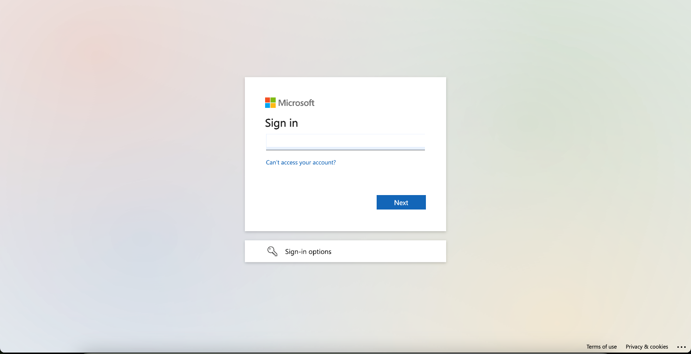
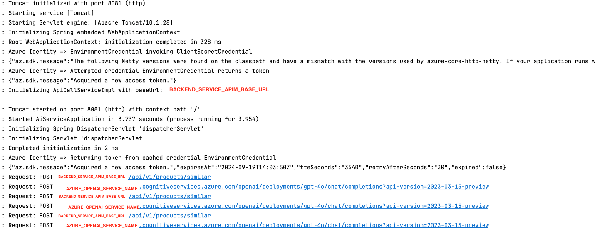
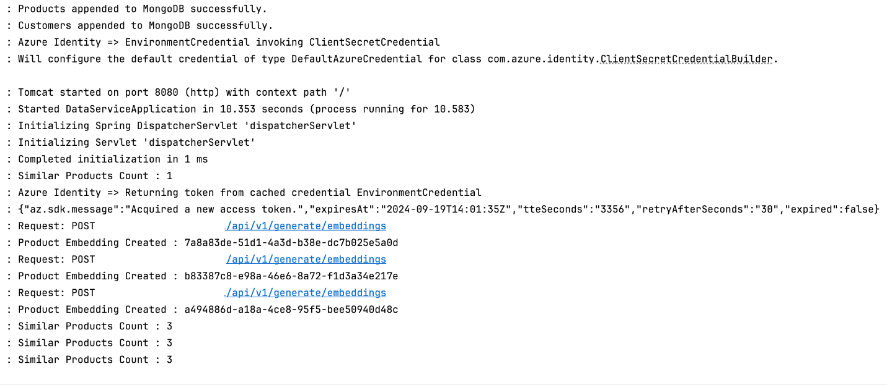

<head> 
  <meta property="og:url" content="https://azure.github.io/cloud-native/demo-our-ai-based-content-generation-app"/>
  <meta property="og:type" content="website"/>
  <meta property="og:title" content="**Build Intelligent Apps | AI Apps on Azure"/>
  <meta property="og:description" content="Walk through our example content generation app, and see how the various components work together."/>
  <meta property="og:image" content="https://github.com/Azure/Cloud-Native/blob/main/website/static/img/ogImage.png"/>
  <meta name="twitter:url" content="https://azure.github.io/Cloud-Native/demo-our-ai-based-content-generation-app" />
  <meta name="twitter:title" content="**Build Intelligent Apps | AI Apps on Azure" />
  <meta name="twitter:description" content="Walk through our example content generation app, and see how the various components work together." />
  <meta name="twitter:image" content="https://azure.github.io/Cloud-Native/img/ogImage.png" />
  <meta name="twitter:card" content="summary_large_image" />
  <meta name="twitter:creator" content="@devanshidiaries" />
  <link rel="canonical" href="https://azure.github.io/Cloud-Native/demo-our-ai-based-content-generation-app" />
</head>

<!-- End METADATA -->

Walk through our example content generation app, and see how the various components work together.

## What we cover:

- A walkthrough of the app’s user-facing front end
- A walkthrough of the app’s middleware service
- A walkthrough of the app’s back-end data management service
- A demonstration of how the components work together

## Introduction

Over the last eight days, this blog series has walked you through creating an example application—the **Best For You Organics** Company’s marketing content generation app. You set up your local tools and the Azure services you needed for development, downloaded and built the app code, and performed an initial deployment to either **[Azure App Service](https://learn.microsoft.com/azure/app-service/?ocid=biafy25h1_30daysofia_webpage_azuremktg)** or **[Azure Kubernetes Service (AKS)](https://learn.microsoft.com/azure/aks/what-is-aks?ocid=biafy25h1_30daysofia_webpage_azuremktg)**. You also investigated deploying to a scalable production environment and explored the considerations you need to manage in the post-deployment phase.

In today’s blog post, we examine the functionality of our example app, now that you’ve deployed it. The app showcases how users can interact with a content generation service, while back-end systems integrate product similarity searches with AI-based content generation models. The app consists of three core services: a ReactJS-based user-facing front end, a Java Spring Boot middleware service, and a Java Spring Boot back-end service.

In the following demo, we present a high-level overview of the app’s interface and functionality, explaining how the app integrates with Azure services, like **[Azure API Management](https://learn.microsoft.com/azure/api-management/api-management-key-concepts?ocid=biafy25h1_30daysofia_webpage_azuremktg)**, **[Azure Key Vault](https://learn.microsoft.com/azure/key-vault/general/overview?ocid=biafy25h1_30daysofia_webpage_azuremktg)**, **[Azure Cosmos DB](https://learn.microsoft.com/azure/cosmos-db/introduction?ocid=biafy25h1_30daysofia_webpage_azuremktg)**, **[Azure Blob Storage](https://learn.microsoft.com/azure/storage/blobs/storage-blobs-introduction?ocid=biafy25h1_30daysofia_webpage_azuremktg)**, and **[Azure OpenAI Service](https://learn.microsoft.com/azure/ai-services/openai/overview?ocid=biafy25h1_30daysofia_webpage_azuremktg)**.

## 1. The front-end layer: How the user interacts with the app.

The app’s front-end layer is a ReactJS application designed to provide users with an interface for requesting content through a seamless chat experience. Users enter their queries, select the type of content they want to generate, submit their request, and then receive results from the AI-powered middleware.

### Key features:

- **Sign-in experience.** Users are prompted to sign in before accessing the chat interface. This secures the app by making sure that only authenticated and authorized users can access it.

  

  

- **Chat interface.** After signing in, users can type their queries into a chat interface and select the content type they want. The submitted request is sent to the middleware service.

  

- **Content display.** The generated content is returned from the middleware service and displayed to the user.

  

## 2. The middleware service: Connecting users, product data, and generated content

The middleware service is responsible for generating content using **OpenAI’s GPT-4o** model and retrieving related product data using an **embedding vector model**. It acts as a bridge between the front end and back end.

### Key features:

- **API Management integration.** All middleware APIs are exposed via Azure API Management, which applies security policies like API key checks, throttling, Cross-Origin Resource Sharing (CORS) rules, and rate limits.
- **Azure OpenAI integration.** The middleware connects to **Azure OpenAI**, using the **completion model (GPT-4o)** for content generation and the **embedding model (text-embedding-3-small)** for vector representation of user queries.

  

- **Security.** The middleware uses **Azure Key Vault** to securely retrieve API keys and credentials via a **managed identity** assigned to the App Service or AKS cluster running the service.

## 3. The back-end service: Managing product-related data

The back end is responsible for managing product-related data, such as customer information, product details, and vector-based product similarity searches.

### Key features:

- **API Management integration.** Like the middleware, the back end exposes its APIs (for example, **Customer API**, **Product API**, **Product Vector API**) through API Management with API key checks, CORS, throttling, and rate limits.
- **Product similarity search.** When the middleware sends a query vector, the back end retrieves a list of similar products based on embeddings and product data stored in **Azure Cosmos DB for MongoDB** and **Blob Storage.**

  

- **Key Vault integration.** All back-end services securely connect to **Azure Cosmos DB** and **Blob Storage**, using secrets stored in **Azure Key Vault**. The key vault is accessed securely by using a **managed identity** assigned to the App Service or AKS cluster running the service.

## 4. End-to-end flow demonstration

### Step-by-step user experience

1. **User signs in.** The user is prompted to sign in, helping to ensure secure access via identity management.
2. **User submits query.** After signing in, the user enters their query in the chat interface, selects the type of content, and then selects **Submit**. This request is sent to the middleware.
3. **Middleware processes query.** The middleware generates an embedding vector for the query and hits the back-end API Management endpoint to retrieve similar products based on this vector.
4. **Back end returns results.** The back end fetches product data (for example, similar products) from an **Azure Cosmos DB** database and then returns the results to the middleware.
5. **Middleware generates content.** The middleware then calls **OpenAI's completion model (GPT-4o)** to generate content based on the query and returns it to the front end.
6. **User gets response.** The generated content is displayed to the user in the chat interface, completing the process.

## Summary

In this blog post, we showcased the power of integrating multiple services and Azure technologies to create a straightforward user experience for AI-based content generation. From secure user sign-in to generating AI-driven content and retrieving relevant product data, the app efficiently uses Azure API Management, Azure Key Vault, and Azure OpenAI Service to meet the needs of modern applications.

In the [next post](https://azure.github.io/Cloud-Native/30-days-of-ia-2024/how-it-works-behind-the-scenes-of-our-ai-based-content-generation-app), we’ll dive deeper into how the application works, covering technical details, code, and data flow diagrams.