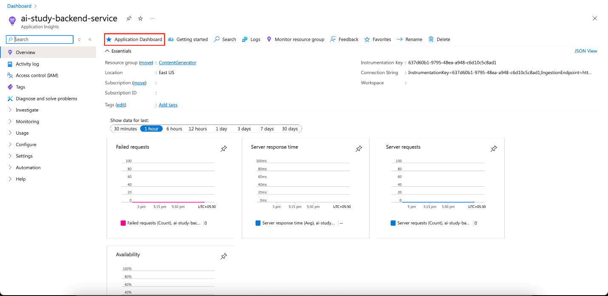
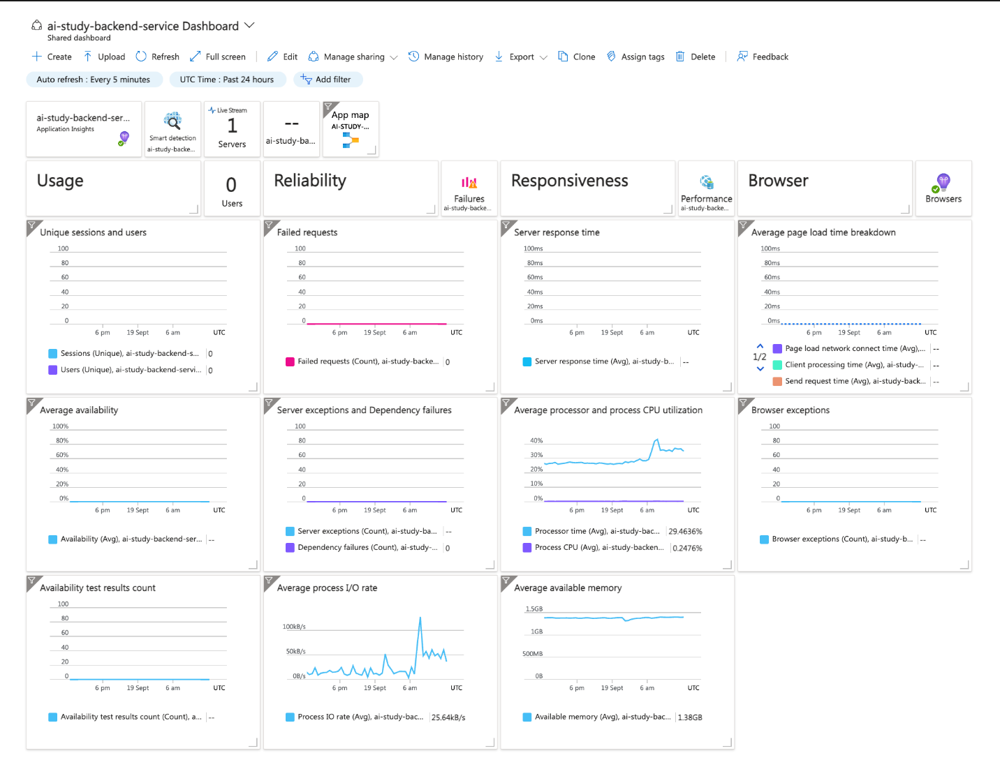
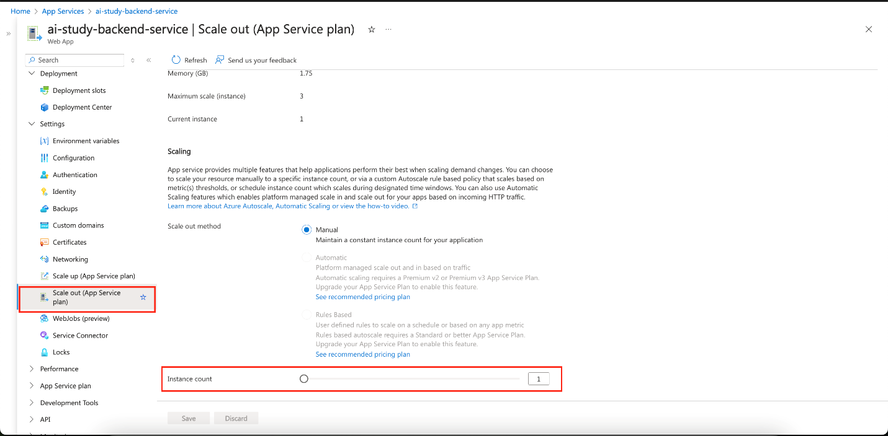
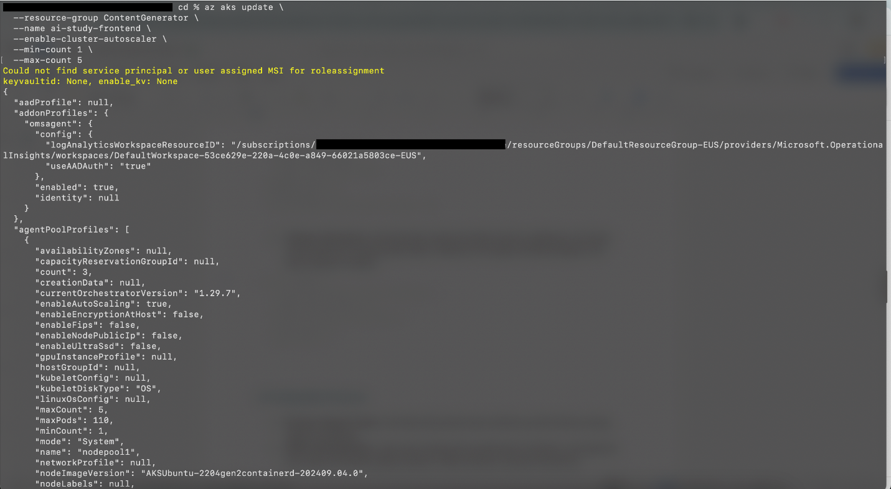

<head> 
  <meta property="og:url" content="https://azure.github.io/cloud-native/post-production-monitoring-scaling-and-optimization"/>
  <meta property="og:type" content="website"/>
  <meta property="og:title" content="**Build Intelligent Apps | AI Apps on Azure"/>
  <meta property="og:description" content="Learn how to make sure that your deployed apps are healthy and meeting user demand."/>
  <meta property="og:image" content="https://github.com/Azure/Cloud-Native/blob/main/website/static/img/ogImage.png"/>
  <meta name="twitter:url" content="https://azure.github.io/Cloud-Native/post-production-monitoring-scaling-and-optimization" />
  <meta name="twitter:title" content="**Build Intelligent Apps | AI Apps on Azure" />
  <meta name="twitter:description" content="Learn how to make sure that your deployed apps are healthy and meeting user demand." />
  <meta name="twitter:image" content="https://azure.github.io/Cloud-Native/img/ogImage.png" />
  <meta name="twitter:card" content="summary_large_image" />
  <meta name="twitter:creator" content="@devanshidiaries" />
  <link rel="canonical" href="https://azure.github.io/Cloud-Native/30-days-of-ia-2024/post-production-monitoring-scaling-and-optimization" />
</head>

<!-- End METADATA -->

Learn how to make sure that your deployed apps are healthy and meeting user demand.

## What we cover:

- Monitoring your application health
- Scaling your application
- Setting up alerts and notifications
- Implementing continuous optimization

## Introduction

In our previous blog posts in this series, we walked through building an example application and deploying it to production by using both **[Azure App Service](https://learn.microsoft.com/azure/app-service/?ocid=biafy25h1_30daysofia_webpage_azuremktg)** and **[Azure Kubernetes Service (AKS)](https://learn.microsoft.com/azure/aks/what-is-aks?ocid=biafy25h1_30daysofia_webpage_azuremktg)** environments. However, the journey doesn’t end after your app is live. The post-production phase of deployment is critical to ensuring that your app is running efficiently and is prepared to scale as user demand increases. 

This post guides you through the essential steps for monitoring, scaling, and optimizing applications deployed on App Service and AKS. We cover setting up monitoring, explore scaling strategies, and discuss setting up alerts and notifications systems that help you stay on top of issues and allow your app to remain reliable and performant.

:::info
Join Demo Bytes: [GenAI Gateway Capabilities in Azure API Management](https://aka.ms/demo-bytes/ep14?ocid=biafy25h1_30daysofia_webpage_azuremktg) to learn how Azure API Management can be configured for authentication and authorization of OpenAI endpoints.
:::

## Step 1. Monitor application health

You need to know whether your app is running correctly and that users can access it successfully. Monitoring tools provide real-time insights, issue and outage detection, and ongoing logging and analysis capabilities. They allow you to gain insight into your app’s performance, availability, and reliability, and they help you to perform proactive troubleshooting and optimization.

### 1.1 Set up Azure Monitor and Application Insights

- **[Azure Monitor](https://learn.microsoft.com/azure/azure-monitor/overview?ocid=biafy25h1_30daysofia_webpage_azuremktg)** provides a full-stack monitoring solution that collects and analyzes telemetry data from your apps and services. To enable Azure Monitor:
  1. **For Azure App Service.** In the Azure portal, go to your App Service. Under **Monitoring**, enable **Application Insights**.
  2. **For AKS.** Enable **Container Insights** to monitor cluster performance, including CPU, memory, and node availability.
- **Application Insights** can be integrated with both App Service and AKS to track performance, response times, request rates, and failures. Key features include:
  - **Live metrics.** Real-time performance monitoring.
  - **Custom dashboards.** Create custom dashboards for specific metrics (for example, API response times, database latency).

  

  

  

### 1.2 Implement logging and tracing

- **App Service.** Enable diagnostic logs to capture application and server logs. You can stream logs live or archive them in Azure Storage.
- **AKS.** Use **kubectl logs** to retrieve logs from pods. Integrate with Azure Monitor Logs for centralized log management and analysis.

### 1.3 Identify key metrics to monitor

- **Availability.** Uptime of your services.
- **Performance.** Response times, latency, and throughput.
- **Error rates.** Percentage of failed requests or exceptions in your app.
- **Resource utilization.** CPU and memory usage of App Service and AKS nodes.

## Step 2. Scale your application

Scaling your app allows it to handle varying user demand by automatically adjusting the available hosting resources. This helps to ensure optimal performance, reduced downtime, and cost-effectiveness.

### 2.1 Scaling on Azure App Service

App Service offers two methods of scaling resources:

- **Vertical scaling (scale up).** This involves increasing the compute resources (for example, CPU, memory) allocated to your App Service plan. It’s useful when your application needs more power to handle intensive workloads.
- **Horizontal scaling (scale out).** This adds more instances of your App Service to handle increased traffic.
  - To set the App Service scale-out setting, go to **App Service > Scale Out (App Service plan)** and then set the number of instances or configure **Autoscale** based on CPU or memory thresholds.

    

### 2.2  Scaling on Azure Kubernetes Service (AKS)

AKS scaling can be configured using these features:

- **Horizontal Pod Autoscaling (HPA).** Automatically adjusts the number of pod replicas in your AKS cluster based on observed CPU or memory usage. You can set up HPA by defining a resource threshold in your Kubernetes deployment `YAML`:

  ```
  apiVersion: autoscaling/v1
  kind: HorizontalPodAutoscaler
  metadata:
    name: <your-hpa-name>
  spec:
    scaleTargetRef:
      apiVersion: apps/v1
      kind: Deployment
      name: <your-app-name>
    minReplicas: 1
    maxReplicas: 10
    targetCPUUtilizationPercentage: 80
  ```

- **Cluster Autoscaler.** Automatically scales the AKS cluster by adding or removing nodes based on workload demands. Enable this through the AKS settings in the Azure portal or via **the Azure CLI:**

  ```
  az aks update \
    --resource-group <resource-group> \
    --name <aks-cluster> \
    --enable-cluster-autoscaler \
    --min-count 1 \
    --max-count 5
  ```

  

### 2.3 Scaling best practices

To make sure that your app stays reliable, while also optimizing costs, you want your scaling to fit your usage. You don’t want to overprovision during low-demand periods, and you don’t want to under provision during high-demand periods. Use the following methods to find the best scaling strategy:

- **Monitor usage trends.** Use historical performance data to predict when scaling might be required.
- **Define scaling rules.** Automate scaling with predefined thresholds, making sure that your app can handle sudden spikes in traffic, without manual intervention.

## Step 3. Set up alerts and notifications

Alerts and notifications provide real-time updates on critical app issues, such as performance degradation, security vulnerabilities, and resource bottlenecks. By receiving timely alerts, your team can quickly respond to issues, minimizing downtime and helping to ensure that the app operates smoothly.

### 3.1 Configure Azure alerts

Set up [Azure Monitor alerts](https://learn.microsoft.com/azure/azure-monitor/alerts/alerts-overview?ocid=biafy25h1_30daysofia_webpage_azuremktg) to notify you when certain metrics (such as CPU usage, memory, or failure rates) exceed defined thresholds:

1. Go to **Azure Monitor > Alerts > New Alert Rule**.
2. Define the **Target Resource**, such as your App Service or AKS.
3. Set **Conditions** for metrics like CPU usage, memory, or HTTP response times.
4. Configure **Actions**, such as sending an email or SMS, or triggering an automated action to handle more advanced responses.

### 3.2 Set up action groups

In Azure Monitor, **[action groups](https://learn.microsoft.com/azure/azure-monitor/alerts/action-groups?ocid=biafy25h1_30daysofia_webpage_azuremktg)** define how Azure responds to an alert after it’s triggered. When attached to an alert rule, the action group determines the following:

- Who gets notified and by what means (for example, via email, SMS, or push notifications).
- What automated actions are performed (for instance, executing an Azure Logic Apps or  Azure Functions process).
- Action groups can be shared across different alert rules, allowing you to centralize and standardize your alert response and helping to ensure that the right people or systems are notified to address issues promptly​.

### 3.3 Use advanced alerting strategies

The Azure platform offers additional capabilities that you can use to make sure that your apps are working correctly:

- **Anomaly detection.** Use machine learning-based anomaly detection in Application Insights to trigger alerts when metrics behave unusually.
- **Health checks.** Set up recurring synthetic transactions or health probes to periodically test the availability and performance of key application endpoints.

## Step 4. Implement continuous optimization

The process of continuous optimization involves regularly analyzing performance, resource utilization, and user demands to let you improve your app’s resource usage and to maintain optimal performance. App scaling is one aspect of optimization that we’ve already discussed, but Azure offers more ways to improve your app’s performance, cost, and stability.

### 4.1 Apply performance tuning

- **Database performance.** Regularly review the performance of your databases (for example, [Azure Cosmos DB for MongoDB](https://learn.microsoft.com/azure/cosmos-db/mongodb/introduction?ocid=biafy25h1_30daysofia_webpage_azuremktg)) to make sure that they can handle traffic and optimize queries for faster response times.
- **Caching.** Implement caching layers (such as [Azure Cache for Redis](https://learn.microsoft.com/azure/azure-cache-for-redis/cache-overview?ocid=biafy25h1_30daysofia_webpage_azuremktg)) to reduce load on the back-end and database services.
- **Code optimization.** Review performance bottlenecks in your code by using profiling tools, such as [Application Insights Profiler](https://learn.microsoft.com/azure/azure-monitor/profiler/profiler-overview?ocid=biafy25h1_30daysofia_webpage_azuremktg).

### 4.2 Consider cost optimizations

- **Monitor resource costs.** Regularly review your resource usage and scaling strategies to avoid overprovisioning. To track your spending, use [Microsoft Cost Management](https://azure.microsoft.com/products/cost-management?ocid=biafy25h1_30daysofia_webpage_azuremktg) tools.
- **Use reserved instances.** For cost savings with long-term workloads, consider using [reserved instances](https://azure.microsoft.com/pricing/reserved-vm-instances?ocid=biafy25h1_30daysofia_webpage_azuremktg).

:::info
Learn more on Technical leaders’ [guide to building intelligent apps](https://aka.ms/AAI_TDMApps_Plan?ocid=biafy25h1_30daysofia_webpage_azuremktg).
:::

## Summary

In this blog post, we walked through how a strong post-production rollout strategy can help you ensure that your application is not only functional but also performant, scalable, and cost-efficient. Monitoring tools, autoscaling features, and alert systems all contribute to a reliable and resilient application environment.

In the next post, we’ll demo the application, showcasing how all the components work together in a live setup, and we’ll discuss some real-world use cases.