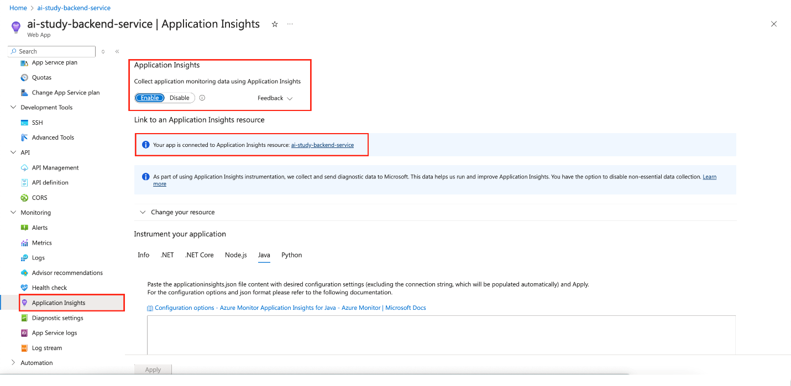
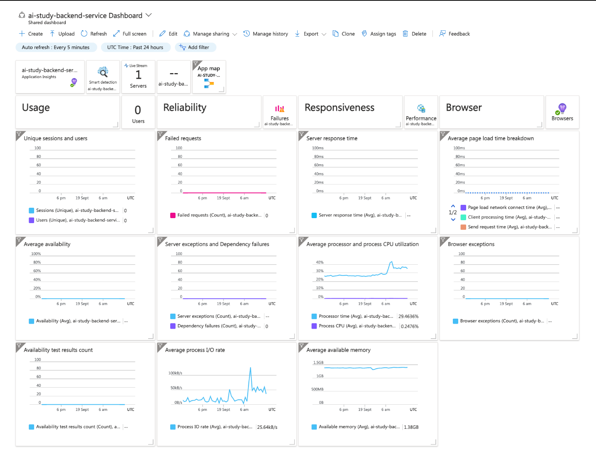
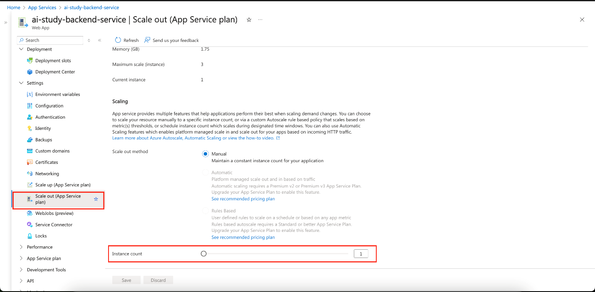
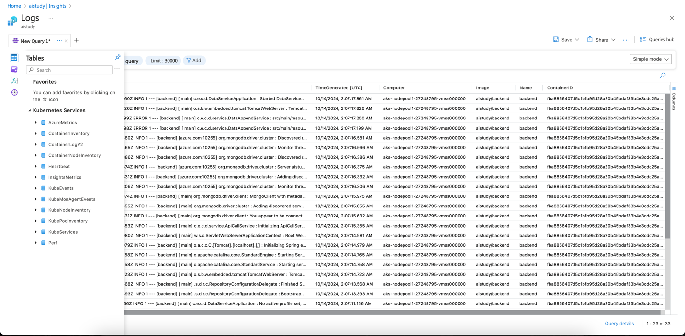
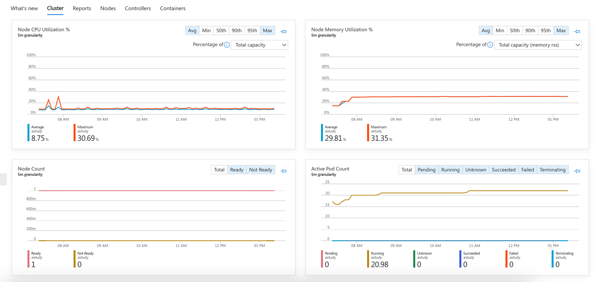
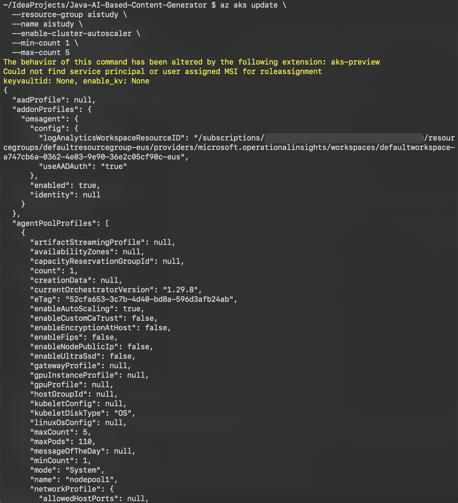
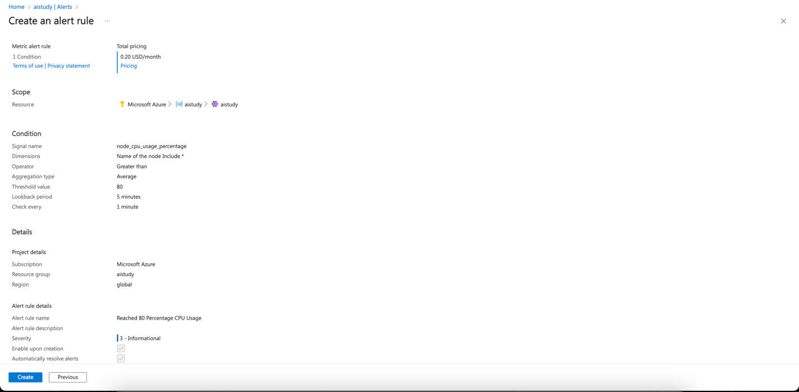

<head> 
  <meta property="og:url" content="https://azure.github.io/cloud-native/post-production-monitoring-scaling-and-optimization"/>
  <meta property="og:type" content="website"/>
  <meta property="og:title" content="**Build Intelligent Apps | AI Apps on Azure"/>
  <meta property="og:description" content="Learn how to ensure that your deployed applications are healthy, scalable, and optimized for cost efficiency. This blog provides specific strategies for both Azure App Service and Azure Kubernetes Service (AKS)."/>
  <meta property="og:image" content="https://github.com/Azure/Cloud-Native/blob/main/website/static/img/ogImage.png"/>
  <meta name="twitter:url" content="https://azure.github.io/Cloud-Native/post-production-monitoring-scaling-and-optimization" />
  <meta name="twitter:title" content="**Build Intelligent Apps | AI Apps on Azure" />
  <meta name="twitter:description" content="Learn how to ensure that your deployed applications are healthy, scalable, and optimized for cost efficiency. This blog provides specific strategies for both Azure App Service and Azure Kubernetes Service (AKS)." />
  <meta name="twitter:image" content="https://azure.github.io/Cloud-Native/img/ogImage.png" />
  <meta name="twitter:card" content="summary_large_image" />
  <meta name="twitter:creator" content="@devanshidiaries" />
  <link rel="canonical" href="https://azure.github.io/Cloud-Native/30-days-of-ia-2024/post-production-monitoring-scaling-and-optimization" />
</head>

<!-- End METADATA -->

Learn how to ensure that your deployed applications are healthy, scalable, and optimized for cost efficiency. This blog provides specific strategies for both Azure App Service and Azure Kubernetes Service (AKS).

## What we cover:

- Monitoring your application health
- Scaling your application
- Setting up alerts and notifications
- Implementing continuous optimization

## Introduction

In our previous blog posts, we walked through building and deploying an example application using both **[Azure App Service](https://learn.microsoft.com/azure/app-service/?ocid=biafy25h1_30daysofia_webpage_azuremktg)** and **[Azure Kubernetes Service (AKS)](https://learn.microsoft.com/azure/aks/what-is-aks?ocid=biafy25h1_30daysofia_webpage_azuremktg)** environments.

However, deployment is not the end of the journey. Post-production phases are essential to maintaining your application’s efficiency and ensuring that it scales effectively as demand increases.

This post covers the necessary steps for monitoring, scaling, and optimizing applications on both App Service and AKS, helping you maintain reliable and performant deployments.

## Azure App Service

### Step 1: Monitor Application Health on App Service

1. **Set up Azure Monitor and Application Insights**  
    Enable Application Insights for your App Service to track performance metrics such as response times, request rates, and failure rates.
    
    - **To enable:**  
        Go to your App Service in the Azure portal. Under Monitoring, enable Application Insights. This provides features like:

        

    - **Live metrics:**
        Real-time performance monitoring.

        

    - **Custom dashboards:** Create visual dashboards for metrics such as API response times and database latency.

        

2. **Implement Logging and Tracing**  
    Enable diagnostic logs to capture application and server logs. Stream logs live or archive them in Azure Storage for future analysis.

3. **Key Metrics to Monitor**
    - **Availability:** Uptime and responsiveness of your App Service.
    - **Performance:** Response times, throughput, and latency.
    - **Error Rates:** Percentage of failed requests or exceptions.
    - **Resource Utilization:** CPU and memory usage.

### Step 2: Scale Your Application on App Service

1. **Vertical Scaling (Scale Up)**  
Increase the compute resources allocated to your App Service plan for handling intensive workloads.

2. **Horizontal Scaling (Scale Out)**  
Add more instances of your App Service to handle increased traffic. You can set the number of instances or configure Autoscale based on CPU or memory thresholds.

    - **To Scale Out:**  
    Go to **App Service** > Scale Out (App Service plan), and configure scaling rules.

      

### Step 3: Set Up Alerts and Notifications for App Service

1. **Configure Azure Monitor Alerts**   
Set up alerts to notify you when key metrics (such as CPU usage, memory, or failure rates) exceed defined thresholds.

    - **Steps:**  
**Azure Monitor** > **Alerts** > **New Alert Rule**. Define your target resource, set conditions, and configure actions like sending emails or SMS alerts.

2. **Set Up Action Groups**  
Use action groups to standardize alert responses, ensuring the right teams are notified promptly.

## Azure Kubernetes Service (AKS)

### Step 1: Monitor Application Health on AKS

1. **Set up Azure Monitor with Container Insights**  
Enable Container Insights to monitor cluster performance, including CPU, memory, and node availability.  

2. **Logging and Tracing on AKS**  
Use `kubectl` logs to retrieve logs from your pods. Integrate with Azure Monitor Logs for centralized log management.

    

3. **Key Metrics to Monitor**
    - **Availability:** Uptime of the services deployed in your AKS cluster.  
    - **Performance:** CPU, memory usage, and network traffic.
    - **Error Rates:** Failed requests or service outages.
    - **Resource Utilization:** Node and pod-level resource usage.

      

### Step 2: Scale Your Application on AKS

4. **Horizontal Pod Autoscaling (HPA)**  
Automatically adjust the number of pod replicas based on observed CPU or memory usage. Configure HPA by defining resource thresholds in your Kubernetes deployment YAML:

    ```
    apiVersion: autoscaling/v1
    kind: HorizontalPodAutoscaler
    metadata:
      name: <your-hpa-name>
    spec:
      scaleTargetRef:
        apiVersion: apps/v1
        kind: Deployment
        name: <your-app-name>
      minReplicas: 1
      maxReplicas: 10
      targetCPUUtilizationPercentage: 80
    ```
  
5. **Cluster Autoscaler**  
Automatically scales the AKS cluster by adding or removing nodes based on workload demands.
    - **Enable using Azure CLI:**

      ```
      az aks update \
        --resource-group <RESOURCE_GROUP_NAME> \
        --name <AKS_NAME> \
        --enable-cluster-autoscaler \
        --min-count 1 \
        --max-count 5
      ```

      

### Step 3: Set Up Alerts and Notifications for AKS

6. **Azure Monitor Alerts**  
Configure alerts to detect resource thresholds being exceeded, such as CPU usage, memory, or network latency.

    

7. **Action Groups**  
Use action groups to define responses when an alert is triggered, standardizing notification and automated actions.

## Common Continuous Optimization

### Step 4. Implement continuous optimization

8. **Performance Tuning**
    - **Database:** Optimize queries and review the performance of your databases (e.g., Azure Cosmos DB for MongoDB).
    - **Caching:** Use caching mechanisms (e.g., Azure Cache for Redis) to offload work from the backend.
    - **Code Optimization:** Identify and resolve performance bottlenecks using profiling tools like Application Insights Profiler.

9. **Cost Optimization**
    - **Monitor Resource Costs:** Regularly review resource usage to avoid overprovisioning.
    - **Reserved Instances:** Use reserved instances for predictable workloads to save on costs.

:::info
Learn more on Technical leaders’ [guide to building intelligent apps](https://aka.ms/AAI_TDMApps_Plan?ocid=biafy25h1_30daysofia_webpage_azuremktg).
:::

## Summary

In this post, we provided a comprehensive guide on monitoring, scaling, and optimizing applications on Azure App Service and AKS. We discussed using monitoring tools, configuring scaling strategies, and setting up alerts. Additionally, we covered best practices for continuous optimization to ensure your applications remain reliable, scalable, and cost-effective.

In the [next blog](https://azure.github.io/Cloud-Native/30-days-of-ia-2024/demo-our-ai-based-content-generation-app), we will demonstrate a live application setup, showcasing how all these components work together in real-world use cases.