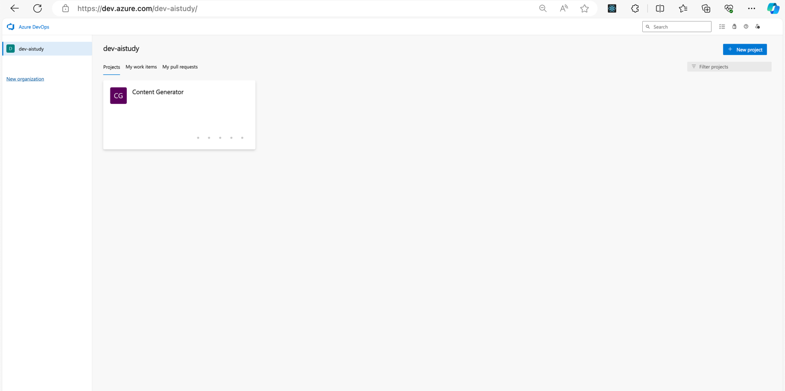
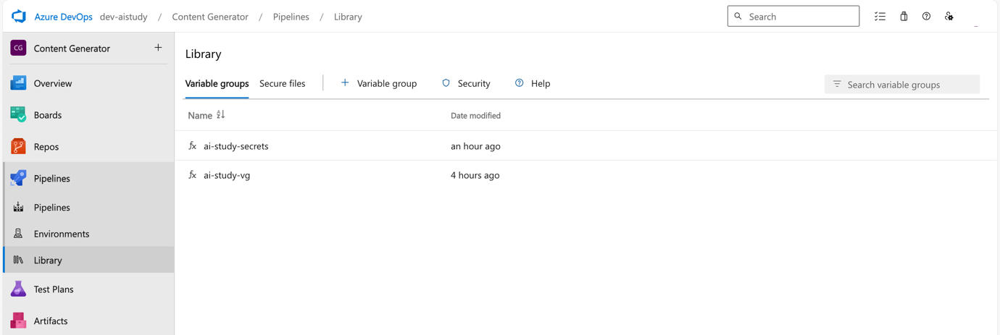
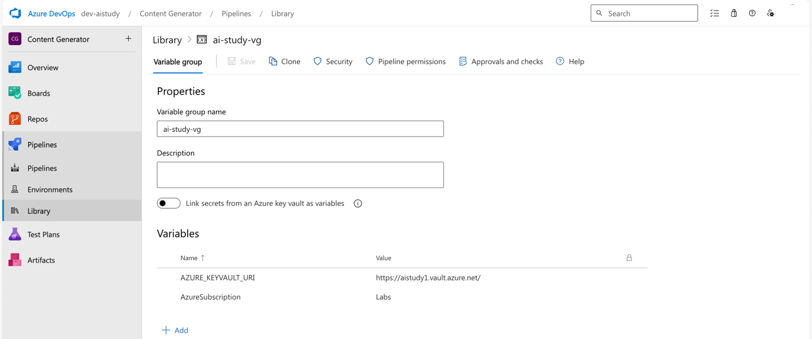
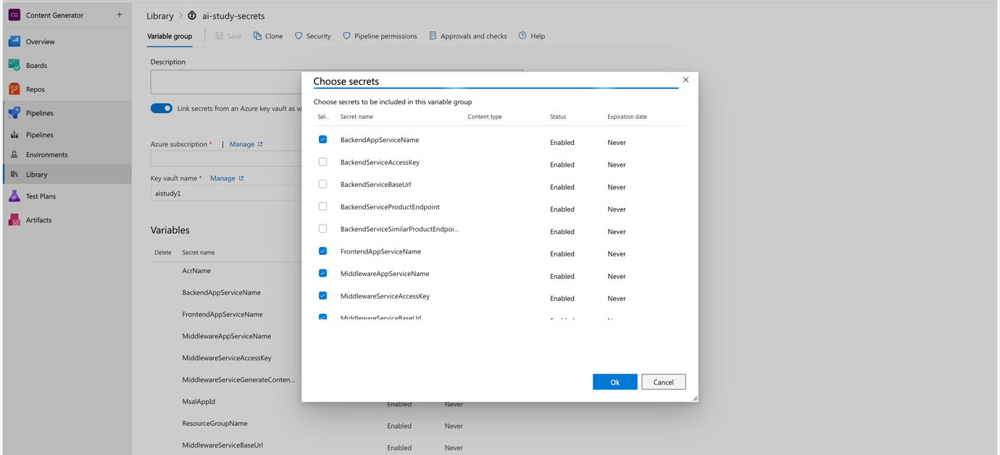
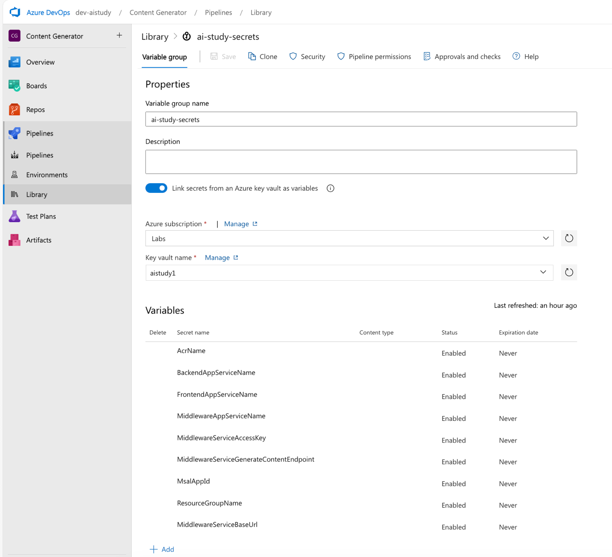
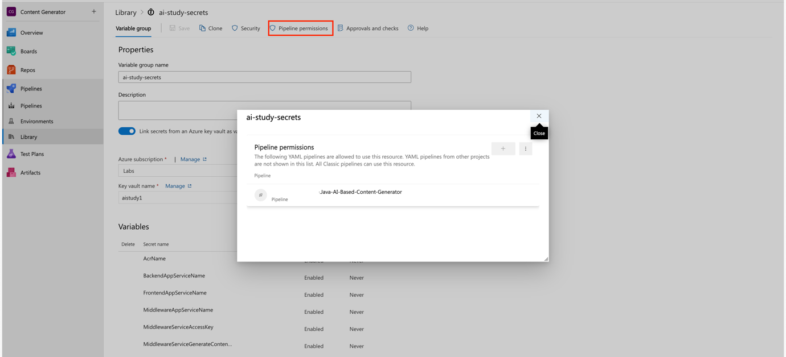
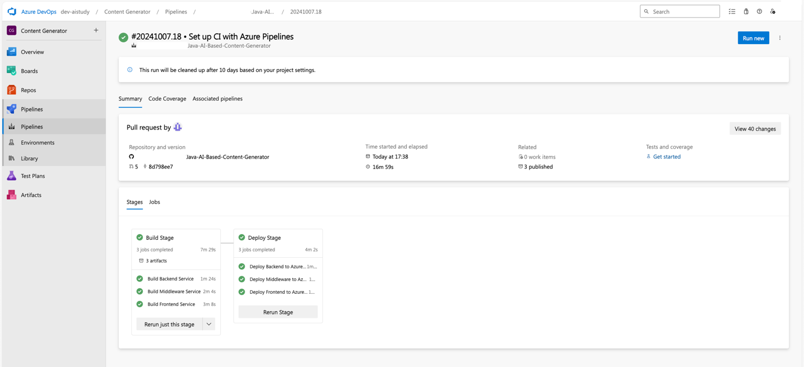
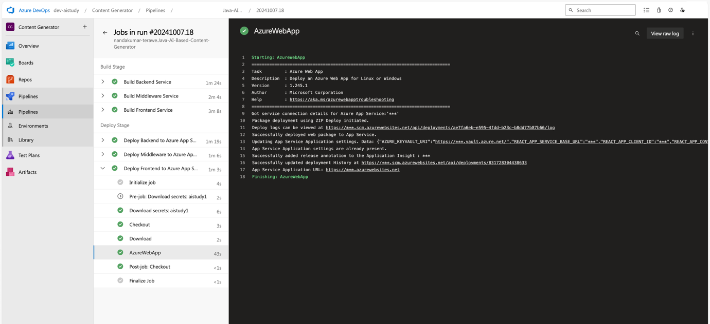

<head> 
  <meta property="og:url" content="https://azure.github.io/cloud-native/setting-up-ci-cd-pipelines-for-azure-app-servicea-and-aks-using-azure-devops-1"/>
  <meta property="og:type" content="website"/>
  <meta property="og:title" content="**Build Intelligent Apps | AI Apps on Azure"/>
  <meta property="og:description" content="In this application development, Continuous Integration and Continuous Deployment (CI/CD) play a vital role in streamlining workflows and ensuring rapid delivery of software.  "/>
  <meta property="og:image" content="https://github.com/Azure/Cloud-Native/blob/main/website/static/img/ogImage.png"/>
  <meta name="twitter:url" content="https://azure.github.io/Cloud-Native/setting-up-ci-cd-pipelines-for-azure-app-servicea-and-aks-using-azure-devops-1" />
  <meta name="twitter:title" content="**Build Intelligent Apps | AI Apps on Azure" />
  <meta name="twitter:description" content="In this application development, Continuous Integration and Continuous Deployment (CI/CD) play a vital role in streamlining workflows and ensuring rapid delivery of software." />
  <meta name="twitter:image" content="https://azure.github.io/Cloud-Native/img/ogImage.png" />
  <meta name="twitter:card" content="summary_large_image" />
  <meta name="twitter:creator" content="@devanshidiaries" />
  <link rel="canonical" href="https://azure.github.io/Cloud-Native/30-days-of-ia-2024/setting-up-ci-cd-pipelines-for-azure-app-servicea-and-aks-using-azure-devops-1" />
</head>

<!-- End METADATA -->
## Part 1: Setting Up CI/CD Pipelines for Azure App Service Using Azure DevOps

In this application development, Continuous Integration and Continuous Deployment (CI/CD) play a vital role in streamlining workflows and ensuring rapid delivery of software. In this blog, we will explore how to set up CI/CD pipelines for three applications—a Java Spring Boot backend, a Java Spring Boot middleware, and a ReactJS frontend—using Azure DevOps. We will deploy these applications to Azure App Service in parallel.

## Prerequisites

Before we start, ensure you have:

- An Azure DevOps account.
- A GitHub repository with your application code, specifically structured with three folders: `backend`, `middleware`, and `frontend`.
- An Azure subscription with access to Azure App Service.
- The GitHub URL for the project we will be using is: [Java-AI-Based-Content-Generator](https://github.com/Azure-Samples/Java-AI-Based-Content-Generator).

## Overview of the Pipeline

The CI/CD pipeline will consist of the following key stages:

1. **Build Stage:** Each application is built in parallel, producing artifacts for deployment.
2. **Deploy Stage:** The built artifacts are deployed to Azure App Service and AKS.

### Integrating GitHub Repository into Azure DevOps

To connect your GitHub repository to Azure DevOps, follow these steps:

1. **Navigate to Your Azure DevOps Project:** Go to the Azure DevOps portal and select your project.

    

2. **Select Project Settings:** At the bottom left corner, click on the **Project settings** gear icon.  
3. **Service Connections:** Under the **Pipelines** section, select **Service connections**.

    

4. **Create a New Service Connection:** Click on **New service connection** and select **GitHub** from the list.
5. **Authorize Azure DevOps:** Follow the prompts to authorize Azure DevOps to access your GitHub account.
6. **Select Repository:** Choose the repository you want to integrate and complete the setup.

    

### Creating Variable Groups

Variable groups in Azure DevOps help centralize configuration management by allowing you to store and reuse variables across multiple pipelines. Here's how to create and configure a variable group:

1. **Navigate to Pipelines:** Open the **Pipelines** section in your Azure DevOps project.
2. **Library:** Click on **Library** under Pipelines.

    

3. **Add Variable Group:** Select **+ Variable group**.

    

4. **Define Variables:** Add the necessary variables (e.g., `AcrName`, `BackendAppServiceName`, `MiddlewareAppServiceName`, and `FrontendAppServiceName`). Optionally, mark sensitive values as secrets.

    

5. **Link to Azure Key Vault:** If needed, link your variable group to an Azure Key Vault to manage secrets.

    

6. **Save the Variable Group:** Click **Save** to confirm your variable group configuration.
7. **Add Pipeline Permission**

    

#### Pipeline YAML Configuration

Below is the YAML configuration for the Azure DevOps pipeline, followed by a detailed explanation of each block.

`azure-pipeline.yml`

```
trigger:
  branches:
    include:
      - main
      - feature/ci

pool:
  vmImage: 'ubuntu-latest'

variables:
  - group: ai-study-vg
  - group: ai-study-secrets

stages:
  - stage: Build
    displayName: 'Build Stage'
    jobs:
      - job: Build_Backend
        displayName: 'Build Backend Service'
        pool:
          vmImage: 'ubuntu-latest'
        steps:
          - checkout: self
          - task: Maven@4
            inputs:
              mavenPomFile: 'backend/pom.xml'
              mavenOptions: '-Xmx3072m'
              javaHomeOption: 'JDKVersion'
              jdkVersionOption: '1.17' # JDK Version set to 17
              jdkArchitectureOption: 'x64'
              publishJUnitResults: true
              testResultsFiles: '**/TEST-*.xml'
              goals: 'clean package'
          - publish: '$(System.DefaultWorkingDirectory)/backend/target/backend.war'
            artifact: backend

      - job: Build_Middleware
        displayName: 'Build Middleware Service'
        pool:
          vmImage: 'ubuntu-latest'
        steps:
          - checkout: self
          - task: Maven@4
            inputs:
              mavenPomFile: 'middleware/pom.xml'
              mavenOptions: '-Xmx3072m'
              javaHomeOption: 'JDKVersion'
              jdkVersionOption: '1.17' # JDK Version set to 17
              jdkArchitectureOption: 'x64'
              publishJUnitResults: true
              testResultsFiles: '**/TEST-*.xml'
              goals: 'clean package'
          - publish: '$(System.DefaultWorkingDirectory)/middleware/target/middleware.war'
            artifact: middleware

      - job: Build_Frontend
        displayName: 'Build Frontend Service'
        pool:
          vmImage: 'ubuntu-latest'
        steps:
          - checkout: self
          - script: |
              cd frontend
              npm install
              npm run build
          - publish: '$(System.DefaultWorkingDirectory)/frontend/build'
            artifact: frontend

  - stage: Deploy
    displayName: 'Deploy Stage'
    dependsOn: Build
    jobs:
      - job: Deploy_Backend_AppService
        displayName: 'Deploy Backend to Azure App Service'
        pool:
          vmImage: 'ubuntu-latest'
        steps:
          - download: current
            artifact: backend
          - task: AzureWebApp@1
            inputs:
              azureSubscription: '$(AzureSubscription)' # This will be set from Variable Group
              appName: '$(BackendAppServiceName)' # This will be set from Key Vault - Variable Group
              package: '$(Pipeline.Workspace)/backend/backend.war'
              appType: 'webAppLinux'
              appSettings: |
                -AZURE_KEYVAULT_URI "$(AZURE_KEYVAULT_URI)"

      - job: Deploy_Middleware_AppService
        displayName: 'Deploy Middleware to Azure App Service'
        pool:
          vmImage: 'ubuntu-latest'
        steps:
          - download: current
            artifact: middleware
          - task: AzureWebApp@1
            inputs:
              azureSubscription: '$(AzureSubscription)' # This will be set from Variable Group
              appName: '$(MiddlewareAppServiceName)' # This will be set from Key Vault - Variable Group
              package: '$(Pipeline.Workspace)/middleware/middleware.war'
              appType: 'webAppLinux'
              appSettings: |
                -AZURE_KEYVAULT_URI "$(AZURE_KEYVAULT_URI)"

      - job: Deploy_Frontend_AppService
        displayName: 'Deploy Frontend to Azure App Service'
        pool:
          vmImage: 'ubuntu-latest'
        steps:
          - download: current
            artifact: frontend
          - task: AzureWebApp@1
            inputs:
              azureSubscription: '$(AzureSubscription)' # This will be set from Variable Group
              appName: '$(FrontendAppServiceName)' # This will be set from Key Vault - Variable Group
              package: '$(Pipeline.Workspace)/frontend'
              startUpCommand: 'pm2 serve /home/site/wwwroot/build --no-daemon --spa'
              appType: 'webAppLinux'
              # These secrets will be retrieved from Key Vault - Variable Group
              appSettings: |
                -REACT_APP_SERVICE_BASE_URL "$(MiddlewareServiceBaseUrl)"
                -REACT_APP_CLIENT_ID "$(MsalAppId)"
                -REACT_APP_CONTENT_GENERATOR_ENDPOINT "$(MiddlewareServiceGenerateContentEndpoint)"
                -REACT_APP_SERVICE_ACCESS_KEY "$(MiddlewareServiceAccessKey)"
```

#### Testing the CI/CD Pipeline

After setting up the pipeline, navigate to the **Pipelines** section in Azure DevOps and manually trigger a run to test your configuration.

1. **Navigate to Pipelines:** Open the Pipelines section.

    

2. **Select the Pipeline:** Choose the pipeline you configured.

    

3. **Run Pipeline:** Click on **Run Pipeline** and monitor the execution.

    

4. **Monitor Job Logs:** View the logs for each stage to ensure there are no errors.

    

:::info
Join live experts to dive into [operational excellence with AKS](https://aka.ms/learn-live/ep3?ocid=biafy25h1_30daysofia_webpage_azuremktg).
:::

## Conclusion

In this blog, we explored how to set up a CI/CD pipeline for Java and ReactJS applications using Azure DevOps. We integrated GitHub, configured variable groups, and deployed to Azure App Service. Testing the pipeline ensures that the setup works end-to-end.

## Next

In the next blog, we’ll cover advanced topics such as monitoring and scaling these deployments.