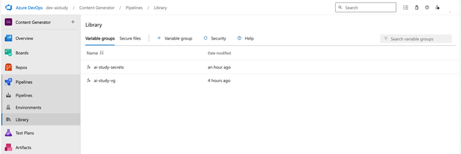
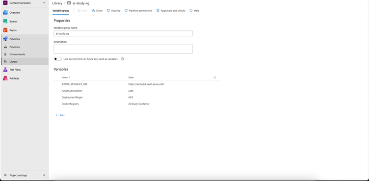
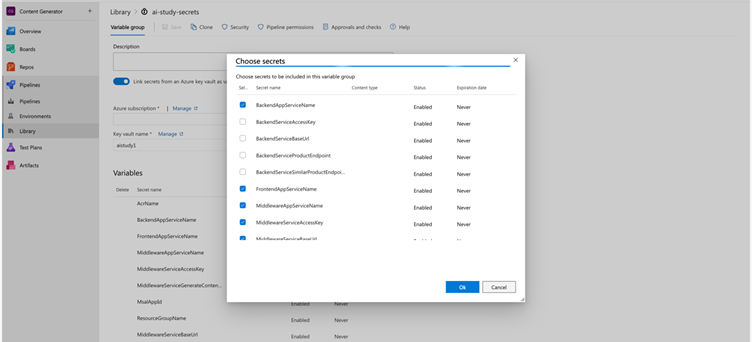
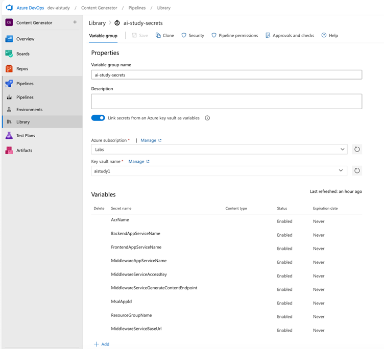
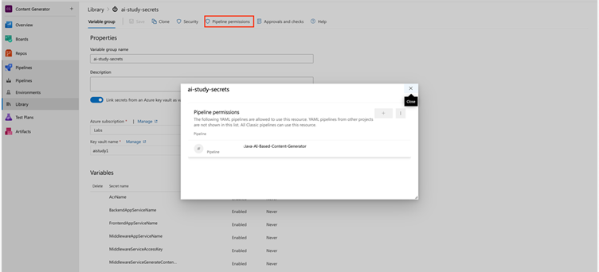
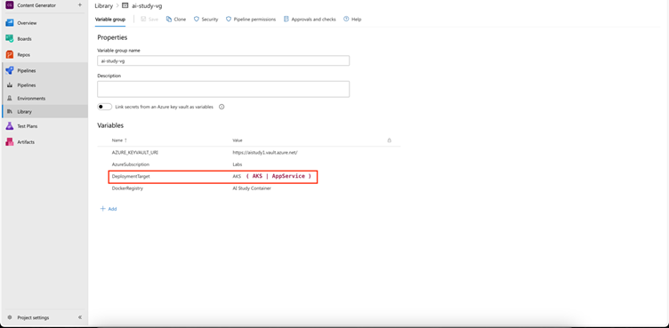
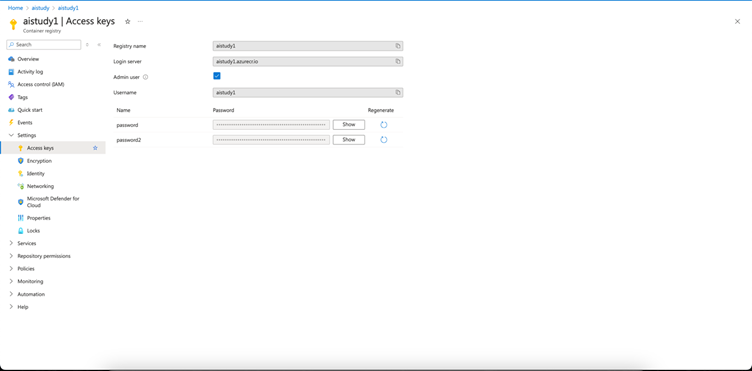
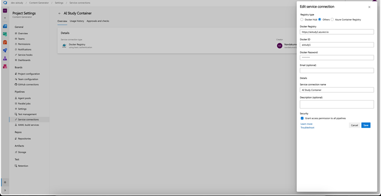
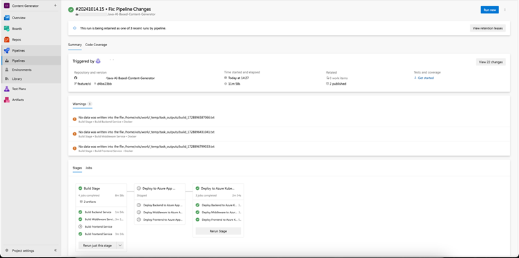
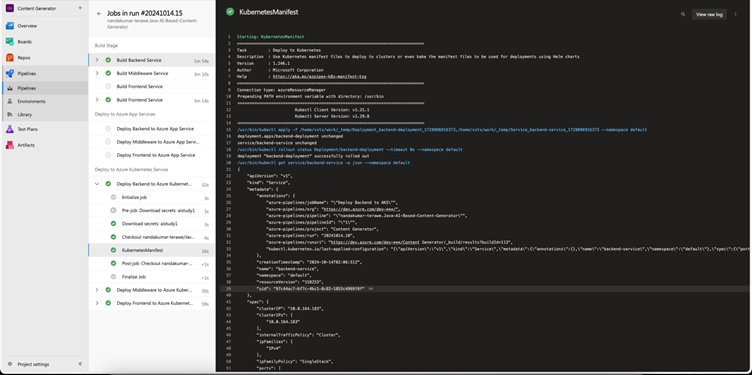

<head> 
  <meta property="og:url" content="https://azure.github.io/cloud-native/setting-up-ci-cd-pipelines-for-azure-app-servicea-and-aks-using-azure-devops-2"/>
  <meta property="og:type" content="website"/>
  <meta property="og:title" content="**Build Intelligent Apps | AI Apps on Azure"/>
  <meta property="og:description" content="In this application development, Continuous Integration and Continuous Deployment (CI/CD) play a vital role in streamlining workflows and ensuring rapid delivery of software.  "/>
  <meta property="og:image" content="https://github.com/Azure/Cloud-Native/blob/main/website/static/img/ogImage.png"/>
  <meta name="twitter:url" content="https://azure.github.io/Cloud-Native/setting-up-ci-cd-pipelines-for-azure-app-servicea-and-aks-using-azure-devops-2" />
  <meta name="twitter:title" content="**Build Intelligent Apps | AI Apps on Azure" />
  <meta name="twitter:description" content="In this application development, Continuous Integration and Continuous Deployment (CI/CD) play a vital role in streamlining workflows and ensuring rapid delivery of software." />
  <meta name="twitter:image" content="https://azure.github.io/Cloud-Native/img/ogImage.png" />
  <meta name="twitter:card" content="summary_large_image" />
  <meta name="twitter:creator" content="@devanshidiaries" />
  <link rel="canonical" href="https://azure.github.io/Cloud-Native/30-days-of-ia-2024/setting-up-ci-cd-pipelines-for-azure-app-servicea-and-aks-using-azure-devops-2" />
</head>

<!-- End METADATA -->
## Part 2: Setting Up CI/CD Pipelines for Azure Kubernetes Service (AKS) Using Azure DevOps

In the previous blog, we discussed the fundamentals of setting up CI/CD pipelines for **Azure App Service**. In this blog, we will focus on how to configure a CI/CD pipeline specifically for **Azure Kubernetes Service (AKS)** using Azure DevOps. We’ll cover prerequisites, detailed YAML configurations, and how to manage deployments based on a variable group setting.

## Prerequisites

Before diving into the pipeline configuration, ensure you have the following prerequisites:

- An Azure DevOps account.
- Access to your Azure subscription with permission to create resources.
- A GitHub repository with your application code, specifically structured with three folders: `backend`, `middleware`, and `frontend`. We will use the same repository as in the previous blog: [Java-AI-Based-Content-Generator](https://github.com/Azure-Samples/Java-AI-Based-Content-Generator).
- Azure Container Registry (ACR) configured and accessible.
- A Kubernetes cluster (AKS) set up in your Azure environment.

## Overview of the Pipeline

The CI/CD pipeline for deploying to AKS will include:

1. **Build Stage:** Similar to the previous setup, each application is built in parallel to produce artifacts.
2. **Push to ACR:** Docker images are created from the build artifacts and pushed to Azure Container Registry.
3. **Deploy Stage:** The Docker images are pulled from ACR and deployed to the AKS cluster

### Integrating GitHub Repository into Azure DevOps

Follow similar steps as outlined in blog 1.6a.

### Creating Variable Groups

Variable groups in Azure DevOps help centralize configuration management by allowing you to store and reuse variables across multiple pipelines. Here's how to create and configure a variable group:

- **Navigate to Pipelines:** Open the **Pipelines** section in your Azure DevOps project.
- **Library:** Click on **Library** under Pipelines.

  

1. **Add Variable Group:** Select + **Variable group**.

    

2. **Define Variables:** Add the necessary variables (e.g., `AcrName`, `BackendAppServiceName`, `MiddlewareAppServiceName`, and `FrontendAppServiceName`). Optionally, mark sensitive values as secrets.

    

3. **Link to Azure Key Vault:** If needed, link your variable group to an Azure Key Vault to manage secrets.

    

4. **Save the Variable Group:** Click **Save** to confirm your variable group configuration.
5. **Add Pipeline Permission:** Ensure that the pipeline has permission to access the variable group.

    

### Variable Groups

We will utilize variable groups to manage our configurations efficiently. In particular, we will set the `DeploymentTarget` variable in the variable group `ai-study-vg` to determine whether we are deploying to AKS or App Service.

#### Adding Variables

- `DeploymentTarget`: This variable will dictate the target deployment, allowing us to switch between AKS and App Service as needed.

    

## Configuring Service Connection for Azure Container Registry (ACR)

Before deploying your applications to Azure Kubernetes Service (AKS), it's essential to set up a service connection for Azure Container Registry (ACR). This allows Azure DevOps to authenticate and pull images from your ACR. Follow these steps to configure the service connection:

### Step 1: Access Your Azure Container Registry

1. **Navigate to Azure Portal** and find your Azure Container Registry resource.
2. In the left-hand menu, select **Access keys**.

### Step 2: Copy the Required Values

In the **Access keys** section, you will find two important values: 

- **Login Server:** This will typically be in the format youracrname.azurecr.io.
- **Admin User Password:** This is used for authentication.

    

### Step 3: Create the Service Connection

6. In your Azure DevOps project, navigate to **Project Settings** > **Service connections**.
7. Click on **New service connection** and select **Docker Registry**.
8. Choose **Others** as the Docker Registry type.
9. Enter the following details:
    - **Registry:** `$(DockerRegistry)` (the variable you created in `ai-study-vg`)
    - **Username:** Your ACR username (usually the name of your ACR)
    - **Password:** Use the **Admin User Password** you copied earlier.
10. Name your service connection (e.g., `AI Study Container`) and save it.

    

### Step 4: Store the Values in Variable Group

11. Go to your Azure DevOps project.
12. Select **Pipelines** > **Library**.
13. Find the variable group `ai-study-vg`.
14. Add a new variable named **DockerRegistry** and service connection name (e.g., `AI Study Container`).

    

Now your Azure DevOps pipeline can authenticate to ACR and pull the necessary images for your AKS deployments.

#### Pipeline YAML Configuration

Here's the YAML configuration for setting up the Azure DevOps pipeline for AKS deployment:

`azure-pipeline.yml`

```
trigger:
  branches:
    include:
      - main

pool:
  vmImage: 'ubuntu-latest'

variables:
  - group: ai-study-vg
  - group: ai-study-secrets

stages:
  - stage: Build
    displayName: 'Build Stage'
    jobs:
      - job: Build_Backend
        displayName: 'Build Backend Service'
        pool:
          vmImage: 'ubuntu-latest'
        steps:
          - checkout: self
          - task: Maven@4
            inputs:
              mavenPomFile: 'backend/pom.xml'
              mavenOptions: '-Xmx3072m'
              javaHomeOption: 'JDKVersion'
              jdkVersionOption: '1.17'  # JDK Version set to 17
              jdkArchitectureOption: 'x64'
              publishJUnitResults: true
              testResultsFiles: '**/TEST-*.xml'
              goals: 'clean package'
          - publish: 'backend/target/backend.war'
            artifact: backend

          # Docker build and push using the published WAR file
          - task: Docker@2
            condition: eq(variables['DeploymentTarget'], 'AKS')
            inputs:
              containerRegistry: '$(DockerRegistry)'
              repository: '$(AcrName).azurecr.io/aistudy/backend'
              command: 'buildAndPush'
              Dockerfile: 'backend/Dockerfile'
              buildContext: 'backend'
              tags: 'latest'

      - job: Build_Middleware
        displayName: 'Build Middleware Service'
        pool:
          vmImage: 'ubuntu-latest'
        steps:
          - checkout: self
          - task: Maven@4
            inputs:
              mavenPomFile: 'middleware/pom.xml'
              mavenOptions: '-Xmx3072m'
              javaHomeOption: 'JDKVersion'
              jdkVersionOption: '1.17'  # JDK Version set to 17
              jdkArchitectureOption: 'x64'
              publishJUnitResults: true
              testResultsFiles: '**/TEST-*.xml'
              goals: 'clean package'
          - publish: 'middleware/target/middleware.war'
            artifact: middleware

          # Docker build and push using the published WAR file
          - task: Docker@2
            condition: eq(variables['DeploymentTarget'], 'AKS')
            inputs:
              containerRegistry: '$(DockerRegistry)'
              repository: '$(AcrName).azurecr.io/aistudy/middleware'
              command: 'buildAndPush'
              Dockerfile: 'middleware/Dockerfile'
              buildContext: 'middleware'
              tags: 'latest'

      - job: Build_Frontend
        displayName: 'Build Frontend Service'
        condition: eq(variables['DeploymentTarget'], 'AppService')
        pool:
          vmImage: 'ubuntu-latest'
        steps:
          - checkout: self

          # Install dependencies and build the React app
          - task: Npm@1
            inputs:
              command: 'install'
              workingDir: 'frontend'

          - task: Npm@1
            inputs:
              command: 'custom'
              workingDir: 'frontend'
              customCommand: 'run build'

          - publish: 'frontend/build'
            artifact: frontend

      - job: Build_Frontend_AKS
        displayName: 'Build Frontend Service'
        condition: eq(variables['DeploymentTarget'], 'AKS')
        pool:
          vmImage: 'ubuntu-latest'
        steps:
          - checkout: self
          - task: Docker@2
            inputs:
              containerRegistry: '$(DockerRegistry)'
              repository: '$(AcrName).azurecr.io/aistudy/frontend'
              command: 'buildAndPush'
              Dockerfile: 'frontend/Dockerfile'
              buildContext: 'frontend'
              tags: 'latest'

  - stage: Deploy_AppServices
    displayName: 'Deploy to Azure App Services'
    condition: eq(variables['DeploymentTarget'], 'AppService')
    dependsOn: Build
    jobs:
      - job: Deploy_Backend_AppService
        displayName: 'Deploy Backend to Azure App Service'
        pool:
          vmImage: 'ubuntu-latest'
        steps:
          - download: current
            artifact: backend
          - task: AzureWebApp@1
            inputs:
              azureSubscription: '$(AzureSubscription)' # This will be set from Variable Group
              appName: '$(BackendAppServiceName)' # This will be set from Key Vault - Variable Group
              package: '$(Pipeline.Workspace)/backend/backend.war'
              appType: 'webAppLinux'
              appSettings: |
                -AZURE_KEYVAULT_URI "$(AZURE_KEYVAULT_URI)"

      - job: Deploy_Middleware_AppService
        displayName: 'Deploy Middleware to Azure App Service'
        pool:
          vmImage: 'ubuntu-latest'
        steps:
          - download: current
            artifact: middleware
          - task: AzureWebApp@1
            inputs:
              azureSubscription: '$(AzureSubscription)' # This will be set from Variable Group
              appName: '$(MiddlewareAppServiceName)' # This will be set from Key Vault - Variable Group
              package: '$(Pipeline.Workspace)/middleware/middleware.war'
              appType: 'webAppLinux'
              appSettings: |
                -AZURE_KEYVAULT_URI "$(AZURE_KEYVAULT_URI)"

      - job: Deploy_Frontend_AppService
        displayName: 'Deploy Frontend to Azure App Service'
        pool:
          vmImage: 'ubuntu-latest'
        steps:
          - download: current
            artifact: frontend
          - task: AzureWebApp@1
            inputs:
              azureSubscription: '$(AzureSubscription)' # This will be set from Variable Group
              appType: 'webAppLinux'
              appName: '$(FrontendAppServiceName)' # This will be set from Key Vault - Variable Group
              package: '$(Pipeline.Workspace)/frontend'
              startUpCommand: 'pm2 serve /home/site/wwwroot/build --no-daemon --spa'
              appSettings: |
                -REACT_APP_SERVICE_BASE_URL "$(MiddlewareServiceBaseUrl)"
                -REACT_APP_CLIENT_ID "$(MsalAppId)"
                -REACT_APP_CONTENT_GENERATOR_ENDPOINT "$(MiddlewareServiceGenerateContentEndpoint)"
                -REACT_APP_SERVICE_ACCESS_KEY "$(MiddlewareServiceAccessKey)"

  # Deploying to Azure Kubernetes Service
  - stage: Deploy_AKS
    displayName: 'Deploy to Azure Kubernetes Service'
    condition: eq(variables['DeploymentTarget'], 'AKS')
    dependsOn: Deploy_AppServices
    jobs:
      - job: Deploy_Backend_AKS
        displayName: 'Deploy Backend to Azure Kubernetes Service'
        pool:
          vmImage: 'ubuntu-latest'
        steps:
          - task: KubernetesManifest@1
            inputs:
              action: 'deploy'
              connectionType: 'azureResourceManager'
              azureSubscriptionConnection: '$(AzureSubscription)'
              azureResourceGroup: '$(ResourceGroupName)'
              kubernetesCluster: '$(AKS)'
              manifests: 'backend/backend-deployment.yml'

      - job: Deploy_Middleware_AKS
        displayName: 'Deploy Middleware to Azure Kubernetes Service'
        pool:
          vmImage: 'ubuntu-latest'
        steps:
          - task: KubernetesManifest@1
            inputs:
              action: 'deploy'
              connectionType: 'azureResourceManager'
              azureSubscriptionConnection: '$(AzureSubscription)'
              azureResourceGroup: '$(ResourceGroupName)'
              kubernetesCluster: '$(AKS)'
              manifests: 'middleware/middleware-deployment.yml'

      - job: Deploy_Frontend_AKS
        displayName: 'Deploy Frontend to Azure Kubernetes Service'
        pool:
          vmImage: 'ubuntu-latest'
        steps:
          - task: KubernetesManifest@1
            inputs:
              action: 'deploy'
              connectionType: 'azureResourceManager'
              azureSubscriptionConnection: '$(AzureSubscription)'
              azureResourceGroup: '$(ResourceGroupName)'
              kubernetesCluster: '$(AKS)'
              manifests: 'frontend/frontend-deployment.yml'
```

### Explanation of the YAML Configuration

- The pipeline triggers on changes to the `main` branch.
- The **Build** job compiles the applications and builds artifacts for deployment.
- The **Deploy** job checks the value of DeploymentTarget and decides whether to deploy to AKS or App Service.

#### Testing the CI/CD Pipeline

Similar to **Blog 1.6a**, manually trigger the pipeline to ensure that the deployment is successful.





## Conclusion

In this blog, we extended our CI/CD pipelines to deploy Java Spring Boot and ReactJS applications to Azure Kubernetes Service. This approach allows for greater scalability and flexibility.

In our next blog, we will cover advanced topics such as monitoring and scaling these deployments to ensure optimal performance and reliability.