<head> 
  <meta property="og:url" content="https://azure.github.io/cloud-native/setting-up-ci-cd-pipelines-for-azure-app-servicea-and-aks-using-azure-devops"/>
  <meta property="og:type" content="website"/>
  <meta property="og:title" content="**Build Intelligent Apps | AI Apps on Azure"/>
  <meta property="og:description" content="In this application development, Continuous Integration and Continuous Deployment (CI/CD) play a vital role in streamlining workflows and ensuring rapid delivery of software.  "/>
  <meta property="og:image" content="https://github.com/Azure/Cloud-Native/blob/main/website/static/img/ogImage.png"/>
  <meta name="twitter:url" content="https://azure.github.io/Cloud-Native/setting-up-ci-cd-pipelines-for-azure-app-servicea-and-aks-using-azure-devops" />
  <meta name="twitter:title" content="**Build Intelligent Apps | AI Apps on Azure" />
  <meta name="twitter:description" content="In this application development, Continuous Integration and Continuous Deployment (CI/CD) play a vital role in streamlining workflows and ensuring rapid delivery of software." />
  <meta name="twitter:image" content="https://azure.github.io/Cloud-Native/img/ogImage.png" />
  <meta name="twitter:card" content="summary_large_image" />
  <meta name="twitter:creator" content="@devanshidiaries" />
  <link rel="canonical" href="https://azure.github.io/Cloud-Native/30-days-of-ia-2024/setting-up-ci-cd-pipelines-for-azure-app-servicea-and-aks-using-azure-devops" />
</head>

<!-- End METADATA -->

In this application development, Continuous Integration and Continuous Deployment (CI/CD) play a vital role in streamlining workflows and ensuring rapid delivery of software. In this blog, we will explore how to set up CI/CD pipelines for three applications—a Java Spring Boot backend, a Java Spring Boot middleware, and a ReactJS frontend—using Azure DevOps. We will deploy these applications to Azure App Service and Azure Kubernetes Service (AKS) in parallel.

## Prerequisites

Before we start, ensure you have:

- An Azure DevOps account.
- A GitHub repository with your application code, specifically structured with three folders: backend, middleware, and frontend.
- An Azure subscription with access to Azure App Service and AKS.
- The GitHub URL for the project we will be using is: [Java-AI-Based-Content-Generator](https://github.com/Azure-Samples/Java-AI-Based-Content-Generator).

:::info
[Ingest your own content](https://aka.ms/demo-bytes/ep6?ocid=biafy25h1_30daysofia_webpage_azuremktg) using the Azure Functions OpenAI extension into a Cosmos DB vector database to enable OpenAI query on your data.
:::

## Overview of the Pipeline

The CI/CD pipeline will consist of the following key stages:

- **Build Stage:** Each application is built in parallel, producing artifacts for deployment.
- **Deploy Stage:** The built artifacts are deployed to Azure App Service and AKS.

### Integrating GitHub Repository into Azure DevOps

To connect your GitHub repository to Azure DevOps, follow these steps:

1. **Navigate to Your Azure DevOps Project:** Go to the Azure DevOps portal and select your project.

    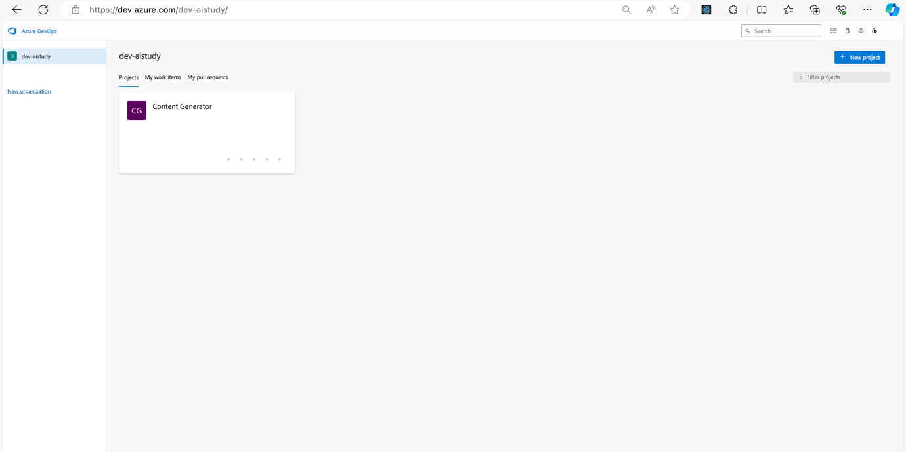

2. **Select Project Settings:** At the bottom left corner, click on the **Project settings** gear icon.  
3. **Service Connections:** Under the **Pipelines** section, select **Service connections**.

    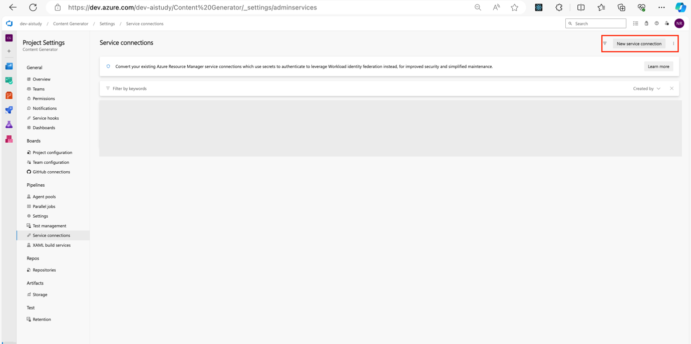

4. **Create a New Service Connection:** Click on **New service connection** and select **GitHub** from the list.
5. **Authorize Azure DevOps:** Follow the prompts to authorize Azure DevOps to access your GitHub account.
6. **Select Repository:** Choose the repository you want to integrate and complete the setup.

    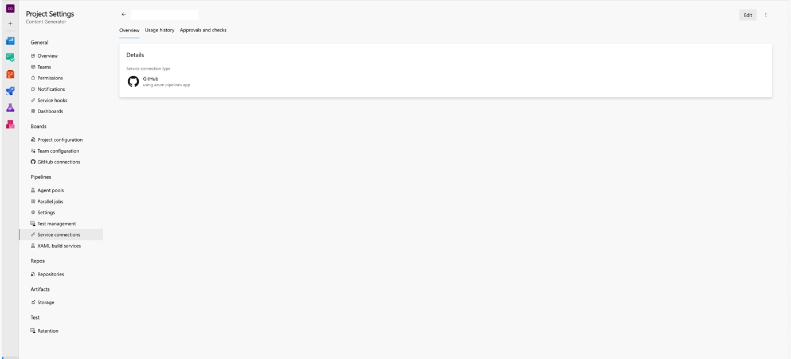

### Creating Variable Groups

Variable groups in Azure DevOps help centralize configuration management by allowing you to store and reuse variables across multiple pipelines. Here's how to create and configure a variable group:

1. **Navigate to Pipelines:** Open the **Pipelines** section in your Azure DevOps project.
2. **Library:** Click on **Library** under Pipelines.

    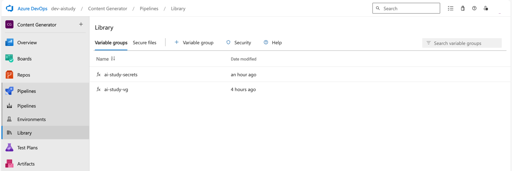

3. **Add Variable Group:** Select **+ Variable group**.

    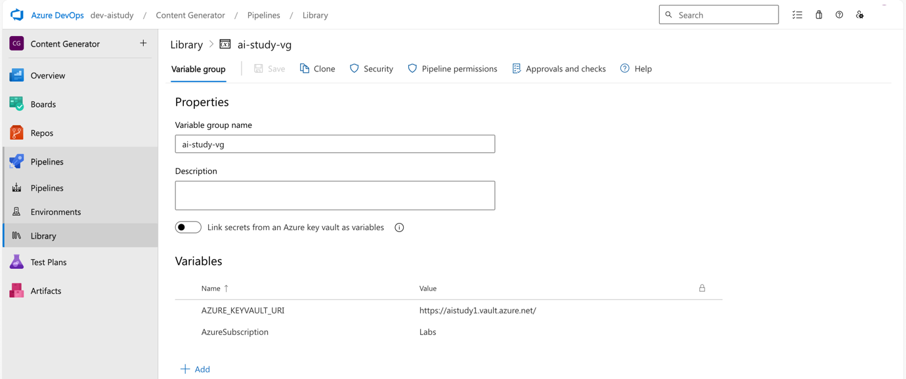

4. **Define Variables:** Add the necessary variables (e.g., `AcrName`, `BackendAppServiceName`, `MiddlewareAppServiceName`, and `FrontendAppServiceName`). Optionally, mark sensitive values as secrets.

    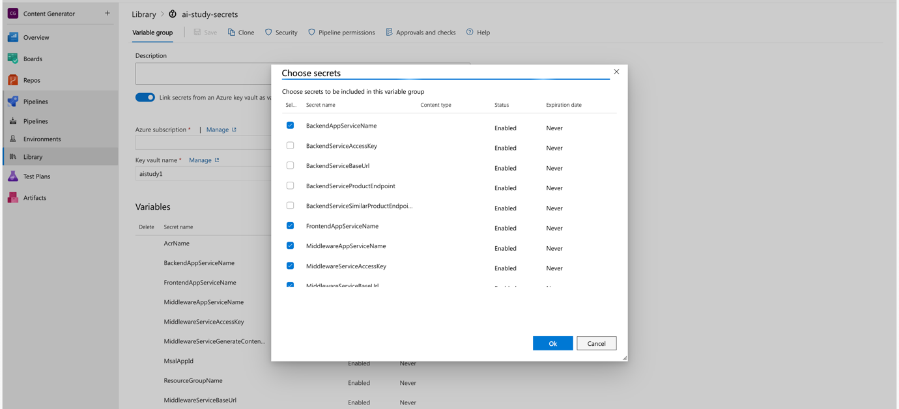

5. **Link to Azure Key Vault:** If needed, link your variable group to an Azure Key Vault to manage secrets.

    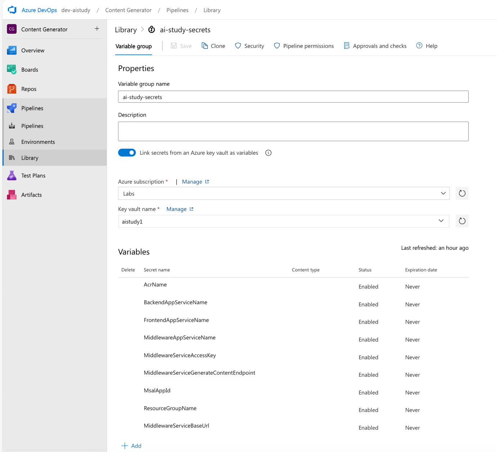

6. **Save the Variable Group:** Click **Save** to confirm your variable group configuration.
7. **Add Pipeline Permission**

    

#### Pipeline YAML Configuration

Below is the YAML configuration for the Azure DevOps pipeline, followed by a detailed explanation of each block.

`azure-pipeline.yml`

```
trigger: 
  branches: 
    include: 
      - main 
      - feature/ci 
 
pool: 
  vmImage: 'ubuntu-latest' 
 
variables: 
  - group: ai-study-vg 
  - group: ai-study-secrets 
 
stages: 
  - stage: Build 
    displayName: 'Build Stage' 
    jobs: 
      - job: Build_Backend 
        displayName: 'Build Backend Service' 
        pool: 
          vmImage: 'ubuntu-latest' 
        steps: 
          - checkout: self 
          - task: Maven@4 
            inputs: 
              mavenPomFile: 'backend/pom.xml' 
              mavenOptions: '-Xmx3072m' 
              javaHomeOption: 'JDKVersion' 
              jdkVersionOption: '1.17'   # JDK Version set to 17 
              jdkArchitectureOption: 'x64' 
              publishJUnitResults: true 
              testResultsFiles: '**/TEST-*.xml' 
              goals: 'clean package' 
          - publish: '$(System.DefaultWorkingDirectory)/backend/target/backend.war' 
            artifact: backend 
      - job: Build_Middleware 
        displayName: 'Build Middleware Service' 
        pool: 
          vmImage: 'ubuntu-latest' 
        steps: 
          - checkout: self 
          - task: Maven@4 
            inputs: 
              mavenPomFile: 'middleware/pom.xml' 
              mavenOptions: '-Xmx3072m' 
              javaHomeOption: 'JDKVersion' 
              jdkVersionOption: '1.17'   # JDK Version set to 17 
              jdkArchitectureOption: 'x64' 
              publishJUnitResults: true 
              testResultsFiles: '**/TEST-*.xml' 
              goals: 'clean package' 
          - publish: '$(System.DefaultWorkingDirectory)/middleware/target/middleware.war' 
            artifact: middleware 
      - job: Build_Frontend 
        displayName: 'Build Frontend Service' 
        pool: 
          vmImage: 'ubuntu-latest' 
        steps: 
          - checkout: self 
          - script: | 
              cd frontend 
              npm install 
              npm run build 
          - publish: '$(System.DefaultWorkingDirectory)/frontend/build' 
            artifact: frontend 
 
  - stage: Deploy 
    displayName: 'Deploy Stage' 
    dependsOn: Build 
    jobs: 
      - job: Deploy_Backend_AppService 
        displayName: 'Deploy Backend to Azure App Service' 
        pool: 
          vmImage: 'ubuntu-latest' 
        steps: 
          - download: current 
            artifact: backend 
          - task: AzureWebApp@1 
            inputs: 
              azureSubscription: '$(AzureSubscription)' # This will be set from Variable Group 
              appName: '$(BackendAppServiceName)' # This will be set from Key Vault - Variable Group 
              package: '$(Pipeline.Workspace)/backend/backend.war' 
              appType: 'webAppLinux' 
              appSettings: | 
                -AZURE_KEYVAULT_URI "$(AZURE_KEYVAULT_URI)" 
 
      - job: Deploy_Middleware_AppService 
        displayName: 'Deploy Middleware to Azure App Service' 
        pool: 
          vmImage: 'ubuntu-latest' 
        steps: 
          - download: current 
            artifact: middleware 
          - task: AzureWebApp@1 
            inputs: 
              azureSubscription: '$(AzureSubscription)' # This will be set from Variable Group 
              appName: '$(MiddlewareAppServiceName)' # This will be set from Key Vault - Variable Group 
              package: '$(Pipeline.Workspace)/middleware/middleware.war' 
              appType: 'webAppLinux' 
              appSettings: | 
                -AZURE_KEYVAULT_URI "$(AZURE_KEYVAULT_URI)" 
 
      - job: Deploy_Frontend_AppService 
        displayName: 'Deploy Frontend to Azure App Service' 
        pool: 
          vmImage: 'ubuntu-latest' 
        steps: 
          - download: current 
            artifact: frontend 
          - task: AzureWebApp@1 
            inputs: 
              azureSubscription: '$(AzureSubscription)' # This will be set from Variable Group 
              appName: '$(FrontendAppServiceName)' # This will be set from Key Vault - Variable Group 
              package: '$(Pipeline.Workspace)/frontend' 
              startUpCommand: 'pm2 serve /home/site/wwwroot/build --no-daemon --spa' 
              appType: 'webAppLinux' 
              appSettings: | 
                -AZURE_KEYVAULT_URI "$(AZURE_KEYVAULT_URI)" -REACT_APP_SERVICE_BASE_URL "$(MiddlewareServiceBaseUrl)" -REACT_APP_CLIENT_ID "$(MsalAppId)" -REACT_APP_CONTENT_GENERATOR_ENDPOINT "$(MiddlewareServiceGenerateContentEndpoint)" -REACT_APP_SERVICE_ACCESS_KEY "$(MiddlewareServiceAccessKey)" 
 
      - job: Deploy_Backend_AKS 
        displayName: 'Deploy Backend to Azure Kubernetes Service' 
        pool: 
          vmImage: 'ubuntu-latest' 
        steps: 
          - download: current 
            artifact: backend 
          - script: | 
              az aks get-credentials --resource-group $(resourceGroup) --name $(BackendAppServiceName) 
              docker build -t $(AcrName).azurecr.io/aistudy/backend:latest backend/ 
              docker push $(AcrName).azurecr.io/aistudy/backend:latest 
              kubectl apply -f backend/backend-deployment.yml 
 
      - job: Deploy_Middleware_AKS 
        displayName: 'Deploy Middleware to Azure Kubernetes Service' 
        pool: 
          vmImage: 'ubuntu-latest' 
        steps: 
          - download: current 
            artifact: middleware 
          - script: | 
              az aks get-credentials --resource-group $(resourceGroup) --name $(MiddlewareAppServiceName) 
              docker build -t $(AcrName).azurecr.io/aistudy/middleware:latest middleware/ 
              docker push $(AcrName).azurecr.io/aistudy/middleware:latest 
              kubectl apply -f middleware/middleware-deployment.yml 
 
      - job: Deploy_Frontend_AKS 
        displayName: 'Deploy Frontend to Azure Kubernetes Service' 
        pool: 
          vmImage: 'ubuntu-latest' 
        steps: 
          - download: current 
            artifact: frontend 
          - script: | 
              az aks get-credentials --resource-group $(resourceGroup) --name $(FrontendAppServiceName) 
              docker build -t $(AcrName).azurecr.io/aistudy/frontend:latest frontend/ 
              docker push $(AcrName).azurecr.io/aistudy/frontend:latest 
              kubectl apply -f frontend/frontend-deployment.yml 
```

#### Testing the CI/CD Pipeline

After setting up the pipeline, navigate to the **Pipelines** section in Azure DevOps and manually trigger a run to test your configuration.

1. **Navigate to Pipelines:** Open the Pipelines section.

    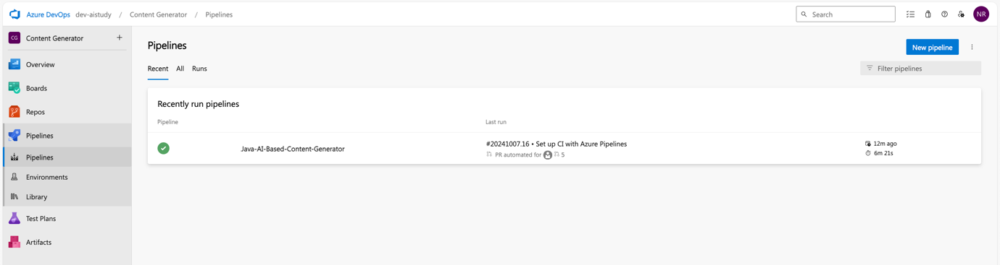

2. **Select the Pipeline:** Choose the pipeline you configured.

    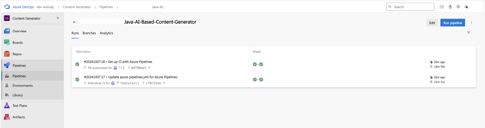

3. **Run Pipeline:** Click on **Run pipeline** and monitor the execution.

    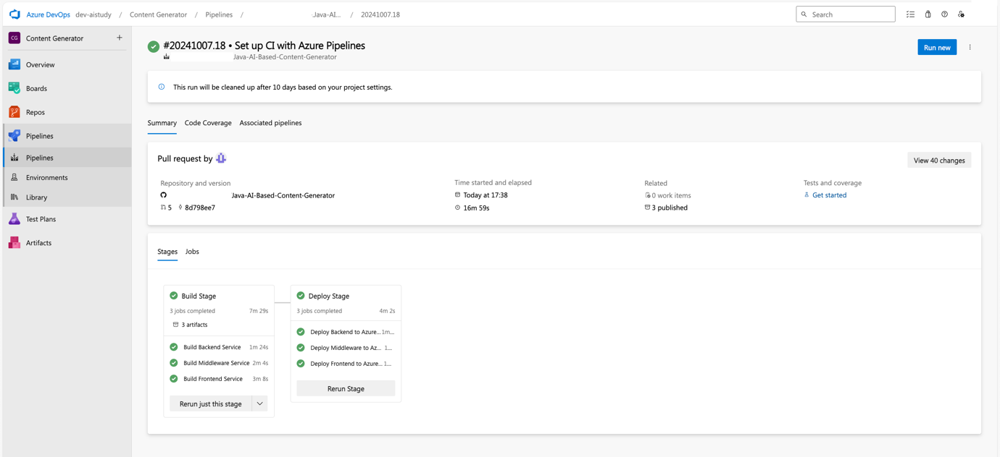

4. **Monitor Job Logs:** View the logs for each stage to ensure there are no errors.

    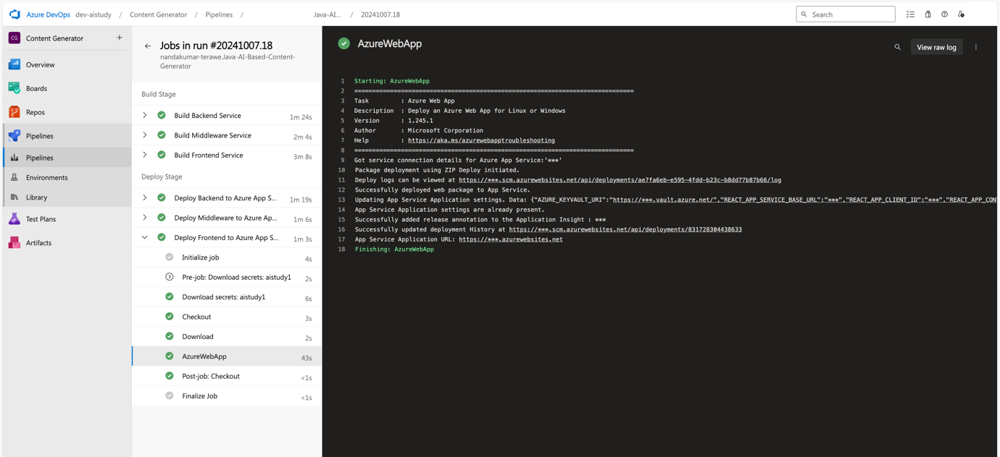

:::info
Join live experts to dive into [operational excellence with AKS](https://aka.ms/learn-live/ep3?ocid=biafy25h1_30daysofia_webpage_azuremktg).
:::

## Conclusion

In this blog, we explored how to set up a CI/CD pipeline for Java and ReactJS applications using Azure DevOps. We integrated GitHub, configured variable groups, and deployed to both Azure App Service and AKS. Testing the pipeline ensures that the setup works end-to-end.

## Next

In the next blog, we’ll cover advanced topics such as monitoring and scaling these deployments.