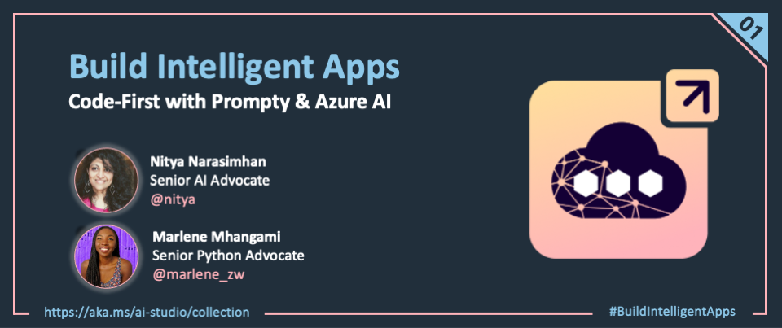
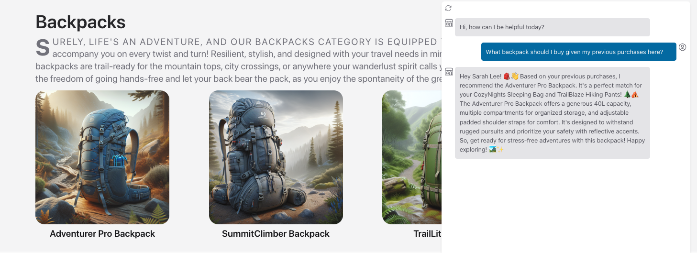
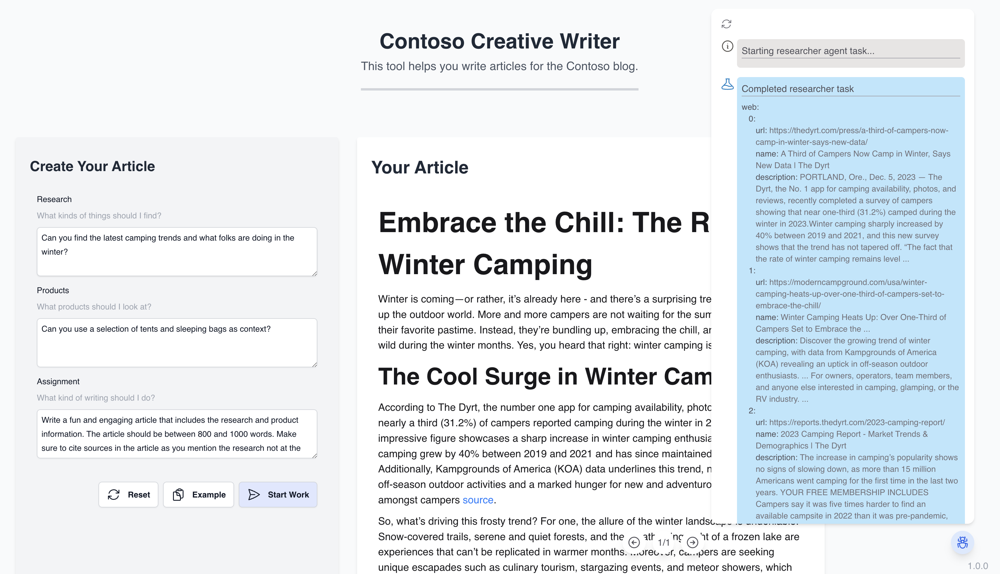
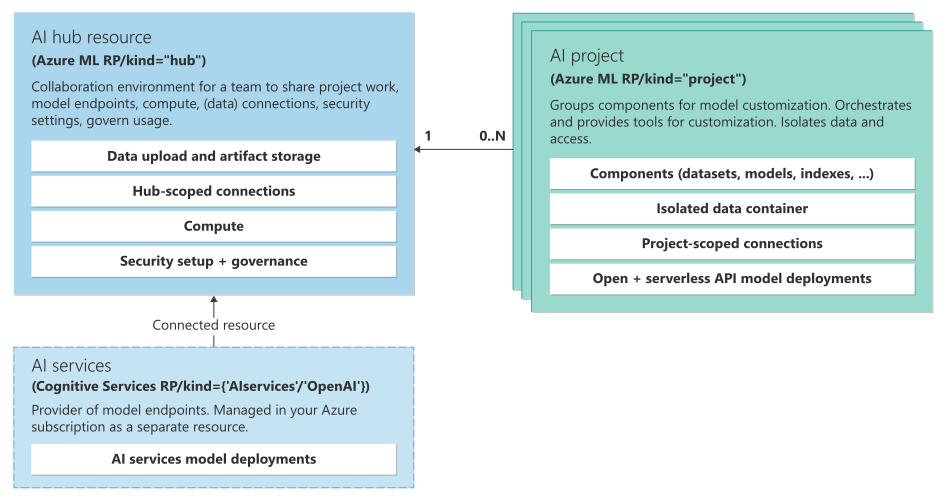
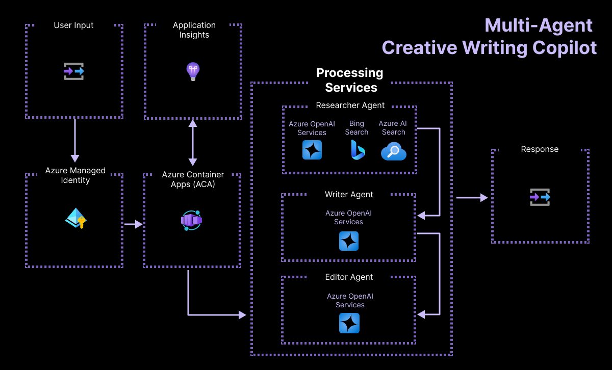

<head> 
  <meta property="og:url" content="https://azure.github.io/cloud-native/kicking-off-azure-ai-week"/>
  <meta property="og:type" content="website"/>
  <meta property="og:title" content="**Build Intelligent Apps | AI Apps on Azure"/>
  <meta property="og:description" content="Join us for a week of posts as we walk through two signature application samples that teach you how to deliver generative AI solutions using Prompty for ideation, Azure AI Studio for development, and Azure Container Apps for deployment."/>
  <meta property="og:image" content="https://github.com/Azure/Cloud-Native/blob/main/website/static/img/ogImage.png"/>
  <meta name="twitter:url" content="https://azure.github.io/Cloud-Native/kicking-off-azure-ai-week" />
  <meta name="twitter:title" content="**Build Intelligent Apps | AI Apps on Azure" />
  <meta name="twitter:description" content="Join us for a week of posts as we walk through two signature application samples that teach you how to deliver generative AI solutions using Prompty for ideation, Azure AI Studio for development, and Azure Container Apps for deployment." />
  <meta name="twitter:image" content="https://azure.github.io/Cloud-Native/img/ogImage.png" />
  <meta name="twitter:card" content="summary_large_image" />
  <meta name="twitter:creator" content="@devanshidiaries" />
  <link rel="canonical" href="https://azure.github.io/Cloud-Native/kicking-off-azure-ai-week" />
</head>

<!-- End METADATA -->

Welcome to Day 1️⃣ of Azure AI Week on the #30 Days Of IA series!

Want to build a custom copilot with more control over every step of the end-to-end workflow from prompt to production? Join us for a week of posts as we walk through **two signature application samples** that teach you how to deliver generative AI solutions using [Prompty](https://prompty.ai) for ideation, [Azure AI Studio](https://aka.ms/aistudio/docs?ocid=biafy25h1_30daysofia_webpage_azuremktg) for development, and [Azure Container Apps](https://aka.ms/containerapps?ocid=biafy25h1_30daysofia_webpage_azuremktg) for deployment.

Ready? Let's get started!

## What We'll Cover Today

- **What are we building?** - Let's talk about the application scenarios.
- **How are we building it?** - Let's discuss the app architecture.
- **What tasks do I need to do?** - Let's review the end-to-end developer workflow.
- **The Week Ahead** - Let's preview the week's content.
- **Call To Action** - Take these 3 actions to skill up on Azure AI!
 
---  

When we begin any application development journey, we start with _design_ before proceeding to _development_ and _delivery_ of the solution. For the design phase, we focus on three questions:

1. **App Scenario**: What use cases and interaction flows should we support?
2. **App Architecture**: What resources do we need to build the application?
3. **App Lifecycle**: What is our end-to-end workflow from prompt to production?

We can then think about development and delivery requirements from three perspectives:
 
 - **Design Patterns**: How do we orchestrate our workflow for efficiency?
 - **Developer Experience**: What tools do we use to streamline the process?
 - **Responsible AI**: What principles & practices do we need for trustworthy AI?

This week, we'll explore these questions with two distinct AI applications that will demonstrate the power and versatility of the Azure AI platform for building intelligent applications. 

## 1. What are we building?

Our first application is [**Contoso Chat**](https://aka.ms/aitour/contoso-chat/), a custom copilot that uses the *Retrieval Augmented Generation* pattern (RAG) to ground responses in your data. The second application is [**Contoso Creative Writer**](https://github.com/Azure-Samples/Contoso-Creative-Writer), a content publishing assistant that uses the *Multi-Agent Conversation* pattern to coordinate and execute multiple tasks autonomously, on behalf of the user. Let's look at each.

### 1.1 Contoso Chat 

The Contoso Chat app scenario involves a retail company ("Contoso Outdoors") that sells hiking and camping gear to outdoor enthusiasts via their website. The company wants to build and integrate a custom copilot that can help customers ask questions about their product catalog, and receive recommendations based on their previous purchases. This requires the copilot to _ground responses in the retailer's product catalog and customer orders data_ for quality responses.

### 1.2 Contoso Creative Writer 

The Contoso Creative Writer app scenario involves a content authoring assistant that can help the company's marketing team quickly assemble and publish content for their product blog. The company needs these articles to be grounded in the product data, but expand on key themes to create compelling narratives for their readers that would motivate more relevant purchases. This requires agentic workflows that can execute tasks concurrently (research topic, find products) and coordinate them autonomously (write content, review for publication) to streamline content creation workflows at scale.

## 2. How are we building it?

Building generative AI applications requires developers to _choose_ relevant models, _deploy_ them for use, and _orchestrate_ their interactions with other services to deliver a complete solution that meets quality and safety requirements. 

The [Azure AI Studio](https://aka.ms/aistudio/docs?ocid=biafy25h1_30daysofia_webpage_azuremktg) platform provides a _unified experience_ for developers to complete this workflow end-to-end, using a web portal, CLI, or SDK. The **Azure AI Studio architecture** involves the three resources shown below - a _hub_ for administration, a _project_ for development and _services_ that provide model endpoints for invocation. Learn more [here](https://learn.microsoft.com/azure/ai-studio/concepts/architecture?ocid=biafy25h1_30daysofia_webpage_azuremktg).

The **AI Application Architecture** builds on this foundation, implementing the required design patterns that define the application's behavior. This typically involves orchestrating interactions between the Azure AI platform resources and third party services, to deliver end-to-end user experience as shown in the examples below. Let's take a look.

### 2.1 Contoso Chat 

The figure shows the AI Application Architecture for the Contoso Chat sample.

The application is deployed as a hosted endpoint in Azure Container Apps, using Azure Managed Identity for keyless authentication. The user request ("prompt") is received at this endpoint, and processed in three steps:

1. The _prompt query is expanded_ to extract relevant product query terms
1. The expanded query is sent to Azure AI Search to _retrieve relevant product documents_
1. The original query is also sent to Azure Cosmos DB to _retrieve relevant customer profile data_

The results from the last two steps provide _grounding data_ that shapes the "enhanced prompt" we then dispatch to the Azure OpenAI _chat_ model. The generated response is then returned to the user. This workflow requires _orchestration_ of invocations to both the AI models (embeddings, chat) and the data retrieval services (search index, customer database) for each request.

### 2.2 Contoso Creative Writer 

The figure shows the AI Application Architecture for the Contoso Creative Writer sample.

Similar to Contoso Chat, the application is deployed as a hosted endpoint in Azure Container Apps, using Azure Managed Identity for keyless authentication - with App Insights for monitoring app performance. The difference is in the _orchestration_ required for processing the user request ("prompt") in this application.

1. The prompt query is expanded to extract relevant topic query terms and relevant products retrieved using Bing Search and Azure AI Search.
1. The expanded query is sent to a "Writer Agent" (chat model) which uses the provided query and grounding context to generate a draft article based on the designed prompt template.
1. The draft article is then sent to an "Editor Agent" (chat model) which assesses the article for acceptance based on the designed prompt template.

An approved article is then published as a blog post. The user interface allows you to view the progression of these tasks visually, to get an intuitive sense for multi-agent coordination.

## 3. What tasks do I need to do?

We know the application architecture to implement, and we know the infrastructure requirements for building on. But we still need to understand the _end-to-end_ developer workflow that will help us go from initial prototype to production-ready solution. 

This is where the **GenAIOps** lifecycle comes in. Because generative AI applications rely on _natural language processing_ and _pre-trained models_, they need additional steps to ensure that responses meet quality and safety standards for the diverse real-world prompts they will encounter. The application lifecycle now looks something like this, with three main stages:

1. **Ideation** - go from prompt to prototype, and validate with a test input.
1. **Evaluation** - go from prototype to production-ready by validating with larger test input set.
1. **Operationalization** - deploy for real-world use, and monitor for cost and performance.

From a practical development perspective, we can map these many steps in the workflow shown below, highlighting the key task to be performed and the tool best-suited for that task. We'll look at these in more detail in the next few posts this week.

But, to deliver **trustworthy AI solutions**, we also need to consider security, privacy, and safety requirements for the application. In the last row above, we highlight key features or practices that enable a Responsible AI approach to development. These range from practical considerations (like using curated models from trusted providers) to more complex features (like evaluation, safety systems, and managed identity) that add layers of protection to the application across the development lifecycle.

## 4. The Week Ahead!

We'll explore these in more detail in the next few posts, as we build and deploy the Contoso Chat and Contoso Creative Writer applications using the Azure AI platform. Here's what to expect: 

- [**Day 1:**](#1-what-are-we-building) Kickoff Post - What are we building?
- [**Day 2:**](https://azure.github.io/Cloud-Native/30-days-of-ia-2024/provision-with-azd) Provision With AZD - Setup for development.
- [**Day 3:**](https://azure.github.io/Cloud-Native/30-days-of-ia-2024/ideate-with-prompty) Ideate with Prompty - Prompt Engineering & Data Grounding
- [**Day 4:**](https://azure.github.io/Cloud-Native/30-days-of-ia-2024/evaluate-with-ai) Evaluate with AI - Custom Evaluators & AI-Assisted Scoring
- **Day 5:** Deploy with ACA - Operationalization & Monitoring

We'll start our journey tomorrow by provisioning Azure resources (_Infrastructure as code_) and setting up our development environment (_Configuration as code_) in a manner that enables consistent and reproducible usage across teams.

## 5. Call To Action

:::info
Want to get hands-on experience building intelligent apps on Azure? 
:::

Take these actions today, to jumpstart your skilling journey:

- [Register for Microsoft AI Tour](https://aka.ms/aitour?ocid=biafy25h1_30daysofia_webpage_azuremktg) - join an instructor-led workshop session.
- [Register for Microsoft Ignite](https://ignite.microsoft.com/sessions?ocid=biafy25h1_30daysofia_webpage_azuremktg) - look for related lab & breakout sessions on Azure AI.
- [Browse the AI Templates Collection](https://aka.ms/azd-ai-templates?ocid=biafy25h1_30daysofia_webpage_azuremktg) - explore samples for new frameworks and scenarios.