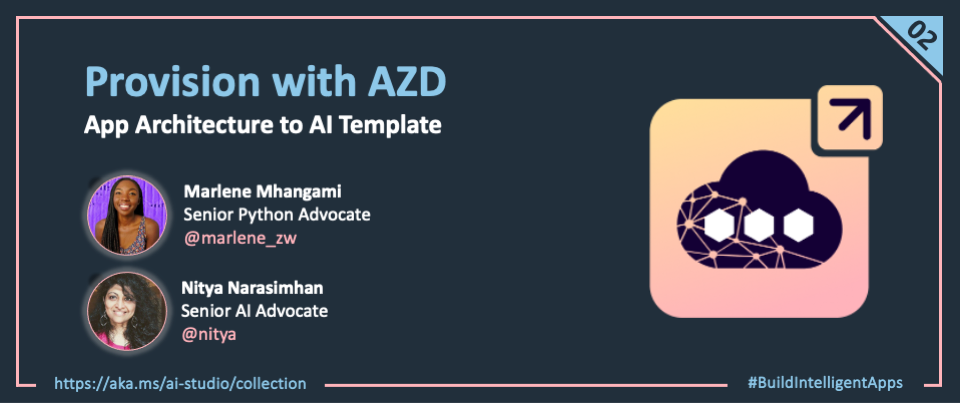

<head> 
  <meta property="og:url" content="https://azure.github.io/cloud-native/provision-with-azd"/>
  <meta property="og:type" content="website"/>
  <meta property="og:title" content="**Build Intelligent Apps | AI Apps on Azure"/>
  <meta property="og:description" content="We'll kick off our developer journey by provisioning the necessary resources for our applications - and setting up our development environment."/>
  <meta property="og:image" content="https://github.com/Azure/Cloud-Native/blob/main/website/static/img/ogImage.png"/>
  <meta name="twitter:url" content="https://azure.github.io/Cloud-Native/provision-with-azd" />
  <meta name="twitter:title" content="**Build Intelligent Apps | AI Apps on Azure" />
  <meta name="twitter:description" content="We'll kick off our developer journey by provisioning the necessary resources for our applications - and setting up our development environment." />
  <meta name="twitter:image" content="https://azure.github.io/Cloud-Native/img/ogImage.png" />
  <meta name="twitter:card" content="summary_large_image" />
  <meta name="twitter:creator" content="@devanshidiaries" />
  <link rel="canonical" href="https://azure.github.io/Cloud-Native/provision-with-azd" />
</head>

<!-- End METADATA -->

Welcome to Day 2️⃣ of Azure AI Week on the #30DaysOfIA series!

_Yesterday_, we introduced the two application scenarios we'll be building this week. _Today_, we'll kick off our developer journey by provisioning the necessary resources for our applications - and setting up our development environment.

Ready? Let's get started!

## What We'll Cover Today

- **Setup Dev Environment** - with GitHub Codespaces (configuration as code).
- **Provision Azure Resources** - with Azure Developer CLI (infrastructure as code).
- **Validate Infrastructure** - verify Azure AI App Architecture setup
- **Validate App Deployment** - verify Azure Container Apps setup
- **What's Next** - Ideating with Prompty

---  

Yesterday, we introduced our two application scenarios, and showed this simplified diagram of the end-to-end developer workflow that we will be walking through this week. Today, we focus on the first two tasks (provision infrastructure, setup dev environment) and the respective tools (Azure Developer CLI, GitHub Codespaces) that will help us complete them.

The challenge in here is that these tasks need to be completed in a **consistent and repeatable way** that can be version controlled, to support collaborative and fast-moving teams. We achieve this by adopting two familiar practices, with relevant tooling:

- **Configuration as Code** uses the [devcontainer](https://containers.dev) specification to define the development environment in a file that can be checked in alongside the codebase. You can now launch GitHub Codespaces on the repo and get a pre-built environment with all dependencies installed, in a consistent way for all team members.
- **Infrastructure As Code** uses Bicep and the [azd-template](https://aka.ms/awesome-azd) format, to describe a solution architecture in a standardized way (`azure.yaml` + `infra/`) that can be checked in alongside the codebase. You can provision and deploy the solution with a single `azd up` command, in a consistent way for all team members.

Let's see this in action by getting started with our development workflow.

## 1. Configuration As Code

:::info
_In this section, we'll fork the sample repo to our personal profiles - then launch GitHub Codespaces to activate that environment with a Visual Studio Code editor, right in the browser._.
:::

Both our application samples use a Python development runtime and require specific Visual Studio Code extensions (e.g., `Prompty`) and commandline tools (e.g., `az`, `azd`, `fastapi`) to be installed for development. To simplify developer setup, we configured each repository with a `devcontainer.json` file that you can activate by launching GitHub Codespaces. 

### 1.1 Fork Repo In GitHub

To get started, fork the relevant sample repository to your personal GitHub account. This gives you a copy of the repository that you can experiment with and customize later, without affecting the original source.

1. **Navigate to** your chosen sample Github repository:

    | Contoso Chat   | Contoso Creative Writer  |
    | -------- | ------- |
    | [https://aka.ms/aitour/contoso-chat](https://aka.ms/aitour/contoso-chat) | [https://aka.ms/aitour/contoso-creative-writer](https://github.com/Azure-Samples/contoso-creative-writer)   |

2. **Sign into** GitHub. If you don't have a Github account you can create one [here](https://docs.github.com/en/get-started/start-your-journey/creating-an-account-on-github). 
3. **Click Fork** on the top-right corner of the repo, to create a personal copy. 
4. **Uncheck `main only`** and click **Create Fork** to complete the action.

    * You should now be at the page `https://github.com/YOURUSERNAME/contoso-{chat or creative-writer}` within your own GitHub account.
   
    * You now have a copy (known as a fork) of this workshop repository in your own GitHub account! Feel free to play with it, you won't break anything.

:::note "You have successfully forked the repository!"
:::

### 1.2 Launch GitHub Codespaces 

_GitHub Codespaces provides a generous free quota for personal accounts that is more than sufficient for this lab. Make sure to delete the Codespaces after the workshop to conserve quota._

This activates the `devcontainer.json` configuration, launching a docker container in the cloud with all relevant tools and dependencies pre-installed. And, it opens a new browser tab with a Visual Studio Code editor connected remotely to that container - making it possible to work on the repsitory from anywhere, without worrying about hardware or software setup.

1. **Navigate to** your forked repository in the browser.
1. Click the green **&lt;&gt; Code** button in the top-right part of the page
1. Click the **Codespaces** tab
1. Click **Create codespace on main** button

This will launch a new browser tab and load the dev environment. In a few minutes, you should see the Visual Studio Code editor with the project files loaded.

:::note
"You have notefully setup the dev environment!"
:::

## 2. Infrastructure As Code

:::info
_In this section, we'll authenticate with Azure from Visual Studio Code, then use the Azure Developer CLI to activate our `azd template`, provisioning resources and deploying the application with a single command._
:::

Both our application samples are instrumented as [azd-templates](htts://aka.ms/awesome-azd) with the main configuration defined in `azure.yaml` and related resources defined as Bicep files under `infra/`. All we need to do is call `azd up` and wait. In a short timeframe, the tool has provisioned the infrastructure, deployed our application, populated the data, and updated our local environment with the environment variables - with no added effort from us. Let's try it!

### 2.1 Authenticate with Azure

In the previous step, you would have started working with one of the samples and have it running in a GitHub Codespaces, with a Visual Studio Code editor open in the browser. **Open a terminal window** and follow these steps to authenticate key tools with Azure.

1. Authenticate with Azure CLI
    - run: `az login --use-device-code` 
    - follow instructions and complete auth workflow
    - select the valid Azure subscription and tenant to use
1. Authenticate with Azure Developer CLI
    - run: `azd auth login --use-device-code`
    - follow instructions and complete auth workflow 
    - You should see: "Logged in to Azure"

**Note:** If you are using a multi-tenant account, you will need to add the tool-specific option to identify the tenant ID you are targeting.

:::note
"You have successfully authenticated with Azure!"
:::

### 2.2 Provision with AZD

You are now ready to provision the resources and deploy the application, effectively delivering the solution architecture with one step. **Start with the same terminal used above, to get an authenticated session.**

1. Type `azd up` - and follow the prompts:
    1. Enter a new environment name - use `rg-ENVNAME`
    2. Select a subscription - pick the same one you used to login
    3. Select a location that has the resources (e.g., model quota) you need:
        - `canadaeast` for _Contoso Creative Writer_  
        - `francecentral` for _Contoso Chat_. 
    4. You should see: _"You can view detailed progress in the Azure Portal ..."_

This can take about 15-20 minutes to complete. You can monitor the progress in the Azure Portal, under the resource group `rg-ENVNAME` that was created. When completed, you should see a "SUCCESS" message in the terminal.

:::note "You have successfully provisioned the app!
:::

## 3. Validate Infrastructure

:::info
_In this section, we'll look at each application sample independently, to verify that the infrastructure and application have been correctly provisioned for that scenario._
:::

We can now validate each sample to make sure everything works as expected. Let's first validate the infrastructure and the deployed application. 

### 3.1 Contoso Chat
1. Visit the Azure Portal - look for the `rg-ENVNAME` resource group created above
2. Click the Deployments link in the Essentials section - wait till all are completed.
3. Return to Overview page - you should see: 35 deployments, 15 resources
4. Click on the Azure CosmosDB resource in the list
    - Visit the resource detail page - click "Data Explorer"
    - Verify that it has created a customers database with data items in it
5. Click on the Azure AI Search resource in the list
    - Visit the resource detail page - click "Search Explorer"
    - Verify that it has created a contoso-products index with data items in it
6. Click on the Azure Container Apps resource in the list
    - Visit the resource detail page - click Application Url
    - Verify that you see a hosted endpoint with a Hello World message on page
7. Next, visit the Azure AI Studio portal
- Sign in - you should be auto-logged in with existing Azure credential
- Click on All Resources - you should see an AIServices and Hub resources
- Click the hub resource - you should see an AI Project resource listed
- Click the project resource - look at Deployments page to verify models

:::note "Congratulations! - Your Contoso Chat Infrastructure is Ready!"
:::

### 3.2 Contoso Creative Writer
1. Visit the Azure Portal - look for the rg-ENVNAME resource group created above
2. Click the Deployments link in the Essentials section - wait till all are completed.
3. Click on the Azure AI Search resource in the list
    - Visit the resource detail page - click "Search Explorer"
    - Verify that it has created a contoso-products index with data items in it
4. Click on the Azure Container Apps resource in the list
    - Visit the resource detail page - click Application Url
    - Verify that you see a the Contoso Creative Writer Application. 
5. Next, visit the Azure AI Studio portal
- Sign in - you should be auto-logged in with existing Azure credential
- Click on All Resources - you should see an AIServices and Hub resources
- Click the hub resource - you should see an AI Project resource listed
- Click the project resource - look at Deployments page to verify models

:::note
"Congratulations! - Your Contoso Creative Writer Infrastructure is Ready!"
:::

## 4. Validate Deployment

In both the samples, the `azd up` deploys the application to an Azure Container App resource as a _FastAPI_ application with a hosted API endpoint. This comes with a built-in `/docs` route that provides a Swagger API test page, allowing you to interact with the application and verify that it works as expected. **Let's validate this for the respective samples.**

### 4.1 Contoso Chat

1. Visit the ACA resource page - click on Application Url to view endpoint
1. Add a /docs suffix to default deployed path - to get a Swagger API test page
1. Click Try it out to unlock inputs - you see question, customer_id, chat_history
1. Enter the following values:
    - **Question** = "Tell me about the waterproof tents"
    - **customer_id** = 2
    - **chat_history** = []
1. Click Execute to see results: 
    - You should see a valid response with a list of tents 
    - The results should match items in the product catalog, with added details

:::note
"Congratulations! - Your Contoso Chat Deployment Works!"
:::

### 4.2 Contoso Creative Writer

1. The link to the deployed application should have been printed to your terminal after running azd up. If you don't see it, scroll up in your terminal until you do. _You can also find the link by visiting the ACA resource page - click on Application Url_.
1. Click the `Example` button to add some example data 
1. Click the `Start Work` button to run the app. 
1. Click the small bug button (bottom left of page) to see agents and tasks completed
1. You should also see an article being generated and streamed on the page. 

:::note
"Congratulations! - Your Contoso Creative Writer Deployment Works!"
:::

## 5. What's Next

We've setup our development environment and successfully provisioned our resources and deployed our application to make sure the codebase works as expected. It's time for us to  **deconstruct** these samples and learn how they were built - so we can reproduce this for our own application scenarios and projects.

In our next post, we'll move on to the **IDEATE** stage of the workflow and learn to use an asset called Prompty to help us go from prompt to prototype in a few simple steps.

## 6. Call To Action

:::info
Want to get hands-on experience building intelligent apps on Azure?
:::

Take these actions today, to jumpstart your skilling journey:

  - [Register for Microsoft AI Tour](https://aka.ms/aitour?ocid=biafy25h1_30daysofia_webpage_azuremktg) - join an instructor-led workshop session.
  - [Register for Microsoft Ignite](https://ignite.microsoft.com/sessions?ocid=biafy25h1_30daysofia_webpage_azuremktg) - look for related lab & breakout sessions on Azure AI.
  - [Browse the AI Templates Collection](https://aka.ms/azd-ai-templates?ocid=biafy25h1_30daysofia_webpage_azuremktg) - explore samples for new frameworks and scenarios.
