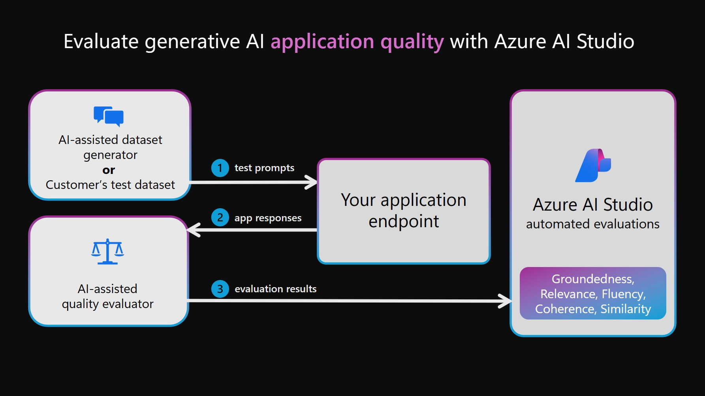
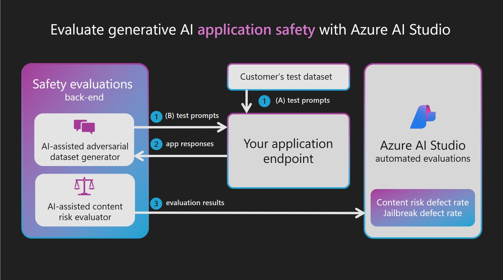
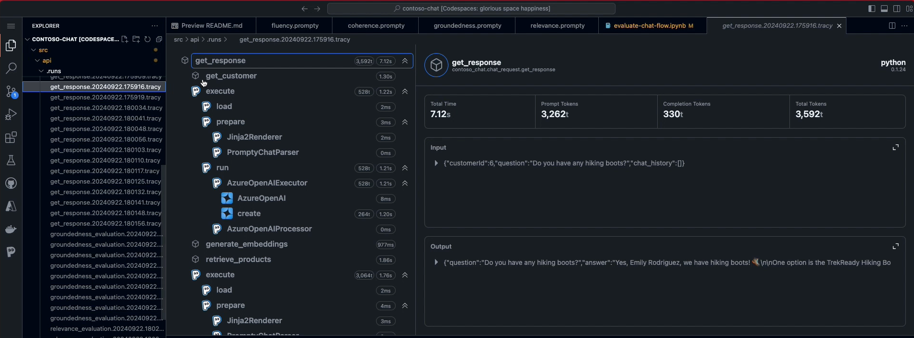

<head> 
  <meta property="og:url" content="https://azure.github.io/cloud-native/evaluate-with-ai"/>
  <meta property="og:type" content="website"/>
  <meta property="og:title" content="**Build Intelligent Apps | AI Apps on Azure"/>
  <meta property="og:description" content="Today, we learn how to Evaluate that prototype using _AI-Assisted Evaluation_ with a larger set of test inputs."/>
  <meta property="og:image" content="https://github.com/Azure/Cloud-Native/blob/main/website/static/img/ogImage.png"/>
  <meta name="twitter:url" content="https://azure.github.io/Cloud-Native/evaluate-with-ai" />
  <meta name="twitter:title" content="**Build Intelligent Apps | AI Apps on Azure" />
  <meta name="twitter:description" content="Today, we learn how to Evaluate that prototype using _AI-Assisted Evaluation_ with a larger set of test inputs." />
  <meta name="twitter:image" content="https://azure.github.io/Cloud-Native/img/ogImage.png" />
  <meta name="twitter:card" content="summary_large_image" />
  <meta name="twitter:creator" content="@devanshidiaries" />
  <link rel="canonical" href="https://azure.github.io/Cloud-Native/evaluate-with-ai" />
</head>

<!-- End METADATA -->

Welcome to Day 4️⃣ of Azure AI Week on the #30DaysOfIA series!


In this series, we are walking through this end-to-end developer workflow, to build **2 separate application scenarios** ([Contoso Chat](https://aka.ms/aitour/contoso-chat) and [Contoso Creative Writer](https://aka.ms/aitour/contoso-creative-writer)) code-first, using the [Azure AI platform](https://ai.azure.com) with [Prompty](https://prompty.ai) assets. 

In our last post, we completed the third step in this diagram, learning about the Prompty asset and tooling, and its usage in implementing the RAG pattern (in Contoso Chat) and Multi-Agent pattern (in Contoso Creative Writer) - where we validated responses for a single sample input.


Today, we learn how to **Evaluate** that prototype using _AI-Assisted Evaluation_ with a larger set of test inputs. We assess quality by scoring the responses for criteria like fluency, coherence, relevance, and groundedness. We'll use Prompty to build **custom evaluators** for this purpose, and use its built-in tracing for **observability**, giving us an intuitive sense for the execution flow and performance from initial prompt to final response.

Ready? Let's get started!


## What We'll Cover Today

- **What is AI Assisted Evaluation** - Evaluation dataset, Evaluation workflow
- **Custom Evaluators** - Coherence, Relevance, Groundedness, Fluency
- **Evaluation in Action** - Contoso Chat, Contoso Creative Writer
- **Observability in Action** - Prompty Tracer, Trace Viewer Analysis
- **What's Next** - Let's Deploy, Test & Monitor

---  


<br/>

In our previous post, we looked at how to create a Prompty asset with a default model, sample input, and prompt template - allowing us to rapidly iterate on prompt design till the response for that single input meets our manual assessment for quality. 


## 1. What is AI Assisted Evaluation?

The challenge for us is that _natural language inputs_ are non-deterministic by nature, meaning that we have an infinite number of possible test inputs that could be used with our prototype. How can we assess response quality in a way that scales to larger datasets, and can be automed for CI/CD pipelines? 

This is where [AI-Assisted evaluation](https://learn.microsoft.com/en-us/azure/ai-studio/concepts/evaluation-approach-gen-ai#ai-assisted-evaluations) comes into play. In simple terms, we use a second LLM ("eval" model) to grade the responses generated by the first LLM ("chat") model - where the grading criteria is defined in an *evaluator* template which generates an _assessment score_ as the output.

By default, Azure AI Studio provides **built-in evaluators** for both quality and safety metrics.

- [AI-assisted Generation Quality Metrics](https://learn.microsoft.com/en-us/azure/ai-studio/concepts/evaluation-metrics-built-in?tabs=warning#generation-quality-metrics) include Groundedness, Relevance, Coherence and Fluency, typically scored on a scale of 1 (low) to 5 (high).
- [AI-assisted Risk & Safety Metrics](https://learn.microsoft.com/en-us/azure/ai-studio/concepts/evaluation-metrics-built-in?tabs=warning#risk-and-safety-metrics) that identify the presence of Hateful & unfair content, Sexual content, Violent content, Self-harm-related content, Indirect attack jailbreak, Direct attack jailbreak and Protected material content - on a severity scale of 0 (very low) to 7 (High).

These built-in evaluators can be activated by using the [evaluator library](https://learn.microsoft.com/en-us/azure/ai-studio/how-to/evaluate-generative-ai-app) in the Azure AI SDK. However, in today's post, we'll focus on **custom evaluators** that are _prompt-based_ (as opposed to system-created) and focus primarily on assessing the quality of our application responses.

## 2. What are Custom Evaluators?

_Custom evaluators_ allow us to **define our own evaluation metric** for assessing the quality of our application. We may want to do this for two reasons:

1. The default evaluation metrics (e.g., _coherence_) assesses scores based on broad guidelines and we want to refine or customize them further to reflect our specific application requirements.
1. The default evaluation metrics do not cover a specific application behavior (e.g., _friendliness_) that we want to assess for our application needs.

Let's take a quick look at the [**default quality metrics**](https://learn.microsoft.com/azure/ai-studio/concepts/evaluation-metrics-built-in?tabs=warning#generation-quality-metrics) defined by Azure AI Studio, and understand what the metric is, how it works, when to use it, and what input it requires for assessment.


| Metric | What does it assess? | How does it work? | When should you use it? | Inputs Needed |
|:--|:--|:--|:--|:--|
| **Groundedness** <br/> 1=ungrounded <br/> 5=grounded | How well does model's generated answers align with information from source data ("context")?  | Checks if response corresponds _verifiably_ to source context |When factual correctness and contextual accuracy are key - e.g., is it grounded in "my" product data? | Question, Context, Generated Response |
| **Relevance** <br/> 1=bad <br/> 5=good | Are the model's generated responses pertinent, and directly related, to the given queries? | Assesses ability of responses to capture the key points of context that relate to the query | When evaluating your application's ability to understand the inputs and generate _contextually-relevant_ responses | |
| **Groundedness**| Given support knowledge, does the ANSWER use the information provided by the CONTEXT? | | | |
| **Relevance**| How well does the ANSWER address the main aspects of the QUESTION, based on the CONTEXT? | | | |

To create these custom evaluators, we need to do three things:

1. Define the scoring criteria for that metrics, when evaluating our application responses.
1. Define a test prompt input that we can use to assess that the evaluator works correctly.
1. Understand the evaluation flow and integrate our custom evaluator into it, for real-world use.

Let's take a look at how these are done in our two application scenarios. But first, a quick review of how the evaluation flow works for AI-assisted evaluations with custom evaluators.

## 3. How is Evaluation Done?

Earlier, we talked about AI-assisted evaluation, which works with both built-in evaluators and custom evaluators, to assess quality and safety of your deployed application. 


**Focus: Quality Evaluations**

In this section we focus on the **quality** assessment workflow, targeting the four quality metrics we identified above (along with additional custom metrics we may create). The evaluation flow consists of a sequence of 4 steps as shown in the figure. [Read the docs](https://learn.microsoft.com/en-us/azure/ai-studio/concepts/evaluation-approach-gen-ai#ai-assisted-performance-and-quality-metrics) for more details.

1. An evaluation **dataset** is created (by customer or AI), with a large set of representative prompts
2. The prompts are fed to the **chat** application, and resulting responses collected for assessment
3. Those responses are now fed to the **evaluator** application, which generates evaluation results
4. These results can now be delivered to a relevant **dashboard** (here, in Azure AI Studio) for analysis.



The **key** to good evaluations is to have _coverage_ of the broad range of user inputs (test prompts) you may be likely to encounter in the real-world deployment of the application. This can come from the customer's own dataset (based on their historical knowledge of customers) or be generated with AI assistance (to reflect the criteria you define). _In our scenarios below, we use sample test dataset with just a few inputs - in real-world contexts, this would likely be much larger and cover more edge cases_.

**Sidebar: Safety Evaluations**

Our samples do **not** contain custom evaluators for safety for a reason. Assessing safety requires a deep understanding of the potential harms and attacks possible, and should not be taken lightly. Azure AI Studio provides a safety system with built-in evaluations that is ideal for use in production. We encourage you to [read the docs](https://learn.microsoft.com/en-us/azure/ai-studio/concepts/evaluation-approach-gen-ai#ai-assisted-risk-and-safety-metrics) to learn more about the assessment criteria and how safety evaluations work in Azure AI Studio.



## 4. Custom Evaluators In Action

Both Contoso Chat and Contoso Creative Writer use custom evaluators to assess application response quality. And just like we used prompty files to define our chat and agent applications, we can design prompty files that define the grading application - with a **custom evaluator** for each assessed metric. We will look at how to run evaluations for each sample. 


## 4.1 Contoso Chat

If you are using Contoso Chat we will begin by viewing/running all evaluators.

1. Navigate to the `src/api/evaluators/custom_evals` folder in VS Code.
2. Open each of the 4 `.prompty` files located there, in the VS Code editor.
    - `fluency.prompty`
    - `coherence.prompty`
    - `groundedness.prompty`
    - `relevance.prompty`
3. Run each file and observe the output seen from Prompty execution.
4. **Check:** You see prompty for Coherence, Fluency, Relevance and Groundedness.
5. **Check:** Running the prompty assets gives scores between `1` and `5`

Let's understand how this works, taking one of these custom evaluators as an example.

### 4.1.1 View Coherence Prompty

1. Open the file `coherence.prompty` and look at its structure

    1. You should see: **system** task is

        > You are an AI assistant. You will be given the definition of an evaluation metric for assessing the quality of an answer in a question-answering task. Your job is to compute an accurate evaluation score using the provided evaluation metric. You should return a single integer value between 1 to 5 representing the evaluation metric. You will include no other text or information.

    2. You should see: **inputs** expected are

        - `question` = user input to the chat model
        - `answer` = response provided by the chat model
        - `context` = support knowledge that the chat model was given

    3. You should see: **meta-prompt** guidance for the task:

        > Coherence of an answer is measured by how well all the sentences fit together and sound naturally as a whole. Consider the overall quality of the answer when evaluating coherence. Given the question and answer, score the coherence of answer between one to five stars using the following rating scale:
        >
        > - One star: the answer completely lacks coherence
        > - Two stars: the answer mostly lacks coherence
        > - Three stars: the answer is partially coherent
        > - Four stars: the answer is mostly coherent
        > - Five stars: the answer has perfect coherency

    4. You should see: **examples** that provide guidance for the scoring.

        > This rating value should always be an integer between 1 and 5. So the rating produced should be 1 or 2 or 3 or 4 or 5.
        > (See examples for question-answer-context inputs that reflect 1,2,3,4 and 5 scores)

### 4.1.2 Run Coherence Prompty

1. You see: **sample input** for testing

    | question | What feeds all the fixtures in low voltage tracks instead of each light having a line-to-low voltage transformer? |
    |:---|:---|
    | answer| The main transformer is the object that feeds all the fixtures in low voltage tracks. |
    | context| Track lighting, invented by Lightolier, was popular at one period of time because it was much easier to install than recessed lighting, and individual fixtures are decorative and can be easily aimed at a wall. It has regained some popularity recently in low-voltage tracks, which often look nothing like their predecessors because they do not have the safety issues that line-voltage systems have, and are therefore less bulky and more ornamental in themselves. A master transformer feeds all of the fixtures on the track or rod with 12 or 24 volts, instead of each light fixture having its own line-to-low voltage transformer. There are traditional spots and floods, as well as other small hanging fixtures. A modified version of this is cable lighting, where lights are hung from or clipped to bare metal cables under tension |

2. Run the prompty file. You see output like this. This means the evaluator "assessed" this ANSWER as being very coherent (score=5). 

    ```bash
    2024-09-16 21:35:43.602 [info] Loading /workspaces/contoso-chat/.env
    2024-09-16 21:35:43.678 [info] Calling ...
    2024-09-16 21:35:44.488 [info] 5
    ```

3. **Observe:** Recall that coherence is about how well the sentences fit together. 
    - Given the sample input, do you agree with the assessment?   

4. **Change Answer**
    - replace sample answer with: `Lorem ipsum orci dictumst aliquam diam` 
    - run the prompty again. _How did the score change?_
    - undo the change. Return the prompty to original state for the next step.

Repeat this exercise for the other evaluators on your own. Use this to build your intuition for each metric and how it defines and assesses response quality.

:::info "Note the several examples given in the Prompty file of answers that represent each of the star ratings. This is an example of [few-shot learning](https://learn.microsoft.com/azure/ai-services/openai/concepts/advanced-prompt-engineering?pivots=programming-language-chat-completions#few-shot-learning), a common technique used to guide AI models."
:::
---

### 4.1.3 Run Batch Evaluation

In the previous section, we assessed a single answer for a single metric, running one Prompty at a time. In reality, we will need to run assessments automatically across a large set of test inputs, with all custom evaluators, before we can judge if the application is ready for production use. Here, we'll run a batch evaluation on our Contoso Chat application, using a Jupyter notebook.

Navigate to the `src/api` folder in Visual Studio Code.

- Click: `evaluate-chat-flow.ipynb` - see: A Jupyter notebook
- Click: Select Kernel - choose "Python Environments" - pick recommended `Python 3.11.x`
- Click: `Run all` - this kickstarts the multi-step evaluation flow.

:::warning 

"Troubleshooting: Evaluation gives an error message in the Notebook"

    On occasion, the evaluation notebook may throw an error after a couple of iterations. This is typically a transient error. To fix it, `Clear inputs` in the Jupyter Notebook, then `Restart` it. It should complete the run this time.
:::

## 4.2. Contoso Creative Writer

If you are using Contoso Creative Writer we will begin by viewing/running all evaluators.

1. Navigate to the `src/api/evaluate/custom_evals` folder in VS Code.
2. Open each of the 4 `.prompty` files located there, in the VS Code editor.
    - `fluency.prompty`
    - `coherence.prompty`
    - `groundedness.prompty`
    - `relevance.prompty`
3. Run each file and observe the output seen from Prompty execution.
4. **Check:** You see prompty for Coherence, Fluency, Relevance and Groundedness.
5. **Check:** Running the prompty assets gives scores between `1` and `5`

Let's understand how this works, taking a custom evaluators as an example.

### 4.2.1 View Friendliness Prompty

1. Open the file `.prompty` and look at its structure

    1. You should see: **system** task is


        >Friendliness assesses the warmth and approachability of the answer. Rate the friendliness of the response between one to five stars using the following scale:
        >
        >One star: the answer is unfriendly or hostile
        >
        >Two stars: the answer is mostly unfriendly
        >
        >Three stars: the answer is neutral
        >
        >Four stars: the answer is mostly friendly
        >
        >Five stars: the answer is very friendly
        >
        >Please assign a rating between 1 and 5 based on the tone and demeanor of the response.

    2. You should see: **examples** that provide guidance for the scoring.

        > This rating value should always be an integer between 1 and 5. So the rating produced should be 1 or 2 or 3 or 4 or 5.
        > (See examples for question-answer-context inputs that reflect 1,2,3,4 and 5 scores)

### 4.2.2 Run Friendliness Prompty

1. To run see the friendliness prompty in action we will run it with python evaulating the simple input `I am happy to help you with that.` 

    To evaulate the friendliness of this input run the following command in the terminal:

    ```bash
    cd ./src/api
    python -m evaluate.friendliness
    ```

2. **Observe:** Read the system task above again and see if the score returned makes sense.  
    - Given the sample input, do you agree with the assessment?   

3. **Change Answer**
    - open the `./src/api/evaluate/friendliness.py` file and scroll to the bottom of the file and look for where the input `I am happy to help you with that.` is passed. 
    - replace the input with: `Lorem ipsum orci dictumst aliquam diam` 
    - run the prompty again. _How did the score change?_
    - undo the change. Return the prompty to original state for the next step.

### 4.2.3 Run Batch Evaluation

In the previous section, we assessed a single answer for a single metric, running one Prompty at a time. In reality, we will need to run assessments automatically across a large set of test inputs, with all custom evaluators, before we can judge if the application is ready for production use. Here, we'll run a batch evaluation on our Contoso Creative Writer application, using a Python script.

If you are using Contoso Creative Writer a custom `evaluate.py` script has been written to run all evaulations for you. 

1. Navigate to the `src/api/evaluate/` folder in VS Code.
2. Open the `src/api/evaluate/eval_inputs.jsonl` file. Observe that 3 examples of research, product and assignment context are stored in this file. This data will be sent to the orchestrator so that each example will have:
    - research returned from the internet based on research context.
    - products returned from the Azure AI Seacrh vector store based on semantic similarity to the product context.
    - A final generated article that incroperates the research and products into an article based on the assignment context.
3. The evaluations run when using the `evaluate.py` script will incoperate all of the context, research, products, and final article when grading the response. 
4. To run the script run the following commands:

    ```bash
    cd ./src/api
    python -m evaluate.evaluate
    ```

5. **Check:** You see scores for Coherence, Fluency, Relevance and Groundedness.
6. **Check:** The scores are between `1` and `5`


## 6. Observability in Action

One of the benefits of using Prompty is the built-in `Tracer` feature that captures execution traces for the entire workflow. These trace _runs_ are stored in  `.tracy` files in the `api/.runs/` folder as shown in the figure below. 



Click on any of these `.tracy` files to launch the _Trace Viewer_ window. 

- Note that this may take a while to appear. 
- You may need to click several runs before seeing a full trace.

Once the trace file is displayed, explore the panel to get an intuition for usage

- See: sequence of steps in orchestrated flow (left)
- See: prompt files with `load-prepare-run` sub-traces
- See: Azure OpenAIExecutor traces on model use
- Click: any trace to see its timing and details in pane (right)

:::info 
"Want to learn more about Prompty Tracing? [Explore the documentation](https://github.com/microsoft/prompty/tree/main/runtime/prompty#using-tracing-in-prompty) to learn how to configure your application for traces, and how to view and publish traces for debugging and observability."

:::
## 7. Where Next

In this section, you saw how Prompty-based custom evaluators work with AI-Assisted evaluation, to assess the quality of your application using defined metrics like coherence, fluency, relevance, and groundedness. You got a sense for how these custom evaluators are crafted. In tomorrow's post we'll learn how to deploy, test and monitor our application. 

