<head>
<meta property="og:url" content="https://azure.github.io/cloud-native/30-days-of-ia-2024/how-it-works-behind-the-scenes-of-our-ai-based-content-generation-app"/> 
<meta property="og:type" content="website"/> 
<meta property="og:title" content="**Build Intelligent Apps | AI Apps on Azure"/> 
<meta property="og:description" content="Join us on a learning journey to build intelligent apps on Azure. Read all about the upcoming #BuildIntelligentApps initiative on this post!"/>
<meta property="og:image" content="https://github.com/Azure/Cloud-Native/blob/main/website/static/img/ogImage.png"/> 
<meta name="twitter:url" content="https://azure.github.io/Cloud-Native/30-days-of-ia-2024/how-it-works-behind-the-scenes-of-our-ai-based-content-generation-app" /> 
<meta name="twitter:title" content="**Build Intelligent Apps | AI Apps on Azure" /> 
<meta name="twitter:description" content=" Join us on a learning journey to build intelligent apps on Azure. Read all about the upcoming #BuildIntelligentApps initiative on this post!” /> 
<meta name="twitter:image" content="https://azure.github.io/Cloud-Native/img/ogImage.png" /> 
<meta name="twitter:card" content="summary_large_image" /> 
<meta name="twitter:creator" content="@devanshidiaries" /> 
<link rel="canonical" href="https://azure.github.io/Cloud-Native/30-days-of-ia-2024/how-it-works-behind-the-scenes-of-our-ai-based-content-generation-app" /> 
</head> 

<!-- End METADATA --> 

Dive in to learn more about how our example application works at a technical level.   

## What we cover:

- A high-level architecture overview  
- A description of API calls made by the front-end app  
- An overview of the APIs offered by the middleware service  
- A walkthrough of the back-end service’s APIs and integration with other Azure services  

## Introduction

In the previous blog post, we gave you a high-level overview of our example AI-based content generation app, covering its user experience and how it integrated various services. Now we’d like to dive a little deeper into the technical side, explaining the app's architecture, key components, and code snippets and offering an overview of the app’s data flow.   

Today’s post breaks down how the **front-end**, **middleware**, and **back-end** services work together. We also discuss the how the app uses Azure services, like [Azure API Management](https://learn.microsoft.com/azure/api-management/api-management-key-concepts?ocid=biafy25h1_30daysofia_webpage_azuremktg), [Azure Key Vault](https://learn.microsoft.com/azure/key-vault/general/overview?ocid=biafy25h1_30daysofia_webpage_azuremktg), [Azure Cosmos DB](https://learn.microsoft.com/azure/cosmos-db/introduction?ocid=biafy25h1_30daysofia_webpage_azuremktg), [Azure Blob Storage](https://learn.microsoft.com/azure/storage/blobs/storage-blobs-introduction?ocid=biafy25h1_30daysofia_webpage_azuremktg), and [Azure OpenAI Service](https://learn.microsoft.com/azure/ai-services/openai/overview?ocid=biafy25h1_30daysofia_webpage_azuremktg), and how **managed identity** is used to securely connect these components.  

## 1. High-level architecture
The application is composed of three core services

1. **Front-end app (ReactJS based)**. A chat-based UI where users submit queries and receive AI-generated content  

2. **Middleware service (Java Spring Boot based)**. Responsible for content generation and handling product similarity searches  

3. **Back-end service (Java Spring Boot based)**. Handles customer and product data and computes product similarity using vectors  

### Architecture diagram
The architecture diagram shows the interaction between:  

**Front end -> Middleware Azure API Management endpoints -> Middleware service -> Back-end API Management endpoints -> Back end (Spring Boot)**.

How middleware and back-end services connect to **Azure Key Vault**, **Azure Cosmos DB**, **Azure Blob Storage**, and **Azure OpenAI**.

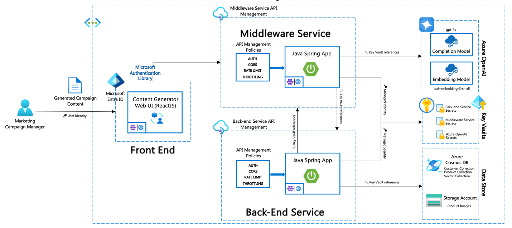

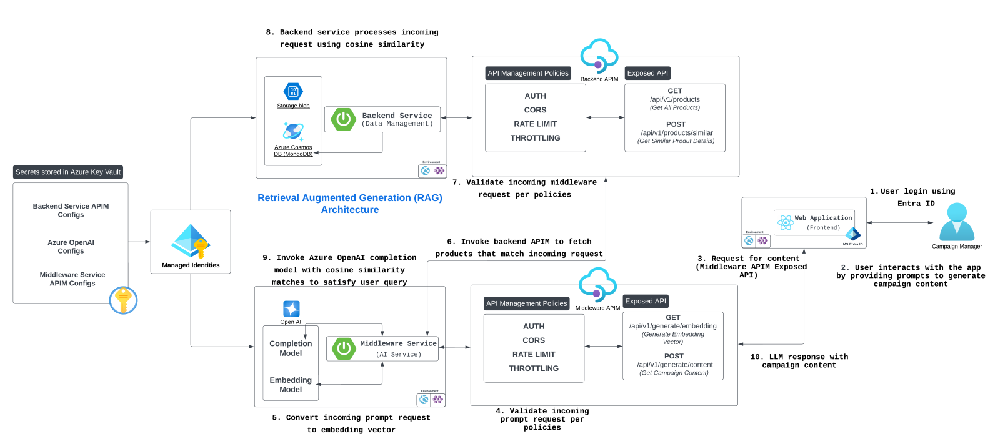

## 2. Front-end app

The **front end** acts as the interface between the user and the application. It allows the user to sign in, enter queries, and receive generated content.  

### Key components:

- **Sign-in and user identity management**. The front end uses identity management to authenticate users before they access the main chat functionality.  

    - Code snippet: User authentication logic uses the [**Microsoft Authentication Library (MSAL)**](https://learn.microsoft.com/entra/identity-platform/msal-overview?ocid=biafy25h1_30daysofia_webpage_azuremktg). (@azure/msal-browser)  

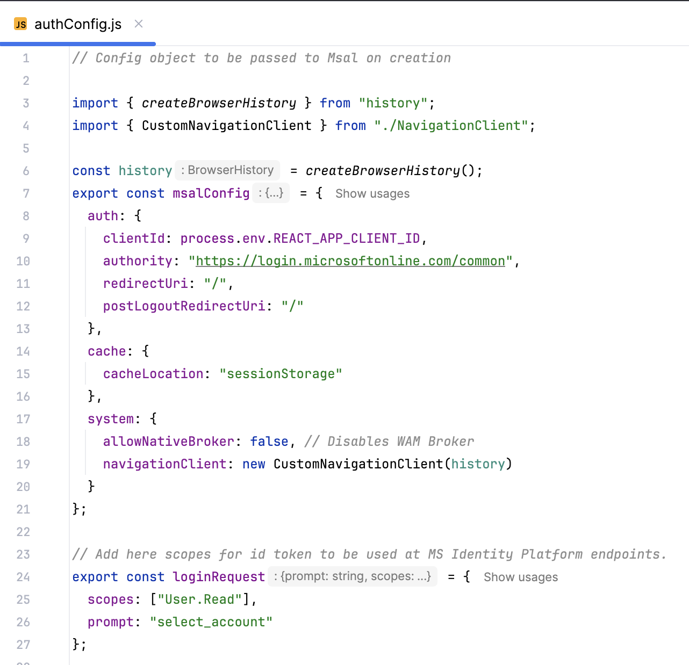

- **Chat interface**. After authentication, the user can interact with the chat interface. On form submission, the query is sent to the **Middleware API** through an **API Management endpoint**.

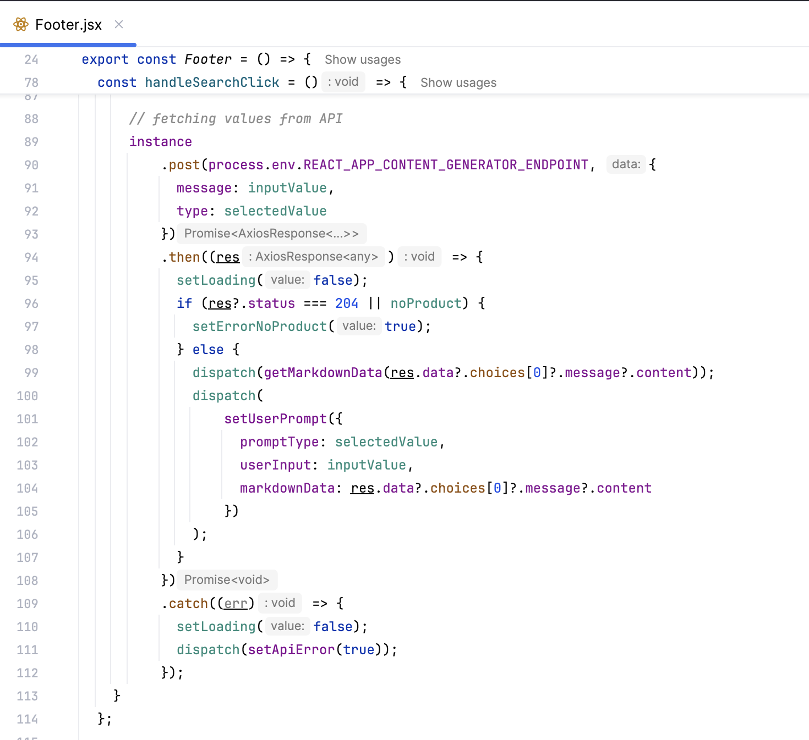

## 3. Middleware service 

The **middleware service** is the central hub for content generation and managing product similarity searches. It connects to **Azure OpenAI** for content generation and interfaces with the **back end** to retrieve product vectors.  

### Core APIs:

- **Generate content API**. This API receives the user’s query, generates an embedding vector, and calls Azure OpenAI to generate relevant content.  

 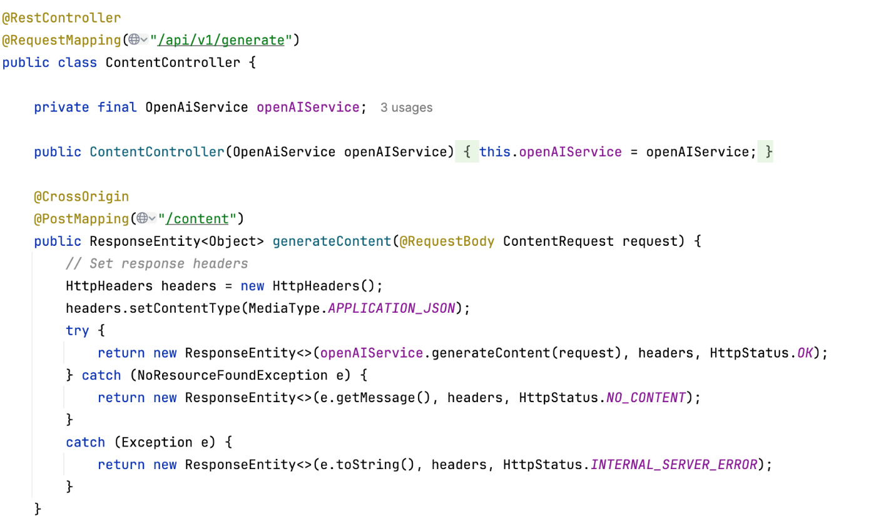

 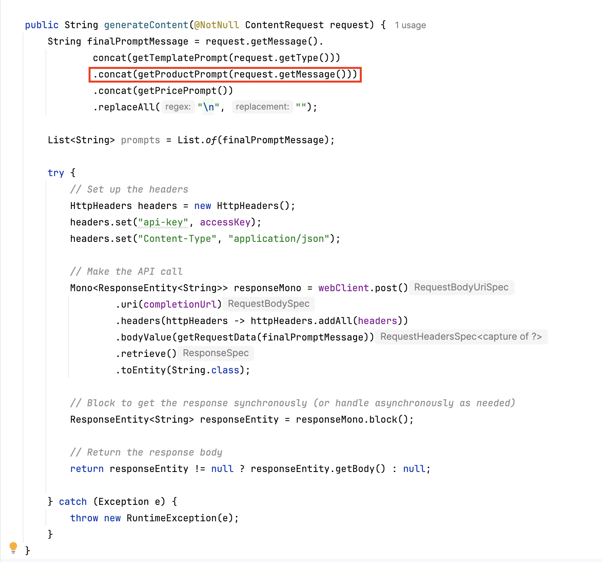

 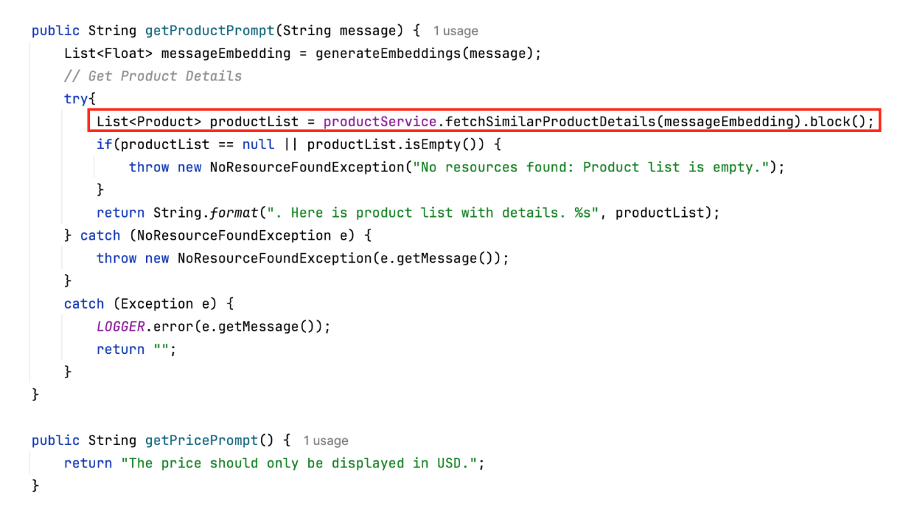

- **Generate embedding vector API**. Uses **OpenAI's embedding model** to transform the user query into an embedding vector that the **back-end** service can use for similarity matching.  

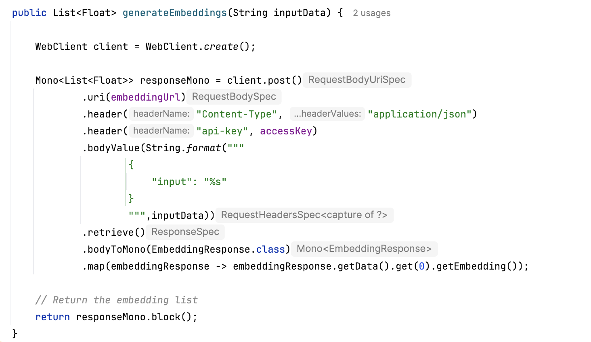

- **OpenAI integration**. The **middleware** connects to **OpenAI's GPT-4o completion model** for content generation and **text embedding model** for vector creation. Credentials and API keys are retrieved securely from **Azure Key Vault** using a **managed identity**.

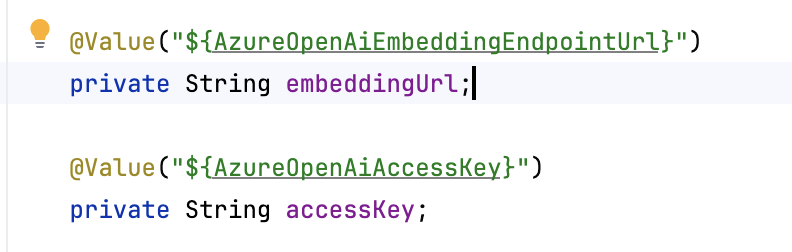

## 4. Back-end service

The **back-end** service handles customer and product data and uses the **product vector API** to find similar products based on embedding vectors sent from the middleware.  

### Core APIs:

- **Customer API**. Manages customer data and provides endpoints to retrieve and update customer information.  

  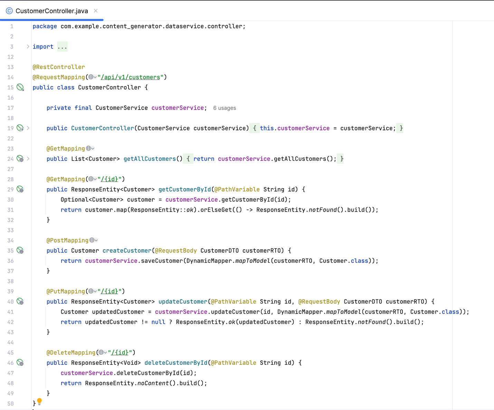

- **Product vector API**. Retrieves a list of similar products based on the embedding vector generated by the middleware.  

## 5. Data flow diagram
The data flow diagram shows how the user query flows from the **front-end** app to the **middleware** service and finally to the **back-end** service:  

1. **User -> Front end**. The user submits a query.  

2. **Front end -> Middleware API Management endpoint**. The query is sent to the middleware via API Management, which enforces API key checks and security.  

3. **Middleware -> Back-end API Management endpoint**. The middleware sends a vectorized query to the back end via API Management.  

4. **Back-end -> Database**. The back end retrieves similar products from Azure Cosmos DB.  

5. **Middleware -> OpenAI**. The middleware generates content using OpenAI’s models.  

6. **Middleware -> Front end**. The generated content is returned to the front end for display.  

 

  
  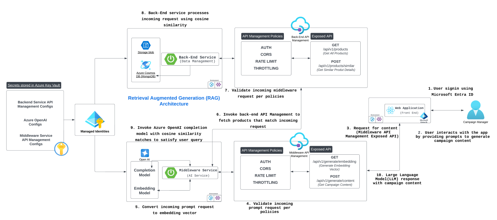

:::info
 Learn more on Technical leaders’ [guide to building intelligent apps](https://aka.ms/AAI_TDMApps_Plan?ocid=biafy25h1_30daysofia_webpage_azuremktg). 
:::
  

## Summary

In today’s blog post, we discussed the inner workings of our example AI-based content generation app, detailing the interactions between the **front-end**, **middleware**, and **back-end** app tiers. We learned how our app uses various Azure services, like Azure API Management, Azure Key Vault, Azure Cosmos DB, Azure Blob Storage, and Azure OpenAI Service to build a secure and scalable solution.   

In the next post—the last in this series—we'll explore the **outcomes** of building this application, highlighting its scalability and performance, the overall impact of the architecture and technologies used, and the key learnings to take away from the project.  

  