<head> 
  <meta property="og:url" content="https://azure.github.io/cloud-native/deploy-with-aca"/>
  <meta property="og:type" content="website"/>
  <meta property="og:title" content="**Build Intelligent Apps | AI Apps on Azure"/>
  <meta property="og:description" content="In today's post we go from Prompty prototype to hosted API endpoint using the FastAPI framework with Azure Container Apps."/>
  <meta property="og:image" content="https://github.com/Azure/Cloud-Native/blob/main/website/static/img/ogImage.png"/>
  <meta name="twitter:url" content="https://azure.github.io/Cloud-Native/deploy-with-aca" />
  <meta name="twitter:title" content="**Build Intelligent Apps | AI Apps on Azure" />
  <meta name="twitter:description" content="In today's post we go from Prompty prototype to hosted API endpoint using the FastAPI framework with Azure Container Apps." />
  <meta name="twitter:image" content="https://azure.github.io/Cloud-Native/img/ogImage.png" />
  <meta name="twitter:card" content="summary_large_image" />
  <meta name="twitter:creator" content="@devanshidiaries" />
  <link rel="canonical" href="https://azure.github.io/Cloud-Native/deploy-with-aca" />
</head>

<!-- End METADATA -->


Welcome to Day 5️⃣ of Azure AI Week on the #30DaysOfIA series! 

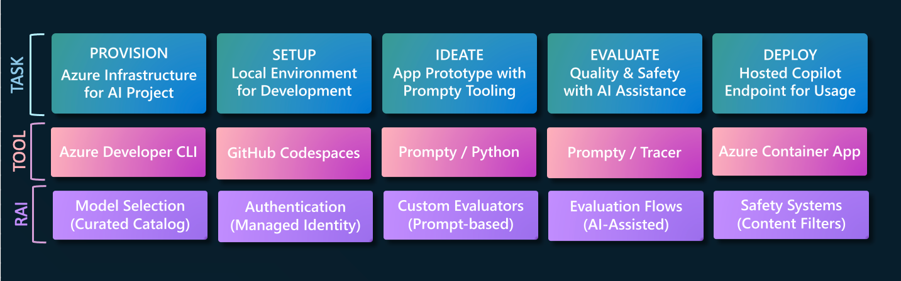

In yesterday's post, we **evaluated** our application for quality using 4 key metrics and a larger test inputs dataset. After getting acceptable results, it's time to **deploy** the protoype to production. In today's post we go from Prompty prototype to hosted API endpoint using the FastAPI framework with Azure Container Apps.

Ready? Let's get started!

## What We'll Cover Today

- **Build a FastAPI App** - Create an API server for your copilot app
- **Deploy with Azure Container Apps** - Get a hosted API endpoint
- **Testing your App Endpoint** - Contoso Chat Example
- **Monitoring for App Insights** - Contoso Creative Writer Example
- **Keep Learning** - Resources For Self-Guided Study

---  

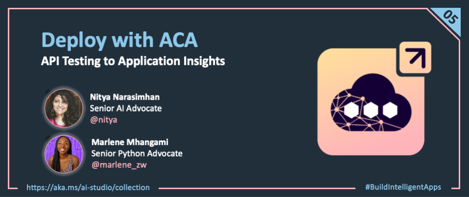

<br/>

In the previous sections, we used the Prompty runtime to generate Python code that we were able to run locally, for interactive testing (single input) or batch evaluation (input daatset). Now, we need to ready our application for deployment **as a hosted API endpoint** to a production environment.

## 1 | Create a FastAPI Server

The first step is to create a **server application** that can expose an API endpoint through which copilot requests can be received, for processing and response. We used the [FastAPI](https://fastapi.tiangolo.com/) framework - a modern, high-performance **Python** web framework for building and serving APIs.

- Run the FastAPI server _locally_ using `fastapi dev ..` to get a development server with hot refresh. Changes you make to the code are visible immediately, making it easy to iterate quickly on your app.
- Run the FastAPI server _in production_ by using a compute service like Azure Container Apps. Simply package up the FastAPI application into a container image and deploy it to get a hosted API endpoint.

**Let's look at the Contoso Chat codebase to see this in action**. The code block below reproduces a subset of the code from [`contoso-chat/src/api/main.py`](https://github.com/Azure-Samples/contoso-chat/blob/main/src/api/main.py) to show how we implement this. Code is annotated to explain the key steps in the process.

1. We import the `get_response` function which is our Prompty-based chat function.
2. We load environment variables and create the FastAPI application instance.
3. We configure CORS middleware to allow requests from specified origins.
4. We set a default route ("/") to return a message ("Hello World") as a health check.
5. We define the `/api/create_response` route to be the entry point for our custom copilot.

A copilot client (e.g., web application, cURL, or other API client) can now "POST" a request to the `/api/create_response` endpoint with the required input fields. The FastAPI server will pass these inputs to the `get_response` function and return the response back to the caller.

```python

# 1. The _get_response_ function is the entry point to the copilot code
from contoso_chat.chat_request import get_response

# 2. Load the environment variables and create the FastAPI application
load_dotenv()
app = FastAPI()

# 3. Configure CORS middleware to allow requests from specified origins
code_space = os.getenv("CODESPACE_NAME")
app_insights = os.getenv("APPINSIGHTS_CONNECTIONSTRING")
if code_space: 
    origin_8000= f"https://{code_space}-8000.app.github.dev"
    origin_5173 = f"https://{code_space}-5173.app.github.dev"
    ingestion_endpoint = app_insights.split(';')[1].split('=')[1]
    origins = [origin_8000, origin_5173, os.getenv("API_SERVICE_ACA_URI"), os.getenv("WEB_SERVICE_ACA_URI"), ingestion_endpoint]
else:
    origins = [
        o.strip()
        for o in Path(Path(__file__).parent / "origins.txt").read_text().splitlines()
    ]
    origins = ['*']

app.add_middleware(
    CORSMiddleware,
    allow_origins=origins,
    allow_credentials=True,
    allow_methods=["*"],
    allow_headers=["*"],
)

# 4. Define the default route ("/") to 
#     return a message ("Hello World") as health check
@app.get("/")
async def root():
    return {"message": "Hello World"}

# (5) Define the "/api/create_response" route to 
#     accept a POST request with query data & invoke _get_response_
#     then return the response to the caller 
@app.post("/api/create_response")
@trace
def create_response(question: str, customer_id: str, chat_history: str) -> dict:
    result = get_response(customer_id, question, chat_history)
    return result
```

## 2 | Deploy Azure Container App

Next, we need to deploy the FastAPI application to Azure using a relevant compute option.  [Azure Container Apps makes this simple](https://learn.microsoft.com/en-us/azure/developer/python/tutorial-containerize-simple-web-app?tabs=web-app-fastapi) requiring just a few steps. The links below point to the relevant files in the **Contoso Chat** sample as a reference.

1. _Create a [Dockerfile](https://github.com/Azure-Samples/contoso-creative-writer/blob/main/src/api/Dockerfile)  and [.dockerignore](https://github.com/Azure-Samples/contoso-creative-writer/blob/main/src/.dockerignore) files for your FastAPI application._ This instructs Docker how to build the container image for your application (and what to leave out).
1. _Configure that application server with the right port and entry function to use._ In this case, we use the `fastapi` server, with `main.py` as entry point, running on port 80.
1. _Provision the Azure Container Apps (ACA) resource on Azure_. In our case, we do this using `azd up` at the start, with configuration specified in [main.bicep](https://github.com/Azure-Samples/contoso-chat/blob/main/infra/main.bicep). The `azd provision` step creates the default ACA resource with the Application Uri showing this image on success.

    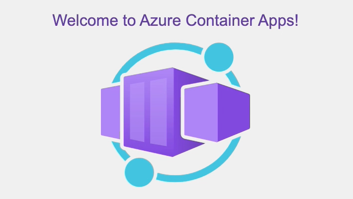

1. _Deploy the updated application to Azure Container Apps_. As you make more code updates, you can use `az acr build` to build the container image and `az containerapp update` to update the deployed application - see this in action in the `azd` [postprovision script](https://github.com/Azure-Samples/contoso-chat/blob/main/infra/hooks/postprovision.sh). The `azd hooks run postprovision` step deploys the application to ACA, with the Application Uri showing this image when refreshed. **Note that this corresponds to the health check message we defined in our FastAPI server for the default route ("/")**.

    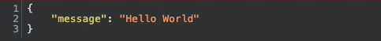

Now, let's learn to _test_ our application in development (local) and in production (deployed).

## 3 | Testing your App Endpoint

### 3.1 Testing In Production

The FastAPI server comes with a built-in Swagger UI that you can use to test the API endpoint in production. Simply navigate to the `/docs` route of the default application URL - and you should see something like this. Clicking on the `Try it out` button makes the form editable, allowing you to submit a request (using the inputs defined in the API specification) and see the returned response (or error message) rendered back in the UI. We'll see this in a minute.

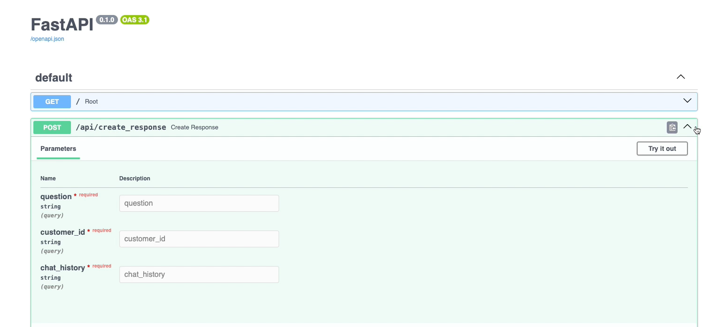

### 3.2 Testing Locally

But first, let's talk briefly about testing the FastAPI application _in development_. We can run the same server from the Visual Studio Code terminal using the command: `fastapi dev src/api/main.py` as shown:

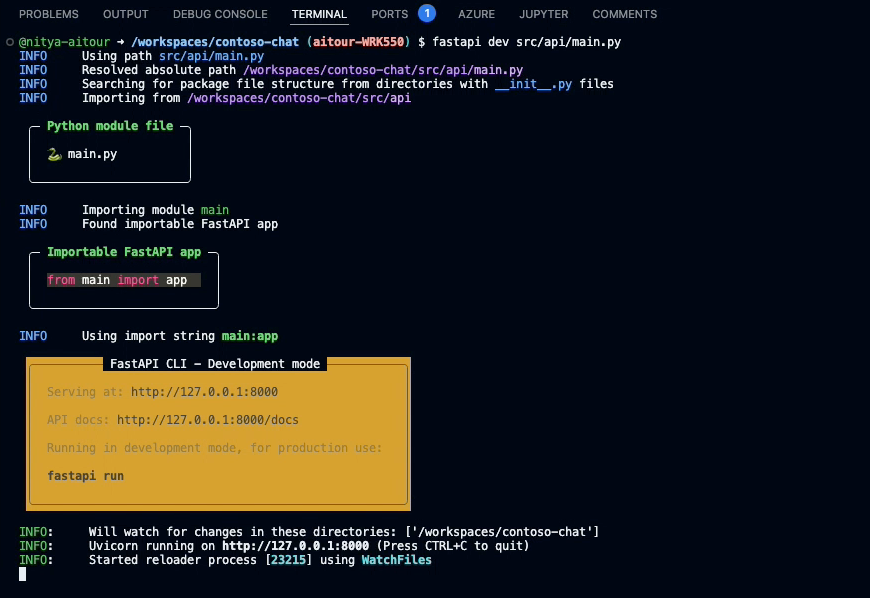

When in GitHub Codespaces, this will prompt you to open the browser to a preview page - with port forwarding to the local server, allowing you to work with the same browser-based application experience you see in production. _Note however that the local server URL will end with a `github.dev` domain reflecting the Codespaces environment we are using._.

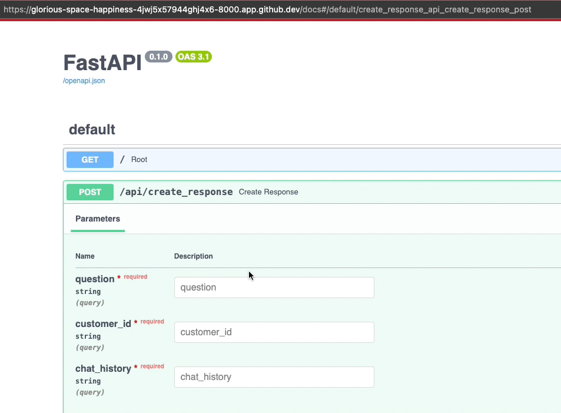

The other thing to note is that the dev server has hot refresh - so changes you make to the code are reflected instantly. This means you can change the behavior of the `get_response` function - and you should see the result reflected when you invoke the `create_response` endpoint, without needing to restart the dev server at commandline.

### 3.3 Testing The Copilot

Let's test the copilot by clicking `Try it out` in the Swagger UI. You can now edit the form fields to add values as shown. (Hint: you can use the sample input from the `chat.prompty` file if you need valid data).

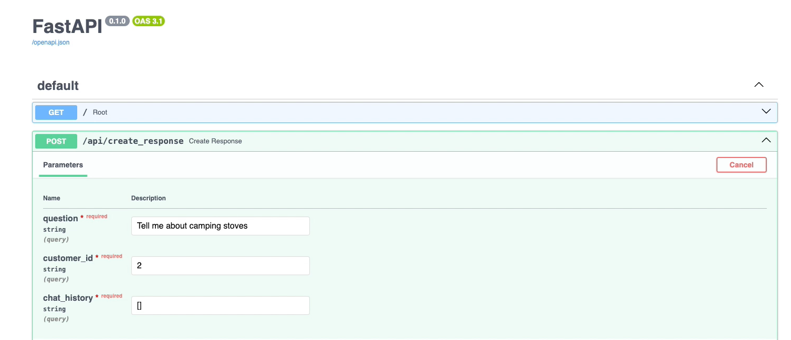

Here, we asked: `Tell me about camping stoves`. The response will be rendered right in the UI, and look something like this.

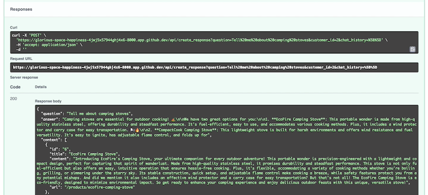

More importantly, if you switch back to the VS Code terminal, you should see the output also printed to the console along with additional execution traces. _This makes it easy to debug the application in development_, and see log messages you may have instrumented in the code.

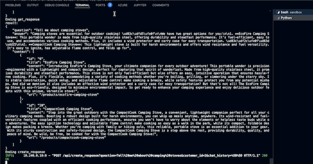

You can now test code changes at various levels, iterating rapidly in VS Code.

1. Change the way the FastAPI server handles the request (in `src/api/main.py`)
1. Change the way the Prompty template behaves (in `src/api/contoso_chat/chat.prompty`)
1. Change the way the RAG flow is orchestrated (in `src/api/contoso_chat/chat_request.py`)

The changes have an instant effect in the local dev server, so you can test them out using the Swagger UI before deploying to production. To _redeploy_ to production, you can try using an [az containerapp up](https://learn.microsoft.com/en-us/azure/developer/python/tutorial-containerize-simple-web-app?tabs=web-app-fastapi#make-updates-and-redeploy) for minor changes, or use the `az acr build` and `az containerapp update` commands together as explained before, for more complex update scenarios.


## 4 | Monitoring with App Insights

### 4.1 What is App Insights?  

Once our application is deployed into production, we can use [Azure Application Insights](https://learn.microsoft.com/en-us/azure/azure-monitor/app/app-insights-overview) to monitor and track everything about it. Application Insights provides many experiences to enhance the performance, reliability, and quality of applications. These can be grouped into 4 main categories:

1. **Investigate:** A comprehensive suite of tools for real-time monitoring, performance tracking, and issue diagnosis, providing insights into your application's health and architecture.

2. **Monitoring:** Visualizations of metrics, logs, and alerts, allowing proactive monitoring and customization of reports for application health and operational data.

3. **Usage:** Provides insights into user behavior, allowing you to track interactions, visualize user journeys, and analyze engagement to improve app performance.

4. **Code analysis:** Focuses on optimizing application code and performance, using tools like a profiler and AI-driven insights to improve efficiency and resolve issues quickly.

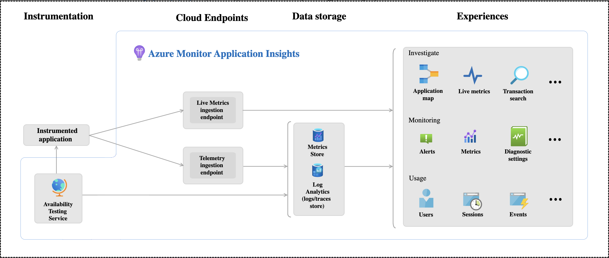

### 4.2 App Insights Dashboard

In Contoso Creative Writer we utilize the [App Insights Dashboard](https://learn.microsoft.com/en-us/azure/azure-monitor/app/overview-dashboard) to access realtime information about our deployed application through a dashboard in Azure Portal. The dashboard provides an overview pane to allow at-a-glance assessment of our application's health and performance. We can also can also use Application Insights to track custom information, and add it to our dashboard. In this case we want to add the evaluation scores and LLM token information we got from the running the evaluations and Prompty tracing we saw in [yesterday's post](https://azure.github.io/Cloud-Native/30-days-of-ia-2024/evaluate-with-ai). 

To enable custom insights in Contoso Creative Writer we added the following code to a [tracing.py](https://github.com/Azure-Samples/contoso-creative-writer/blob/a304cc691d1657b6d1e93e18df871de37633efb9/src/api/tracing.py#L51) file. 


```python
from prompty.tracer import Tracer, PromptyTracer
from opentelemetry import trace as oteltrace
from opentelemetry import trace
from opentelemetry.sdk.trace import TracerProvider
from opentelemetry.sdk.trace.export import BatchSpanProcessor
from opentelemetry.sdk.trace.export import SimpleSpanProcessor
from opentelemetry.sdk.trace.sampling import ParentBasedTraceIdRatio
from azure.monitor.opentelemetry.exporter import AzureMonitorTraceExporter

_tracer = "prompty"

@contextlib.contextmanager
def trace_span(name: str):    
    tracer = oteltrace.get_tracer(_tracer)    
    with tracer.start_as_current_span(name) as span:        
        def verbose_trace(key, value):            
            if isinstance(value, dict):                
                for k, v in value.items():                  
                    verbose_trace(f"{key}.{k}", v)            
            else:                
                span.set_attribute(f"{key}", value)        
        yield verbose_trace


def init_tracing(local_tracing: bool = False):
    """
    Initialize tracing for the application
    If local_tracing is True, use the PromptyTracer
    If remote_tracing is True, use the OpenTelemetry tracer
    If remote_tracing is not specified, defaults to using the OpenTelemetry tracer only if local_tracing is False
    """

    if local_tracing:
        local_trace = PromptyTracer()
        Tracer.add("PromptyTracer", local_trace.tracer)
    else:
        Tracer.add("OpenTelemetry", trace_span)

        azmon_logger = logging.getLogger("azure")
        azmon_logger.setLevel(logging.INFO)

        # Configure Azure Monitor as the Exporter
        app_insights = os.getenv("APPINSIGHTS_CONNECTIONSTRING")

        # Add the Azure exporter to the tracer provider
        oteltrace.set_tracer_provider(TracerProvider(sampler=ParentBasedTraceIdRatio(1.0)))
        oteltrace.get_tracer_provider().add_span_processor(BatchSpanProcessor(AzureMonitorTraceExporter(connection_string=app_insights)))

        return oteltrace.get_tracer(_tracer)
```

For sending tracing insights from the app to the dashboard we use the Prompty Tracer alongside the [Opentelemetry](https://learn.microsoft.com/en-us/azure/azure-monitor/app/opentelemetry-enable?tabs=python) Python package. The connection string (which is automatically generated when you run `azd up` for this sample) is unique and specifies where the Azure Monitor OpenTelemetry Distro sends the telemetry it collects. When our application is running in production, and we open Application Insights in the Azure portal the following data can be seen in the dashboard. (It might take a few minutes for data to show up.)

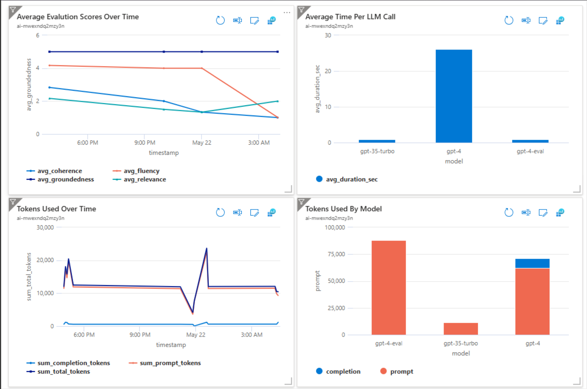

Our dashboard now provides extensive information from LLM calls, token usage, and various evaluation metrics. This provides detailed insights into performance and helps identify areas of improvement or any issues that may arise. For example, by visualizing token usage over time, businesses can track cost and performance metrics, making it easier to make decisons. We can also look at average evaluation scores, such as relevance, fluency, and coherence, which can be viewed in real-time, providing a clear understanding of the quality of LLM-generated outputs.


## 5 |  Wrap-up & Next Steps

We made it!! Thank you for following along with us all through Azure AI Week on the #30DaysOfIA series! Let's quickly recap what we covered over these 5 days.

1. **Kickoff** - We introduced two signature use cases for our copilot - Contoso Chat and Contoso Creative Writer - and introduced the end-to-end workflow that both samples follow, for code-first development on Azure AI Studio with Prompty assets.
1. **Provision & Setup** - Next, we walked through how we provisioned the application architectures for each sample (with `azd`) and launched a pre-built development environment for each sample (using GitHub Codespaces) connected to that infra.'
1. **Ideate** - We then began the first stage of our GenAIOps lifecycle by going from prompt to prototype, using Prompty assets, tooling, and runtime. We learned how to use Prompty to shape the data (for RAG) and help orchestrate flows (for Agentic AI).
1. **Evaluate** - We learned about AI-Assisted evaluation flows, quality and safety assessment metrics, and the process for crafting custom evaluators with Prompty. We also learned about support for observability in Prompty, with tracing options and a built-in viewer.
1. **Deploy** - Finally, we learned how to use FastAPI to create a server app, deploy it using Azure Container Apps, and test it in development and production using a built-in UI that allows us to iterate quickly to improve app quality, debug issue, or evolve functionality.


Found this series useful and want to keep going? Here are a few things you can do to continue your learning journey!

:::tip 
"Want to get hands-on experience building intelligent apps on Azure?"   
:::

Take these actions today, to jumpstart your skilling journey:

- [Register for Microsoft AI Tour](https://aka.ms/aitour) - join an instructor-led workshop session.
- [Register for Microsoft Ignite](https://ignite.microsoft.com/sessions) - look for related lab & breakout sessions on Azure AI.
- [Browse the AI Templates Collection](https://aka.ms/azd-ai-templates) - explore samples for new frameworks and scenarios.

---