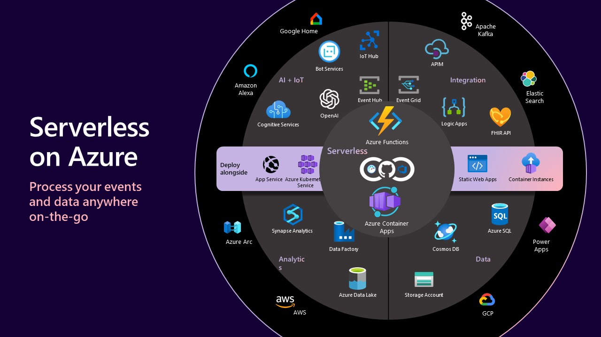

<head>
<meta property="og:url" content="https://azure.github.io/cloud-native/30daysofia/kick-off"/>
<meta property="og:type" content="website"/>
<meta property="og:title" content="**Fall For Intelligent Apps! 🍂| Build AI Apps On Azure"/>
<meta property="og:description" content="Join us this Fall season on a learning journey to build intelligent apps on Azure. Read all about the upcoming #FallForIntelligentApps initiative on this post!"/>
<meta property="og:image" content="https://github.com/Azure/Cloud-Native/blob/main/website/static/img/ogImage.png"/>
    <meta name="twitter:url" 
      content="https://azure.github.io/Cloud-Native/30daysofIA/kick-off" />
    <meta name="twitter:title" 
      content="**Fall For Intelligent Apps! 🍂 | Build AI Apps On Azure" />
    <meta name="twitter:description" 
      content="Join us this Fall season on a learning journey to build intelligent apps on Azure. Read all about the upcoming #FallForIntelligentApps initiative on this post!" />
    <meta name="twitter:image" 
      content="https://azure.github.io/Cloud-Native/img/ogImage.png" />
    <meta name="twitter:card" content="summary_large_image" />
    <meta name="twitter:creator" 
      content="@devanshidiaries" />
    <meta name="twitter:site" content="@AzureAdvocates" /> 
    <link rel="canonical" 
      href="https://azure.github.io/Cloud-Native/30daysofIA/kick-off" />
</head>

<!-- End METADATA -->

This Fall focus on building intelligent apps using AI and cloud-native technologies. `#FallForIntelligentApps` brings to you a learning journey to build your skills on creating differentiated experiences while modernizing your applications. It’s time to `learn it all`. 

## What We'll Cover
 * What is Fall For Intelligent Apps? 
 * How Can I participate? 
 * How Can I skill up? (in just 30 Days) 
 * **Exercise:** Take the [Fall For Intelligent Apps Skills Challenge](https://aka.ms/FallForIA/apps-csc)
 * **Resources:** [#30DaysOfIA Collection](https://aka.ms/fallforIA/collection/?WT.mc_id=javascript-99907-ninarasi)

## Get Ready To #FallForIntelligentApps starting September 18!

Today, we kick off the Fall season with content and activities to skill you up on all things Intelligent Apps or AI Apps on Azure with content, events, and community interactions! Read on to learn about what is coming!

## Explore Our Initiatives

We have a number of initiatives planned for the month to help you learn and skill up on relevant technologies. Click on the links to visit the relevant pages for each

 * #30DaysOfIA - 6 themed weeks of daily articles in a structured roadmap
 * Learn Live Series – 8 weekly live episodes on `Serverless` and `Kubernetes`
 * Ask The Expert – join live Q&A sessions with Product Engineering teams
 * Cloud Skills Challenge – skill up by competing with peers to complete modules

:::info **Register for the events!**

What are 3 things you can do today, to jumpstart your learning journey?

 * Register for live Q&A sessions (free, online) 
     * September 20  - [Ask The Expert: Azure Container Apps](https://aka.ms/FallForIA/ATE-series)
     * September 26 – [Ask The Expert: Azure Functions](https://aka.ms/FallForIA/ATE-series)
     * October 11 – [Ask The Expert: Azure App Service](https://aka.ms/FallForIA/ATE-series)
     * October 25 – [Ask The Expert: Azure Kubernetes Service](https://aka.ms/FallForIA/ATE-series)
 * Register for the [Learn Live Series: Serverless Edition](https://aka.ms/FallForIA/LearnLive) – weekly live learning 
 * Register for the [Intelligent Apps webinar](https://info.microsoft.com/ww-landing-driving-business-value-by-modernizing-with-cloud-native-and-ai.html?lcid=en-us) with Microsoft and Forrester
 * Complete the [Cloud Skills Challenge](https://aka.ms/fallforIA/csc) – ends on October 31! 
:::

## #30Days Of Intelligent Apps

[#30DaysOfIA](https://aka.ms/fallforIA/30days) is a series of daily blog posts grouped into themed weeks - taking you from core concepts to end-to-end solution examples in 30 days. Each article will provide conceptual lessons paired with exercises and resources to help you reinforce learnings and take next steps.

This series takes you through learning journey in **four stages**, each building on the previous week to help you skill up in a beginner-friendly way:

 * **Week 1**: Power of [Intelligent Applications](https://azure.microsoft.com/en-us/blog/build-next-generation-ai-powered-applications-on-microsoft-azure/?WT.mc_id=javascript-99907-ninarasi)
 * **Week 2:** How to build intelligent apps with [cloud-native](https://azure.microsoft.com/en-us/solutions/cloud-native-apps/?WT.mc_id=javascript-99907-ninarasi)?
 * **Week 3:** Powering intelligent applications using [Azure Kubernetes Service](https://learn.microsoft.com/en-us/azure/aks/?WT.mc_id=javascript-99907-ninarasi)
 * **Week 4:** Building a Serverless Intelligent App with [Azure Functions](https://learn.microsoft.com/en-us/azure/azure-functions/functions-overview?WT.mc_id=javascript-99907-ninarasi&pivots=programming-language-csharp) and [Azure OpenAI](https://learn.microsoft.com/en-us/azure/ai-services/openai/overview/?WT.mc_id=javascript-99907-ninarasi)
 * **Week 5:** Build end to end AI powered solutions with real world [reference architectures](https://learn.microsoft.com/en-us/azure/architecture/?WT.mc_id=javascript-99907-ninarasi)
 * **Week 6:** Build your own [Copilot](https://learn.microsoft.com/en-us/training/paths/copilot/?WT.mc_id=javascript-99907-ninarasi)

We will start with defining intelligent apps and then expand on how to build with cloud-native technologies like [Azure Kubernetes Service](https://azure.microsoft.com/en-us/products/kubernetes-service/?WT.mc_id=javascript-99907-ninarasi), [Azure Container Apps](https://azure.microsoft.com/en-us/products/container-apps/?WT.mc_id=javascript-99907-ninarasi) and [Azure Functions](https://azure.microsoft.com/en-us/products/functions?WT.mc_id=javascript-99907-ninarasi), and take you through end-to-end scenarios for real world application development. Before we dive deep on intelligent apps, here is a high-level overview of the **Intelligent Apps** landscape on Azure: 

**Containers on Azure** services offer you a wide range of capabilities, from simplicity to control to suit your different needs.

To start with the basics for developing [Kubernetes](https://azure.microsoft.com/en-us/products/kubernetes-service/?WT.mc_id=javascript-99907-ninarasi) applications, explore [#30DaysOfCloudNative](https://azure.github.io/Cloud-Native/cnny-2023).

Cloud-native development when paired with **serverless computing** enhances your solution architecture for building cost optimized, resilient applications.

To start with the basics for [serverless computing](https://azure.microsoft.com/solutions/serverless/?WT.mc_id=javascript-99907-ninarasi), explore [#30DaysOfServerless](https://azure.github.io/Cloud-Native/blog).

## Let’s Get Started

Now you know everything! We hope you are as excited as we are to dive into a full month of active learning and doing! Don't forget to [subscribe](https://aka.ms/fallforIA/30days/subscribe) for updates in your favorite feed reader! **And look out for our first Intelligent Apps post tomorrow!**