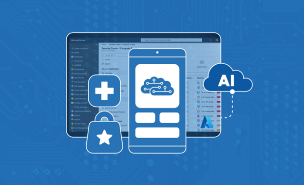
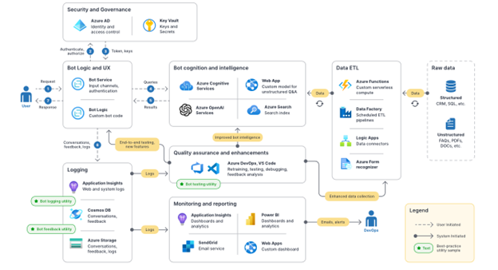

<head>
<meta property="og:url" content="https://azure.github.io/cloud-native/30daysofia/harnessing-the-power-of-intelligent-apps"/>
<meta property="og:type" content="website"/>
<meta property="og:title" content="**Fall For Intelligent Apps! 🍂| Build AI Apps On Azure"/>
<meta property="og:description" content="Explore the concept of intelligent applications for readers and gain a clear understanding of the role of AI capabilities in modern applications."/>
<meta property="og:image" content="https://github.com/Azure/Cloud-Native/blob/main/website/static/img/ogImage.png"/>
    <meta name="twitter:url" 
      content="https://azure.github.io/Cloud-Native/30daysofIA/harnessing-the-power-of-intelligent-apps" />
    <meta name="twitter:title" 
      content="**Fall For Intelligent Apps! 🍂 | Build AI Apps On Azure" />
    <meta name="twitter:description" 
      content="1-2.Explore real-world examples of how Intelligent Apps revolutionize logistics, retail, finance, manufacturing, tech, and medicine." />
    <meta name="twitter:image" 
      content="https://azure.github.io/Cloud-Native/img/ogImage.png" />
    <meta name="twitter:card" content="summary_large_image" />
    <meta name="twitter:creator" 
      content="@devanshidiaries" />
    <meta name="twitter:site" content="@AzureAdvocates" /> 
    <link rel="canonical" 
      href="https://azure.github.io/Cloud-Native/30daysofIA/harnessing-the-power-of-intelligent-apps" />
</head>

<!-- End METADATA -->

Explore real-world examples of how **Intelligent Apps** revolutionize logistics, retail, finance, manufacturing, tech, and medicine.

## What We'll Cover:

 * Real-world businesses revolutionizing operations with Intelligent Apps
 * High level architecture for industry scenarios
 * Implementation architecture overview across industries

## Real-world Success Stories

According to IBM’s 2022 [Global AI Adoption Index](https://www.ibm.com/downloads/cas/GVAGA3JP?WT.mc_id=javascript-99907-ninarasi), 35% of surveyed companies already use AI in their business, and 42% are exploring the idea. Organizations lagging behind the AI curve will quickly fall behind early adopters, who are already enjoying its benefits and boosting their investment in this technology.

In the first part of this series, [“Demystifying Intelligent Applications: Leveraging AI in App Development,”](https://azure.github.io/Cloud-Native/30daysofIA/demystifying-intelligent-applications) we explored how organizations can use AI-powered apps, or intelligent apps, to transform their operations, decision-making, and customer experiences, leaping ahead of the competition.

Intelligent apps significantly improve operational efficiency and customer engagement across industries like logistics, retail, finance, manufacturing, tech, and healthcare. In this article, we’ll spotlight real-world success stories of businesses revolutionizing operations with intelligent apps using Microsoft Azure’s app, data, and AI services.

:::info
**Register** for the [Learn Live](https://aka.ms/contoso-real-estate/learn-live?WT.mc_id=javascript-99907-ninarasi) on **September 21** for a live guided experience with SMEs on how to build end-to-end solution architecture for real world implementation of Intelligent Apps.
:::

## Streamlining Operations: Intelligent Apps in the Airline Industry

Aerospace pioneer Airbus [leveraged intelligent apps to streamline its operations and innovate its services](https://customers.microsoft.com/en-us/story/858578-airbus-defense-and-intelligence-azure?WT.mc_id=javascript-99907-ninarasi) with two ground-breaking modernizations that use Azure apps, data, and AI services to reimagine pilot training and predict aircraft maintenance issues.  

Aviation technology’s rapid evolution compelled Airbus to reconceive their approach to training pilots. The aircraft manufacturer created a pilot training chatbot by combining [Azure AI Services](https://azure.microsoft.com/en-us/products/ai-services?WT.mc_id=javascript-99907-ninarasi) with [Speech to Text](https://azure.microsoft.com/en-us/products/ai-services/speech-to-text?WT.mc_id=javascript-99907-ninarasi) and [Text to Speech](https://azure.microsoft.com/en-us/products/ai-services/text-to-speech?WT.mc_id=javascript-99907-ninarasi). The bot helps trainee pilots navigate over 6,000 pages of technical information. Pilots can ask questions verbally for quick answers, aiding their understanding of dense information and speeding up training. And when Airbus needed to accommodate its military consumers, deploying its Kubernetes cluster to a disconnected, “air-gapped” environment met the strict security requirements of military aircraft training.

A chatbot could look like the following diagram as Azure services work together to create a conversational experience. Its components could include security and governance, bot logic and user experience (UX), bot cognition and intelligence, data extract, transfer, and load (ETL) operations, quality assurance and enhancements, logging, and monitoring and reporting.

Airbus also used AI to improve its aircraft maintenance and safety. They deployed AI Anomaly Detector to gather and analyze telemetry data from multiple flights, enabling more profound insights into wear and tear on military aircraft operating in harsh conditions. This AI application helps Airbus better understand each airplane’s health. Airbus can predict and fix potential problems before they occur, improving the aircraft’s safety and operational readiness.

AI and Azure are changing how organizations like Airbus operate, even in strict, highly regulated markets with stringent security requirements. And by streamlining pilot training and staying ahead of aircraft maintenance, Airbus helps its military and commercial clients reliably deliver their goods across the globe, maintaining their critical supply chains.

## Boosting Customer Service: Intelligent Apps in the Retail Industry

The retail industry has been among the first to adopt and benefit from intelligent apps. For example, the leading American used car retailer, CarMax, [uses intelligent apps to transform the car shopping experience](https://customers.microsoft.com/en-us/story/1501304071775762777-carmax-retailer-azure-openai-service?WT.mc_id=javascript-99907-ninarasi).

Before embracing AI, CarMax faced a significant challenge: Manually creating text summaries was time-consuming and labor-intensive. CarMax decided to leverage [Azure OpenAI Service](https://azure.microsoft.com/en-us/products/ai-services/openai-service?WT.mc_id=javascript-99907-ninarasi) to automatically generate car research pages, offering customers valuable insights while enhancing the website’s search engine rankings.

This AI-driven approach has significantly streamlined the process, achieving in a few months what would have taken years manually. Also, the AI system condenses thousands of customer reviews into a few readable sentences, offering potential buyers a quick overview of others’ experiences.

CarMax has improved their customer experience while boosting operational efficiency through AI adoption. CarMax’s editorial staff focuses on creating strategic, longer-form content with the time saved, enhancing productivity, and driving more website traffic.

CarMax’s success story serves as a testament to the potential of intelligent apps in the retail industry.

## Enhancing Cybersecurity: Intelligent Apps in Finance

Intelligent apps also impact the highly regulated financial services sector. Swift, a leading infrastructure provider for financial messaging services, [uses intelligent apps to enhance decision-making and combat financial crime](https://customers.microsoft.com/en-us/story/1637929534319366070-swift-banking-capital-markets-azure-machine-learning?WT.mc_id=javascript-99907-ninarasi).

The massive growth of cross-border transactions and instant payment networks led to a surge in financial fraud that can cost the industry hundreds of billions of dollars every year. So, Swift and Microsoft partnered to build an anomaly detection model using [federated learning techniques](https://techcommunity.microsoft.com/t5/ai-machine-learning-blog/federated-learning-with-azure-machine-learning-powering-privacy/ba-p/3824720?WT.mc_id=javascript-99907-ninarasi) with [Azure Machine Learning](https://azure.microsoft.com/en-us/products/machine-learning/?WT.mc_id=javascript-99907-ninarasi) and [Azure confidential computing](https://azure.microsoft.com/en-us/solutions/confidential-compute/?WT.mc_id=javascript-99907-ninarasi).

[Microsoft Purview](https://azure.microsoft.com/en-us/products/purview/?WT.mc_id=javascript-99907-ninarasi) helped govern data, as the federated learning method partially trained each model in a silo before aggregating them. This approach enabled Swift and Microsoft to develop a highly accurate model without copying or moving data from Swift members’ secure locations, ensuring the highest level of security and privacy.

Financial organizations can now deploy this trained ML model to run a real-time fraud detection system, lowering the cost of financial fraud.

Organizations can deploy a fraud detection system like the following example on Microsoft Azure. The system ingests data from streams or storage, runs analytics, and uses ML to detect fraud and store results. It then alerts users and other systems to the security issue.

Swift provides the innovative model to its banking partners, who can share data to further train the model. Azure confidential computing securely runs new models on current data to accumulate insights, generating an ongoing learning cycle. This iterative approach strengthens the global detection of fraudulent financial transactions through an increasingly faster and more accurate model.  

The collaboration between Swift and Microsoft demonstrates how combining various Azure services creates Intelligent Apps to enhance decision-making in finance. These apps solve real problems at an unprecedented global scale.  

## Enhancing Efficiency: Intelligent Apps in Manufacturing

3M, known for Post-it Notes and other innovative products, [wielded the power of Intelligent Apps to standardize, automate, and accelerate its sales forecasting](https://customers.microsoft.com/en-us/story/1504342377134122633-3M-manufacturing-azure-machine-learning?WT.mc_id=javascript-99907-ninarasi). The company needed a unified, automated approach to replace its multiple manual methods.

It adopted Azure Machine Learning and other Azure AI Services to develop, train, and implement 1,500 custom models for each region and division, replacing manual methods. This solution delivers timely finance, sales, and marketing insights while freeing teams from time-consuming manual data manipulation tasks.

3M used Azure Machine Learning, [automated machine learning](https://azure.microsoft.com/en-us/products/machine-learning/automatedml/?WT.mc_id=javascript-99907-ninarasi) (AutoML), and the [Many Models Solution Accelerator](https://github.com/microsoft/solution-accelerator-many-models?WT.mc_id=javascript-99907-ninarasi) to train and score numerous machine learning models in parallel. This approach significantly shortened the company’s development cycle time.

Then, 3M integrated [Microsoft Power BI](https://powerbi.microsoft.com/en-us/?WT.mc_id=javascript-99907-ninarasi) into their solution to compile and visualize results more effectively. Executives now have an unbiased and unfiltered view of data for better decision-making. With its improved ability to forecast sales, 3M can focus on manufacturing the products it needs efficiently.

3M’s success demonstrates how combining various Azure services can enhance efficiency in the manufacturing industry. These apps improve operational processes while enabling employees to focus on higher-level tasks. Strategic decisions are more targeted, and business conversations are more meaningful.

## Driving Innovation: Intelligent Apps in the Technology Industry

As expected, the tech industry is at the forefront of leveraging Intelligent Apps to drive innovation. Elastic [saw an opportunity to use intelligent apps to optimize its search services and meet customer needs more effectively](https://customers.microsoft.com/en-us/story/1653495116803202350-elastic-partner-professional-services-azure-openai-service?WT.mc_id=javascript-99907-ninarasi). The company built a managed, secure, and scalable solution for its customers, Elastic Cloud, by leveraging [Microsoft Azure](https://azure.microsoft.com/en-us?WT.mc_id=javascript-99907-ninarasi).

Elastic Cloud uses Azure Machine Learning and other Azure AI Services to automate many basic management tasks, such as backing up data, upgrading, and scaling deployments. This approach enables Elastic’s customers to focus less on managing the software and more on serving their own clients. Customers can quickly deploy and manage Elastic Cloud on Kubernetes (ECK) using [Azure Kubernetes Service](https://azure.microsoft.com/en-us/products/kubernetes-service/?WT.mc_id=javascript-99907-ninarasi).

As a result, Elastic’s cloud business is growing twice as fast as its on-premises solutions. Enterprise search users have reported significant improvements in system availability and employee satisfaction.

Additionally, Elastic incorporated Azure OpenAI Service into its Elasticsearch Relevance Engine (ESRE), providing more relevant answers to search queries. ESRE enables text, vector, and hybrid search, offering a more effective and accurate response to queries.

Elastic’s success story demonstrates how combining various Azure services can create intelligent Apps to drive innovation in the tech industry. These apps help improve operational processes and deliver better results quickly.

## Revolutionizing Healthcare: Intelligent Apps in Medicine

Intelligent apps also drive transformative changes in the healthcare sector. Cambridgeshire and Peterborough NHS Foundation Trust, a healthcare provider in the United Kingdom, gradually shifted their on-premises systems to the cloud using Azure, improving flexibility, and lowering costs. They needed a solution for their electronic patient record (EPR) system that integrates 23 years of data across multiple systems and formats.

The Trust used Microsoft Azure and [Azure Cognitive Search](https://azure.microsoft.com/en-us/products/ai-services/cognitive-search?WT.mc_id=javascript-99907-ninarasi), including semantic search for understanding intent and contexts and cognitive capabilities for extracting insights from data, to [standardize and automate data management](https://customers.microsoft.com/en-us/story/1612121636839251558-cpft-health-provider-azure-en-united-kingdom?WT.mc_id=javascript-99907-ninarasi). This approach made legacy, archive, and live data more discoverable, saving clinicians’ time. The Trust’s solution searches through millions of clinical documents in seconds, even recognizing handwritten notes without needing a separate optical character recognition (OCR) solution to extract text from images (Azure Cognitive Search automatically does it). Clinicians can now uncover previously inaccessible insights, enabling them to offer more personalized care.

The Trust also used [Integration Services](https://azure.microsoft.com/en-us/products/category/integration/?WT.mc_id=javascript-99907-ninarasi) tools such as [Azure Logic Apps](https://azure.microsoft.com/en-us/products/logic-apps/) to create workflows without writing code and [Event Grid](https://azure.microsoft.com/en-us/products/event-grid/?WT.mc_id=javascript-99907-ninarasi) to connect Azure and third-party services through a [publisher-subscriber model](https://learn.microsoft.com/en-us/azure/architecture/patterns/publisher-subscriber?WT.mc_id=javascript-99907-ninarasi). They switched on a live feed from their new EPR system to Azure to feed real-time information into other applications. Researchers can now access anonymized data to fuel medical innovations beyond the NHS.

The healthcare provider also invested heavily in Power BI’s data visualization and analytical functions to sift through massive amounts of information. This level of data accessibility was previously impossible with their on-premises system. The new insights have significantly improved clinicians’ efficiency for better patient care.

Data accessibility and security are critical in the healthcare industry. Intelligent Apps empower organizations like the Trust to revolutionize medical care. AI capabilities helped the Trust improve its operational efficiency and user experiences, setting a new standard for healthcare in the digital age.

## Summary

AI is driving transformation and real-world successes across industries. Intelligent apps are reshaping our world by streamlining operations in manufacturing and logistics, enhancing customer experience in the retail sector, improving decision-making in finance, driving innovation in tech, and revolutionizing healthcare.

As organizations adopt AI, they’re innovating in ways that were once too difficult, expensive, or outright impossible. Companies that wait to embrace intelligent apps risk the chance of falling behind. By embracing intelligent apps and leveraging the capabilities of Azure, you can harness the transformative potential of AI to remain on the cutting edge of technology.

## Exercise

 * **Complete** the [Intelligent Apps Cloud Skills Challenge](https://aka.ms/fallforIA/apps-csc?WT.mc_id=javascript-99907-ninarasi) to build on your apps and AI skills.
 * **Watch** [Episode 01](https://aka.ms/learnlive-contoso-app-deconstructed-Ep1?WT.mc_id=javascript-99907-ninarasi) of the Serverless Edition Learn Live session to learn how to build an end-to-end intelligent app solution.
 * **Register** for the [Intelligent Apps webinar](https://info.microsoft.com/ww-landing-driving-business-value-by-modernizing-with-cloud-native-and-ai.html?lcid=en-us?WT.mc_id=javascript-99907-ninarasi) with Microsoft and Forrester.