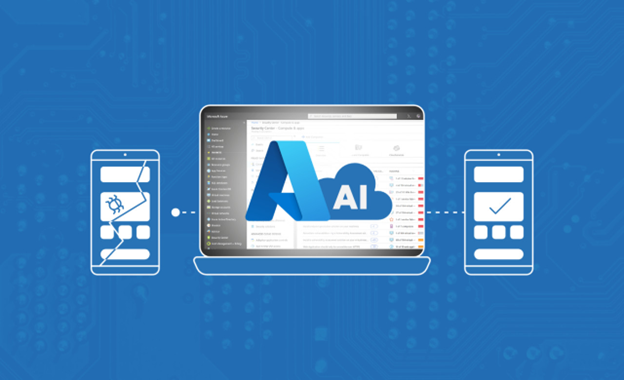

<head>
<meta property="og:url" content="https://azure.github.io/cloud-native/30daysofia/reimagine-app-development-with-ai"/>
<meta property="og:type" content="website"/>
<meta property="og:title" content="**Fall For Intelligent Apps! 🍂| Build AI Apps On Azure"/>
<meta property="og:description" content="In the part of our series on intelligent apps, we’ll explore how AI is transforming application development, from design and architecture to building."/>
<meta property="og:image" content="https://github.com/Azure/Cloud-Native/blob/main/website/static/img/ogImage.png"/>
    <meta name="twitter:url" 
      content="https://azure.github.io/Cloud-Native/30daysofIA/reimagine-app-development-with-ai" />
    <meta name="twitter:title" 
      content="**Fall For Intelligent Apps! 🍂 | Build AI Apps On Azure" />
    <meta name="twitter:description" 
      content="1-3. Explore how AI is transforming application development, from design and architecture to building." />
    <meta name="twitter:image" 
      content="https://azure.github.io/Cloud-Native/img/ogImage.png" />
    <meta name="twitter:card" content="summary_large_image" />
    <meta name="twitter:creator" 
      content="@devanshidiaries" />
    <meta name="twitter:site" content="@AzureAdvocates" /> 
    <link rel="canonical" 
      href="https://azure.github.io/Cloud-Native/30daysofIA/reimagine-app-development-with-ai" />
</head>

<!-- End METADATA -->
In the part of our series on intelligent apps, we’ll explore how AI is transforming application development, from design and architecture to building.

## What We'll Cover:

 * Revolutionizing application development using AI
 * Infusing AI in application design architecture
 * I Assisted Pair Programming
 * Future of App Development

## Reimagining Application Development With AI: A New Paradigm

Artificial intelligence (AI) is impacting every industry. AI-powered development tools offer new functionalities and assist software developers throughout the development process, revolutionizing app development. From initial design and architecture to coding and debugging, AI reshapes how we approach application conception, creation, and iteration.

In part one of this series, “[Demystifying Intelligent Applications: Leveraging AI in App Development](https://azure.github.io/Cloud-Native/30daysofIA/demystifying-intelligent-applications),” we explored the new breed of intelligent apps and how they use AI. In this article, we’ll see how AI technologies enhance developer toolkits and shape the future of app development, particularly through AI-enabled coding assistance and debugging.

## The Dawn of Intelligent Apps: Revolutionizing Application Development

AI is more than just another addition to the development toolbox—it represents a revolution bringing unprecedented efficiency, innovation, and user engagement to our applications.  

What sets intelligent apps apart is how they can adapt and learn, helping us deliver unique, real-time user experiences.   

One example is an AI-driven health application that can track biometric data, predict potential health issues, provide personalized health advice, and even guide emergency services during a medical crisis. An AI-enabled language learning app that adapts to our learning speeds, recognizes our problem areas, and customizes its content to help us improve our language proficiencies is another example.   

Intelligent apps like these don’t just use data for recommendations—they can make critical decisions and provide sophisticated services that were previously impossible.  

For developers, intelligent apps mean we’re no longer just coding—we’re teaching applications how to think, adapt, and make decisions. AI is reshaping every step of the development journey, helping us to build more intuitive and user-focused products.  

Next, we’ll examine the impact of AI on application design and architecture and how AI-assisted “pair programming” changes software development.

:::info
**Register** for the *FREE* [webinar on Intelligent Apps](https://info.microsoft.com/ww-landing-driving-business-value-by-modernizing-with-cloud-native-and-ai.html?lcid=en-us&WT.mc_id=javascript-99907-ninarasi) with Microsoft and Forrester on September 26 to explore how modernization sets the stage for incorporating AI/ML into existing applications and how building new, intelligent applications can drive innovation and competitive advantage across a range of industries. 

There will be a showcase of real-world use cases that demonstrate how AI can be seamlessly integrated into cloud-native environments driving tangible business value.
:::

## AI in Design and Architecture: Fueling Creativity and Efficiency

AI technologies help developers automate and streamline their processes and provide new ways to think about design.   

In traditional application development, the design and architecture phase can take significant time, effort, and expertise. For instance, adopting a monolithic architecture or a microservices-based design can significantly increase coding, testing, and debugging complexity. The app may even behave differently when hosted locally than in a deployed environment. It may take hours to track down an issue manually—time developers could spend elsewhere.  

Conversely, we can generate numerous design iterations in seconds with AI, each optimized to fulfill specific user needs and business goals. AI tools can quickly model various scenarios' impacts and software design patterns in the architectural design phase. It provides insights into performance and potential issues and suggests improvements. AI can also generate skeleton code, allowing developers to prototype different solutions or test specific components and technologies rapidly. By reviewing thousands of lines of code in seconds, AI allows us to focus on creating apps that serve users through feature development instead of searching for bugs.   

Integrating AI into the design and architecture phase can even extend our creative capabilities. By leveraging the power of generative AI—like large language models (LLMs)—and their broad knowledge and context going beyond software, we can better brainstorm apps and feature ideas. We can go beyond code and software architecture and get ideas about user experience, logo and branding, or marketing concepts. And as AI tools deliver insights and ideas we would have never considered; it encourages more innovation.

:::info
Watch [Episode 01](https://aka.ms/learnlive-contoso-app-deconstructed-Ep1) of the Learn Live session to learn how to build an end-to-end intelligent app solution architecture.
:::

## The Power of AI-Assisted Pair Programming in Building Applications

AI-assisted pair programming is a collaborative coding approach where an AI system—like [GitHub Copilot](https://github.com/features/copilot) or [TestPilot](https://githubnext.com/projects/testpilot/)—assists developers during coding. It’s an increasingly common approach that significantly impacts developer productivity. In fact, [GitHub Copilot](https://github.com/features/copilot) is now behind an [average of 46 percent of developers’ code](https://github.blog/2023-02-14-github-copilot-now-has-a-better-ai-model-and-new-capabilities/) and users are seeing [55 percent faster task completion](https://github.blog/2022-09-07-research-quantifying-github-copilots-impact-on-developer-productivity-and-happiness/) on average.  

For new software developers, or those interested in learning new skills, AI-assisted pair programming are training wheels for coding. With the benefits of code snippet suggestions, developers can avoid struggling with beginner pitfalls like language syntax. Tools like ChatGPT can act as a personal, on-demand tutor—answering questions, generating code samples, and explaining complex code syntax and logic. These tools dramatically speed the learning process and help developers gain confidence in their coding abilities.  

Building applications with AI tools hastens development and provides more robust code. For example, GitHub Copilot helps us write new code accurately. It also quickly makes sense of existing code, suggests whole new lines or blocks of code, and even detects errors and proposes fixes. It’s like having a second coder working alongside us—one who never tires and is trained on billions of lines of code.  

However, it’s also important to acknowledge the limitations of AI. While generative AI-assistance technologies like GitHub Copilot are impressive, they’re still imperfect. They can sometimes produce erroneous, non-functional, or vulnerable code. They can also lack nuanced, domain-specific knowledge.   

So, although these tools are helpful, we can’t rely on them fully—these are programming aids rather than definitive solutions. AI-assisted pair programming is about augmenting the human developer’s skills, not replacing them.

## Debugging and Improving Code With AI: Enhancing Application Quality

Identifying and correcting code errors is often time-consuming and challenging for developers. AI streamlines the debugging process by automatically detecting anomalies, suggesting fixes, and learning from previous bugs to prevent them from recurring.  

We can use generative AI to create unit tests from code snippets, from simple parameter checking and input validation to complex mocks of database and network services. Automated AI testing improves code coverage and robustness. It saves significant time compared to manually crafting unit tests.  

AI also revolutionizes code reviews by scanning and highlighting potential issues—like code patterns leading to a bug or a coding standards violation—and suggesting ways to simplify or refactor the code for readability and performance. This reduces human error and makes the code review process more efficient. Its benefits extend to small teams, where the availability of developers is crucial to deadlines, and large teams, where effective collaboration depends on readability and code consistency. AI further saves time by triaging issues so developers can prioritize the most mission-critical ones.  

Aside from improving code quality, AI is critical to understanding system behavior. Intelligent AI-assisted software development tools can monitor and audit system behavior, giving developers a better insight into how their code performs in different scenarios. AI can track patterns, identify inefficiencies, and provide alerts when they detect unusual behavior—enabling developers to enhance their code further.  

By predicting and identifying potential vulnerabilities, intelligent AI-assisted coding apps like [Microsoft Security Copilot](https://www.microsoft.com/en-us/security/business/ai-machine-learning/microsoft-security-copilot?WT.mc_id=javascript-99907-ninarasi) are pivotal in ensuring application functionality, reliability, and security. These AI tools are continually trained and upgraded with large codebases and user feedback that refines their responses. This ability to learn from past mistakes makes AI an incredibly powerful tool that will continue to expand its capabilities in the future.

:::info
Complete the [AI Cloud Skills Challenge](https://aka.ms/FallForIA/ai-csc) to build on you AI application development skills with paired programming using generative AI and GitHub Copilot.
:::

## AI and the Future of Application Development

The rapid advancements in AI and machine learning technologies point to an exciting future for application development.  

In “[The Future of Applications](https://mikecann.co.uk/posts/the-future-of-applications),” software developer Mike Cann illustrates how LLMs might revolutionize application development. Cann that suggests fully-autonomous coding—AI-generated applications created entirely from prompts—may supersede traditional hand-crafted applications. Dynamically generated user interfaces could offer personalized and customizable experiences while we can design APIs for machine consumption and efficiency rather than human readability. Furthermore, we can store data in less structured, more adaptable, and flexible forms. 

AI is already making application development more accessible. With AI handling the complex, technical aspects of development, less-technical individuals can take a greater role in building applications. Consequently, AI can potentially democratize software engineering.  

Intelligent apps will continue to evolve, becoming more efficient, adaptable, and capable of learning from user interactions. Similarly, AI will inevitably become integral in every stage of app development.

## Summary

AI has already created a new development paradigm—one in which machine intelligence and human creativity come together to produce innovative, efficient, and robust applications. AI already assists us at every stage of app development, from design and architecture to coding and debugging.  

Developers who embrace AI tools and integrate them into their processes can enhance their productivity, improve the quality of their applications, and expand the possibilities of their application development.   

The future of development is automated and AI-driven, and it’s here today. Getting started is easy—try an AI-powered development tool like GitHub Copilot to see how AI-assisted pair programming can enhance your productivity and code quality.

## Exercise

 * **Watch** the “[Develop and Deconstruct](https://aka.ms/learnlive-contoso-app-deconstructed-Ep2)” episode of our Learn Live series, a live guided experience on building end-to-end intelligent apps architecture with SMEs from Microsoft.
 * **Complete** the [Fall For Intelligent Apps Skills Challenges](https://aka.ms/FallForIA/csc) – ends on October 31!
