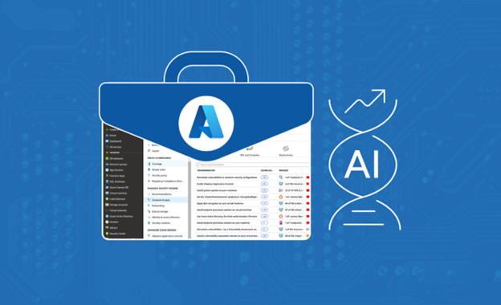

<head>
<meta property="og:url" content="https://azure.github.io/cloud-native/30daysofia/how-digital-natives-leverage-generative-ai"/>
<meta property="og:type" content="website"/>
<meta property="og:title" content="**Build Intelligent Apps! | Build AI Apps On Azure"/>
<meta property="og:description" content="Explore how digital natives and Independent Software Vendors (ISVs) can transform their business operations and generate higher value for customers with generative AI and intelligent apps."/>
<meta property="og:image" content="https://azure.github.io/Cloud-Native/img/ogImage.png"/>
    <meta name="twitter:url" 
      content="https://azure.github.io/Cloud-Native/30daysofIA/how-digital-natives-leverage-generative-ai" />
    <meta name="twitter:title" 
      content="**Build Intelligent Apps! | Build AI Apps On Azure" />
    <meta name="twitter:description" 
      content="1-4. Explore how digital natives and Independent Software Vendors (ISVs) can transform their business operations and generate higher value for customers with generative AI and intelligent apps." />
    <meta name="twitter:image" 
      content="https://azure.github.io/Cloud-Native/img/ogImage.png" />
    <meta name="twitter:card" content="summary_large_image" />
    <meta name="twitter:creator" 
      content="@devanshidiaries" />
    <meta name="twitter:site" content="@AzureAdvocates" /> 
    <link rel="canonical" 
      href="https://azure.github.io/Cloud-Native/30daysofIA/how-digital-natives-leverage-generative-ai" />
</head>

<!-- End METADATA -->
Explore how digital natives and Independent Software Vendors (ISVs) can transform their business operations and generate higher value for customers with generative AI and intelligent apps.

## What We'll Cover:

 * Potential of Generative AI in application development
 * Challenges with Generative AI
 * Integrating Generative AI with business operations

## Unleashing Business Transformation: How Digital Natives Can Leverage Generative AI

Generative AI is no longer a technological flight of fancy. It’s here, and it’s rewriting the rules of business innovation.  

This type of AI leverages machine learning algorithms to create new data with similar characteristics to a given dataset. It goes beyond text generation using generative pretrained transformer (GPT) models, covering an array of applications that span from image synthesis to translations and more. It also powers a new class of intelligent applications, which combine AI capabilities with traditional software functions for enhanced user experiences and advanced business solutions.  

Generative AI is transforming how digital natives and independent software vendors (ISVs) operate. Generative AI offers new possibilities for creating unique business value, enhancing customer experiences, and driving growth.  

It plays a critical role in applications, improving functionality, aiding decision-making, and automating complex tasks to deliver dynamic, uniquely personalized user experiences. Generative AI also enables and automates data-driven outcomes, functions, and features.

Integrating AI capabilities into customer-facing apps and turning them into intelligent apps benefits both the customer and the business, as we discussed in [Demystifying Intelligent Applications: Leveraging AI in App Development](https://azure.github.io/Cloud-Native/30daysofIA/demystifying-intelligent-applications). You get faster product development workflows and better business intelligence for sales and marketing, while your users get more natural and context-aware features and interactions.  

That said, to realize generative AI’s potential, you need some strategy and knowledge of how and where it fits into your current business and operations. We’ll examine this technology’s potential to transform business operations, its risks, and rewards, and how to integrate it into your existing operations.  

## Unpacking the Potential of Generative AI

Generative AI is creating new opportunities in the digital playing field. It empowers businesses to generate insights, design products, and automate processes in ways and at speeds that were previously unimaginable. You can now predict customer behavior more accurately, offer highly personalized user experiences, and prototype innovative ideas rapidly.  

For example, Microsoft used generative AI to reinvent web search in the new [AI-powered Bing and Edge](https://blogs.microsoft.com/blog/2023/02/07/reinventing-search-with-a-new-ai-powered-microsoft-bing-and-edge-your-copilot-for-the-web/). The search experience has evolved from a solitary user flow of typing in keywords and scrolling through results. It’s now a conversational experience where Bing uses context to offer better quality and more personalized search queries and results.  

Similarly, Microsoft harnessed generative AI to transform its productivity suite into intelligent apps. Through [Copilot for Microsoft 365](https://blogs.microsoft.com/blog/2023/03/16/introducing-microsoft-365-copilot-your-copilot-for-work/), PowerPoint now empowers users to tell their stories by using DALL-E to generate images effortlessly. It also helps rephrase text-heavy slides to be more straightforward. Outlook now assists users to compose more effective emails, enabling better communication.

These are just some examples of how AI powers day-to-day work and operations.  

Businesses that ignore generative AI miss out on untapped market opportunities, letting competitors gain an edge in the digital race. By seeking ways to rethink assumptions and reinvent existing approaches, you can effectively use generative AI to create new opportunities, open products to new use cases and markets, unlock new growth and customer satisfaction levels, and increase your revenue.

:::info
Register for the intelligent apps webinar on [Driving Business Value by Modernizing with Cloud-Native & AI](https://info.microsoft.com/ww-landing-driving-business-value-by-modernizing-with-cloud-native-and-ai.html?lcid=en-us?WT.mc_id=javascript-99907-ninarasi) with *Microsoft* and *Forrester* on **September 26**.

Explore how modernization sets the stage for incorporating AI/ML into existing applications and how building new, intelligent applications can drive innovation and competitive advantage across a range of industries.  
:::

## The Crucial Role of Generative AI in Business Operations

Generative AI can be a powerful catalyst for business transformation. Let’s quickly tour some ways it can redefine business operations. 

Product development is traditionally a long and painstaking process. Now, tools like [GitHub Copilot](https://github.com/features/copilot) and [TestPilot](https://githubnext.com/projects/testpilot/) use generative AI to make coding and testing software easier, faster, and more robust.  

Similarly, machine learning as a service technology, such as [Azure Machine Learning](https://azure.microsoft.com/en-us/products/machine-learning?WT.mc_id=javascript-99907-ninarasi), democratizes the availability of machine learning. It helps collect, clean, and train models across datasets, making engineering and analyzing data more efficient and accessible.   

Generative AI also simplifies the process of creating intelligent apps. Previously, simulating thousands of prototypes, predicting their performance, and narrowing down to the most viable options could take weeks, months, or even years of iteration and data analysis. With generative AI, this process can be as quick as days, hours, or perhaps minutes.  

Customer experience is also ripe for transformation. Personalized recommendations drive engagement and sales, and generative AI can scale that personalization to every customer interaction using comprehensive and continually updated data. For instance, Microsoft leverages AI to enable personalization in [Dynamics 365 Customer Insights](https://dynamics.microsoft.com/en-us/ai/customer-insights/). Using this tool, you can ask questions about your customers in natural language and gain valuable and actionable insights into your customer base.  

Lastly, marketing and sales can benefit from generative AI. For example, identifying current and future key markets and emerging trends helps companies stay ahead of the curve. Tools like [Copilot in Power BI](https://powerbi.microsoft.com/en-us/blog/introducing-microsoft-fabric-and-copilot-in-microsoft-power-bi/) help you quickly understand and uncover insights about your business, enabling your team to craft targeted campaigns, create engaging content, and optimize your business strategy.  

Leveraging this full generative AI potential requires the right tools. GPT-4, for instance, can be instrumental in realizing effective business transformation. It excels in understanding context, generating human-like text, and learning from minimal data input, making it a formidable tool in any digital native's arsenal. Platforms like [Azure OpenAI Service](https://azure.microsoft.com/en-us/products/ai-services/openai-service?WT.mc_id=javascript-99907-ninarasi) bring GPT-4’s power to your fingertips.

## Navigating Challenges in the Generative AI Landscape

However, as with any powerful technology, it’s unwise to treat generative AI as a perfect solution. You must know the challenges and risks of not leveraging it effectively, including technical and human-factor considerations.  

Without generative AI, your company risks missing the opportunity to please customers via personalization, as discussed previously. You’ll miss sales opportunities via business intelligence insights, limiting your ability to grow revenue and keep up with the competition.  

One challenge of leveraging generative AI’s full potential is finding the right tools. Fortunately, you can implement generative AI in your organization without investing in infrastructure, computational power, and expertise. Platforms like [Azure OpenAI Service](https://azure.microsoft.com/en-us/products/ai-services/openai-service?WT.mc_id=javascript-99907-ninarasi) and [Azure AI Services](https://azure.microsoft.com/en-us/solutions/ai?WT.mc_id=javascript-99907-ninarasi) make AI easily accessible. They also work with Azure compute and data services like [Azure Functions](https://azure.microsoft.com/en-us/products/functions?WT.mc_id=javascript-99907-ninarasi) and [Azure Kubernetes Service](https://azure.microsoft.com/en-us/products/kubernetes-service/?WT.mc_id=javascript-99907-ninarasi) (AKS), enabling you to build intelligent apps easily and quickly.  

However, generative AI can’t do everything. It may need human expertise and intervention to use it fully.  

For example, generative AI can create unique data. However, the data may have limited diversity and complexity. The AI may need help recognizing additional considerations or requirements specific to a problem. It may also lack context due to various factors, such as the information’s freshness. Also, since it’s an emerging field that’s [potentially worth $4.4 trillion](https://www.mckinsey.com/capabilities/mckinsey-digital/our-insights/the-economic-potential-of-generative-ai-the-next-productivity-frontier#key-insights), we’re still learning about the nuances and [potential regulatory impact](https://techcrunch.com/2023/01/27/the-current-legal-cases-against-generative-ai-are-just-the-beginning/) of generative AI.  

Perhaps the most crucial and challenging aspect of adopting generative AI is an organization’s required cultural shift. Your teams must learn how to use AI as your company fosters an understanding of AI’s potential and limitations.  

Begin integrating AI literacy into your company’s DNA. Knowledge of its potential and the readily available tools can inspire your teams to incorporate generative AI into their daily workflows and business operations quickly, improve productivity, and deliver superior customer experiences.  

No company wants to be outpaced by its competitors. You can balance generative AI’s potential with your business operations by staying aware of and adapting to the dynamic AI landscape.

## Achieving Harmony: Integrating Generative AI with Existing Business Operations

Integrating generative AI into existing business operations doesn’t have to be disruptive. With the correct strategy, you can do so seamlessly. Your goal should be to augment and enhance your operations, not disrupt and replace.  

For example, Microsoft Cloud technologies leveraged AI to [relieve healthcare organizations’ challenges](https://www.microsoft.com/en-us/industry/blog/healthcare/2023/04/12/microsoft-cloud-for-healthcare-empowering-healthcare-to-deliver-meaningful-outcomes/?WT.mc_id=javascript-99907-ninarasi), such as talent shortage and workforce burnout. Providers automated their workflows, invested in specific applications and connectors, and enhanced support for data and operations.  

Azure AI Services, such as [text analytics for health](https://learn.microsoft.com/en-us/azure/ai-services/language-service/text-analytics-for-health/overview?tabs=ner?WT.mc_id=javascript-99907-ninarasi), enable healthcare organizations to understand their largely unstructured and untapped medical data. [Project Health Insights](https://azure.microsoft.com/en-us/blog/announcing-project-health-insights-preview-advancing-ai-for-health-data/?WT.mc_id=javascript-99907-ninarasi) leans on AI to help healthcare professionals gain actionable insights and inferences from patient data.  

[Azure Health Bot](https://techcommunity.microsoft.com/t5/healthcare-and-life-sciences/extending-azure-health-bot-with-azure-openai-service/ba-p/3792560), an Intelligent App, empowers organizations to build and deploy legally compliant, powerful conversational healthcare experiences to patients.  

A successful AI integration like this begins with understanding. Knowing what generative AI can do and setting realistic expectations can help you identify where and how AI can best serve your operations.  

Next, you can foster a culture of AI literacy across teams, speeding up adoption by helping them understand how it can aid their work. The more familiar your team is with AI and its possibilities, the smoother the transition. Training and education programs play a pivotal role here.  

Finally, integration requires a systematic approach. It’s not about overhauling everything at once — it's about identifying areas where AI can add the most value, then gradually experimenting and scaling its use. Successful integration stories often feature a phased approach, starting small and growing steadily.  

As we move toward a future where generative AI is a staple in business operations, remember that every journey is unique. Although there’s no one-size-fits-all solution, a strategic approach and a keen understanding of your business needs will help you navigate this new landscape successfully. 

## Conclusion

Generative AI offers plenty of opportunities for businesses that embrace it. It’s fueling the next generation of intelligent applications, transforming everything from product development to customer engagement to marketing. This technology is the key to unlocking unprecedented growth and innovation.  

While the journey may have challenges, the potential rewards make generative AI worth exploring. As generative AI advances, [Azure AI](https://azure.microsoft.com/en-us/products/cognitive-services/#overview?WT.mc_id=javascript-99907-ninarasi)’s broad range of tools and services will help you navigate this fascinating field.

## Exercise

 * Watch **[Episode 02](https://aka.ms/learnlive-contoso-app-deconstructed-Ep2)** of the serverless edition Learn Live session to learn how to build, test and deploy an end-to-end intelligent app solution.
 * Complete the **[Cloud Skills Challenge](https://aka.ms/fallforIA/ai-csc)** to build on your AI skills.
 * Register for **[Ask the Expert: Azure Functions](https://aka.ms/FallForIA/ATE)** on September 26 for a live Q&A with the Product Team on how to build AI apps using serverless computing.  
