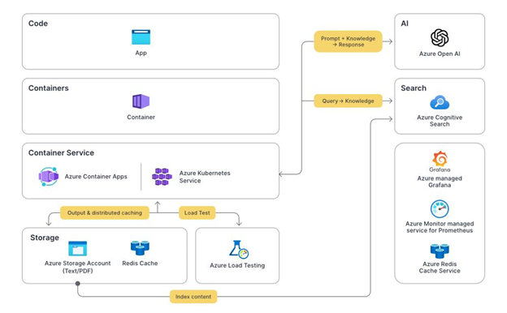

<head>
<meta property="og:url" content="https://azure.github.io/cloud-native/30daysofia/how-digital-natives-leverage-generative-ai"/>
<meta property="og:type" content="website"/>
<meta property="og:title" content="**Build Intelligent Apps! | Build AI Apps On Azure"/>
<meta property="og:description" content="Explore how digital natives and Independent Software Vendors (ISVs) can transform their business operations and generate higher value for customers with generative AI and intelligent apps."/>
<meta property="og:image" content="https://azure.github.io/Cloud-Native/img/ogImage.png"/>
    <meta name="twitter:url" 
      content="https://azure.github.io/Cloud-Native/30daysofIA/preparing-the-path-for-intelligent-apps" />
    <meta name="twitter:title" 
      content="**Build Intelligent Apps! | Build AI Apps On Azure" />
    <meta name="twitter:description" 
      content="1-5. Learn best practices for modernizing your on-premises or IaaS solutions to intelligent apps in the cloud." />
    <meta name="twitter:image" 
      content="https://azure.github.io/Cloud-Native/img/ogImage.png" />
    <meta name="twitter:card" content="summary_large_image" />
    <meta name="twitter:creator" 
      content="@devanshidiaries" />
    <meta name="twitter:site" content="@AzureAdvocates" /> 
    <link rel="canonical" 
      href="https://azure.github.io/Cloud-Native/30daysofIA/preparing-the-path-for-intelligent-apps" />
</head>

<!-- End METADATA -->
Learn best practices for modernizing your on-premises or IaaS solutions to intelligent apps in the cloud.

## What We'll Cover:

 * Traditional vs Intelligent Apps
 * On-Premises/IaaS vs. Cloud-Native Platforms
 * Modernization strategy for building Intelligent Apps

## Preparing the Path for Intelligent Apps: Transitioning from On-Premises/IaaS to Cloud-Native Applications

The proliferation of generative AI is paving the way for intelligent applications, software that leverages AI capabilities to deliver unparalleled functionality and user experience. As we covered in a previous article, “[Demystifying Intelligent Applications: Leveraging AI in App Development](https://azure.github.io/Cloud-Native/30daysofIA/demystifying-intelligent-applications),” intelligent Apps aren’t just products of advanced coding. They interact, learn, and evolve thanks to modern AI and machine learning (ML) breakthroughs.  

The paradigm shift from traditional to intelligent apps demands that we change our approach to the technical challenges of software and architecture design. It also necessitates adopting new ways of thinking and operating within an organization, which we explore in greater depth in “[Cultivating a Culture for Intelligent Apps: Organizational Readiness and Change Management](https://azure.github.io/Cloud-Native/30daysofIA/cultivating-a-culture-for-intelligent-apps).”  

This article explores the technical infrastructure powering intelligent apps, providing a roadmap to transition traditional on-premises or Infrastructure as a Service (IaaS) solutions to intelligent apps deployed to cloud native platforms and services. We’ll discover the differences between conventional and intelligent apps, options for re-architecting existing applications, and critical strategic considerations integral to modernizing the application-building approach.  

## Understanding the Shift: Traditional vs. Intelligent Applications

Intelligent apps are more than just an incremental evolution from traditional apps. They involve a fundamental shift in software solution design, development, and deployment. A clear understanding of how each paradigm differs is crucial for comprehending the impact of this transition.  

### Functionality and User Experience

Traditional applications, often rule-based and rigid, rely on preprogrammed operations. A traditional weather app, for example, typically presents structured, location-based forecasts using a predetermined data source. Meanwhile, an intelligent app leverages AI for data-driven decision-making and personalization. Rather than merely displaying the forecast, it integrates ML with additional data sources—like a user’s calendar and fitness data—to determine their favorite outdoor activities, provide relevant clothing suggestions, and even automatically design ideal vacations and times based on the user’s optimal weather preferences.  

Similarly, while traditional applications tend to offer a one-size-fits-all UI, intelligent apps use AI to create tailored interactions. For instance, an intelligent banking app might use generative AI to provide a voice-enabled UI that lets customers use natural language to ask about transactions and receive personalized financial advice.

### Infrastructure

Intelligent apps integrating these sophisticated features require highly scalable, flexible infrastructure optimized for AI functionality and able to manage large volumes of real-time data. Unlike traditional applications deployed on-premises or in infrastructure as a service (IaaS) environments, intelligent apps demand the flexibility and scalability of cloud native architectures.

An on-premises or IaaS-based e-commerce application may struggle with connecting its data to AI services or scaling to accommodate voluminous real-time data and requests. But an intelligent app built with a cloud native approach and scalability at its core can handle variable demand much more efficiently. It also maintains its infrastructure components on demand, whether for collecting data for AI/ML consumption or user-facing features like AI-enabled customer support and personalization.

Consider an intelligent app built on Azure that creates ChatGPT-like experiences with custom data. It might connect [Azure Open AI](https://azure.microsoft.com/en-us/products/ai-services/openai-service?WT.mc_id=javascript-99907-ninarasi) and [Azure Cognitive Search](https://azure.microsoft.com/en-us/products/ai-services/cognitive-search?WT.mc_id=javascript-99907-ninarasi) to an app running on [Azure Container Apps](https://azure.microsoft.com/en-us/products/container-apps/?WT.mc_id=javascript-99907-ninarasi) or [Azure Kubernetes Service](https://azure.microsoft.com/en-us/products/kubernetes-service/?WT.mc_id=javascript-99907-ninarasi).  

The architecture might look like the following diagram based on this [demo app](https://github.com/Azure-Samples/azure-search-openai-demo-csharp):

While the cloud is well-equipped to handle the challenges associated with shifting to AI-centric infrastructure—handling real-time data processing and storage, integrating and managing AI services, configuring event-driven and microservices architectures, and ensuring security across the distributed environment—re-architecting a traditional app to an intelligent app requires careful planning and execution to ensure it benefits fully from the capabilities of AI and cloud computing.

### On-Premises/IaaS vs. Cloud-Native Platforms

While on-premises and IaaS solutions provide substantial control over data and processes, this fine-grained control comes with setup and maintenance costs and may lack the scalability necessary for AI-driven Intelligent Apps. On-premises hosting involves purchasing and maintaining hardware, including servers and storage systems. IaaS involves leasing virtual hardware and then hiring and training IT personnel for the infrastructure’s operation, maintenance, and security.

Conversely, infrastructure built on cloud native app services with [Microsoft Azure](https://azure.microsoft.com/?WT.mc_id=javascript-99907-ninarasi) offers virtually unlimited scalability without ongoing hardware and maintenance costs. This feature is ideal for intelligent apps that need to adapt and scale to accommodate fluctuating workloads and data streams. And because these cloud infrastructures typically operate on a pay-as-you-go model, traditionally substantial upfront costs turn into predictable operating expenses, lowering both the cost and risk of launching applications.

Moreover, cloud service providers continually update their offerings, so building on sophisticated AI tools and services through the cloud, like the [Azure AI Platform](https://azure.microsoft.com/en-us/solutions/ai/?WT.mc_id=javascript-99907-ninarasi) and orchestration capabilities with [Azure Kubernetes Service](https://azure.microsoft.com/en-us/products/kubernetes-service/?WT.mc_id=javascript-99907-ninarasi), ensures that you have access to the latest AI and most advanced AI models and technologies.

### Strategic Considerations for Transitioning to Intelligent Apps

When developing a strategy for transitioning to intelligent apps, you must consider costs, personnel skill development, and data management.

Monolithic architectures are unlikely to support the scale and ease of iteration required by intelligent apps, so you’ll likely need to implement code changes to support the transition. Your chosen hosting solution and the amount of data your app will handle affect cost and performance, in addition to determining privacy and compliance requirements.

An app that manages or stores terabytes or petabytes of data will require storage-optimized virtual machines or a managed database service hosting. Meanwhile, an app that processes video content or performs resource-intensive calculations should prioritize high-performance computing. Maximizing storage and performance can become extraordinarily costly.

Finally, existing applications shifting towards intelligent apps may encounter compatibility conflicts, depending on database type or the existing system’s underlying programming language. As you might imagine, a traditional app running on-premises and using a shared local database may need significant restructuring to support a cloud native architecture. You need plans for data migration, potential downtime, and training.

Next, let’s look at this transformation process.

### Re-Architecting Monolithic Apps into Microservices

Shifting from [monolithic applications](https://learn.microsoft.com/en-us/dotnet/architecture/containerized-lifecycle/design-develop-containerized-apps/monolithic-applications?WT.mc_id=javascript-99907-ninarasi) to microservices is pivotal for transitioning to Intelligent Apps, and you can use this shift as an opportunity to transform your legacy software into intelligent apps that leverage the flexibility and power of microservices-enabled AI solutions.

Traditionally, a monolithic application (let’s use an online marketplace as an example) might handle all activities—from serving webpages to processing payments—within an on-premises server or a cloud server. However, this approach is challenging to scale and remains vulnerable to network failures or cyberattacks.

Breaking these applications into multiple services with specific responsibilities, such as authentication or notifications, can overcome these limitations. These services are typically deployed as microservices within container environments like [Azure Kubernetes Service](https://azure.microsoft.com/en-us/products/kubernetes-service/?WT.mc_id=javascript-99907-ninarasi) or serverless platforms like [Azure Container Apps](https://azure.microsoft.com/en-us/products/container-apps?WT.mc_id=javascript-99907-ninarasi) or [Azure Functions](https://azure.microsoft.com/en-us/products/functions/?WT.mc_id=javascript-99907-ninarasi) using automated processes. This approach offers scalability, robustness, and improved performance, as each microservice can run independently and use its own database.

Shifting towards smaller, independent microservices in app architectures allows us to reap the benefits of AI-powered intelligent apps, for example, by using microservices to handle AI tasks such as processing natural language input, analyzing behavioral data, or personalizing content.

:::info
Watch [Episode 1](https://aka.ms/learnlive-contoso-app-deconstructed-Ep1) and [Episode 2](https://aka.ms/learnlive-contoso-app-deconstructed-Ep2) of the [Learn Live series](https://aka.ms/contoso-real-estate/learn-live) on how to build, test and deploy an end-to-end intelligent app solution using the [Contoso Real Estate Sample](https://github.com/Azure-Samples/contoso-real-estate).
:::

### Event-Driven Architectures: Knowing When to Use Them

[Event-Driven Architectures](https://learn.microsoft.com/en-us/azure/architecture/guide/architecture-styles/event-driven?WT.mc_id=javascript-99907-ninarasi) (EDAs) can significantly enhance the performance and cost-effectiveness of intelligent apps. EDAs, typically implemented with microservices, respond in real time to events or state changes ranging from user interactions to real-time analytics.

Consider an intelligent app designed for personalized customer engagement. Instead of designing the application to check continuously for changes in user data, an EDA can react to such changes immediately, triggering appropriate microservices. For example, if users modify their preferences, an event could trigger an AI-driven recommendation microservice to update its suggestions immediately. This real-time responsiveness, enabled by services like [Azure Event Grid](https://azure.microsoft.com/en-us/products/event-grid/?WT.mc_id=javascript-99907-ninarasi), can improve user experiences and make intelligent apps more adaptive and proactive.

However, it’s worth noting that while EDAs provide significant benefits, they can introduce unique complexities, such as maintaining event consistency and debugging issues in event chains across multiple microservices. Therefore, it’s important to assess your application’s needs so you can understand where it can benefit from an EDA.

## Conclusion

Transitioning to intelligent apps represents a shift in strategy, architecture, and infrastructure. By designing and re-architecting for cloud-based infrastructure, your apps gain scalability, cost-effectiveness, robust data management, access to sophisticated AI tools, enhanced security, and reduced operational overhead.   

But this transition extends well beyond its technical components. Organizations and the people working within them need equal attention. You can explore these facets in greater depth in “Cultivating a Culture for Intelligent Apps: Organizational Readiness and Change Management.”  

The power of generative AI is here, and preparing for the move toward cloud-based intelligent applications will ensure that your apps remain performative and scalable and—most importantly—that your business is ready for the newest era of app innovation.

## Exercise

 * Complete the **[Apps Cloud Skills Challenge](https://aka.ms/fallforIA/apps-csc)** to build on your app dev and AI skills.
 * Complete the **[AI Cloud Skills Challenge](https://aka.ms/fallforIA/ai-csc)** to build on your AI skills.
 * Register for **[Episode 03](https://aka.ms/learnlive-contoso-app-deconstructed-Ep3)** of the serverless edition Learn Live session to learn how to build, test and deploy an end-to-end intelligent app solution.
 * Register for **[Ask the Expert: Azure Functions](https://reactor.microsoft.com/en-us/reactor/series/S-1037/)** session for live Q&A with the Product Engineering team on building intelligent serverless apps.
