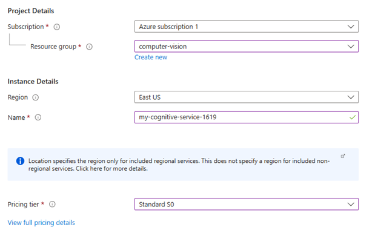
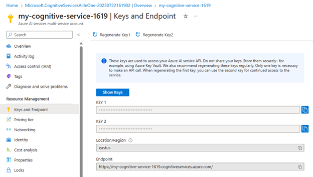
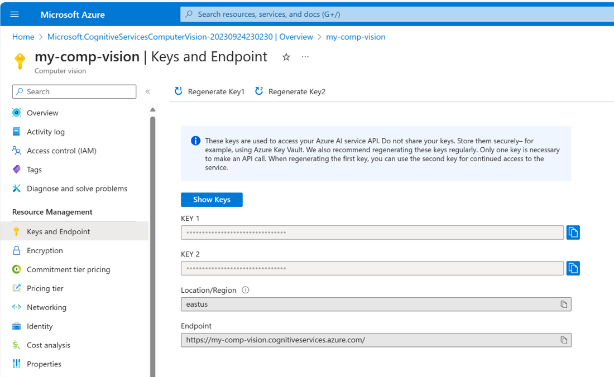
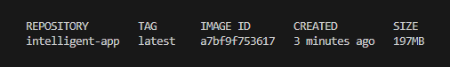
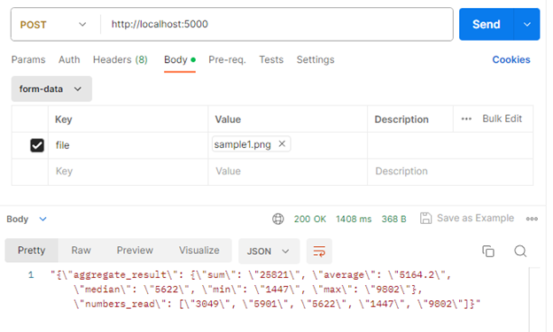

<head>
<meta property="og:url" content="https://azure.github.io/cloud-native/30daysofia/build-your-first-intelligent-app-with-azure-ai-and-aks-1"/>
<meta property="og:type" content="website"/>
<meta property="og:title" content="**Fall For Intelligent Apps! 🍂| Build AI Apps On Azure"/>
<meta property="og:description" content="Create an Intelligent App that leverages Azure AI Vision to analyze images and extract data."/>
<meta property="og:image" content="https://azure.github.io/Cloud-Native/img/ogImage.png"/>
    <meta name="twitter:url" 
      content="https://azure.github.io/Cloud-Native/30daysofIA/build-your-first-intelligent-app-with-azure-ai-and-aks-1" />
    <meta name="twitter:title" 
      content="**Fall For Intelligent Apps! 🍂 | Build AI Apps On Azure" />
    <meta name="twitter:description" 
      content="2-1. Create an Intelligent App that leverages Azure AI Vision to analyze images and extract data." />
    <meta name="twitter:image" 
      content="https://azure.github.io/Cloud-Native/img/ogImage.png" />
    <meta name="twitter:card" content="summary_large_image" />
    <meta name="twitter:creator" 
      content="@devanshidiaries" />
    <meta name="twitter:site" content="@AzureAdvocates" /> 
    <link rel="canonical" 
      href="https://azure.github.io/Cloud-Native/30daysofIA/build-your-first-intelligent-app-with-azure-ai-and-aks-1" />
</head>

<!-- End METADATA -->
Delve into creating an Intelligent App that leverages Azure AI Vision to analyze images and extract data. Develop an API to perform optical character recognition (OCR) on uploaded images and testing this API locally.

## What We'll Cover:

 * Understanding Azure AI Vision and Azure Kubernetes Service
 * Build a Python Web API to perform OCR
 * Test the API locally


## Jumpstart Your AI Journey: Building Your First Intelligent App with Azure AI and AKS (1)

An Intelligent App is a software application that uses artificial intelligence (AI), such as machine learning (ML), to extract meaningful insights, enabling users to make informed decisions based on the extracted text, data, sound, images, and more.

Intelligent Apps can employ advanced algorithms and models to recognize objects, patterns, and features within images, allowing them to perform tasks like object identification, image classification, facial recognition, and image segmentation.

To explore the power of Intelligent Apps, let’s build a Python app that performs [optical character recognition](https://learn.microsoft.com/en-us/azure/ai-services/computer-vision/overview-ocr?WT.mc_id=javascript-99907-ninarasi) (OCR) on images containing numbers and performs aggregate functions on the extracted numbers, like sum and average. We’ll leverage [Azure AI Services](https://azure.microsoft.com/en-ca/products/cognitive-services?WT.mc_id=javascript-99907-ninarasi) for the OCR functionality and [Azure Kubernetes Service](https://azure.microsoft.com/en-ca/products/kubernetes-service?WT.mc_id=javascript-99907-ninarasi) (AKS) to develop, publish, and maintain a cloud-based, scalable app in Azure.

Let’s get started!

## Understanding Azure AI Vision and Azure Kubernetes Service

Azure AI Vision is a cloud-based service that offers a range of advanced computer vision capabilities enabling applications to interpret content, such as images and videos, using ML and other AI algorithms. Azure computer vision lets users integrate powerful vision features into their projects without ML experience.

OCR is one of the critical functionalities within Azure vision service, allowing applications to extract text from images. Within Azure AI Vision service, OCR offers several features, including text extraction, multilingual support, layout analysis of documents, and integration with Azure services, such as [Azure Functions](https://azure.microsoft.com/en-ca/products/functions) and [Azure Machine Learning](https://azure.microsoft.com/en-ca/products/machine-learning).

:::info
Watch the intelligent apps webinar on **[Driving Business Value by Modernizing with Cloud-Native & AI](https://info.microsoft.com/ww-landing-driving-business-value-by-modernizing-with-cloud-native-and-ai.html?WT.mc_id=javascript-99907-ninarasi)** with *Microsoft* and *Forrester* on **September 26**. 
:::

AKS is Microsoft Azure’s container orchestration platform that enables us to quickly and efficiently deploy, manage, and scale containerized applications, such as our Intelligent App.

Let’s explore how to leverage these tools to build an Intelligent App that uses Azure AI Vision to analyze images and extract data.

### Prerequisites

To follow this tutorial, ensure you have the following:

- [Python 3.7](https://www.python.org/downloads/) or later installed
- [VS Code](https://code.visualstudio.com/download) or another integrated development environment (IDE) for writing Python code
- The [sample Python application](https://github.com/contentlab-io/Microsoft-Using-Azure-Kubernetes-Service-to-Deploy-an-Intelligent-App-for-Analyzing-Images-1/tree/main/Microsoft_Series17-18_Code/intelligent-app-before) downloaded
- [pip](https://pip.pypa.io/en/stable/installing/), the package manager for Python, installed
- [Docker Desktop](https://www.docker.com/products/docker-desktop/) installed. Ensure Docker is running on Linux containers.
- [Postman](https://www.postman.com/downloads/) installed. We’ll use this to test our API.
- A [free Azure account](https://azure.microsoft.com/free/?WT.mc_id=javascript-99907-ninarasi). Sign up if you don’t have one yet.
- The [Azure command-line interface](https://learn.microsoft.com/cli/azure/install-azure-cli?WT.mc_id=javascript-99907-ninarasi) (CLI)

For a preview of this final project, take a look at the [complete project code](https://github.com/contentlab-io/Microsoft-Using-Azure-Kubernetes-Service-to-Deploy-an-Intelligent-App-for-Analyzing-Images-1/tree/main/Microsoft_Series17-18_Code/intelligent-app-after).

### Building the API with Azure AI Vision Service

First, log in to your Azure account and navigate to the [Azure Portal](https://portal.azure.com).

Click **Create a resource** and search for “resource group.” Create a new resource group named `computer-vision`.


Return to the Azure Portal home page and click **Create a resource**.


Search for “computer vision” and select it from the results. Click **Create**.


Clicking **Create** displays the Create Computer Vision wizard. Select the resource group you just created as the Resource group from the dropdown. Enter a resource name similar to what is seen in the screenshot below. Note that this must be a unique name so choose one that is not currently in use. Select Standard S1 as the pricing tier and check the Responsible use of AI box in the field at the bottom.




Click **Review + Create**, then click **Create**.

Next, get the API key and endpoint from the Azure AI services multi-service account you created. Once the resource is created, navigate to the resource details page. Under **Resource Management**, select **Keys and Endpoint**. Once on the **Keys and Endpoint** page, you’ll find the **Key 1** and **Endpoint** values. These credentials are necessary to access the Azure AI APIs.





#### Configuring the Local Environment Variables

Next, we need to define a local environment variable file. This convenient way to store our API keys in a simple text file enables us to manage sensitive information and separate configuration from our API code.

If you haven’t done so already, clone the [starter project template](https://github.com/contentlab-io/Microsoft-Using-Azure-Kubernetes-Service-to-Deploy-an-Intelligent-App-for-Analyzing-Images) from GitHub into your local computer. Open the [starter project template](https://github.com/contentlab-io/Microsoft-Using-Azure-Kubernetes-Service-to-Deploy-an-Intelligent-App-for-Analyzing-Images/tree/main/Microsoft_Series17-18_Code/intelligent-app-before) in a code editor and create a new `.env` file in the root folder.

**Note**: Root folder in this case is the “/Microsoft_Series17-18_Code/intelligent-app-before" folder.

Add the following key-value pairs to the file, remembering to replace the placeholder values with those you obtained from the previous step.

```
VISION_KEY=<THE-KEY-1-VALUE-FROM-YOUR-AZURE-AI-SERVICE>
VISION_ENDPOINT=<THE-ENDPOINT-VALUE-FROM-YOUR-AZURE-AI-SERVICE>
```

#### Reviewing the Quickstart Code

Let’s review the `app.py` file in the starter project template.  

The `app.py` file works as the entry point for the Flask application. It is responsible for initializing the web server, listening for incoming requests, dispatching them to the appropriate route handlers, and generating responses. 

Below is the code contained in the `app.py` file:

```
import os
import json
 
from flask import Flask, request 
from flask_restful import Resource, Api
from werkzeug.utils import secure_filename

app = Flask(__name__,
      static_url_path='',
      static_folder='static/files')

api = Api(app)

app = Flask(__name__)

app.config['UPLOAD_FOLDER'] = 'files'

api = Api(app)

class UploadHandler(Resource):

  def allowed_file(self, filename):
    return '.' in filename and \
      filename.rsplit('.', 1)[1].lower() in {'png'}

  def post(self):
    form = request.form.to_dict()

    if 'file' not in request.files:
      return json.dumps({ "success": False, "error": "No file part"})

    file = request.files.get("file")
    if file and self.allowed_file(file.filename):
      filename = secure_filename(file.filename)
      upload_folder = "static/files"
      if not os.path.exists(upload_folder):
        os.makedirs(upload_folder)
      local_file_path = os.path.join(upload_folder, filename)
      file.save(local_file_path)

      return f"File {filename} uploaded successfully to folder: {upload_folder}"

api.add_resource(UploadHandler, "/")

if __name__ == '__main__':
  app.run(debug=True)

```

The `UploadHandler` class above is defined as a Flask RESTful resource to handle file uploads. The class contains two methods:

- The `allowed_file` method checks whether the file extension is allowed for upload. In this case, only `.png` files are allowed.

- The `post` method handles HTTP POST requests for file uploads. It saves the uploaded `.png` file to the `static/files` folder.

Finally, the application returns a text response informing us that the file has been uploaded successfully.

#### Implementing the REST API in Python

To implement image analysis in your REST API, open the starter project template in your terminal, [create a virtual environment](https://docs.python.org/3/library/venv.html), and [activate it](https://docs.python.org/3/library/venv.html#how-venvs-work).

Next, install the Azure AI Vision SDK:

```
pip install azure-ai-vision
```

Then, add the following line to the `requirements.txt` file to include the `azure-ai-vision` package:

```
azure-ai-vision==0.13.0b1
```

Now, create an `ocr_helper.py` file in the project’s root folder. This file is a Python module that provides functions for processing images using OCR. Add the following code to the file:

```
import os
from statistics import median
from decimal import Decimal
import azure.ai.vision as sdk

def process_ocr(source_image):
  service_options = sdk.VisionServiceOptions(os.environ["VISION_ENDPOINT"],
                       os.environ["VISION_KEY"])

  vision_source = sdk.VisionSource(filename=source_image)

  analysis_options = sdk.ImageAnalysisOptions()

  analysis_options.features = (
    sdk.ImageAnalysisFeature.CAPTION |
    sdk.ImageAnalysisFeature.TEXT
  )

  analysis_options.language = "en"

  analysis_options.gender_neutral_caption = True

  image_analyzer = sdk.ImageAnalyzer(service_options, vision_source, analysis_options)

  result = image_analyzer.analyze()

  ocr_result = get_ocr_result(result)

  return ocr_result

def get_ocr_result(result):
  string_list = []

  if result.reason != sdk.ImageAnalysisResultReason.ANALYZED:
    return sdk.ImageAnalysisErrorDetails.from_result(result)
  else:
    if result.text is not None:
      for line in result.text.lines:
        for word in line.words:
          string_list.append(word.content)

  number_list = convert_to_decimal_list(string_list)

  aggregate_result = aggregate_operations(number_list)

  return {
    "aggregate_result": aggregate_result,
    "numbers_read": string_list
  } 

def convert_to_decimal_list(string_list):
  return list(map(Decimal, string_list))

def aggregate_operations(numbers):
  result = {
    'sum': sum(numbers),
    'average': sum(numbers) / len(numbers),
    'median': median(numbers),
    'min': min(numbers),
    'max': max(numbers)
  `}`
  `return result`
```

This module uses the [azure-ai-vision](https://learn.microsoft.com/python/api/azure-ai-vision/?view=azure-python-preview?WT.mc_id=javascript-99907-ninarasi) package to analyze images, including capturing captions and extracting text from the image. The `process_ocr` function inputs an image file and performs the OCR analysis. The module is a convenient tool for analyzing text-based data in pictures and performing numerical computations based on that data.

Let’s review the different components of the `ocr_helper.py` module listed above and explore how its functions help our Intelligent App process images and perform aggregate operations:

- The `process_ocr` function takes the parameter `source_image`, which is the path of the image to be processed. The function then initializes the `VisionServiceOptions` using environment variables `VISION_ENDPOINT` and `VISION_KEY` to connect to the Azure AI Vision API.
- The `process_ocr` function creates a `VisionSource` object with the specified `source_image` file name. `ImageAnalysisOptions` specify the features to be analyzed, including `CAPTION` and `TEXT`. The language is set to English (`"en"`), and gender-neutral captions are enabled.
- Finally, an `ImageAnalyzer` object is created with the service options, vision source, and analysis options. The image is then analyzed using the `image_analyzer.analyze` method to retrieve OCR results. The recognized text from the OCR result is extracted, with numerical values stored in the `string_list` variable.
- The `convert_to_decimal_list` function converts the list of strings to a list of decimal numbers, which helps process numeric values extracted from the text.
- The `aggregate_operations` function calculates various aggregate statistics (sum, average, median, minimum, maximum) from a list of numbers and returns the results in a dictionary.

Note that you must have the appropriate credentials (`VISION_KEY`) and endpoint (`VISION_ENDPOINT`) configured for the Azure AI Vision API to use this module.

Finally, we must modify the `app.py` file so our code can use the `process_ocr` function of the `ocr_helper.py` file.

Add the following import statement to the `app.py` file: 

```
from ocr_helper import process_ocr
```

Then, replace this line:

`return f"File {filename} uploaded successfully to folder: {upload_folder}"`

With these two lines:

```
aggregates = process_ocr(local_file_path)
return json.dumps(aggregates, default=str)
```

Doing so allows our application to perform aggregate operations (sum, average, median, minimum, maximum) of any numeric values found in the text and return the operation’s result as a JSON response.

### Running the Intelligent App Locally

Our final goal is to deploy the sample app to AKS, which will run the app in a container. However, as a good practice, let’s run the app in a container locally before moving it to AKS. Doing so ensures that our application and its dependencies are encapsulated and can be run consistently across different environments.

#### Deploying to Docker Desktop

For our application to run on Docker, it needs two additional files: a Dockerfile and `docker-compose.yml`. A Dockerfile creates a single container image by specifying the steps to build it, and a `docker-compose.yml` file manages multiple containers as a cohesive application, defining their configurations and relationships. Dockerfile builds the image, while `docker-compose.yml` orchestrates multi-container applications.

In the project root folder, add a file named `Dockerfile` with the content below:

```
# syntax=docker/dockerfile:1

FROM python:3.8-slim-buster

WORKDIR /intelligentapp

COPY requirements.txt requirements.txt
RUN pip3 install -r requirements.txt

RUN pip install debugpy

COPY . .

CMD [ "python3", "-m" , "flask", "run", "--host=0.0.0.0"]
```

Now create a file named `docker-compose.yml` file in the project’s root folder with the following code, replacing the `VISION_KEY` and the `VISION_ENDPOINT` according to the environment variables you configured earlier:

```
version: '3.8'
services:
  intelligentapp:
    build:
      context: .
      dockerfile: Dockerfile
    image: intelligent-app
    ports:
      - 5000:5000
    container_name: intelligent-app
    environment:
      - VISION_KEY=<THE-KEY-1-VALUE-FROM-YOUR-AZURE-AI-SERVICE>
      - VISION_ENDPOINT=<THE-ENDPOINT-VALUE-FROM-YOUR-AZURE-AI-SERVICE>
```

Then, run the following command in the terminal to build the image and start a container for the Intelligent App services defined in the `docker-compose.yml` file: 

```
docker-compose up --build --force-recreate
```

Next, open a new terminal and run the command below to list the image deployed to your local Docker:

```
docker images
```



#### Testing the Intelligent App Locally

Now, we’ll test the Intelligent App’s functionality using the following test image:


This image is provided as `sample1.png` in the sample app source files, so you can easily use it in the next step.

The Intelligent App will read the image above using OCR to extract numbers in the image and perform five aggregate functions:

- Sum
- Average
- Median
- Min
- Max

To test the API, open Postman and fill out the fields as follows:

- **URL:** http://localhost:5000/
- **Method:** POST
- **Body:**
    - **Form-data**
        -  **Key**: File — Click the right end of the **Key** field and select **File** from the dropdown list.
        -  **Value**: Click **Select Files**, then select the **sample1.png** file provided in the sample code.



Now click the **Send** button and review the result body:

`"{\"aggregate_result\": {\"sum\": \"25821\", \"average\": \"5164.2\", \"median\": \"5622\", \"min\": \"1447\", \"max\": \"9802\"}, \"numbers_read\": [\"3049\", \"5901\", \"5622\", \"1447\", \"9802\"]}"`

As we can see, the app running on a local container returned the correct results based on the sample image. So, we’re ready to prepare our Azure resources to run the Intelligent App on AKS.

## Exercise

 * Complete this **hands-on sample** [project code](https://github.com/contentlab-io/Microsoft-Using-Azure-Kubernetes-Service-to-Deploy-an-Intelligent-App-for-Analyzing-Images-1/tree/main/Microsoft_Series17-18_Code/intelligent-app-after) to build your first intelligent app.
 * Complete the **[Apps Cloud Skills Challenge](https://aka.ms/fallforIA/apps-csc)** to build on your app dev and AI skills.
 * Watch the **[Ask the Expert: Azure Functions](https://reactor.microsoft.com/en-us/reactor/series/S-1037/)** session for live Q&A with the Product Engineering team on building intelligent apps.

 ## Next Steps

In this article, we explored the creation of an Intelligent App that leverages Azure AI Vision to analyze images and extract data. We learned how to build a Python Web API to perform OCR on uploaded images and subsequently test this API locally.

Head to the [next part](https://azure.github.io/Cloud-Native/30daysofIA/build-your-first-intelligent-app-with-azure-ai-and-aks-2), to deploy this API via Azure Kubernetes Service.