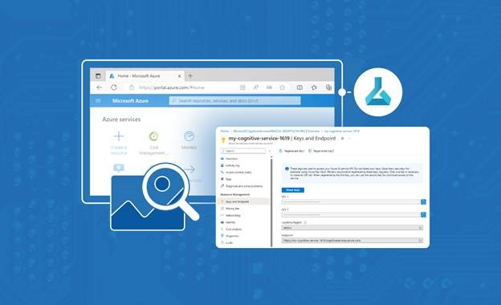

<head>
<meta property="og:url" content="https://azure.github.io/cloud-native/30daysofia/build-your-first-intelligent-app-with-azure-ai-and-aks-2"/>
<meta property="og:type" content="website"/>
<meta property="og:title" content="**Fall For Intelligent Apps! 🍂| Build AI Apps On Azure"/>
<meta property="og:description" content="Create an Intelligent App that leverages Azure AI Vision to analyze images and extract data."/>
<meta property="og:image" content="https://azure.github.io/Cloud-Native/img/ogImage.png"/>
    <meta name="twitter:url" 
      content="https://azure.github.io/Cloud-Native/30daysofIA/build-your-first-intelligent-app-with-azure-ai-and-aks-2" />
    <meta name="twitter:title" 
      content="**Fall For Intelligent Apps! 🍂 | Build AI Apps On Azure" />
    <meta name="twitter:description" 
      content="2-2. Create an Intelligent App that leverages Azure AI Vision to analyze images and extract data." />
    <meta name="twitter:image" 
      content="https://azure.github.io/Cloud-Native/img/ogImage.png" />
    <meta name="twitter:card" content="summary_large_image" />
    <meta name="twitter:creator" 
      content="@devanshidiaries" />
    <meta name="twitter:site" content="@AzureAdvocates" /> 
    <link rel="canonical" 
      href="https://azure.github.io/Cloud-Native/30daysofIA/build-your-first-intelligent-app-with-azure-ai-and-aks-2" />
</head>

<!-- End METADATA -->
In the last article, we created an Intelligent App that leverages Azure AI Vision to analyze images and extract data. Develop an API to perform optical character recognition (OCR) on uploaded images and testing this API locally. 

In this article, we will deploy the web API to the cloud platform using Azure Kubernetes Service. 

## What We'll Cover:

 * Understanding Azure AI Vision and Azure Kubernetes Service
 * Build a Python Web API to perform OCR
 * Test the API locally



## Jumpstart Your AI Journey: Building Your First Intelligent App with Azure AI and AKS (2)

In the previous article we explored the creation of an Intelligent App that leverages Azure AI Vision to analyze images and extract data. We learned how to build a Python Web API to perform OCR on uploaded images and subsequently test this API locally.  

In this article we will use [Azure Kubernetes Service](https://azure.microsoft.com/products/kubernetes-service?WT.mc_id=javascript-99907-ninarasi) (AKS) to develop, publish, and maintain our app in the cloud on Azure. 

Let’s get started!

### Prerequisites

To follow this tutorial, ensure you have completed [Jumpstart Your AI Journey: Building Your First Intelligent App with Azure AI and AKS (1)](https://azure.github.io/Cloud-Native/30daysofIA/build-your-first-intelligent-app-with-azure-ai-and-aks-1).

## Pushing a Container Image to Azure Container Registry (ACR)

To start, open your CLI or terminal and type the following command:

```
az login
```

Follow the instructions displayed on your browser to enter your Azure credentials.

Once authenticated, you’ll initiate a secure connection between your local environment and Azure. This process grants you access to cloud services and resources.

Next, type the command below in your terminal to set up a new Azure Container Registry (ACR) to store your container images:

```
az acr create --resource-group computer-vision --name <name-of-azure-container-registry> --sku Basic
```

Remember to replace `<name-of-azure-container-registry>` with your container registry name. The name must be unique within Azure and comply with [these rules](https://learn.microsoft.com/azure/azure-resource-manager/management/resource-name-rules#microsoftcontainerregistry).

The command above creates an [Azure Container Registry](https://azure.microsoft.com/products/container-registry?WT.mc_id=javascript-99907-ninarasi) (ACR) in the `computer-vision` resource group under the [Basic SKU](https://learn.microsoft.com/azure/container-registry/container-registry-skus?WT.mc_id=javascript-99907-ninarasi). This ACR is your secure and private repository for storing container images within Azure.

Next, log in to the registry with the following command:

```
az acr login -n <name-of-azure-container-registry>
```

The `az acr login` command above lets you securely authenticate and access the specified ACR without providing their Azure credentials each time.

Now, run the following command in your terminal. It will display the endpoint URL to log in to and interact with the ACR for pushing and pulling container images.

```
az acr show --name <name-of-azure-container-registry> --query loginServer --output table
```

This returns an endpoint URL as follows: 

    Result
    ----------------------------------
    <name-of-azure-container-registry>.azurecr.io

Now, run the following command to show all container images, their repository, tags, and size:

```
docker images
```

| REPOSITORY       | TAG       | IMAGE ID       | CREATED       | SIZE       |
|:--------------|:--------------|:--------------|:--------------|:--------------|
| intelligent-app  | latest  | a7bf9f753617  | 16 hours ago  | 197MB  |

Tags are necessary to push Docker images to a remote registry like Azure Container Registry. They also let you differentiate between different versions of the same image and upload or download the one you want.

Run the following command to tag your Docker image:

```
docker tag intelligent-app <name-of-azure-container-registry>.azurecr.io/intelligent-app:v1
```
Then, run the `docker images` command again to check your tagged image:

```
docker images
```

| REPOSITORY       | TAG       | IMAGE ID       | CREATED       | SIZE       |
|:--------------|:--------------|:--------------|:--------------|:--------------|
| intelligent-app  | latest  | c52168039265  | About a minute ago  | 197MB  |
| &lt;name-of-azure-container-registry&gt;.azurecr.io/intelligent-app  | v1  | c52168039265  | About a minute ago  | 197MB  |

Now run the following command so Docker can securely upload the image to your Azure Container Registry:

```
docker push <name-of-azure-container-registry>.azurecr.io/intelligent-app:v1
```

Once we've deployed the image to the container registry, AKS can access it during deployment.

:::info
Watch **[Episode 03](https://aka.ms/learnlive-contoso-app-deconstructed-Ep3)** for the Learn Live session to experience a guided session on how to build, test and deploy an end-to-end intelligent app solution.
:::

## Deploying the Intelligent App on Azure Kubernetes Service (AKS)

Before we deploy our Intelligent App to AKS, we need to provision an AKS cluster and define Kubernetes manifests.

To provision an AKS cluster to host our application, we specify the desired configurations for the cluster, such as the number of nodes, node size, and networking options. But first, download and install the Kubernetes command-line tools (kubectl), a client credential plugin implementing Azure authentication:

```
az aks install-cli
```

If you’re using Linux, [review this tutorial](https://learn.microsoft.com/en-us/cli/azure/install-azure-cli-linux?pivots=apt?WT.mc_id=javascript-99907-ninarasi). Then run the following: 

```
sudo az aks install-cli
```

Next, run the following command in your terminal to enable access to the networking-related resources and services provided by the `Microsoft.Network`` namespace in Azure: 

```
az provider register --namespace Microsoft.Network
```

Now, we must create an AKS cluster. Run the following command to create an AKS cluster named `aks-intelligent-app` in the `computer-vision` resource group.

```
az aks create --resource-group computer-vision --name aks-intelligent-app --node-count 1 --generate-ssh-keys
```

The command above specifies the target resource group: `computer-vision`. The [node pool](https://learn.microsoft.com/en-us/azure/aks/use-multiple-node-pools?WT.mc_id=javascript-99907-ninarasi) is configured with one virtual machine (VM), and the secure shell (SSH) keys for secure node access are generated automatically.

Next, run the following command to update the AKS cluster you created by attaching it to your ACR. Doing so allows the AKS cluster to pull container images from the specified ACR when deploying workloads to the cluster.

```
az aks update -n aks-intelligent-app -g computer-vision --attach-acr <name-of-azure-container-registry>
```

Then, run the command below to configure kubectl to work with our AKS cluster in the computer-vision resource group. 

```
az aks get-credentials --resource-group computer-vision --name aks-intelligent-app
```

The command above retrieves the necessary credentials and context information required for kubectl to communicate with the AKS cluster.

We still have to define the Kubernetes manifests written in YAML, describing the desired state of our application deployment, including containers, networking, and scaling rules. We’ll prepare these manifests, including [Deployment](https://kubernetes.io/docs/concepts/workloads/controllers/deployment/) and [Service](https://kubernetes.io/docs/concepts/services-networking/service/) configurations, to define how our application should be deployed and exposed.

Create a folder named `Deployment` in the project root directory. Next, create two files in the deployment folder: `deployment.yml` and `service.yml`.

Add the following configuration to the `deployment.yml` file, replacing the `<name-of-azure-container-registry>` placeholder with your registry’s name:

```
apiVersion: apps/v1
kind: Deployment
metadata:
  name: intelligent-app
spec:
  replicas: 1
  selector:
    matchLabels:
      app: intelligent-app
  template:
    metadata:
      labels:
        app: intelligent-app
    spec:
      nodeSelector:
        kubernetes.io/os: linux
      containers:
        - name: intelligent-app
          image: <name-of-azure-container-registry>.azurecr.io/intelligent-app:v1
          resources:
            limits:
              memory: 512Mi
              cpu: "1"
            requests:
              memory: 256Mi
              cpu: "0.2"
          ports:
            - containerPort: 5000
          env:
            - name: FLASK_DEBUG
              value: "1"
            - name: VISION_KEY
              value: <THE-KEY-1-VALUE-FROM-YOUR-AZURE-AI-SERVICE>
            - name: VISION_ENDPOINT
              value: <THE-ENDPOINT-VALUE-FROM-YOUR-AZURE-AI>
```

Additionally, edit the `VISION_KEY` and `VISION_ENDPOINT` environment variables above according to the API key and endpoint of your Azure AI Services instance.

Then, add the following configuration to the `service.yml` file:

```
apiVersion: v1
kind: Service 
metadata:
  name: intelligent-app-service
spec:
  type: LoadBalancer
  ports:
    - protocol: TCP
      port: 80
      targetPort: 5000
      name: port5000
  selector:
    app: intelligent-app
```

Now, we’ll deploy our application using kubectl. Applying the Kubernetes manifests creates the necessary resources and deploys our containerized application to the AKS cluster.

First, change the terminal to the `deployment` folder: 

```
cd Deployment 
```

Then, run the following command to create or update Kubernetes resources defined in the `deployment.yml` file:

```
kubectl apply -f deployment.yml
```

Create a Kubernetes Service resource in a Kubernetes cluster based on the configuration defined in the `service.yml` file using the code below: 

```
kubectl apply -f service.yml
```

Once you’ve applied the resource definition and the service configuration contained in the `deployment.yml` and the `service.yml` files, open the **aks-intelligent-app** Kubernetes Service in the Azure Portal, select **Workloads** under **Kubernetes resources** on the sidebar, and find the deployment named **intelligent-app**. It must have the status “Ready 1/1”. If you encounter an issue with this status, check out these [troubleshooting resources](https://learn.microsoft.com/en-us/troubleshoot/azure/azure-kubernetes/node-not-ready-basic-troubleshooting?WT.mc_id=javascript-99907-ninarasi).


## Testing the Intelligent App on AKS

To test the app on AKS, first, run the command below:

```
kubectl get services
```

This command lists the Services and their corresponding details, including the Service name, cluster IP address, external IP, and ports.

| NAME       | TYPE       | CLUSTER-IP       | EXTERNAL-IP       | PORT(S)       | AGE       |
|:--------------|:--------------|:--------------|:--------------|:--------------|:--------------|
| intelligent-app-service  | LoadBalancer  | 10.0.77.60  | 20.121.76.153  | 80:30936/TCP  | 47s  |
| kubernetes  | ClusterIP  | 10.0.0.1  | &lt;none&gt;  | 443/TCP  | 14m  |

The output above shows a Kubernetes Service named `intelligent-app-service` with a type set to `LoadBalancer`. It’s reachable from within the cluster using the cluster IP `10.0.77.60` and accessible externally via the external IP `20.121.76.153` on port 80 (mapped to port 30936).

**Note**: Your set of IP addresses will differ. Remember to use your unique external IP address when testing with Postman. 

To test the deployed app, go to Postman, replace the URL with the external IP of the Kubernetes Service you just deployed, and click **Send**:


As we can see, our Intelligent App has successfully deployed to AKS and is functioning on the cloud as expected.

## Exercise

* Complete this **hands-on** sample [project code](https://github.com/contentlab-io/Microsoft-Using-Azure-Kubernetes-Service-to-Deploy-an-Intelligent-App-for-Analyzing-Images-1/tree/main/Microsoft_Series17-18_Code/intelligent-app-after) to build your first intelligent app.
* Complete the [Apps Cloud Skills Challenge](https://aka.ms/fallforIA/apps-csc) to build on your app dev and AI skills.
* Register for [Ask the Expert: Azure Kubernetes Service](https://reactor.microsoft.com/en-us/reactor/series/S-1037/) session for live Q&A with the Product Engineering team on building intelligent apps.

## Next Steps

In this two-part article, we explored the creation of an Intelligent App that leverages Azure AI Vision to analyze images and extract data. We learned how to build a Python Web API to perform OCR on uploaded images and subsequently deploy this API via Azure Kubernetes Service.

Besides OCR and Image Analysis, you can continue exploring Azure’s vast array of services and experiment further with Azure AI and AKS by applying various practical uses to your Intelligent Apps, including natural language processing, speech recognition and synthesis, sentiment analysis for customer feedback, and automated content moderation.
