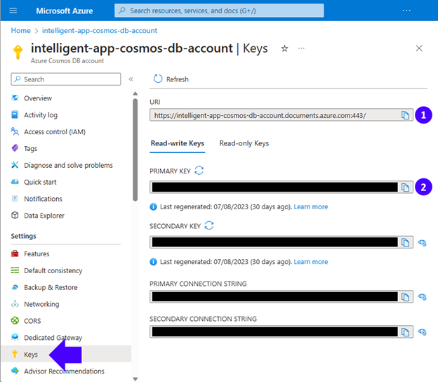
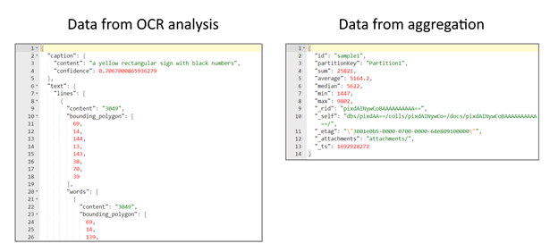

<head>
<meta property="og:url" content="https://azure.github.io/cloud-native/30daysofia/powering-intelligent-apps-with-azure-cosmos-db-2"/>
<meta property="og:type" content="website"/>
<meta property="og:title" content="**Fall For Intelligent Apps! 🍂| Build AI Apps On Azure"/>
<meta property="og:description" content="Explore the power of multi-model databases for Intelligent Apps and their integration with Azure Cosmos DB and Azure Kubernetes Service (AKS)."/>
<meta property="og:image" content="https://azure.github.io/Cloud-Native/img/ogImage.png"/>
    <meta name="twitter:url" 
      content="https://azure.github.io/Cloud-Native/30daysofIA/powering-intelligent-apps-with-azure-cosmos-db-2" />
    <meta name="twitter:title" 
      content="**Fall For Intelligent Apps! 🍂 | Build AI Apps On Azure" />
    <meta name="twitter:description" 
      content="2-4. Explore the power of multi-model databases for Intelligent Apps and their integration with Azure Cosmos DB and Azure Kubernetes Service (AKS)" />
    <meta name="twitter:image" 
      content="https://azure.github.io/Cloud-Native/img/ogImage.png" />
    <meta name="twitter:card" content="summary_large_image" />
    <meta name="twitter:creator" 
      content="@devanshidiaries" />
    <meta name="twitter:site" content="@AzureAdvocates" /> 
    <link rel="canonical" 
      href="https://azure.github.io/Cloud-Native/30daysofIA/powering-intelligent-apps-with-azure-cosmos-db-2" />
</head>

<!-- End METADATA -->
In this article, continue to explore the power of multi-model databases for Intelligent Apps and their integration with Azure Cosmos DB and Azure Kubernetes Service (AKS).

## What We'll Cover:

 * Loading OCR Data into the Multi-Model Database
 * Configuring the Intelligent App to Use Cosmos DB
 * Testing the app locally and deploying to AKS


## Powering Intelligent Apps with a Multi-Model Database Using Cosmos DB and Azure Kubernetes Service (2)  

In the [first article of this week](https://azure.github.io/Cloud-Native/30daysofIA/build-your-first-intelligent-app-with-azure-ai-and-aks-1), we created an Intelligent App that helped us analyze images and extract valuable data. We constructed a Python web API to execute [optical character recognition](https://learn.microsoft.com/azure/ai-services/computer-vision/overview-ocr?WT.mc_id=javascript-99907-ninarasi) (OCR) on images uploaded to the application using [Azure AI Vision](https://azure.microsoft.com/products/cognitive-services/vision-services?WT.mc_id=javascript-99907-ninarasi) and [Azure Kubernetes Service](https://azure.microsoft.com/products/kubernetes-service?WT.mc_id=javascript-99907-ninarasi) (AKS) for hosting the application.

In continuation of the [previous article](https://azure.github.io/Cloud-Native/30daysofIA/powering-intelligent-apps-with-azure-cosmos-db-1), we’ll continue to explore how Azure Cosmos DB’s support for multi-model databases provides flexibility in data modeling, scalability, and performance optimization—crucial for storing, indexing, and querying data in multiple formats.

## Loading OCR Data into the Multi-Model Database

Once we’ve created our Cosmos DB account and configured our containers, we can access them using the Azure Cosmos DB API with the appropriate host URI and key. You can find these credentials by selecting **Keys** on the sidebar, like in the image below:



### Configuring the Intelligent App to Use Cosmos DB

Now, we must provide the app with our Cosmos DB database credentials. We’ll do this using the environment variables in the deployment configuration file created in the first part of this series.

Open the `deployment.yml` file (in the `Deployment` folder) and add the following environment variables matching your Cosmos DB account information:

```
- name: COSMOS_ACCOUNT_CONNECTION_STRING
  value: <YOUR-COSMOS-ACCOUNT-PRIMARY-CONNECTION-STRING>
- name: COSMOS_ACCOUNT_HOST
  value: <YOUR-COSMOS-ACCOUNT-URI>
- name: COSMOS_ACCOUNT_KEY
  value: <YOUR-COSMOS-ACCOUNT-PRIMARY-KEY>
- name: COSMOS_DATABASE_ID
  value: IntelligentAppDB
- name: COSMOS_IMAGE_ANALYSIS_CONTAINER_ID
  value: ImageAnalysisContainer
- name: COSMOS_AGGREGATE_RESULTS_CONTAINER_ID
  value: AggregateResultsContainer
```

Then, open the `docker-compose.yml` file and add the following environment variables, copying the same values you defined above:

```
      - COSMOS_ACCOUNT_CONNECTION_STRING=<YOUR-COSMOS-ACCOUNT-PRIMARY-CONNECTION-STRING> 
      - COSMOS_ACCOUNT_HOST=<YOUR-COSMOS-ACCOUNT-URI> 
      - COSMOS_ACCOUNT_KEY=<YOUR-COSMOS-ACCOUNT-PRIMARY-KEY> 
      - COSMOS_DATABASE_ID=IntelligentAppDB 
      - COSMOS_IMAGE_ANALYSIS_CONTAINER_ID=ImageAnalysisContainer 
      - COSMOS_AGGREGATE_RESULTS_CONTAINER_ID=AggregateResultsContainer
```

### Diverse Data and Cosmos DB: A Perfect Match

The diverse and often unstructured nature of OCR data finds an ideal match in the flexible structure of a multi-model database like Azure Cosmos DB for NoSQL. OCR data frequently encompasses many document types, varying layouts, languages, and formatting styles, making it inherently challenging to impose a rigid schema.

The picture below represents the varying data layouts we’ll encounter in this article. The left-hand picture shows **Data from OCR analysis**, which contains AI-generated descriptions of the image, plus the characters read and their positions within it. The right-hand picture shows **Data from aggregation**—the numeric operations performed on the numbers read.



### Implementing the CosmosDBHelper Class

We need a Python class to provide a convenient way to interact with our Azure Cosmos DB service. It will encapsulate the necessary operations for creating and managing documents within the `ImageAnalysisContainer` and the `AggregateResultsContainer`.

Let’s create a file named `CosmosDBHelper.py` in the project root folder with the following contents:

```
import os 
import azure.cosmos.cosmos_client as cosmos_client 

class CosmosDBHelper: 

  def __init__(self):
    self.cosmos_database_id = os.environ["COSMOS_DATABASE_ID"]
    self.cosmos_image_analysis_container_id = os.environ["COSMOS_IMAGE_ANALYSIS_CONTAINER_ID"]
    self.cosmos_aggregate_results_container_id = os.environ["COSMOS_AGGREGATE_RESULTS_CONTAINER_ID"]
    cosmos_account_host = os.environ["COSMOS_ACCOUNT_HOST"]
    cosmos_account_key = os.environ["COSMOS_ACCOUNT_KEY"]
    self.client = cosmos_client.CosmosClient(cosmos_account_host, {'masterKey': cosmos_account_key})
  
  def create_analysis(self, document):
    db = self.client.get_database_client(self.cosmos_database_id)
    container = db.get_container_client(self.cosmos_image_analysis_container_id)
    return container.upsert_item(document)

  def create_aggregate_result(self, inserted_id, aggregate_result):
    db = self.client.get_database_client(self.cosmos_database_id)
    container = db.get_container_client(self.cosmos_aggregate_results_container_id)
    entity = {
      "id": inserted_id,
      "sum": float(aggregate_result["sum"]),
      "average": float(aggregate_result["average"]),
      "median": float(aggregate_result["median"]),
      "min": float(aggregate_result["min"]),
      "max": float(aggregate_result["max"])
    }
    return container.upsert_item(entity)
```

Let's break down the code step by step, detailing the process of transferring the OCR-extracted data into the Cosmos DB database.

The `azure.cosmos.cosmos_client` module imported at the beginning of the file represents the Azure Cosmos DB for NoSQL client library for Python. We use it to interact with the Azure Cosmos DB service.

The `CosmosDBHelper` class constructor initializes the class instance and retrieves configuration values from the environment variables we configured in the previous section:

* `COSMOS_DATABASE_ID`—The ID of the Cosmos DB database
* `COSMOS_IMAGE_ANALYSIS_CONTAINER_ID`—The ID of the container for storing image analysis documents
* `COSMOS_AGGREGATE_RESULTS_CONTAINER_ID`—The ID of the container for storing aggregate result documents
* `COSMOS_ACCOUNT_HOST`—The host URL for the Cosmos DB account
* `COSMOS_ACCOUNT_KEY`—The authentication key for the Cosmos DB account

The class constructor also creates a `CosmosClient` instance using the provided account host and key, which we’ll use in the methods below:

* The `create_analysis` method inserts or updates an image analysis document into the `ImageAnalysisContainer` container. It takes the document parameter, which represents the structured analysis data, to be inserted or updated. This method first fetches the database client using the provided database ID and the previously created Cosmos Client instance. Then, it fetches the container client for image analysis using the provided container ID. Finally, the `create_analysis` method calls the `upsert_item` method on the container client to insert or update the supplied document.

* The `create_aggregate_result` method inserts or updates an aggregate result document into the specified container. It takes two arguments: `inserted_id` (the document’s ID) and `aggregate_result` (a dictionary containing aggregated data like sum, average, median, min, and max). Similarly to the previous method, it fetches the database and container clients. Finally, the `create_aggregate_result` constructs an entity dictionary with the provided data and uses the `upsert_item` method to insert or update the entity in the `AggregateResultsContainer` container.

### Introducing New OCR Helper Functions

We need some additional Python functions to process and insert image analysis results into a Cosmos DB using the CosmosDBHelper class from the previous explanation. First, open the `ocr_helper.py` file from the first part of this series and add these import statements at the top of the file:

```
import json
from CosmosDBHelper import CosmosDBHelper
```

Next, locate these lines in the `ocr_helper.py` file:

```
  ocr_result = get_ocr_result(result) 
  return ocr_result 
```

Replace these lines with:

```
  ocr_result = get_ocr_result(result)
  analysis_result = get_image_analysis_result(result, source_image)
  ocr_result["analysis_result"] = analysis_result
  inserted_id = insert_analysis(ocr_result["analysis_result"])
  insert_aggregate_result(inserted_id, ocr_result["aggregate_result"])
  return ocr_result
```

Last, add the `get_image_analysis_result`, `insert_aggregate_result`, and `insert_analysis` functions: 

```
def get_image_analysis_result(result, source_image):

  analysis_result = { }
  string_list = []

  if result.reason != sdk.ImageAnalysisResultReason.ANALYZED:
    return sdk.ImageAnalysisErrorDetails.from_result(result)
  else:

    if result.caption is not None:
        analysis_result["caption"] = {
                                      "content": result.caption.content, 
                                      "confidence": result.caption.confidence 
                                      }        
        analysis_result["text"] = {
                                      "lines": []
                                  }
    if result.text is not None:
      for line in result.text.lines:
        line_result = {
                        "content": line.content,
                        "bounding_polygon": line.bounding_polygon,
                        "words": [],
                      }

        for word in line.words:
          word_result = {
                          "content": word.content,
                          "bounding_polygon": word.bounding_polygon,
                          "confidence": word.confidence
                        }
          string_list.append(word.content)
          line_result["words"].append(word_result)

        document_id = os.path.basename(source_image).rsplit('.', 1)[0]

        analysis_result["file_name"] = source_image
        analysis_result["text"]["lines"].append(line_result)
        analysis_result["id"] = document_id
        analysis_result["partitionKey"] = "Partition1"

      return analysis_result

def insert_aggregate_result(inserted_id, aggregate_result):
    db_helper = CosmosDBHelper()
    db_helper.create_aggregate_result(inserted_id, aggregate_result)

def insert_analysis(analysis_result):
    db_helper = CosmosDBHelper()
    doc = db_helper.create_analysis(analysis_result)
    return str(doc["id"])
```

Let's examine each function step by step.

* The `get_image_analysis_result` function takes two parameters: `result`, an image analysis result object, and `source_image`, the path to the source image. This function is responsible for the format transformation and data loading process: It creates an empty dictionary, `analysis_result`, and an empty list, `string_list`, to store words extracted from the text analysis. It checks if the `reason` attribute of the result indicates that the image has been successfully analyzed (not an error). The function iterates through each line in `result.text.lines` and processes the line’s content, bounding polygon, and words. In the end, the function returns the populated analysis_result dictionary.

* The `insert_aggregate_result` function takes two parameters: `inserted_id`, the ID of the inserted document, and aggregate_result, a dictionary containing aggregated analysis results (sum, average, median, min, max). It initializes an instance of the `CosmosDBHelper` class called `db_helper`. It calls the `create_aggregate_result` method of `db_helper` to insert the provided `aggregate_result` into the `AggregateResultsContainer` container.

* The `insert_analysis` function takes one parameter: `analysis_result`, a dictionary containing the image analysis results. It initializes an instance of the `CosmosDBHelper` class called `db_helper`. It then calls the `create_analysis` method of db_helper to insert the provided `analysis_result` into the Analysis Results container. The ID of the inserted document is retrieved from the returned document and converted to a string before being returned from the function.

The steps above highlight how the diverse and unstructured nature of OCR data, which we obtained from the Azure AI for Vision configured in the first article of this series, fits well with the flexible structure of a multi-model database.


## Exploring Real-World Use Cases for Multi-Model Databases

Numerous industries can benefit from leveraging multi-model databases when building Intelligent Apps. Below are just a few real-world examples:

* **E-commerce personalization**—Multi-model databases allow e-commerce platforms to store and manage various data types, such as customer profiles, product details, purchase history, and user-generated content like reviews and images.
* **Healthcare patient records**—Multi-model databases can help manage diverse patient data in the healthcare sector, like diagnoses and medications, semi-structured data like doctors' notes, and unstructured data like medical images and test results.
* **Social media analytics**—Multi-model databases find applications in social media platforms for handling the vast and varied data users generate, such as user profiles, connections, posts, images, videos, and textual content. The databases enable social platforms to execute quick and complex queries for real-time analytics.
* **Cosmos DB’s schema**-agnostic approach helps it seamlessly adapt to this diversity, enabling our Intelligent App to store OCR analysis and aggregation data as JSON documents without predefined structures.

Unlike traditional relational databases, the flexibility of a multi-model database like Cosmos DB for NoSQL ensures that the database can accommodate the ever-evolving OCR data without frequent schema modifications. This quality makes it a robust choice for our Intelligent App, which processes diverse documents and requires rapid adaptability.

## Exercise

* Complete this **hands-on sample** [project code](https://github.com/contentlab-io/Microsoft-Using-Azure-Kubernetes-Service-to-Deploy-an-Intelligent-App-for-Analyzing-Images-2/tree/main/Microsoft_Series_19-20_Code/intelligent-app-after-pt2) to build your intelligent app with multi-modal databases.  
* Complete the **[Apps Cloud Skills Challenge](https://aka.ms/fallforIA/apps-csc)** to build on your app dev and AI skills.  
* Register for **[Ask the Expert: Azure Kubernetes Service](https://reactor.microsoft.com/reactor/series/S-1037/)** session for live Q&A with the Product Engineering team on building intelligent serverless apps.

## Next Steps

Multi-model databases are invaluable for Intelligent Apps, offering intelligent indexing, caching, and query optimization for swift data access. They accommodate various data structures like documents, graphs, and key-value pairs, enabling cohesive data management, streamlined development, and insightful analysis—promoting limitless scalability and letting us adapt data to numerous formats without compromising efficiency.

Discover [Azure’s Cosmos DB and other services](https://learn.microsoft.com/azure/architecture/data-guide/technology-choices/data-storage#azure-cosmos-db?WT.mc_id=javascript-99907-ninarasi) to unlock even more potential in your Intelligent Apps—and carry on to the third and final topic of this week to learn how to take your Intelligent Apps to the next level with Azure Kubernetes Service in the next article. 