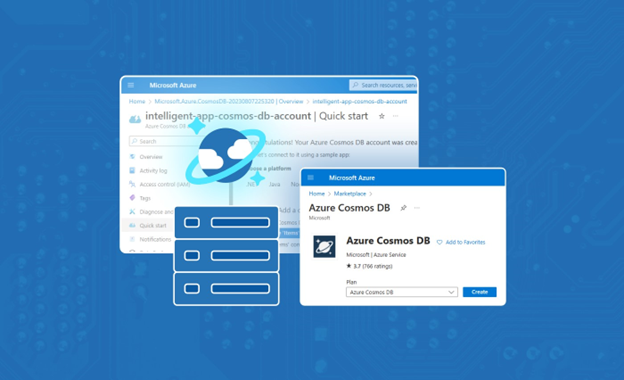
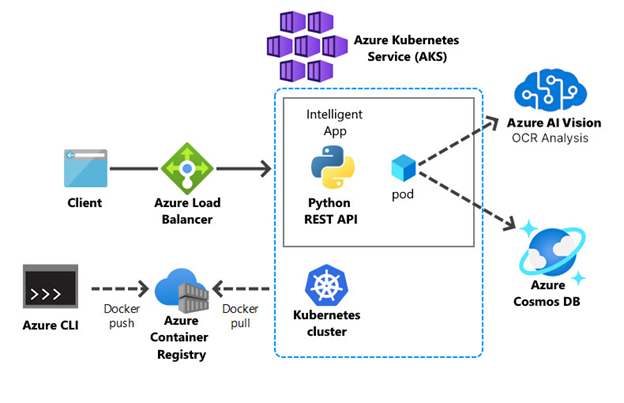
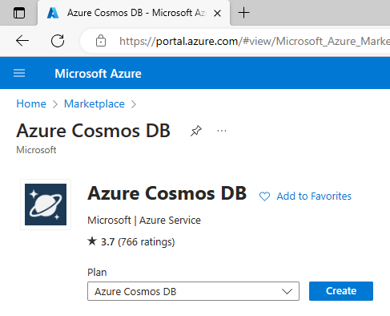
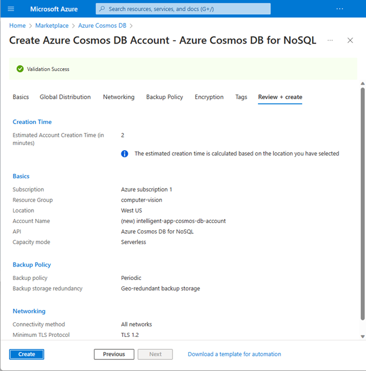
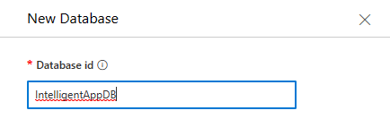
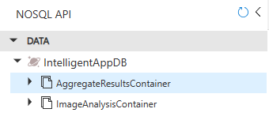

<head>
<meta property="og:url" content="https://azure.github.io/cloud-native/30daysofia/powering-intelligent-apps-with-azure-cosmos-db-1"/>
<meta property="og:type" content="website"/>
<meta property="og:title" content="**Build Intelligent Apps! | Build AI Apps On Azure"/>
<meta property="og:description" content="Explore the power of multi-model databases for Intelligent Apps and their integration with Azure Cosmos DB and Azure Kubernetes Service (AKS)."/>
<meta property="og:image" content="https://azure.github.io/Cloud-Native/img/ogImage.png"/>
    <meta name="twitter:url" 
      content="https://azure.github.io/Cloud-Native/30daysofIA/powering-intelligent-apps-with-azure-cosmos-db-1" />
    <meta name="twitter:title" 
      content="**Build Intelligent Apps! | Build AI Apps On Azure" />
    <meta name="twitter:description" 
      content="2-3. Explore the power of multi-model databases for Intelligent Apps and their integration with Azure Cosmos DB and Azure Kubernetes Service (AKS)" />
    <meta name="twitter:image" 
      content="https://azure.github.io/Cloud-Native/img/ogImage.png" />
    <meta name="twitter:card" content="summary_large_image" />
    <meta name="twitter:creator" 
      content="@devanshidiaries" />
    <meta name="twitter:site" content="@AzureAdvocates" /> 
    <link rel="canonical" 
      href="https://azure.github.io/Cloud-Native/30daysofIA/powering-intelligent-apps-with-azure-cosmos-db-1" />
</head>

<!-- End METADATA -->
In this article, explore the power of multi-model databases for Intelligent Apps and their integration with Azure Cosmos DB and Azure Kubernetes Service (AKS).

## What We'll Cover:

 * What is a multi-model database?
 * Concepts of Azure Cosmos DB
 * Creating a Multi-Model Database with Cosmos DB and AKS

## Powering Intelligent Apps with a Multi-Model Database Using Cosmos DB and Azure Kubernetes Service (1) 

In the [first topic of this week](https://azure.github.io/Cloud-Native/30daysofIA/build-your-first-intelligent-app-with-azure-ai-and-aks-1), we created an Intelligent App that helped us analyze images and extract valuable data. We constructed a Python web API to execute [optical character recognition](https://learn.microsoft.com/azure/ai-services/computer-vision/overview-ocr?WT.mc_id=javascript-99907-ninarasi) (OCR) on images uploaded to the application using [Azure AI Vision](https://azure.microsoft.com/products/cognitive-services/vision-services?WT.mc_id=javascript-99907-ninarasi) and [Azure Kubernetes Service](https://azure.microsoft.com/products/kubernetes-service?WT.mc_id=javascript-99907-ninarasi) (AKS) for hosting the application.  

In this second topic for the week, we’ll explore how Azure Cosmos DB’s support for multi-model databases provides flexibility in data modeling, scalability, and performance optimization—crucial for storing, indexing, and querying data in multiple formats.   

## Unraveling Multi-Model Databases and Cosmos DB

Multi-model databases let us store and work with data in multiple formats, including relational data, JSON documents, key-value pairs, spatial data, and graphs. They simplify development, reduce data integration issues, and support a more comprehensive data analysis, leading to valuable insights.

Below are some of the benefits of using a multi-model database:

* **Scalability and performance**—Multi-model databases allow us to shape data to fit different formats. We can tailor these databases to our applications, spreading data across clusters to support efficient, smooth scaling. Additionally, they support intelligent indexing, caching, and query optimization to ensure fast and efficient data access, even when handling complex queries.
* **Versatility**—Multi-model databases support versatility by accommodating diverse data types and structures within a unified platform. Unlike traditional databases, they seamlessly integrate storing and retrieving various data formats, enabling us to dynamically model and manage complex information.
* **Data handling and transformation advantages**—Because a multi-model database supports different data structures, it can easily handle structured, semi-structured, and unstructured data. These databases offer a transformative advantage in applications dealing with diverse and unstructured data. Their ability to manage various data types ensures a holistic and agile data storage, retrieval, and analysis approach. As such, multi-model databases enable streamlined development, simplified integration, and flexible querying.
* **OCR analysis**—Multi-model databases are invaluable assets for managing the complex needs of diverse data from OCR analysis. This flexibility in data handling means efficient storage and retrieval of OCR results, enabling complex queries that reveal deeper insights across various data types.

[Azure Cosmos DB](https://azure.microsoft.com/products/cosmos-db?WT.mc_id=javascript-99907-ninarasi) is Azure’s top-tier multi-model database service, compatible with various popular data models and APIs. It effortlessly handles numerous data types, providing developers a unified platform for various application purposes.

Supporting several APIs, including native NoSQL, and open-source APIs for MongoDB, Apache Cassandra, Gremlin, and Table, Cosmos DB enable smooth transition and integration of current apps and aids in building new ones. This adaptability in data modeling ensures quick adjustments to evolving needs, maintaining low latency, global distribution, and high availability.

Let’s explore the power of multi-model databases for Intelligent Apps.

### Creating a Multi-Model Database with Cosmos DB and AKS

In the following sections, we’ll walk through how Azure Cosmos DB can handle the unstructured data from the OCR analysis and provide multi-model databases for our Intelligent App while hosting it in AKS.

:::info
Watch the intelligent apps webinar on **[Driving Business Value by Modernizing with Cloud-Native & AI](https://info.microsoft.com/ww-landing-driving-business-value-by-modernizing-with-cloud-native-and-ai.html?lcid=en-us)** with *Microsoft* and *Forrester*.

Explore how modernization sets the stage for incorporating AI/ML into existing applications and how building new, intelligent applications can drive innovation and competitive advantage across a range of industries. Walkthrough a showcase of real-world use cases that demonstrate how AI can be seamlessly integrated into cloud-native environments driving tangible business value.  
:::

### Prerequisites

To follow this tutorial, ensure you have:  

* Read through the [first topic of this week](https://azure.github.io/Cloud-Native/30daysofIA/build-your-first-intelligent-app-with-azure-ai-and-aks-1). 
* [Python 3.7](https://www.python.org/downloads/) or later installed  
* [VS Code](https://code.visualstudio.com/download) or another integrated development environment (IDE) for writing Python code  
* The [sample Python application](https://github.com/contentlab-io/Microsoft-Using-Azure-Kubernetes-Service-to-Deploy-an-Intelligent-App-for-Analyzing-Images-2/tree/main/Microsoft_Series_19-20_Code/intelligent-app-before-pt2) downloaded  
* [pip](https://pip.pypa.io/en/stable/installing/), the package manager for Python, installed  
* A [free Azure account](https://azure.microsoft.com/free/?WT.mc_id=javascript-99907-ninarasi). Sign up if you don’t have one yet. 
* The [Azure command-line interface](https://learn.microsoft.com/cli/azure/install-azure-cli?WT.mc_id=javascript-99907-ninarasi) (CLI)

For a look at the final project from this tutorial, review the [complete code](https://github.com/contentlab-io/Microsoft-Powering-Intelligent-Apps-with-Cosmos-DB-and-Azure-Kubernetes-Service/tree/main/PartTwo_IntelligentApp_After).

### Solution Architecture

The image below shows the architecture of the solution we’re aiming for in this article.

### Creating an Azure Cosmos DB for NoSQL Account

This section provides step-by-step instructions for setting up a multi-model database with Cosmos DB in your AKS environment. We’ll focus on the preparation, design, and configuration stages.  

Note that an Azure Cosmos DB for NoSQL account isn’t related to your Azure account. An Azure Cosmos DB for NoSQL account is a database service provided by Microsoft Azure for creating, managing, and scaling globally distributed, multi-model databases.  

An Azure Cosmos DB account provides a collection of Azure Cosmos DB assets, such as databases, containers, and items. It also offers an endpoint that facilitates connections for various tools and SDKs, enabling actions within Azure Cosmos DB. For deeper insight into the assets within Azure Cosmos DB, refer to the [Azure Cosmos DB resource model](https://learn.microsoft.com/azure/cosmos-db/resource-model?WT.mc_id=javascript-99907-ninarasi).  

Let’s create an Azure Cosmos DB account using the API for NoSQL. First, [sign](https://portal.azure.com/) in to the Azure portal. From the Azure portal menu or the [homepage](https://portal.azure.com/#home), select **Create a resource**.  

On the **Create a resource** page, search for **Azure Cosmos DB**.

When the results appear, locate the **Azure Cosmos DB** service, then click **Create**.

Next, you’ll see the **Azure Cosmos DB** service page as follows:

The API determines the type of account to create. Select **Azure Cosmos DB API for NoSQL** and click **Create**.

When you reach the Create **Azure Cosmos DB Account** page, enter the settings below for the new account, then click **Review + create**.

 * **Resource Group**: computer-vision
 * **Account Name**: This should be unique to you.
 * **Capacity mode**: Serverless

Finally, review your settings and click the **Create** button.

Next, wait a few minutes until Azure creates the account and click the **Go to resource** button. Wait for the portal to display your new Cosmos DB account’s overview.

We still need to create the NoSQL database. So, select **Data Explorer** on the sidebar. Then select the **New Container** dropdown menu and select **New Database**:

Next, provide “IntelligentAppDB” as the **Database id** and click **OK**:

Now, select the **IntelligentAppDB** database, click the ellipsis (...) icon, and click the **New Container** option:

Provide “ImageAnalysisContainer” as the **Container id** and “Partition1” as the partition key. Then, click **OK** to save the container.

Repeat the previous step to create a new container. Provide “AggregateResultsContainer” as the **Container id** and “/id” as the **Partition key**. Then click **OK** to save the database.

Now, your database and container structure should appear like the image below:

Let’s review the elements of this Cosmos DB setup:  

* **IntelligentAppDB** is a database within Cosmos DB, serving as a high-level container for grouping related data relevant to our Intelligent App.  
* **AggregateResultsContainer** is a container within the IntelligentAppDB database. Containers are where data is stored in Cosmos DB, and this particular container holds data related to aggregate results generated from the Intelligent App.  
* **ImageAnalysisContainer** is another container within the same IntelligentAppDB database. It’s dedicated to storing data pertaining to OCR analysis generated by Azure AI Vision.  

## Exercise

* Complete this **hands-on sample** [project code](https://github.com/contentlab-io/Microsoft-Powering-Intelligent-Apps-with-Cosmos-DB-and-Azure-Kubernetes-Service/tree/main/PartTwo_IntelligentApp_After) to build your intelligent app with multi-modal databases.  
* Complete the **[AI Cloud Skills Challenge](https://aka.ms/fallforIA/ai-csc)** to build on your app dev and AI skills.  
* Register for **[Ask the Expert: Azure Kubernetes Service](https://reactor.microsoft.com/reactor/series/S-1037/)** session for live Q&A with the Product Engineering team on building intelligent serverless apps.

## Next Steps

Continue to the [next part of this topic](https://azure.github.io/Cloud-Native/30daysofIA/powering-intelligent-apps-with-azure-cosmos-db-2) to further explore loading OCR data into the multi-model database with Azure Cosmos DB, testing the app locally and deploying new version of the intelligent app to Azure Kubernetes Service. Furthermore, learn more about the real-world use cases for multi-model databases.