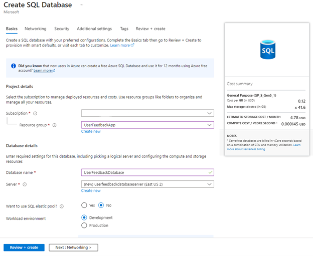
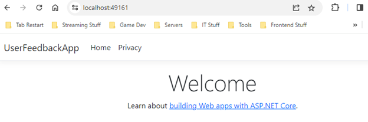
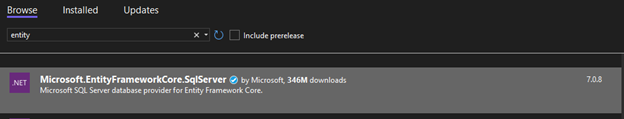
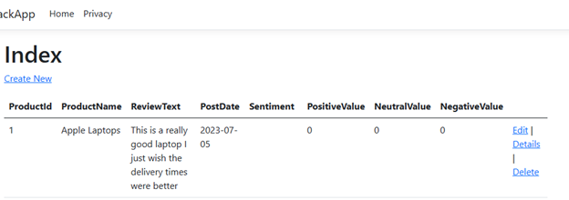

<head>
<meta property="og:url" content="https://azure.github.io/cloud-native/30daysofia/deploy-an-intelligent-app-on-azure-container-apps-1"/>
<meta property="og:type" content="website"/>
<meta property="og:title" content="Build Intelligent Apps!| Build AI Apps On Azure"/>
<meta property="og:description" content="Create a user feedback analysis application by setting up an Azure environment to deploy and manage the app using Azure Container Apps and Azure AI"/>
<meta property="og:image" content="https://azure.github.io/Cloud-Native/img/ogImage.png"/>
    <meta name="twitter:url" 
      content="https://azure.github.io/Cloud-Native/30daysofIA/deploy-an-intelligent-app-on-azure-container-apps-1" />
    <meta name="twitter:title" 
      content="Build Intelligent Apps! | Build AI Apps On Azure" />
    <meta name="twitter:description" 
      content="3-1. Create a user feedback analysis application by setting up an Azure environment to deploy and manage the app using Azure Container Apps and Azure AI." />
    <meta name="twitter:image" 
      content="https://azure.github.io/Cloud-Native/img/ogImage.png" />
    <meta name="twitter:card" content="summary_large_image" />
    <meta name="twitter:creator" 
      content="@devanshidiaries" />
    <meta name="twitter:site" content="@AzureAdvocates" /> 
    <link rel="canonical" 
      href="https://azure.github.io/Cloud-Native/30daysofIA/deploy-an-intelligent-app-on-azure-container-apps-1" />
</head>

<!-- End METADATA -->
In this article, explore how to create a user feedback analysis application by setting up an Azure environment to deploy and manage the app using [Azure Container Apps](https://learn.microsoft.com/en-us/azure/container-apps/?WT.mc_id=javascript-99907-ninarasi) and [Azure AI](https://learn.microsoft.com/en-us/azure/ai-services/?WT.mc_id=javascript-99907-ninarasi).

## What We'll Cover:

 * Understanding Azure AI and Azure Container Apps 
 * Setting up your Azure environment
 * Designing the intelligent application


## Deploy an Intelligent App on Azure Container Apps with Azure AI (1)

As developers, we’re all acutely aware of how artificial intelligence (AI) has transformed and revolutionized application development. AI technologies like machine learning (ML) and natural language processing (NLP) have enabled us to create a personalized, adaptive user experience—Intelligent Apps. Intelligent Apps leverage AI algorithms to learn from user interactions and make real-time decisions. 

As the demand for Intelligent Apps continues to soar, we’ll increasingly need to integrate AI components into our applications. This work can be complex and resource-intensive, but it doesn’t have to be. 
 
In this article—the first of a series on building Intelligent Apps with [Azure Container Apps](https://learn.microsoft.com/en-us/azure/container-apps/?WT.mc_id=javascript-99907-ninarasi)—we’ll explore how to incorporate AI into an application and transition that app to production. We’ll create a user feedback analysis application and walk through setting up an Azure environment, then deploying and managing the app using Azure Container Apps.

### Solution Architecture

The image below shows the architecture of the solution we’re aiming for in this article.


## Understanding Azure AI and Azure Container Apps

In this tutorial, we’ll use a combination of [Azure OpenAI](https://azure.microsoft.com/en-us/products/ai-services/openai-service?WT.mc_id=javascript-99907-ninarasi)—a tool for creating Intelligent Apps using large language models (LLMs)—and [Azure Container Apps](https://azure.microsoft.com/en-us/products/container-apps?WT.mc_id=javascript-99907-ninarasi)—a fully managed Kubernetes-based platform that helps us deploy from containers and code. These two dynamic tools will serve as the backbone of our app’s functionality. 
 
Azure Open AI will infuse intelligence into our application through APIs that process our data. Specifically, we’ll leverage the [Sentiment Analysis API](https://azure.microsoft.com/en-ca/products/cognitive-services/language-service/?WT.mc_id=javascript-99907-ninarasi) to assess customer sentiment from their feedback and reviews. 
 
On the front end, we’ll employ Azure Container Apps to deploy our Kubernetes-based application. This approach relieves us from worrying about any infrastructure orchestration, enabling our application to scale up and down to meet load requirements. 
 
Finally, we’ll use [Azure SQL Database](https://learn.microsoft.com/en-us/azure/azure-sql/azure-sql-iaas-vs-paas-what-is-overview?view=azuresql&viewFallbackFrom=azuresql&WT.mc_id=3Djavascript-99907-ninarasi) to store both the feedback and sentiment datasets. 


:::info
Watch the [on-demand Learn Live serverless series](https://azure.github.io/Cloud-Native/Build-IA/LearnLive/?WT.mc_id=javascript-99907-ninarasi) that deconstructs a reference architecture for building intelligent apps using Azure Container Apps and Azure AI.
:::

## Prerequisites 

To follow this tutorial, you’ll need:

 * An Azure account. Signing up for a [free account](https://azure.microsoft.com/en-us/free/) gives you complimentary credits for the first month and access to a number of basic services. When you create a new account, you’ll have to provide a credit card to verify transactions in case you use more resources than your allocation. For these articles, we’ll minimize spending as much as possible.
 * [Docker Desktop](https://www.docker.com/products/docker-desktop/) version 3.5.1 or newer installed
 * [Visual Studio](https://visualstudio.microsoft.com/vs/community/) installed. This demonstration uses Community Edition 2022.
 
To see the project in action, check out the [complete project code](https://github.com/contentlab-io/Microsoft-Building-Your-First-Intelligent-App-with-Azure-Cognitive-Services/tree/main/Microsoft_Series_2_Code/Source%20-%20Article%207%20%2B%208/UserFeedbackApp/Models). 

## Setting Up Your Azure Environment

Before we design our application, we need to configure our Azure environment, Visual Studio, and a basic application template. 
 
First, we need an Azure account with a resource group ready to deploy our application. We’ll start by creating a new resource group to hold all our project items. Log in, click **Resource Groups**, and hit **Create**.


Now, name your resource group and set the location. For this demo, we’ll name the resource group “UserFeedbackApp” and select **East US** as the default region. Next, click **Review + create**.


Now, navigate to the resource group section in Azure Portal on the left. Open it and create a new Azure AI multi-service instance. To do this, search for “Azure AI” in the Azure Marketplace and add it. 
 
You’ll now have to name and configure the instance. For this demonstration, we’ll use “UserFeedbackAppAI” and leave everything else as the default. 
 
**Note:** The defaults are fine for this tutorial, but in a production environment, you may want to configure the instance under the **Network** tab for better access. 
 
We also need to create an SQL Database to store our data. Back in the Azure Marketplace, search for Azure SQL to spot the SQL Database option. Create a database and a server to host it in the same resource group we just created. 
 
This demonstration uses the development tier and a basic server to keep costs low. Name the SQL database “UserFeedbackDatabase” and use a local administrator account rather than the identity-based access option.



Next, we need to create several resources for the container application itself. Open Visual Studio and select **Create a new project**. Go with the new, standard **ASP.NET Core Web App (Model-View-Controller)** option for this tutorial. Find that template, name your project, and select a location to save it.


To containerize our application, we need to select **Enable Docker** on the next screen. This option bundles our application with a Dockerfile, which is essential for building the infrastructure to support it. Leave the default Linux OS selected for the Docker container. 


Now, allow Visual Studio to build the templated project.
 
Next, run the application using Docker from Visual Studio. Once there, click **play** to build and run the application, push it to your local Docker environment, and launch a web browser to view the static opening page.



With our application running locally, it’s time to publish it. We do this so we can create the required container resources and have Visual Studio keep the configuration in our publishing profile. Right-click on the project, choose **Publish**, add a profile for publishing, click **Azure**, and name it **Azure Container Apps (Linux)**.
 
On the Container App screen, double-check that you’re logged into your Azure account and that your subscription name is populated. Click **Create new**. Give your application and container a name, ensuring the right subscription and resource group are selected. You can also specify/name the Container Apps environment by selecting **New**. Otherwise, keep the default name. 
 
Finally, click **Create** to finalize the Container App setup.


We also need to specify a [Container Registry](https://azure.microsoft.com/en-ca/products/container-registry) to store the application and its configuration that we’ll publish into the container. Name the registry a name (let’s say, “UserFeedbackAppRegistry”) and click **Create**. 
 
During the container-building process, you’ll have to enable admin rights for the container. Click **Yes** and wait for the infrastructure to build.
 
Now, you can use the publish profile to push your Azure Web App to your Container App on Azure. Check out the infrastructure you’ve created by opening the Azure Portal and navigating to the **Resource** folder.


## Designing the Intelligent App

With the groundwork laid, it’s time to design and develop our application. This tutorial revolves around a simple use case: building a merchandise store feedback function. It will allow users to select a product and leave feedback using freeform text. 
 
Next, we’ll save that feedback to our database. Subsequently, we’ll send a call to the Azure AI API to perform sentiment analysis on the feedback, and then store the outcome in our database. Finally, based on these results, we’ll create a report page showing our product sentiment.
 
Let’s get started.

### Building the Basic App

Our goal is to enable users to leave feedback on a selection of products for future sentiment analysis. To facilitate this, we need a basic web application with database read and write capabilities.

### Adding the Models and Connecting the Database

The initial function on our checklist is the capability to retrieve various products from our SQL database. This will allow us to populate a drop-down menu displaying a list of our products, which users can then write a review for. 
 
To configure the database connection for our application, install the following packages using the Package Manager in Visual Studio:
 
 * `Microsoft.EntityFrameworkCore`
 * `Microsoft.EntityFrameworkCore.Tools`
 * `Microsoft.EntityFrameworkCore.SqlServer`




Next, create two models for your data—a `Product` and a `Review`—by adding the following code to the Models folder. First, create a `Product.cs` file with the following code: 

```
namespace UserFeedbackApp.Models
{
    public class Product
    {
        public int Id { get; set; }
        public string Name { get; set; }
    }
}
```
 
Then, create a `Review.cs` file in the models directory with the following code:

``` 
namespace UserFeedbackApp.Models
{
    public class Review
    {
        public int Id { get; set; }
        public int ProductId { get; set; }
        public string ProductName { get; set; }
        public string ReviewText { get; set; }
        public string PostDate { get; set; }
 
        public string Sentiment { get; set; }
        public float PositiveValue { get; set; }
        public float NeutralValue { get; set; }
        public float NegativeValue { get; set; }
    }
}
```

To bridge the gap between our models and the interface, we need a `DbContext` class. Create a `DatabaseContext.cs` file within the Models folder and populate it as follows:

```
using Microsoft.EntityFrameworkCore;
 
namespace UserFeedbackApp.Models
{
    public class DatabaseContext : DbContext
    {
        private readonly string _connectionString;
 
        public DatabaseContext(DbContextOptions<DatabaseContext> options) : base(options)
        {
        }
 
        protected override void OnConfiguring(DbContextOptionsBuilder optionsBuilder)
        {
            base.OnConfiguring(optionsBuilder);
        }
 
        public DbSet<Product> Products => Set<Product>();
        public DbSet<Review> Reviews => Set<Review>();
    }
}
```

The next step is to configure a connection to the Azure SQL database we just created. Double-click **Connected Services** in your project hierarchy and add a new **Service Dependency**. Select **Azure SQL database** and locate the one you created earlier. Then, edit the dependency details, ensuring you assign a database connection string name — you’ll use it shortly. Click **Finish**.


This action creates the connection details for our database. 
 
Now, modify the `Program.cs` file to establish a connection to the database using the following code:

```
using Microsoft.EntityFrameworkCore;
using UserFeedbackApp.Models;
 
var builder = WebApplication.CreateBuilder(args);
 
// Add Database Context
if (builder.Environment.IsDevelopment())
{
    builder.Services.AddDbContext<DatabaseContext>(options =>
        options.UseSqlServer(builder.Configuration["userfeedbackdatabaseconnection"]));
}
else
{
    builder.Services.AddDbContext<DatabaseContext>(options =>
        options.UseSqlServer(Environment.GetEnvironmentVariable("AZURE_SQL_CONNECTIONSTRING")));
}
```

This code uses an if statement to check the application’s environment, either development or production. Depending on the environment, it uses either our local connection secret in development or the Azure connection string when published. 

### Building the Database Structure and Adding Products

With the code configured, we can now use Entity Framework tools to build our database structure. Open a Developer PowerShell window at the bottom of Visual Studio by selecting **View > Terminal**. Ensure you select **Developer PowerShell** in the drop-down and navigate to your project directory. Run the following commands:
 
`dotnet tool install dotnet-ef –global`  
`dotnet ef migrations add Initial`  
`dotnet ef database update`  


These three commands will create our basic database structure using the previously defined models for `Products` and `Review`.  
 
Next, let’s manually prepopulate some `Product` data for reading. Open the Azure Console, navigate to your database in the apps resource group, and locate the Query Editor on the left-hand side. Use the following query to populate our Products table:

```
SET IDENTITY_INSERT Products ON;
INSERT INTO Products (id, name)
VALUES (1, 'Apple Laptops'), (2, 'Camcorders'), (3, 'Cell Phones & Smartphones'), (4, 'Circular Saws'), (5, 'Clippers & Trimmers'), (6, 'Cordless Drills'), (7, 'Digital Cameras'), (8, 'Electric Toothbrushes'), (9, 'Headphones'), (10, 'Headsets'), (11, 'Ink Cartridges'), (12, 'Internal Hard Disk Drives'), (13, 'Keyboards & Keypads'), (14, 'Lenses'), (15, 'Media Streamers'), (16, 'Mens Shavers'), (17, 'Mice, Trackballs & Touchpads'), (18, 'Monitors'), (19, 'Motherboards'), (20, 'Other Automotive Hand Tools'), (21, 'PC Laptops & Netbooks'), (22, 'Power Tool Sets'), (23, 'Prepaid Gaming Cards'), (24, 'Receivers'), (25, 'Reciprocating Saws'), (26, 'Smart Speakers'), (27, 'Smart Watches'), (28, 'Tablets and eBook Readers'), (29, 'Video Game Consoles'), (30, 'Video Games'), (31, 'Wireless Routers');
SET IDENTITY_INSERT Products OFF;
```

After executing this query, we have about 30 products in our database ready to use in our application.

### Creating Views

With the data configured, let’s create a basic [MVC Controller](https://learn.microsoft.com/en-us/aspnet/mvc/overview/older-versions-1/controllers-and-routing/aspnet-mvc-controllers-overview-cs) with views. Right-click on the `Controllers` folder and select **Add New Scaffold Item**. Choose the **MVC Controller with views, using the Entity Framework**, and click **Add**. Select the `Model` class as `Product`, give the controller a name, and click Add. Repeat this process with the `Reviews Model`.


Now, run your application both locally and after publishing it to the Azure Container application to ensure everything is functioning correctly. 
 
When you run your application locally, your web browser will open with the base URL. Add `/Products` to the end of the URL to see a list of the manually entered pre-populated data.


With the framework established, you can replace `/Products` at the end of the URL with `/Reviews` to look at any reviews you have. Alternatively, you can use `/Reviews/Create` to create new reviews. However, currently, a review doesn’t align with the model we’ve provided, as we expect our product list to populate the `Products` field. To fix this, we’ll need to adjust the reviews view to better align with our requirements.
 
In the `ReviewsController` file, change the `GET Create Action` as follows:
 
```
public async Task<IActionResult> Create()
{
  var products = await _context.Products.ToListAsync<Product>();
  List<SelectListItem> productSelections = new List<SelectListItem>();
 
  foreach (var product in products)
  {
    productSelections.Add(new SelectListItem { Text = product.Name, Value = product.Id.ToString() });
  }
 
  ViewBag.Products = productSelections;
 
  return View();
}
```

This code fetches products from the database and places them into a select list or drop-down on the `Review` creation page. We’re focusing on having users select a single product and write a review, ensuring the sentiment analysis we perform later aligns with each product. So, let’s also modify the `Create` page within the `Views/Reviews` directory:

```
@model UserFeedbackApp.Models.Review
 
@{
    ViewData["Title"] = "Create";
}
 
<h1>Create</h1>
 
<h4>Review</h4>
<hr />
<div class="row">
    <div class="col-md-4">
        <form asp-action="Create">
            <div asp-validation-summary="ModelOnly" class="text-danger"></div>
            <div class="form-group">
                @Html.DropDownList("Products", (IEnumerable
                <SelectListItem>)ViewBag.Products)
            </div>
            <div class="form-group">
                <label asp-for="ReviewText" class="control-label"></label>
                <textarea rows="6" asp-for="ReviewText" class="form-control"></textarea>
                <span asp-validation-for="ReviewText" class="text-danger"></span>
            </div>
            <br />
            <div class="form-group">
                <input type="submit" value="Create" class="btn btn-primary" />
            </div>
        </form>
    </div>
</div>
 
<div>
    <a asp-action="Index">Back to List</a>
</div>
 
@section Scripts {
    @{await Html.RenderPartialAsync("_ValidationScriptsPartial");}
}
```

This confines the page to a product drop-down list and an area for entering a review. 
 
Finally, let’s adjust the `POST Create Action` in the `Reviews` controller to handle the two received values. Add placeholder values for elements we’re currently generating:

```
[HttpPost]
[ValidateAntiForgeryToken]
public async Task<IActionResult> Create([Bind("Id,ProductId,ProductName,ReviewText,PostDate,Sentiment,PositiveValue,NeutralValue,NegativeValue")] Review review)
{
  var selectedProductId = int.Parse(HttpContext.Request.Form["Products"].ToString());
  var product = await _context.Products.FirstOrDefaultAsync(p => p.Id == selectedProductId);
                   
  review.ProductId = selectedProductId;
  review.ProductName = product.Name;
  review.PostDate = DateTime.Now.ToString("yyyy-MM-dd");
  review.Sentiment = "";
  review.PositiveValue = 0;
  review.NeutralValue = 0;
  review.NegativeValue = 0;

  _context.Add(review);
  await _context.SaveChangesAsync();
  return RedirectToAction(nameof(Index));
}
```

Now, run the application and go to the `/Reviews/Create` endpoint. You’ll see your newly written page. If you select a product and fill out a review, the database will save the review sans any sentiment information.



Finally, publish your changes to your Azure instance.

## Exercise

* Complete this **hands-on sample** [project code](https://github.com/contentlab-io/Microsoft-Building-Your-First-Intelligent-App-with-Azure-Cognitive-Services/tree/main/Microsoft_Series_2_Code/Source%20-%20Article%207%20%2B%208/UserFeedbackApp/Models) to build your intelligent app with multi-modal databases.
* Complete the **[Intelligent apps Cloud Skills Challenge](https://aka.ms/fallforIA/apps-csc)** to build on your app dev and AI skills.
* Register for **[Ask the Expert: Azure Container Apps](https://reactor.microsoft.com/en-us/reactor/events/20728/?WT.mc_id=javascript-99907-ninarasi)** session for live Q&A with the Product Engineering team on building intelligent apps using Azure Container Apps.

## Next Steps

Continue to the next part of this [topic](https://azure.github.io/Cloud-Native/30daysofIA/deploy-an-intelligent-app-on-azure-container-apps-2) to further explore building, containerizing, deploying and analysing your intelligent app.