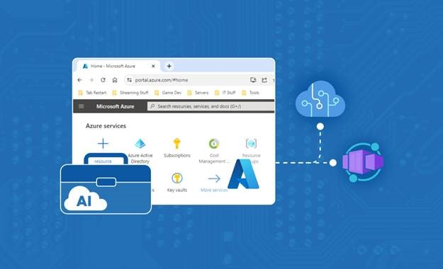
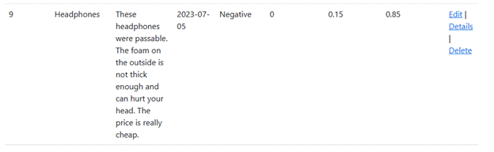

<head>
<meta property="og:url" content="https://azure.github.io/cloud-native/30daysofia/deploy-an-intelligent-app-on-azure-container-apps-2"/>
<meta property="og:type" content="website"/>
<meta property="og:title" content="Build Intelligent Apps!| Build AI Apps On Azure"/>
<meta property="og:description" content="Create a user feedback analysis application by setting up an Azure environment to deploy and manage the app using Azure Container Apps and Azure AI"/>
<meta property="og:image" content="https://azure.github.io/Cloud-Native/img/ogImage.png"/>
    <meta name="twitter:url" 
      content="https://azure.github.io/Cloud-Native/30daysofIA/deploy-an-intelligent-app-on-azure-container-apps-2" />
    <meta name="twitter:title" 
      content="Build Intelligent Apps! | Build AI Apps On Azure" />
    <meta name="twitter:description" 
      content="4-2. Create a user feedback analysis application by setting up an Azure environment to deploy and manage the app using Azure Container Apps and Azure AI." />
    <meta name="twitter:image" 
      content="https://azure.github.io/Cloud-Native/img/ogImage.png" />
    <meta name="twitter:card" content="summary_large_image" />
    <meta name="twitter:creator" 
      content="@devanshidiaries" />
    <meta name="twitter:site" content="@AzureAdvocates" /> 
    <link rel="canonical" 
      href="https://azure.github.io/Cloud-Native/30daysofIA/deploy-an-intelligent-app-on-azure-container-apps-2" />
</head>

<!-- End METADATA -->
In this article, explore how to create a user feedback analysis application by setting up an Azure environment to deploy and manage the app using [Azure Container Apps](https://learn.microsoft.com/en-us/azure/container-apps/?WT.mc_id=javascript-99907-ninarasi) and [Azure AI](https://learn.microsoft.com/en-us/azure/ai-services/?WT.mc_id=javascript-99907-ninarasi).

## What We'll Cover:

 * Building and containerizing the intelligent app 
 * Analysing user feedback



## Deploy an Intelligent App on Azure Container Apps with Azure AI (2)

In the [first part of this article](https://azure.github.io/Cloud-Native/30DaysOfIA/deploy-an-intelligent-app-on-azure-container-apps-1), we explored the concepts of Azure Container Apps and Azure AI, setup an Azure environment to deploy an intelligent app on Azure Container Apps as well as designed the intelligent app.

This article is a continuation to now build the intelligent app, containerize it and analyse user feedback.

## Building the Intelligent App

Now that we’ve set up our basic application, let’s add some intelligence to it. Our initial step involves adding two NuGet packages: `Azure.AI.TextAnalytics` for granting access to Azure AI and `Microsoft.Extensions.Azure` for seamlessly injecting the SDK.


Next, we need to register our text analytics client for dependency injection into our application. Before we can do that, the Text Analytics client requires two secrets: 

* An endpoint address
* An access key

We need to add these into both our development and production environments. In both environments, `AI_EndPoint` is the endpoint variable name while `AI_Key` is the access key variable name.

To add these two items to your development environment, right-click on your project and select **Manage User Secrets**. Next, open your Publish profile, click the three dots ( … ) next to Hosting, and select **Manage container app settings** to verify that these variables are accessible within your container. Finally, you can add these secrets to your Azure container.

Now, open the `Program.cs` file and modify the section where we initialize the database context to include the text analytics initialization:

```
if (builder.Environment.IsDevelopment())
{ 
    builder.Services.AddDbContext<DatabaseContext>(options =>
        options.UseSqlServer(builder.Configuration["userfeedbackdatabaseconnection"]));


    builder.Services.AddAzureClients(clientBuilder =>
        clientBuilder.AddTextAnalyticsClient(new Uri(builder.Configuration["AI_EndPoint"]),
        new Azure.AzureKeyCredential(builder.Configuration["AI_Key"])) 
        ); 
} 
else 
{
    builder.Services.AddDbContext<DatabaseContext>(options => 
        options.UseSqlServer(Environment.GetEnvironmentVariable("AZURE_SQL_CONNECTIONSTRING"))); 

    builder.Services.AddAzureClients(clientBuilder => 
        clientBuilder.AddTextAnalyticsClient(new Uri(builder.Configuration["AI_EndPoint"]), 
        new Azure.AzureKeyCredential(builder.Configuration["AI_Key"])) 
        );
}
```
Finally, let’s configure our `Review Create` method to retrieve sentiment analysis results from the Azure AI services API. To do this, add the following to your `Review` controller constructor:

```
private readonly TextAnalyticsClient _textClient;

        public ReviewsController(DatabaseContext context, TextAnalyticsClient textClient)
        { 
            _context = context;
            _textClient = textClient;
        } 
```

Then, modify the `POST Create Action` in your `Reviews` controller to incorporate a call to the Azure AI services API for analyzing the review text:

```
        [HttpPost]
        [ValidateAntiForgeryToken]
        public async Task<IActionResult> Create([Bind("Id,ProductId,ProductName,ReviewText,PostDate,Sentiment,PositiveValue,NeutralValue,NegativeValue")] Review review) 
        {
            var selectedProductId = int.Parse(HttpContext.Request.Form["Products"].ToString());
            var product = await _context.Products.FirstOrDefaultAsync(p => p.Id == selectedProductId);

            var sentimentResult = await _textClient.AnalyzeSentimentAsync(review.ReviewText);

            review.ProductId = selectedProductId;
            review.ProductName = product.Name;
            review.PostDate = DateTime.Now.ToString("yyyy-MM-dd");
            review.Sentiment = sentimentResult.Value.Sentiment.ToString();
            review.PositiveValue = (float)sentimentResult.Value.ConfidenceScores.Positive;
            review.NeutralValue = (float)sentimentResult.Value.ConfidenceScores.Neutral;
            review.NegativeValue = (float)sentimentResult.Value.ConfidenceScores.Negative;
  
            _context.Add(review);
            await _context.SaveChangesAsync();
            return RedirectToAction(nameof(Index));
        } 
```

In this tutorial, we use the simpler `AnalyzeSentimentAsync` method. It takes our review text and produces an overall sentiment analysis, assigning positive, neutral, and negative scores.

Azure’s text analytics service also supports [opinion mining](https://learn.microsoft.com/en-us/azure/ai-services/language-service/sentiment-opinion-mining/quickstart?tabs=macos&pivots=programming-language-csharp), a more advanced use case. Opinion mining goes beyond the basics, providing sentiment analysis for specific subjects or keywords within a text.

For instance, if a review reads, “This was a really good product, but the delivery times were way too long. I also had a hard time understanding the manual,” the opinion mining option might break this into distinct subjects and offer sentiment analysis for each:

* “Product” with a sentiment of positive
* “Delivery time” with a sentiment of negative
* “Manual” with a sentiment of negative

:::info
Watch the [on-demand Learn Live serverless series](https://azure.github.io/Cloud-Native/Build-IA/LearnLive/?WT.mc_id=javascript-99907-ninarasi) that deconstructs a reference architecture for building intelligent apps using Azure Container Apps and Azure AI.
:::

## Using Your Intelligent App to Analyze User Feedback

Now that we have our AI connected to our application, let’s create a review and see what the AI responds with.

Run the application, navigate to the `/Reviews/Create` folder to create a review, and click **Submit**. Select **Clippers & Trimmers** from the drop-down and write: “This was a really good trimmer for cutting my hair, but it gets caught in my beard.”

Upon inspecting the review you just posted, you’ll notice that Azure AI scored it as positive, albeit with slightly negative and neutral components.


Now, try another review. This time, select the **Headphones** product from the drop-down and write the following review: “These headphones were passable. The foam on the outside was not thick enough and can hurt your head. The price is really cheap.”

This time, the AI scores the review as negative, with no positive score and a slight neutral score.



By incorporating this AI-based scoring, you gain insights into customer feedback trends and can initiate specific actions based on positive or negative feedback. For example, we might want to understand how our product reviews have performed over the last seven days. Let’s update our review list page to present the average reviews during that period.

To achieve this, we’ll navigate to the **ReviewContoller** and summarize our data to display on the **Index** page. Then, we’ll load our products and reviews from the database, iterate through them, and average them over eight days (including the current day). Finally, we’ll compile the summarized data in a list and create a table based on the list.

Begin by creating a `SentimentTrends` model (a cut-down version of our review data) with this code:

```
namespace UserFeedbackApp.Models
{ 
    public class SentimentTrends
    { 
        public int Id { get; set; }
        public string ProductName { get; set; }
        public float PositiveValue { get; set; }
        public float NeutralValue { get; set; }
        public float NegativeValue { get; set; }
     public string PostDate { get; set; }
    }
} 
```

Next, update the `Index` method in our `ReviewController` file using the following code:

```
public async Task<IActionResult> Index()
{ 
    var reviewList = await _context.Reviews.ToListAsync();
    var productList = await _context.Products.ToListAsync();
  
    List<SentimentTrends> trends = new List<SentimentTrends>();

    foreach(var product in productList)
    { 
         var productReviews = reviewList
        .Where(d => d.ProductId == product.Id)
        .Where(d => DateTime.ParseExact(d.PostDate, "yyyy-MM-dd", CultureInfo.InvariantCulture) >= (DateTime.Now.AddDays(-8)))
        .ToList();

        if (productReviews.Count() > 0)
        { 

            float positiveValue = 0;
            float neutralValue = 0;
            float negativeValue = 0;

            foreach (var review in productReviews) 
            {
                 positiveValue += review.PositiveValue;
                 neutralValue += review.NeutralValue;
                 negativeValue += review.NegativeValue;
            }

             positiveValue = (float)Math.Round(positiveValue / productReviews.Count(), 2);
             neutralValue = (float)Math.Round(neutralValue / productReviews.Count(), 2);
             negativeValue = (float)Math.Round(negativeValue / productReviews.Count(), 2);

             SentimentTrends trend = new SentimentTrends();

             trend.Id = productReviews.First().ProductId;
             trend.ProductName = productReviews.First().ProductName;
             trend.PostDate = DateTime.Now.AddDays(-8).ToString("yyyy-MM-dd");
             trend.PositiveValue = positiveValue;
             trend.NeutralValue = neutralValue;
             trend.NegativeValue = negativeValue;

             trends.Add(trend);
        } 
    } 

    ViewBag.Trends = trends;
    return reviewList != null ?
            View(reviewList) :
            Problem("Entity set 'DatabaseContext.Reviews'  is null.");
} 
```

This code filters our recent reviews, averages them by the number of reviews received, and creates the list before passing it to the view in the **ViewBag**. To display this data, update the `Index.cshtml` file in our `Views/Reviews` folder with the following code:

```
 <h2>Seven Day Trend</h2> 
<table class="table"> 
    <thead>
        <tr>
            <th>Product ID</th>
            <th>Product Name</th>
            <th>Positive</th>
            <th>Neutral</th>
            <th>Negative</th>
        </tr>
    </thead>
    <tbody>
        @foreach (SentimentTrends item in ViewBag.trends) 
        {
        <tr>
              <td>@item.Id</td>
              <td>@item.ProductName</td>
              <td>@item.PositiveValue</td>
              <td>@item.NeutralValue</td>
              <td>@item.NegativeValue</td>
        </tr>
        }
    </tbody>
</table>
```

This displays our data in a simple table on our reviews page. If we run our code now and navigate to the reviews page, we’ll see the table at the top of the page. Averaging product sentiments this way offers valuable insights into potential product issues based on real user feedback.


## Conclusion

Intelligent Apps can add more data and insights into your applications, opening possibilities for even more functionality.

In this two-part article, we built a simple web application using [Azure Container Apps](https://learn.microsoft.com/en-us/azure/container-apps/overview?WT.mc_id=javascript-99907-ninarasi). Then, we incorporated sentiment analysis through Azure AI, extending our application’s capabilities to analyze user feedback. This application architecture on Azure enables seamless scalability for both the application and the AI components. This automatic scalability ensures your application can efficiently meet rising demands and scale back down when that demand subsides.

However, sentiment analysis is just one small component of the entire Azure AI suite. Azure AI includes several AI-driven APIs using pre-built models, such as:

* Language understanding for translation, question answering, or conversational language comprehension
* Image processing for image recognition or image and video analysis
* Speech processing, including speech-to-text, text-to-speech, or speech translation
* Anomaly detection, offensive content detection, and personalization

Begin your journey into [Intelligent Apps with Azure](https://azure.microsoft.com/en-us/products/ai-services?WT.mc_id=javascript-99907-ninarasi), then delve into the next topic to learn how to level up your Intelligent Apps.

## Exercise

* Complete this **hands-on sample** [project code](https://github.com/contentlab-io/Microsoft-Building-Your-First-Intelligent-App-with-Azure-Cognitive-Services/tree/main/Microsoft_Series_2_Code/Source%20-%20Article%207%20%2B%208/UserFeedbackApp/Models) to build your intelligent app with multi-modal databases.
* Complete the **[Intelligent apps Cloud Skills Challenge](https://aka.ms/fallforIA/apps-csc)** to build on your app dev and AI skills.
* Register for **[Ask the Expert: Azure Container Apps](https://reactor.microsoft.com/en-us/reactor/events/20728/?WT.mc_id=javascript-99907-ninarasi)** session for live Q&A with the Product Engineering team on building intelligent apps using Azure Container Apps.