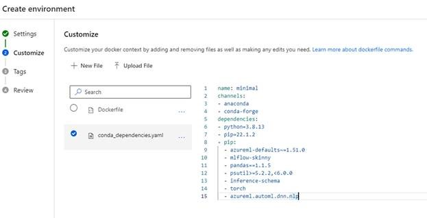
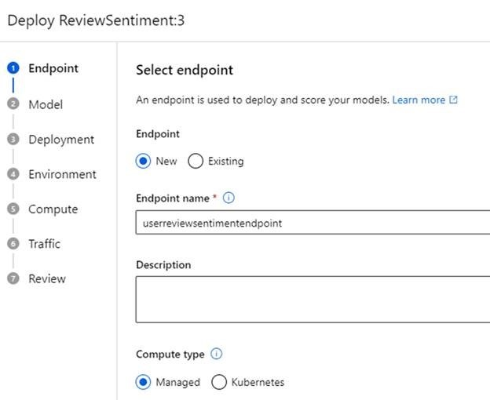
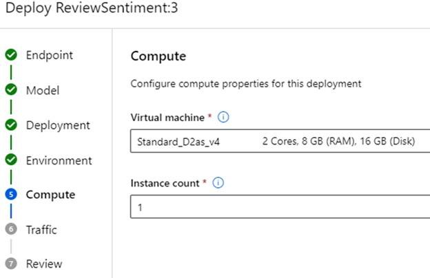
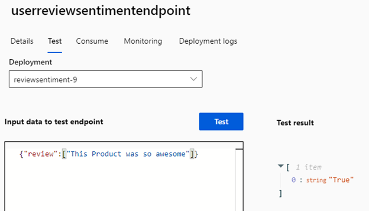
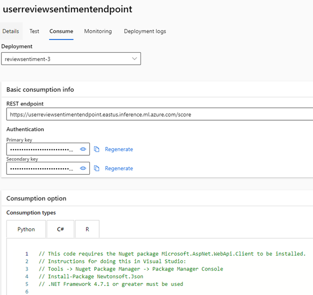
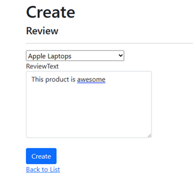
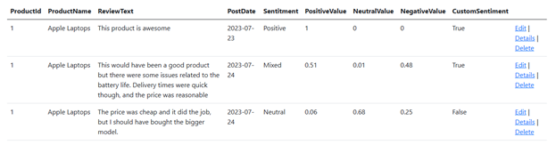

<head>
<meta property="og:url" content="https://azure.github.io/cloud-native/30daysofia/taking-intelligent-apps-to-the-next-level-implementing-advanced-features-with-azure-machine-learning-2"/>
<meta property="og:type" content="website"/>
<meta property="og:title" content="Build Intelligent Apps!| Build AI Apps On Azure"/>
<meta property="og:description" content="Explore how to level up your Intelligent Apps by training a custom model using your own dataset with Azure Machine Learning and Azure Container Apps."/>
<meta property="og:image" content="https://azure.github.io/Cloud-Native/img/ogImage.png"/>
    <meta name="twitter:url" 
      content="https://azure.github.io/Cloud-Native/30daysofIA/taking-intelligent-apps-to-the-next-level-implementing-advanced-features-with-azure-machine-learning-2" />
    <meta name="twitter:title" 
      content="Build Intelligent Apps! | Build AI Apps On Azure" />
    <meta name="twitter:description" 
      content="3.4 Taking Intelligent Apps to the Next Level: Implementing Advanced Features with Azure Machine Learning-2." />
    <meta name="twitter:image" 
      content="https://azure.github.io/Cloud-Native/img/ogImage.png" />
    <meta name="twitter:card" content="summary_large_image" />
    <meta name="twitter:creator" 
      content="@devanshidiaries" />
    <meta name="twitter:site" content="@AzureAdvocates" /> 
    <link rel="canonical" 
      href="https://azure.github.io/Cloud-Native/30daysofIA/taking-intelligent-apps-to-the-next-level-implementing-advanced-features-with-azure-machine-learning-2" />
</head>

<!-- End METADATA -->
In this article, continue to explore how to level up your Intelligent Apps by training a custom model using your own dataset with Azure Machine Learning and Azure Container Apps.

## What We'll Cover:

 * Testing and validating the ML model with the intelligent app 
 * Integrating the Machine Learning Model into the intelligent app
 * Testing and validating the enhanced intelligent app 


## Taking Intelligent Apps to the Next Level: Implementing Advanced Features with Azure Machine Learning (2)

In the [previous part](https://azure.github.io/Cloud-Native/30DaysOfIA/taking-intelligent-apps-to-the-next-level-implementing-advanced-features-with-azure-machine-learning-1) of this tutorial, we explored creating Azure Machine Learning workspace and training the machine learning model. This part continues onto integrating the ML model into the app, and then testing and validating the enhanced intelligent app to get better results from the [Azure AI Sentiment Analysis API](https://learn.microsoft.com/en-us/azure/ai-services/language-service/sentiment-opinion-mining/overview?tabs=prebuilt?WT.mc_id=javascript-99907-ninarasi).

### Prerequisites

To follow this tutorial, ensure you have completed the [first](https://azure.github.io/Cloud-Native/30DaysOfIA/taking-intelligent-apps-to-the-next-level-implementing-advanced-features-with-azure-machine-learning-1) part of this topic.

### Testing and Validating the ML Model with the Intelligent App

Next, we need to register our model for use with a managed endpoint. To do so, click on the **Models** menu item to view a list of models in your environment.

If you didn’t train your model or prefer a pre-built one, unzip the example model file into its own directory and select **From local files**. Ensure the model type is **MLflow**, which matches the type of model we trained.

Upload all these files from the unzipped folder. Your folder should be simple and without spaces, as you’ll need to reference this in the code later. Pick a name and version for your model and register it.


For certain models, you can use the built-in endpoint creation process. However, as of writing this article, our model requires some customization for both the endpoint and environment before launching.

First, let’s build a custom environment using a minimal endpoint container. Go to **Environments** in the left menu. You’ll find two options for the environment type: **curated** and **custom**. In this tutorial, we’re turning a curated image into a custom one, so click the **curated** tab. Find the minimal inference server image. At the time of this writing, it was called `minimal-ubuntu20.04-py38-cpu-inference`, but the version may have changed. It’s a minimal Docker image that supports ML endpoints for some pipelines.

Click on the image’s **Context** tab to get its Dockerfile and Conda dependencies file. Download these configuration files using the **Download Content** option. This will download a .zip archive with these files, so unzip them and place them in their own directory for customization.


Return to the **custom** tab in the environments screen and hit **Create** to make a new custom environment. Give this environment a name. For “Select environment source,” choose **Upload existing docker context** and select the minimal server folder you downloaded previously.

Click on **Next**. Azure ML will allow you to modify the environment. To add dependencies, update the list under line 8. Here’s what the configuration file should look like:

```
name: minimal
channels:
- anaconda
- conda-forge
dependencies:
- python=3.8.13
- pip=22.1.2
- pip:
  - torch
  - pandas==1.1.5
  - psutil>=5.2.2,<6.0.0
  - mlflow-skinny
  - inference-schema
  - azureml-defaults~=1.51.0
  - azureml.automl.dnn.nlp
```



Because this is a YAML file, we’ll need to ensure that the tabs on each line item are correct. This updated configuration file adds essential Python data science libraries for our model, including:

* `mlflow-skinny`, a “runtime” version of the [MLFlow](https://mlflow.org/) machine learning library 
* `inference-schema`, which drives inputs and outputs to our inference server 
* `azureml-defaults`, which includes some default code and libraries to run AzureML libraries 
* `azureml.automl.dnn.nlp`, which we use to train our model 

With our environment set up, we can now create an endpoint for our application. Open the **Endpoints** menu, then hit **Create** for a new one. In the first window, choose the model you registered previously and click **Select**. Then, click **More options** to configure the endpoint. Give your endpoint a name, leave **managed** selected, and ensure your model is selected in the next window.

The deployment screen lets you tweak live probes, score timeouts, and change other configurations. But for now, let’s stick with the defaults.



Next, we can customize our environment and scoring script. Select the toggle that enables you to customize, pick the environment that you created, and add a scoring script—custom code that runs when you send data to the endpoint.

Create a new script named `score.py` and paste this code:

```
from cmath import log
import logging
import os
import json
import mlflow
from io import StringIO
from mlflow.pyfunc.scoring_server import infer_and_parse_json_input, predictions_to_json
  
def init():
    global model
    global input_schema 

    model_path = os.getenv("AZUREML_MODEL_DIR") + "/ReviewSentiment"
    model = mlflow.pyfunc.load_model(model_path)
    input_schema = model.metadata.get_input_schema()

def run(raw_data):
    json_data = json.loads(raw_data)
    if "review" not in json_data.keys():
        raise Exception("Request must contain a top level key named 'review'")

    serving_input = { "inputs": json_data["review"] }
    data = infer_and_parse_json_input(serving_input, input_schema)
    predictions = model.predict(data)
    return predictions
```

This code has two functions: `init`, which loads and prepares the model, and `run`, which uses our data input against the model.

In the `init` function, we use the environment variable `"AZUREML_MODEL_DIR"` to reference where Azure ML stores our model files. You should also see an additional folder after this variable—this is the base folder that stores our model file when we upload or retrieve a model job.

Next, we load the model using the `load_model` function in the `mlflow` library and the input schema, which enables input validation. This preloads all the components for our endpoint so that when a client requests an analysis, we don’t need to wait for items to start up.

Now, look at the run function. It takes in raw data as a JSON object, loads it into a variable called `json_data`, and checks if the JSON data contains a review key, which allows you to do a basic review of your input.

Next, we need to format our input according to the `mlflow` model’s requirements. In this case, we’re expecting the API to accept an object formatted as follows:

```
{ "inputs": <JSON-Object> }.
```

We send this input to the model for predictions using the `infer_and_parse_json_input` method. 

With the scoring script ready and our environment selected, it’s time to select **Compute** to run our endpoint container. In this demonstration, we use a memory-optimized compute instance so that the endpoint has enough space to load and use the model. Depending on the model, you might need different compute sizes, especially if you’re not using a pre-trained model. If you encounter resource errors during deployment, adjust the size as required.

:::info
Register to meet the Azure team at **[KubeCon and Azure Day](https://aka.ms/aks-day)** in Chicago on **November 6, 2023**. The Azure Product Engineering Team along with the Cloud Advocates team will be there to dive deep with you on developing intelligent apps with Azure Kubernetes Service.
:::

We can also define the traffic sent to this deployment. Azure ML sets up a load balancer for managed endpoints with multiple deployments, often for tasks like A/B testing or rolling out new model versions.



Once you set the configurations, click **Create** to start the deployment. This takes around five to ten minutes while Azure ML assembles the resources and environment. 

With the endpoint deployed, we can test the payloads our model can score. As referenced in our code, we need to ensure this input is in a key/value pair called `review`, and the input type is expected to be an array.

Let’s try a simple example. Open the endpoint, click **Test**, and enter the following code in the **Input data to test endpoint** box:

```
{
    "review": ["This Product was so awesome"]
}
```

After running this test, you should receive a JSON object with a predictions key containing an array with a single value of True, signifying the positive review we just left.



Although our endpoint is for real-time usage, we can still batch requests by specifying them in the input array. But if real-time performance isn’t crucial, we can gather reviews at set intervals, like every 15 minutes, and make this an asynchronous workflow.

To demonstrate, let’s try a larger payload. Enter the following test data:

```
{
    "review": [
        "This Product was so awesome",
        "I really did like this product",
        "I'm a little bit disappointed by this item"
        ]
} 
```

This time, the endpoint will take a little bit longer to respond, but the array should contain two positives (`True`) and one negative (`False`).

You can observe these predictions in action by checking your deployment logs.


### Integrating the Machine Learning Model into Your App

With our model trained and endpoint ready, we can now call the endpoint from our existing application. First, add a new field to your database to store the new model predictions. Open the project in Visual Studio and add the following line to your `Review.cs` file in the `Models` directory:

```
public string CustomSentiment { get; set; }
```

Next, in the developer PowerShell terminal window, run these commands from your project folder to update your database:

```
dotnet ef migrations add NewReviewField
dotnet ef database update
```


With this new field in place, update your `Review Index.cshtml` page by adding the `CustomSentiment` value, which lists our reviews when we go to the URL `/reviews`:

```
<td>
    @Html.DisplayFor(modelItem => item.CustomSentiment)
</td>
```

Now, let’s incorporate the endpoint’s boilerplate code into our application to process a review.

Return to the Azure ML Studio, open **Endpoints** from the left menu, click on your deployed endpoint, and select **Consume**. You’ll see code snippets for Python, C#, and R. Copy everything from the `InvokeRequestResponseService` method and switch back to your application. Paste the code into the `Create` method in the `Review` controller, right after retrieving the sentiment from the Azure AI services API.



Now, trim the code to look like this:

```
var handler = new HttpClientHandler()
{
    ClientCertificateOptions = ClientCertificateOption.Manual,
    ServerCertificateCustomValidationCallback =
            (httpRequestMessage, cert, cetChain, policyErrors) => { return true; }
};
using (var client = new HttpClient(handler))
{
    var reviewModel = new AIModel();
    reviewModel.review.Add(review.ReviewText);
    var requestBody = JsonConvert.SerializeObject(reviewModel);

    const string apiKey = "endpoint-key";
    client.DefaultRequestHeaders.Authorization = new AuthenticationHeaderValue("Bearer", apiKey);
    client.BaseAddress = new Uri("https://userreviewsentimentendpoint.eastus.inference.ml.azure.com/score");

    var content = new StringContent(requestBody);
    content.Headers.ContentType = new MediaTypeHeaderValue("application/json");

    HttpResponseMessage response = await client.PostAsync("", content);

    if (response.IsSuccessStatusCode)
    {
        string result = await response.Content.ReadAsStringAsync();
        var data = JsonConvert.DeserializeObject<List<string>>(result);

        review.CustomSentiment = data.First();
    }
}
```

With these modifications and cleanup in the boilerplate code, this block now:

* Populates a new class, `AIModel`, with our review text
* Creates a standard .NET HTTP client
* Sends the review information to the endpoint
* Waits for the array of values and passes on to be written to the database

Now, to ensure the model receives the same types of values the API expects (an array of strings), we need to create the `AIModel` class as follows:

```
public class AIModel
{
   public List<string> review { get; set; }

   public AIModel()
   {
        review = new List<string>();
   }
} 
```

This will send an array of JSON-converted review strings to the model.

### Testing and Validating the Enhanced Intelligent App

Finally, let’s build and run our application to test the result. When the web page opens, navigate to **/Reviews/Create** and enter a sample review to have the application generate a response from both Azure AI services and our Custom AI endpoint. Pick a category and enter the text “This product is awesome.”



Click **Create**. The process will take a little longer this time as we’re calling both the Azure AI services API and our Custom AI API. But once the process completes and you return to the Reviews screen, you’ll see both the Azure AI Analysis and the custom sentiment marked as positive (`True`).


Comparing the results for our tutorial example, you might notice a negligible difference between the Azure AI model and our custom one. This could be due to various reasons.

* The phrase we used was pretty generic and didn’t supply much detail.
* The data we used to train the model is pretty broad, similar to Azure AI.
* The data is open source and may have also been used to train the Azure AI model.

However, for our demonstration, we’re expecting longer reviews that are more specific. So, let’s try a review that resembles real-life feedback: “This would have been a good product, but there were some issues related to the battery life. Delivery times were quick though, and the price was reasonable.”


This time, our custom model shows a sentiment of true, whereas Azure AI categorizes it as mixed. Thanks to the training data we used, our model makes a clearer decision regarding the review’s sentiment.

Let’s try another one: “The price was cheap and it did the job, but I should have bought the bigger model.”



Now, Azure AI analyzes this review as generally neutral, while our AI service analyzes it as negative. Both Azure AI and our custom-trained model offer excellent sentiment analysis for text. However, custom models can also provide specialized analysis or additional features based on data collected over time.

If your applications have broader features and data, you can construct more complex models that analyze multi-columnar data or make decisions based on historical actions, further integrating AI into your workflows.

## Conclusion

In this article, we expanded our application by training our custom AI model in Azure Machine Learning. We covered how to train a sentiment analysis model based on our own application data and incorporate this into our application. We also compared our custom-built model to Azure AI and briefly explored expanding AI capabilities with larger applications and datasets.

Azure ML allows you to build upon Azure AI’s existing AI functionalities, enabling you to train, publish, and seamlessly use AI services within applications. With the newfound ability to train custom models, the possibilities for AI capabilities are boundless.

While off-the-shelf solutions offer general utility, the power to customize models allows for fine-tuning to specific tasks. For instance, you can use this knowledge to create a bespoke recommendation system for a niche e-commerce platform, catering to subtle buying patterns that traditional models might overlook. With the capacity to train tailored models, you’re ready to venture beyond generalized solutions and unlock AI’s true potential for specialized applications.

Take a look at [Azure Machine Learning](https://ml.azure.com/) to integrate more advanced AI features and take your Intelligent Applications to the next level.

## Exercise

* Complete this **hands-on sample** [project code](https://github.com/contentlab-io/Microsoft-Building-Your-First-Intelligent-App-with-Azure-Cognitive-Services/tree/main/Microsoft_Series_2_Code/Source%20-%20Article%207%20%2B%208/UserFeedbackApp/Models) to build your intelligent app with multi-modal databases.
* Complete the **[Intelligent apps Cloud Skills Challenge](https://aka.ms/fallforIA/apps-csc)** to build on your app dev and AI skills.
* Watch the **[Ask the Expert: Azure Container Apps](https://reactor.microsoft.com/en-us/reactor/events/20728/?WT.mc_id=javascript-99907-ninarasi)** session where the Product Engineering team goes deep with demos while addressing the concepts for building intelligent apps using Azure Container Apps.