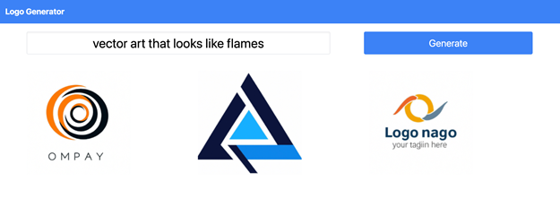

<head>
<meta property="og:url" content="https://azure.github.io/cloud-native/30daysofia/building-an-ai-powered-logo-variation-generator-with-azure-openai-and-aks-1"/>
<meta property="og:type" content="website"/>
<meta property="og:title" content="Build Intelligent Apps!| Build AI Apps On Azure"/>
<meta property="og:description" content="Explore how to develop an AI-powered logo generator using DALL-E, Azure OpenAI and Azure Kubernetes Service (AKS)."/>
<meta property="og:image" content="https://azure.github.io/Cloud-Native/img/ogImage.png"/>
    <meta name="twitter:url" 
      content="https://azure.github.io/Cloud-Native/30daysofIA/building-an-ai-powered-logo-variation-generator-with-azure-openai-and-aks-1" />
    <meta name="twitter:title" 
      content="Build Intelligent Apps! | Build AI Apps On Azure" />
    <meta name="twitter:description" 
      content="4.1 - Building an AI-Powered Logo Variation Generator with Azure OpenAI and AKS (1)" />
    <meta name="twitter:image" 
      content="https://azure.github.io/Cloud-Native/img/ogImage.png" />
    <meta name="twitter:card" content="summary_large_image" />
    <meta name="twitter:creator" 
      content="@devanshidiaries" />
    <meta name="twitter:site" content="@AzureAdvocates" /> 
    <link rel="canonical" 
      href="https://azure.github.io/Cloud-Native/30daysofIA/https://azure.github.io/Cloud-Native/30daysofIA/building-an-ai-powered-logo-variation-generator-with-azure-openai-and-aks-1" />
</head>

<!-- End METADATA -->
In this article, explore how to develop an AI-powered logo generator using DALL-E, [Azure OpenAI](https://learn.microsoft.com/azure/ai-services/openai/overview?WT.mc_id=javascript-99907-ninarasi) and [Azure Kubernetes Service (AKS)](https://learn.microsoft.com/azure/aks/?WT.mc_id=javascript-99907-ninarasi).

## What We'll Cover:

 * Generating images with [DALL-E](https://openai.com/dall-e-2)
 * Building a web interface


## Building an AI-Powered Logo Variation Generator with Azure OpenAI and AKS (1)

Have you ever wondered how to create unique and eye-catching logos for your brand or project? Do you want to unleash your creativity and experiment with AI? If so, you might be interested in [Azure OpenAI](https://azure.microsoft.com/products/ai-services/openai-service?WT.mc_id=javascript-99907-ninarasi), a new Azure service granting access to some of the most advanced AI models globally, including [DALL-E 2](https://openai.com/dall-e-2).

With the ability to interpret detailed text prompts, DALL-E 2 can generate images ranging from realistic to imaginative. It can merge elements, characteristics, and artistic influences to generate unique illustrations, emblems, or images with a true-to-life appearance.

In this article, we’ll explore how to build an Intelligent App that uses DALL-E to create logos. Intelligent Apps harness artificial intelligence (AI), machine learning (ML), and data analytics to deliver personalized and data-driven user experiences. They can understand the user’s intent, make predictions, automate tasks, generate content, or provide recommendations based on data and analytics.

After completing this tutorial, you’ll know how to:

* Set up Azure OpenAI.
* Create a Python back end using [FastAPI](https://fastapi.tiangolo.com/) that uses DALL-E to create logo variations.
* Build a web interface that lets you upload a logo, enter a text prompt, and view logos generated by DALL-E.
* Deploy your app using [Azure Kubernetes Service (AKS)](https://azure.microsoft.com/products/kubernetes-service?WT.mc_id=javascript-99907-ninarasi). 

Let’s get started!

## Creating an AI-Powered Logo Variation Generator

Before diving into the details of how to build and deploy the app, let’s look at its basic architecture. The app consists of three main parts:

* A Python back end that uses the [OpenAI Python Library](https://github.com/openai/openai-python) to communicate with Azure OpenAI and FastAPI to serve logo generation requests.
* A web UI built with HTML, CSS, and JavaScript. This setup lets us select a logo, enter instructions, submit them to the back end, and view the logos provided by DALL-E.
* An AKS cluster that hosts the app. This is AKS Azure’s managed Kubernetes service, which we’ll use to deploy the app as a containerized application.

For a preview of the final product, review the [complete project code](https://github.com/contentlab-io/Microsoft-Building-an-AI-Powered-Logo-Variation-Generator-with-Azure-OpenAI).

### Prerequisites

To follow along, you need:

* An [Azure subscription](https://learn.microsoft.com/azure/cloud-adoption-framework/ready/landing-zone/design-area/resource-org-subscriptions?WT.mc_id=javascript-99907-ninarasi) with access to Azure OpenAI. Note that you’ll have to [apply for approval](https://customervoice.microsoft.com/Pages/ResponsePage.aspx?id=v4j5cvGGr0GRqy180BHbR7en2Ais5pxKtso_Pz4b1_xUOFA5Qk1UWDRBMjg0WFhPMkIzTzhKQ1dWNyQlQCN0PWcu) to access Azure OpenAI.
* A DALL-E model deployed to Azure. See the [resource deployment guide](https://learn.microsoft.com/azure/ai-services/openai/how-to/create-resource?pivots=cli&WT.mc_id=javascript-99907-ninarasi) for further instructions on deploying a model. You can currently only deploy DALL-E models to resource groups in the `eastus` region using the `dalle2` model.
* The deployment name, endpoint, and API key for your DALL-E model. See the “Retrieve key and endpoint” section in the [Azure OpenAI docs](https://learn.microsoft.com/azure/ai-services/openai/dall-e-quickstart?pivots=programming-language-python&WT.mc_id=javascript-99907-ninarasi#retrieve-key-and-endpoint) for instructions on how to find your model’s endpoint URL and API key.
* The [Azure CLI](https://learn.microsoft.com/cli/azure/install-azure-cli?WT.mc_id=javascript-99907-ninarasi) installed and signed in to the Azure subscription containing your DALL-E model deployment
* [Docker](https://www.docker.com/) to package and deploy your application
* [kubectl](https://kubernetes.io/docs/reference/kubectl/) to manage your AKS cluster 

If you don’t yet have Docker or `kubectl` installed, [Docker Desktop](https://www.docker.com/products/docker-desktop/) includes both and is the quickest way to get up and running.

### Solution Architecture

The image below shows the architecture of the solution we’re aiming for in this article.


## Generating Images with DALL-E

The first step in building our Azure OpenAI-powered app is creating a Python back end using [FastAPI](https://fastapi.tiangolo.com/) and the OpenAI Python SDK. If you haven’t used it before, FastAPI is a library for building fast, easy-to-write REST APIs.

Start by creating a file named `requirements.txt`. Add our app’s dependencies to it: 

```
fastapi[all] 
openai 
```

Then, install the dependencies using `pip`: 

```
pip install -r requirements.txt
```

Next, create a file named `main.py`. Our back end doesn’t require a lot of code, so we’ll compile all the Python code into this file to keep things simple. Copy the rest of the code blocks in this section into `main.py` as you go. Start by importing the packages and classes needed to build the back end:

```
from typing import List

import openai
from fastapi import FastAPI
from fastapi.staticfiles import StaticFiles 
```

Now, we need to alter a few settings to get the OpenAI Python library to work with Azure OpenAI. Replace `AZURE_OPENAI_KEY` and `AZURE_OPENAI_ENDPOINT` with the values you received when creating your Azure OpenAI model:

```
openai.api_key = "AZURE_OPENAI_KEY"
openai.api_base = "AZURE_OPENAI_ENDPOINT"
openai.api_type = 'azure'
openai.api_version = '2023-05-15'
```

Note that we’re hardcoding the values to keep this tutorial simple, but in a production environment, you’ll want to use [Azure Key Vault](https://azure.microsoft.com/products/key-vault?WT.mc_id=javascript-99907-ninarasi) to safely store your app’s secrets.

Then, create an instance of FastAPI and assign it to a variable named 'app':

```
app = FastAPI() 
```

Next, add a function named 'generate_logos' that takes a text prompt as a parameter and returns a list of logo variants that DALL-E generates:

```
async def generate_logos(text_prompt: str):
    # Generate images from text prompt using DALL-E
    response = await openai.Image.acreate(
        prompt=f"A company logo matching the following description: {text_prompt}",
        size="256x256",
        n=3,
    )

    # Return a list of image URLs
    image_urls = [image["url"] for image in response["data"]]
    return image_urls
```

Here’s what the function does:

* It reads the image file as bytes and encodes it as base64.
* It uses the `openai.Image.create()` method to generate images from the user’s prompt, passing in the image file as an input parameter along with the text prompt.
* It returns a list of image URLs from the response.

Note that we’re adding additional detail to the prompt the user provided to help ensure it generates logos as we expect. This technique is worth remembering because [prompt engineering](https://learn.microsoft.com/azure/ai-services/openai/concepts/prompt-engineering?WT.mc_id=javascript-99907-ninarasi) is important when working with modern AI models.

Next, add a FastAPI endpoint that accepts a text prompt from the web UI and returns a list of DALL-E-generated logo variants:

```
@app.post("/logos", response_model=List[str])
async def logos(text_prompt: str = ""):
    # Generate logo variants using DALL-E
    image_urls = generate_logos(text_prompt)

    # Return image URLs as JSON response
    return image_urls
```

FastAPI automatically converts the Python array to JSON, so we don’t need to serialize it before returning it. Now, add an endpoint to serve the static files housing the app’s web UI:

```
app.mount("/", StaticFiles(directory="static", html=True), name="static")
```

FastAPI processes routes in the order they’re created, so adding the static file handler at the end ensures it won’t accidentally intercept requests to the `/logo` endpoint.

That’s all the code needed in `main.py`. Save the file and run the server using uvicorn, which comes automatically with FastAPI:

```
uvicorn main:app --reload
```

Your terminal should display something like this:

```
INFO:     Uvicorn running on http://127.0.0.1:8000 (Press CTRL+C to quit) INFO:     Started reloader process [12345] using statreload INFO:     Started server process [56789] INFO:     Waiting for application startup. INFO:     Application startup complete.
```

That’s all you need for the Python back end! Let’s move on to building the app’s user interface.

:::info
Join the Azure team at **[KubeCon and Azure Day](https://aka.ms/aks-day)** in Chicago on **November 6, 2023**. The Azure Product Engineering team along with the Cloud Advocates team will be there to dive deep with you on developing intelligent apps with Azure Kubernetes Service.
:::

## Building a Web Interface

The next step in our app is creating a simple web interface that lets users upload an image of a logo, enter a text prompt with instructions on how to vary the logo, and view the results that DALL-E returns. We’ll use HTML and plain JavaScript with some Tailwind CSS to add visual appeal.

Start by creating a `static` subdirectory, and inside it, generate an HTML file named `index.html`. This file will contain the basic layout of our webpage, such as the title, navigation bar, input box for entering a text prompt, and container for displaying the results. It’s also essential to link to the Tailwind CSS CDN and our custom CSS file that we’ll create later.

Add the following HTML to the `index.html` file:

```
<!DOCTYPE html>
<html lang="en">
<head>
  <meta charset="UTF-8">
  <meta name="viewport" content="width=device-width, initial-scale=1.0">
  <title>Logo Variation Generator</title>
  <!-- Link to Tailwind CSS CDN -->
  <script src="https://cdn.tailwindcss.com"></script>
  <!-- Link to our custom CSS file -->
  <link rel="stylesheet" href="/style.css">
</head>
<body>
  <!-- Navigation bar -->
    <nav class="bg-blue-500 p-4 flex justify-between items-center fixed top-0 left-0 w-full z-10">
    <h1 class="text-white text-xl font-bold">Logo Variation Generator</h1>
  </nav>
  <!-- Main content -->
  <main class="container mx-auto p-4 pt-16">
    <!-- Create a grid layout with two columns -->
    <div id="logo-input" class="flex flex-col items-center justify-center space-y-4 mt-20">
        <input id="logo-text" type="text" placeholder="Describe the logo you'd like to create..." class="w-3/4 text-2xl text-center border border-gray-300 px-4 py-2 rounded" required>
        <button id="logo-generate" type="button" class="bg-blue-500 hover:bg-blue-600 text-white px-4 py-2 rounded">Generate</button>
      </div>
    <div id="logo-results" class="mt-10 hidden"></div>
  </main>
  <!-- Script for handling user input and fetch requests -->
  <script src="/script.js"></script>
</body>
</html>
```

Next, create a file named `style.css` in the static directory and add a few styles to enhance the UI:

```
.logo-input {
    position: absolute;
    top: 0;
    left: 0;
    width: 100%;
    height: 100%;
    display: flex;
    align-items: center;
    justify-content: center;
}

.logo-input-moved {
    flex-direction: row;
    justify-content: space-between;
    gap: 1rem;
    width: 100%;
    max-width: 800px;
    margin: 2rem auto;
}

/* Grid layout for displaying logos */ 

#logo-results {
    display: grid;
    grid-template-columns: repeat(3, 1fr); /* Change '3' according to desired columns */
    gap: 20px;
} 

#logo-text {
    font-size: 2rem;
    border-color: #e5e7eb;
    box-shadow: inset 0 2px 4px rgba(0,0,0,0.06);
} 

#logo-generate {
    transition: all 0.3s ease-in-out;
    font-size: 1.5rem;
    box-shadow: 0 2px 4px rgba(0,0,0,0.06);
}   

.fade-in {
    opacity: 0;
    animation: fade-in 0.5s forwards;
}

@keyframes fade-in {
    from {
    opacity: 0;
    }
    to {
    opacity: 1;
    }
}

.fade-out {
    animation: fade-out 0.5s forwards;
} 

@keyframes fade-out {
    from {
    opacity: 1;
    }
    to {
    opacity: 0;
    }
}
```

Now, we just need some JavaScript to tie it all together. Create a file named `script.js` in the `static` directory, and add the following:

```
const logoGenerateButton = document.getElementById("logo-generate");
const logoInput = document.getElementById("logo-input");
const logoResults = document.getElementById("logo-results");
const logoText = document.getElementById("logo-text");

logoGenerateButton.addEventListener("click", function () {
    // Disable the input and button
    logoText.disabled = true;
    logoGenerateButton.disabled = true;
    // Change the button text
    logoGenerateButton.textContent = "Generating...";

    // Get the input value
    const text = logoText.value;

    fetch("/logos", {
        method: "POST",
        // send the input value as JSON
        headers: {
            "Content-Type": "application/json",
        },
        body: JSON.stringify({ text }),
    })
    .then((response) => response.json())
    .then((data) => {
        // Fade out the input and button
        logoInput.classList.add("opacity-0");
        // Re-enable the input and button
        logoText.disabled = false;
        logoGenerateButton.disabled = false;
        // Reset the button text
        logoGenerateButton.textContent = "Generate";
        // Adjust the input and button styles
        logoInput.classList.remove("flex-col", "items-center", "justify-center", "space-y-4", "mt-20", "opacity-0");
        logoInput.classList.add("flex-row", "justify-between", "mt-4");
        logoText.classList.add("w-3/5");
        logoGenerateButton.classList.add("w-1/3");

        // Clear the results container
        logoResults.innerHTML = "";

        // Loop through each image URL in the data array
        data.forEach((url) => { 

            // Create an image element for each URL
            const img = document.createElement("img");
            img.src = url;
            img.alt = "Logo variant";

        // Append the image element to the results container
            logoResults.appendChild(img);
        }); 

        // Show the results container
        logoResults.classList.remove("hidden");

        // Fade in the input, button, and images
        logoInput.classList.add("opacity-100");
    })
    .catch((error) => {
        // Log any errors to the console
        console.error(error);
    });
}); 
```

And with that, you’ve successfully built an Azure OpenAI-powered logo creation web interface.

To test it, run the following command in your terminal from the app’s root directory.

```
uvicorn main:app --reload
```

Then, open a web browser and navigate to `http://localhost:8000`. You should see the web page you just created. Describe the kind of logo you’d like to create and click Generate. In a few seconds, you should see the images DALL-E generated for you:



DALL-E will display the original logo on the left column and the logo variants on the right one.

Try experimenting with different prompts to see what you come up with!

## Exercise

* Complete this **hands-on sample** [project code](https://github.com/contentlab-io/Microsoft-Building-an-AI-Powered-Logo-Variation-Generator-with-Azure-OpenAI) to build your intelligent app with multi-modal databases.
* Watch the **[Ask the Expert: Azure Kubernetes Service](https://reactor.microsoft.com/reactor/events/20732/?WT.mc_id=javascript-99907-ninarasi)** session where the Product Engineering team goes dives into the concepts for building intelligent apps using Azure Kubernetes Service.
* To revise core concepts on cloud-native or Azure Kubernetes Service, go to **[30 Days of Cloud Native](https://azure.github.io/Cloud-Native/cnny-2023/cloud-native-fundamentals?WT.mc_id=javascript-99907-ninarasi)**.