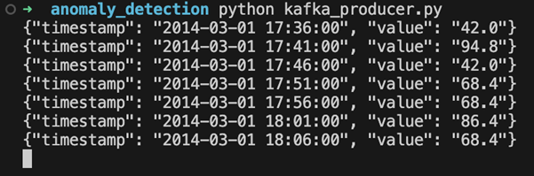
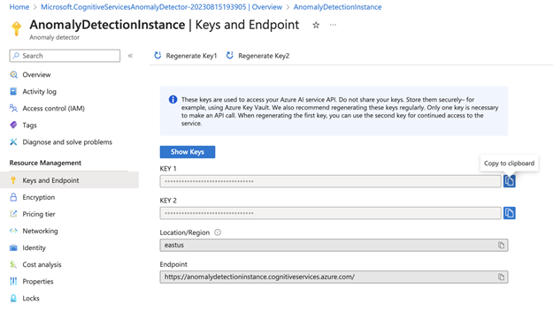
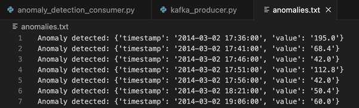

<head>
<meta property="og:url" content="https://azure.github.io/cloud-native/30daysofia/fortifying-cybersecurity-using-intelligent-apps-on-aks-1"/>
<meta property="og:type" content="website"/>
<meta property="og:title" content="Build Intelligent Apps! | Build AI Apps On Azure"/>
<meta property="og:description" content="Discover how to enhance the security of our Intelligent Apps with Azure AI Anomaly Detector and Azure Kubernetes Service."/>
<meta property="og:image" content="https://azure.github.io/Cloud-Native/img/ogImage.png"/>
    <meta name="twitter:url" 
      content="https://azure.github.io/Cloud-Native/30daysofIA/fortifying-cybersecurity-using-intelligent-apps-on-aks-1" />
    <meta name="twitter:title" 
      content="Build Intelligent Apps! | Build AI Apps On Azure" />
    <meta name="twitter:description" 
      content="4-3. Fortifying Cybersecurity Using Intelligent Apps on AKS (1)" 
      content="https://azure.github.io/Cloud-Native/img/ogImage.png" />
    <meta name="twitter:card" content="summary_large_image" />
    <meta name="twitter:creator" 
      content="@devanshidiaries" />
    <meta name="twitter:site" content="@AzureAdvocates" /> 
    <link rel="canonical" 
      href="https://azure.github.io/Cloud-Native/30daysofIA/https://azure.github.io/Cloud-Native/30daysofIA/fortifying-cybersecurity-using-intelligent-apps-on-aks-1" />
</head>

<!-- End METADATA -->
In this article, discover how to enhance the security of our Intelligent Apps with [Azure AI Anomaly Detector](https://learn.microsoft.com/azure/ai-services/anomaly-detector/overview?WT.mc_id=javascript-99907-ninarasi) and [Azure Kubernetes Service (AKS)](https://learn.microsoft.com/azure/aks/?WT.mc_id=javascript-99907-ninarasi). Follow along to learn how to implement real-time monitoring and anomaly detection of network traffic and make data-driven security decisions to protect against emerging cyber threats.

## What We'll Cover:

 * Anomaly detection concepts
 * Building an intelligent app for real-time network traffic anomaly detection
 * Simulating network traffic logs
 * Setup Azure AI Anomaly Detector
 * Create the intelligent app


## Fortifying Cybersecurity Using Intelligent Apps on AKS: Hands-on with AI-Powered Anomaly Detection (1)

Intelligent Apps bring together cutting-edge technologies, including machine learning (ML), data analytics, and predictive or generative AI. Their goal is to seamlessly integrate into the workflows of customers and employees, providing tangible benefits to end users.

There are three main categories of Intelligent Apps. Outcome-based apps focus on delivering intelligent results to support data-driven decision-making. Functionality-based apps employ predictive or generative AI to enhance specific features, such as personalized recommendations. Feature-based apps use neural networks and advanced AI, such as large language models (LLMs), instead of traditional, procedural methods.

In today’s data-rich tech landscape, cybersecurity places significant importance on anomaly detection. Organizations deal with vast amounts of data, so identifying unusual patterns is vital for early threat detection. Anomaly detection using ML and AI-driven algorithms can uncover subtle irregularities that might evade traditional rule-based analysis.

Detecting these anomalies, especially in real-time data streams, aids in pinpointing potential cyber threats. The faster we spot an anomaly, the earlier we can respond to it, minimizing the potential impact of attacks. AI excels at these tasks, as it can analyze large data streams and recognize subtle deviations that might signify threats. When integrated into Intelligent Apps, AI-driven anomaly detection identifies issues and sends alerts to facilitate responses.

In this hands-on tutorial, we’ll explore the capabilities of [Azure AI Anomaly Detector](https://azure.microsoft.com/products/ai-services/ai-anomaly-detector?WT.mc_id=javascript-99907-ninarasi) and other tools by an Intelligent App that performs real-time anomaly detection on network traffic data. First, we’ll set up Azure AI Anomaly Detector, then integrate it into a Python application using a real-time data feed from Apache Kafka. When you finish this guide, you’ll have created a powerful application that detects potential cyber threats in real time.

## Practical Anomaly Detection

Anomaly detection identifies patterns that deviate significantly from the norm. These irregularities might signal rare events, unusual occurrences, fraud, or system errors.

There are numerous types of anomalies. Point anomalies are single data points that differ significantly from the rest, often having unusually high or low values. Contextual anomalies show up only when considering the surrounding data points. For instance, a sudden drop in website traffic during a major holiday would be a contextual anomaly.

Collective anomalies involve a group of data points that, as a group, deviate from the expected pattern. During a coordinated distributed denial-of-service (DDoS) attack, attackers gradually increase request rates, evading traditional detection because no individual data point stands out. However, the trend over time forms a visible collective anomaly.

The most common anomaly detection techniques employ statistics. They establish thresholds based on measures like mean and standard deviation to spot outliers. Similarly, time series analysis detects irregular data point sequences over time.

ML approaches are now becoming commonplace. We use ML algorithms to learn the typical behavior of datasets, then flag points that differ. These methods include clustering, where anomalies lie outside identified clusters, and classification, where algorithms label data points as normal or anomalous using trained models.

ML models excel with large data volumes and can adapt through continuous training as data patterns change. Rule-based approaches may miss certain anomalies that an ML algorithm will detect, as ML can grasp intricate relationships and subtle data deviations.

This tutorial employs Azure AI Anomaly Detector, which leverages ML to identify anomalies in real-time data feeds. We send time series data to AI Anomaly Detector, which learns from historical data to flag potentially anomalous data.

Azure AI Anomaly Detector brings two main benefits. Its powerful built-in algorithm reduces the burden on developers and data scientists to create their own models. Additionally, it offers cloud-native perks like high availability and autoscaling — critical for monitoring industrial or financial systems where detection downtime poses severe risks.

### Building an Intelligent App for Real-time Network Traffic Anomaly Detection

We start by building an Intelligent App that ingests network data from Apache Kafka and uses AI Anomaly Detector to identify abnormalities and record them in a file.

Next, we set up a Python script to read data from a CSV file and periodically add this data to a Kafka topic. (This simulates a real-time feed of network traffic logs.) Then, we build our Intelligent App to process this data.

To follow this tutorial, you need:

 * Access to a code editor
 * Python 3 installed
 * [Kafka installed and running](https://kafka.apache.org/quickstart)
 * A Microsoft Azure account
 * [Project code](https://github.com/contentlab-io/Microsoft-Fortifying-Cybersecurity-Using-Intelligent-Apps)

### Solution Architecture

The image below shows the architecture of the solution we’re aiming for in this article.


:::info
Join the Azure team at **[KubeCon and Azure Day](https://aka.ms/aks-day)** in Chicago on **November 6, 2023**. The Azure Product Engineering team along with the Cloud Advocates team will be there to dive deep with you on developing intelligent apps with Azure Kubernetes Service.
:::

### Simulating Network Traffic Logs

Create a new folder named `anomaly_detection` on your computer. Within this folder, create a Python file named `kafka_producer.py`.

Ensure the `confluent-kafka` library is installed using pip:

```
pip install confluent-kafka
```

Next, open the `kafka_producer.py` file in your preferred code editor and import the necessary libraries:

```
import csv
import json
import time
import random
from confluent_kafka import Producer
```

Then, define the Kafka broker and topic (effectively a queue) we’ll be using. Remember the topic name, which we’ll use later when consuming the data.

```
kafka_broker = 'localhost:9092'
kafka_topic = 'aws-cloudwatch-network'
```

If you’re running Kafka locally, the default address is usually `localhost:9092`. If using a non-local Kafka deployment, replace the address with your Kafka instance’s broker address(es).

Now, we initialize the Kafka producer using the following code:

```
producer_config = {
    'bootstrap.servers': kafka_broker
}
producer = Producer(producer_config)
```

We then create the function to send data to Kafka.

```
def send_to_kafka(data):
    producer.produce(kafka_topic, key=None, value=data)
    producer.flush()
```

Finally, we can add code to iterate through the CSV file and convert the data into a JSON object. We’ll send this data to Kafka using the `send_to_kafka` function and introduce a brief delay between rows:

```
with open('data/sample_network_data.csv', 'r') as csv_file:
    csv_reader = csv.DictReader(csv_file)
    for index, row in enumerate(csv_reader, start=1):
        json_data = json.dumps(row)
        print(json_data)
        send_to_kafka(json_data.encode('utf-8'))
        time.sleep(1)
```

Finally, close the Kafka producer when finished:

```
producer.close()
```

The CSV file containing the sample network data is named `sample_network_data.csv`. It displays rows for every five minutes, showing bytes transferred into the network. Here’s an example of the file’s data:

```
timestamp,value
2014-03-01 17:36:00,42.0
2014-03-01 17:41:00,94.8
2014-03-01 17:46:00,42.0
2014-03-01 17:51:00,68.4
2014-03-01 17:56:00,68.4
2014-03-01 18:01:00,86.4
2014-03-01 18:06:00,68.4
2014-03-01 18:11:00,42.0
2014-03-01 18:16:00,112.8
```

Within the `anomaly_detection` folder, ensure the CSV file is inside a subfolder named `data`. We’re now ready to run the script. Make sure Kafka is running, open a terminal window, and navigate to the `anomaly_detection` folder. Run the script using the following command:

```
python kafka_producer.py
```

The script will read data from the CSV file and send it to the specified Kafka topic. If functioning properly, we’ll see the JSON version of CSV rows in the output:



Pause the script for now. We’ll restart it later. In the next section, we’ll explore consuming this data and using AI Anomaly Detector.

### Setting up Azure AI Anomaly Detector

Navigate to the Azure portal and log in using your account credentials. Search for “Anomaly Detector” and click **Anomaly detectors** under **Services**.

To create a new AI Anomaly Detector instance, click **Create anomaly detector** and follow the setup wizard.

First, we need to choose a resource group to help organize our resources. For this project, let’s create a new one named “AnomalyDetectionRG.”


Now, name your AI Anomaly Detector instance. This demonstration uses “AnomalyDetectionInstance,” but your name should be unique. Select the Free **F0** pricing tier, and leave the other settings as default. Click **Review + create**, and ensure the information matches.

Finally, click **Create** to initiate the creation process for the new instance. Azure will begin provisioning the resources according to our configuration. After this, you’ll receive a notification confirming your instance’s successful creation.

Once deployed, click **Go to resource**. Here, you’ll find the API endpoint URL and access keys necessary for making calls to the AI Anomaly Detector in our Python script.

Access the credentials by selecting **Keys and Endpoint** (under **Resource Management**) in the sidebar. This page contains two keys: the region and endpoint URL. Note the first key and the endpoint URL to use in the next section.



### Creating Our Intelligent App

Now, let’s build our Intelligent App to incorporate everything we’ve done so far. The first step is to export our AI Anomaly Detector credentials as environment variables.

Retrieve the key and endpoint you saved when creating your AI Anomaly Detector instance. Execute the following two commands in your command line, replacing the placeholders with your actual values:

```
export ANOMALY_DETECTOR_KEY=<your key here>
export ANOMALY_DETECTOR_ENDPOINT=<your endpoint URL here>
```

We also need to install two new Python libraries using pip. The `azure-core` library will help configure our credentials, while `azure-ai-anomalydetector` provides the libraries for calling the anomaly detector instance:

```
pip install azure-core
pip install azure-ai-anomalydetector
```

Now, let’s start building our script.

Create a new file named `anomaly_detection_consumer.py` in the `anomaly_detection` folder. First, import the required libraries and set up an `AnomalyDetectorClient` and a Kafka consumer:

```
from azure.ai.anomalydetector import AnomalyDetectorClient
from azure.ai.anomalydetector.models import TimeSeriesPoint, UnivariateDetectionOptions
from azure.core.credentials import AzureKeyCredential
from confluent_kafka import Consumer, KafkaError
import os

# Azure Anomaly Detector credentials
SUBSCRIPTION_KEY = os.environ["ANOMALY_DETECTOR_KEY"]
ANOMALY_DETECTOR_ENDPOINT = os.environ["ANOMALY_DETECTOR_ENDPOINT"]

anomaly_detector_client = AnomalyDetectorClient(ANOMALY_DETECTOR_ENDPOINT, AzureKeyCredential(SUBSCRIPTION_KEY))

conf = {
    'bootstrap.servers': 'localhost:9092',
    'group.id': 'anomaly-detection-group',
    'auto.offset.reset': 'latest'
}

consumer = Consumer(conf)
consumer.subscribe(['aws-cloudwatch-network'])
```

Here, we’ve imported the key and endpoint from our environment variables and used them to initialize the AI Anomaly Detector client. The Kafka consumer uses the same bootstrap server address as in the previous script. You can name the `group.id` whatever you like and use it to enable multiple consumers to work together when consuming messages from a topic. The `auto.offset.reset` property is set to `latest`, which tells our script to start reading from the newest message in the queue each time it begins.

Now, we’ll define a function to detect the anomalies and make the call to our AI Anomaly Detector instance:

```
def detect_anomalies(data):
    request = UnivariateDetectionOptions(
                    series=data,
                    granularity='minutely',
                    custom_interval=5
                )
    try:
        response = anomaly_detector_client.detect_univariate_last_point(request)
        return response.is_anomaly
    except Exception as e:
        print(
            "Error code: {}".format(e.error.code),
            "Error message: {}".format(e.error.message),
        )
        return False 
```

This function takes an array of data points we want to analyze with AI Anomaly Detector. We’re using a univariate detector, suitable for analyzing a single variable (in this case, our network bytes field) in isolation. AI Anomaly Detector also supports multivariate detection, useful for detecting anomalies due to complex interactions among variables.

The detector configuration includes per-minute granularity and a custom interval of 5, indicating our time series data points are five minutes apart.

Next, we make a call to `detect_univariate_last_point` with our request. This function contacts our AI Anomaly Detector instance to run the anomaly detection algorithm on our dataset. It indicates if the last point in the data series is anomalous compared to other data points. The response contains an `is_anomaly` property set to true if an anomaly exists. We return this value from our function to use in the main code flow, which we’ll build soon.

Before that, we need to create a function that writes our anomalous data points to a text file.

```
def write_anomaly_to_file(data):
    with open('anomalies.txt', 'a') as f:
        f.write(f"Anomaly detected: {data}\n")
```

This simple function writes the provided data to a file named `anomalies.txt`, allowing us to inspect our anomalies.

Next, we need to write the main part of the code that consumes messages from the Kafka topic and calls our anomaly detection function:

```
series = []
try:
    while True:
        msg = consumer.poll(1.0)
        if msg is None:
            continue
        if msg.error():
            print(msg.error())
            continue         

        data = eval(msg.value().decode('utf-8'))
        series.append(TimeSeriesPoint(timestamp=data['timestamp'], value=data['value']))
        if len(series) < 288:
            continue

        if len(series) > 288:
            series.pop(0)

        print('analyzing event: ', data)
        if detect_anomalies(series):
            print(f"Anomaly detected: {data}")
            write_anomaly_to_file(data)
except:
    consumer.close()
```

This code constantly checks for new messages from the Kafka topic using the consumer’s poll method. If the script doesn’t receive a message within the one-second timeout, it proceeds to the next message.

We initialize an empty list named `series` to store the data points. The AI Anomaly Detector requires us to send at least 12 points at a time, so we need to keep a rolling set of data points in an array.

The first part of the loop checks for errors in the Kafka message and prints any error messages encountered before skipping the message and going to the next one.

If the message is valid, we decode its payload and add it as a data point to the series list. We continue looping through the first 288 messages so the AI Anomaly Detector has enough data to detect genuine anomalies.

To ensure we aren’t sending too much data, we limit the series list size to 288 data points — 24 hours’ worth. When the limit is reached, we remove the oldest point. When detecting an anomaly, the script notifies us with a message and logs the anomaly data to a file using the `write_anomaly_to_file` function.

Save the script and execute it by navigating to the `anomaly_detection` folder in the command line and using this command:

```
python anomaly_detection_consumer.py
```

At present, the script won’t perform because our producer isn’t running. To begin adding messages to the Kafka topic, let’s run the producer we created earlier:

```
python kafka_producer.py
```

Once the producer job has sent 288 events, the script begins outputting a message to the screen, showing the currency analyzed point. Leave the script running for five minutes, after which the `anomalies.txt` file should contain some values.

Here’s an example of the file after the script has run for several minutes:



## Exercise

* Complete this **hands-on sample** [project code](https://github.com/contentlab-io/Microsoft-Fortifying-Cybersecurity-Using-Intelligent-Apps) to build your intelligent app with multi-modal databases.
* Watch the **[Ask the Expert: Azure Kubernetes Service](https://reactor.microsoft.com/reactor/events/20732/?WT.mc_id=javascript-99907-ninarasi)** session where the Product Engineering team goes dives into the concepts for building intelligent apps using Azure Kubernetes Service.
* To revise core concepts on cloud-native or Azure Kubernetes Service, go to 
**[30 Days of Cloud Native](https://azure.github.io/Cloud-Native/cnny-2023/cloud-native-fundamentals)**.