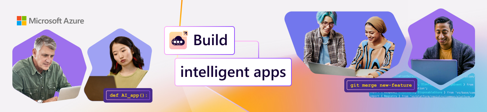

<head> 
  <meta property="og:url" content="https://azure.github.io/cloud-native/60daysofia/kick-off"/>
  <meta property="og:type" content="website"/> 
  <meta property="og:title" content="**Build Intelligent Apps | AI Apps on Azure"/> 
  <meta property="og:description" content="Join us on a learning journey to build intelligent apps on Azure. Read all about the upcoming #BuildIntelligentApps initiative on this post!"/> 
  <meta property="og:image" content="https://github.com/Azure/Cloud-Native/blob/main/website/static/img/ogImage.png"/> 
  <meta name="twitter:url" content="https://azure.github.io/Cloud-Native/60daysofIA/kick-off" /> 
  <meta name="twitter:title" content="**Build Intelligent Apps | AI Apps on Azure" /> 
  <meta name="twitter:description" content="Join us on a learning journey to build intelligent apps on Azure. Read all about the upcoming #BuildIntelligentApps initiative on this post!” /> 
  <meta name="twitter:image" content="https://azure.github.io/Cloud-Native/img/ogImage.png" /> 
  <meta name="twitter:card" content="summary_large_image" /> 
  <meta name="twitter:creator" content="@devanshidiaries" /> 
  <link rel="canonical" href="https://azure.github.io/Cloud-Native/60daysofIA/kick-off" /> 
</head> 

<!-- End METADATA -->

Let’s ride the buzz of AI with the focus on building intelligent apps using cloud-native technologies. Build '#IntelligentApps' brings to you a learning journey to build your skills on creating differentiated experiences while modernizing your applications. It’s time to 'learn it all'. 

## What We’ll Cover

* What is Build Intelligent Apps?
* How Can I *participate*?
* How Can I *skill up*? (in just 60 Days)
* **Exercise:** Take the [Build Intelligent Apps Skills Challenge](https://aka.ms/build-ia/csc)

## Get Ready To Build #IntelligentApps starting February 19!

Today, we kick off with content and activities for you to skill up on all things Intelligent Apps or AI Apps on Azure with content, events, and community interactions! Read on to learn about what is coming!

## Explore Our Initiatives

We have a number of initiatives planned for the month to help you learn and skill up on relevant technologies. Click on the links to visit the relevant pages for each.

* [#60Days of IA](https://aka.ms/build-ia/60days) - 8 themed weeks of blogs on AI led application development
* [Learn Live Series](https://aka.ms/FallForIA/LearnLive) – 8 weekly live episodes on 'Kubernetes' and 'Serverless'
* [Ask The Expert](https://aka.ms/build-ia/ATE-series) – join live Q&A sessions with Product Engineering and Advocacy teams
* [Cloud Skills Challenge](https://aka.ms/build-ia/csc) – skill up by competing with peers to complete modules

:::info
## Register for the events!

What are 4 things you can do today, to jumpstart your learning journey?

* **Register** for live Q&A sessions (free, online) 
  * February 29 – [Ask The Expert: Intelligent Apps with Azure Kubernetes Service](https://aka.ms/intelligent-apps/ate-aks/?ocid=buildia24_60days_blogs)
  * March 7 – [Ask The Expert: Intelligent Apps with Azure Cosmos DB](https://aka.ms/intelligent-apps/ate-cosmos/?ocid=buildia24_60days_blogs)
  * March 21 - [Ask The Expert: Intelligent Apps with Azure AI](https://aka.ms/intelligent-apps/ate-ai/?ocid=buildia24_60days_blogs) 
  * April 4 – [Ask The Expert: Intelligent Apps with Azure Functions](https://aka.ms/intelligent-apps/ate-functions/?ocid=buildia24_60days_blogs)
* **Register** for the [Learn Live Series: Kubernetes Edition](https://aka.ms/intelligent-apps/aks-learnlive?ocid=buildia24_LL_website&ocid=buildia24_60days_blogs) – weekly live learning 
  * February 21 – [Episode 1: Deploying Intelligent Apps with OpenAI on AKS](https://aka.ms/learn-live-building-intelligent-apps-aks-ep1?ocid=buildia24_60days_blogs) 
  * February 28 – [Episode 2: Bring Your Own AI Models to Intelligent Apps on AKS with KAITO](https://aka.ms/learn-live-building-intelligent-apps-aks-ep2?ocid=buildia24_60days_blogs)
  * March 6 – [Episode 3: Enhance Observability of Your Intelligent Apps on AKS](https://aka.ms/learn-live-building-intelligent-apps-aks-ep3?ocid=buildia24_60days_blogs)
  * March 13 – [Episode 4: Taking Your Intelligent App Global with AKS](https://aka.ms/learn-live-building-intelligent-apps-aks-ep4?ocid=buildia24_60days_blogs)
* **Register** for the [Azure Kubernetes Day at KubeCon, EU](https://aka.ms/aks-day?ocid=buildia24_60days_blogs) to meet the product engineering teams in-person and learn about the new product capabilities for intelligent apps.
* **Complete** the [Cloud Skills Challenge](https://aka.ms/intelligent-apps/apps-csc?ocid=buildia24_60days_blogs) to earn a Microsoft Learn badge – ends on *April 15*!
:::

