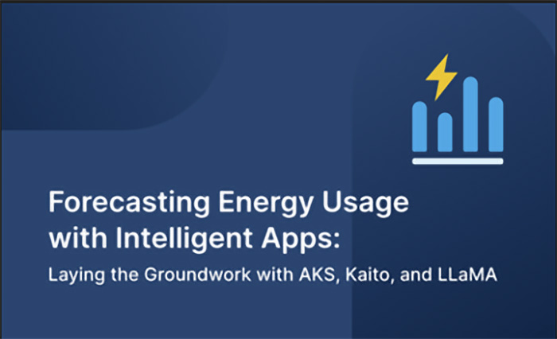
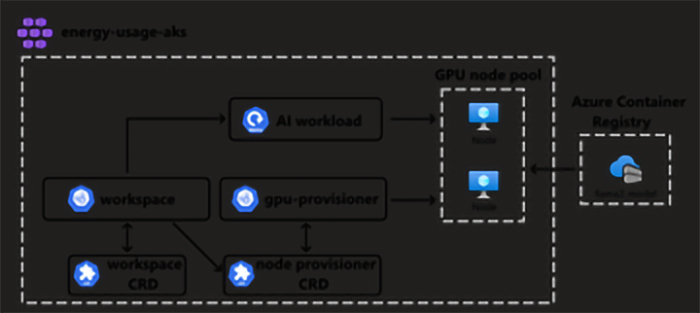

<head> 
  <meta property="og:url" content="https://azure.github.io/cloud-native/60daysofia/forecasting-energy-usage-with-intelligent-apps-1"/>
  <meta property="og:type" content="website"/> 
  <meta property="og:title" content="Build Intelligent Apps | AI Apps on Azure"/> 
  <meta property="og:description" content="In this series, you'll create an Intelligent App powered by Azure Kubernetes Service (AKS) to forecast energy usage and cost."/> 
  <meta property="og:image" content="https://github.com/Azure/Cloud-Native/blob/main/website/static/img/ogImage.png"/> 
  <meta name="twitter:url" content="https://azure.github.io/Cloud-Native/60daysofIA/forecasting-energy-usage-with-intelligent-apps-1" /> 
  <meta name="twitter:title" content="Build Intelligent Apps | AI Apps on Azure" />
 <meta name="twitter:description" content="In this series, you'll create an Intelligent App powered by Azure Kubernetes Service (AKS) to forecast energy usage and cost." />
  <meta name="twitter:image" content="https://azure.github.io/Cloud-Native/img/ogImage.png" /> 
  <meta name="twitter:card" content="summary_large_image" /> 
  <meta name="twitter:creator" content="@devanshidiaries" /> 
  <link rel="canonical" href="https://azure.github.io/Cloud-Native/60daysofIA/forecasting-energy-usage-with-intelligent-apps-1" /> 
</head> 

<!-- End METADATA -->



*This three-part series demonstrates how to create an Intelligent App that forecasts future energy consumption and pricing based on historical data. In this first article, you’ll set up an Azure Kubernetes Service (AKS) environment, install KAITO, and set up KAITO to work with the LLaMA 2 model.*

## Forecasting Energy Usage with Intelligent Apps Part 1: Laying the Groundwork with AKS, KAITO, and LLaMA

Intelligent Apps leverage artificial intelligence (AI) and machine learning (ML) technologies to enhance traditional applications with advanced capabilities. They enable businesses to make smarter decisions, automate tasks, and drive innovation by extracting actionable insights from vast amounts of data.

In this series, you’ll create an Intelligent App powered by [Azure Kubernetes Service](https://azure.microsoft.com/en-ca/products/kubernetes-service) (AKS) to forecast energy usage and cost. Each article will demonstrate the use of core Azure technologies, particularly AKS, to build an application that generates forecasts based on AI capabilities applied to user input and historical data analysis.

Let’s get started!

### Prerequisites

To follow this tutorial, ensure you have the following:

- An [Azure Subscription](https://azure.microsoft.com/en-us/free/search) that supports the GPU-enabled [Standard_NC12s_v3 instance type](https://learn.microsoft.com/en-us/azure/virtual-machines/ncv3-series) in the selected region. You might need to request an increase in vCPU quota.
 - Basic understanding of [AKS](https://azure.microsoft.com/en-us/products/kubernetes-service) and Kubernetes

### Building an Intelligent App with Azure Kubernetes Service and KAITO

This first article walks you through setting up an AKS environment and the Kubernetes AI Toolchain Operator (KAITO) to automate AI/ML model deployment in the AKS cluster.

#### Downloading the LLaMA 2 Model

A fundamental piece in your Intelligent App’s architecture is the target model. Here, you’ll use LLaMA 2, an open-source project developed by Meta in partnership with Microsoft.

LLaMA 2 is a large-scale training and inference framework for ML models. It provides a distributed computing infrastructure that enables executing ML tasks across multiple nodes or clusters, using parallelism and optimization techniques to improve performance.

To configure your model, download LLaMA 2 by following the instructions in [this document](https://github.com/Azure/kaito/tree/main/presets/models/llama2). Ensure you download the **llama2-7b** model.

#### Configuring the AKS Cluster and KAITO



Creating an AKS environment is the first step for onboarding large AI inference models onto Kubernetes. Later, you’ll integrate the node provisioner controller with AKS APIs, letting you dynamically add GPU nodes to the cluster to promote scalability and optimal resource use.

Additionally, AKS facilitates testing service endpoints within the cluster, providing a reliable environment for validating and fine-tuning AI inference services.

KAITO is an open-source operator that transforms how you deploy AI models on Kubernetes. It streamlines the process, automating critical tasks like infrastructure provisioning and resource optimization. It intelligently selects the optimal hardware configuration for your specific model, using available CPU and GPU resources on AKS. KAITO eliminates the manual setup complexities, accelerating your deployment time and reducing associated costs.

To set up an AKS cluster and install KAITO, follow [this tutorial](https://github.com/Azure/kaito/blob/main/docs/installation.md), adjusting the KAITO installation steps to match the **llama2-7b** model you downloaded earlier.

:::info
Register for **[Intelligent Apps on AKS: Episode 3](https://aka.ms/learn-live-building-intelligent-apps-aks-ep3?ocid=buildia24_60days_blogs)**, a live hands-on training with an expert on how OpenCost, Prometheus, and Grafana with AKS can improve intelligent apps. 
:::

#### Pushing LLaMA 2 Model to Azure Container Registry

Now that you have AKS with the KAITO installation, you need to push the local model image to the AKS cluster.

Create an Azure Container Registry (ACR) resource using Azure CLI with the following command, replacing `<YOUR-ACR-NAME>` with a new ACR name:

```
az acr create --name <YOUR-ACR-NAME> --resource-group $RESOURCE_GROUP --sku Standard --location $LOCATION
```

Now, push your local LLaMA 2 model’s Docker image to the ACR hosted at `<YOUR-ACR-NAME>.azurecr.io` by running:

```
docker push <YOUR-ACR-NAME>.azurecr.io/llama2_model:latest
```

Finally, run the command to update the AKS cluster to attach it to your ACR, allowing the cluster to pull the model container image from `<YOUR-ACR-NAME>.azurecr.io`:

```
az aks update -g $RESOURCE_GROUP -n $MY_CLUSTER --attach-acr <YOUR-ACR-NAME>
```

#### Starting the Inference Service

After installing KAITO, run the following command to start a `llama-2-7b` inference service, replacing `<YOUR-ACR-NAME>` with the ACR name you created previously:

```
$ cat examples/kaito_workspace_llama2_7b.yaml
apiVersion: kaito.sh/v1alpha1
kind: Workspace
metadata:
  name: workspace-llama-2-7b
resource:
  instanceType: "Standard_NC12s_v3"
  labelSelector:
    matchLabels:
      apps: llama-2-7b
inference:
  preset:
    name: "llama-2-7b"
    accessMode: private
    presetOptions:
      image: <YOUR-ACR-NAME>.azurecr.io/llama2_model:latest

$ kubectl apply -f examples/kaito_workspace_llama2_7b.yaml
```

Kubernetes uses this YAML code to instantiate a workspace resource with the specified configurations. This enables deploying and managing inference workloads within the cluster.

You can monitor the workspace status by executing the command below. The model deployment has been completed once the `WORKSPACEREADY` column becomes `True`:

```
$ kubectl get workspace workspace-llama-2-7b 
| NAME | INSTANCE | RESOURCEREADY | INFERENCEREADY | WORKSPACEREADY | AGE |
| workspace-llama-2-7b | Standard_NC12s_v3 | True | True | True | 10m |
```

**Note**: Achieving machine and workspace readiness may take up to 20 minutes.

Now, run the command below to find the inference service’s cluster IP:

```
$ kubectl get svc workspace-llama-2-7b 
| NAME | TYPE | CLUSTER-IP | EXTERNAL-IP | PORT(S) | AGE |
| workspace-llama-2-7b | ClusterIP | <CLUSTERIP> | <none> | 80/TCP,29500/TCP | 10m |
```

Finally, run a curl pod to test the service endpoint in the cluster:

```
export CLUSTERIP=$(kubectl get svc workspace-llama-2-7b -o jsonpath="{.spec.clusterIPs[0]}")

$ kubectl run -it --rm --restart=Never curl --image=curlimages/curl -- curl -X POST http://$CLUSTERIP/generate -H "accept: application/json" -H "Content-Type: application/json" -d "{\"prompts\":[\"What is the capital of India?\"],\"parameters\": {\"temperature\": 0, \"max_gen_len\": 64 }}"
```

You should receive these results:

```
{"results":[{"prompt":"What is the capital of India?","response":"\nWhat is the capital of India? New Delhi is the capital of India. It is located in the northern part of the country. It is also the home of the President of India.\nWhat is the"}]}
```

**Note**: You can test with your own questions, but there may be inaccuracies within the response. This is because AKS hasn’t fine-tuned the model for your scenario.

That’s it! You’ve successfully established your AKS environment and familiarized yourself with setting up KAITO to deploy the LLaMA 2 model within your Kubernetes environment. You’re now ready to analyze a model and make predictions using Azure’s AI services.

## Next Steps

In this article, you established an AKS cluster and configured KAITO to integrate with the LLaMA 2 model for advanced ML capabilities. In part 2, you’ll use AKS and KAITO to analyze historical energy consumption data with advanced ML models. You’ll create a dynamic web interface for users to input data, generate predictions, and visualize results seamlessly.

Be sure to join the [Cloud Skill Challenge](https://azure.github.io/Cloud-Native/Build-IA/CloudSkills) to level up your cloud computing skills and gain hands-on experience. You can also register for the [next episode](https://aka.ms/learn-live-building-intelligent-apps-aks-ep3?ocid=buildia24_60days_blogs) on **Intelligent Apps with Azure Kubernetes Service**, an instructor led live learning experience to deploy your app on AKS. And, join the AKS product and engineering team at *KubeCon EU 2024*—the premier conference for cloud-native technologies, for **AKS [Customer](https://aka.ms/aks-day) and [Lab](https://aka.ms/aks-lab-day) Days**.