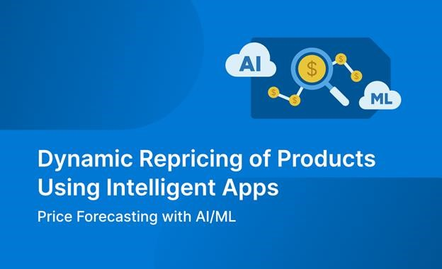

<head> 
  <meta property="og:url" content="https://azure.github.io/cloud-native/60daysofia/dynamic-repricing-of-products-using-intelligent-apps-part-2"/>
  <meta property="og:type" content="website"/> 
  <meta property="og:title" content="Build Intelligent Apps | AI Apps on Azure"/> 
  <meta property="og:description" content="In this series, you’ll learn why Cosmos DB is an ideal choice for powering such applications—and how it makes building Intelligent Apps accessible and approachable."/> 
  <meta property="og:image" content="https://github.com/Azure/Cloud-Native/blob/main/website/static/img/ogImage.png"/> 
  <meta name="twitter:url" content="https://azure.github.io/Cloud-Native/60daysofIA/dynamic-repricing-of-products-using-intelligent-apps-part-2" /> 
  <meta name="twitter:title" content="Build Intelligent Apps | AI Apps on Azure" />
 <meta name="twitter:description" content="In this series, you’ll learn why Cosmos DB is an ideal choice for powering such applications—and how it makes building Intelligent Apps accessible and approachable." />
  <meta name="twitter:image" content="https://azure.github.io/Cloud-Native/img/ogImage.png" /> 
  <meta name="twitter:card" content="summary_large_image" /> 
  <meta name="twitter:creator" content="@devanshidiaries" /> 
  <link rel="canonical" href="https://azure.github.io/Cloud-Native/60daysofIA/dynamic-repricing-of-products-using-intelligent-apps-part-2" /> 
</head> 

<!-- End METADATA -->



*This three-part series demonstrates how to use Azure Cosmos DB to build an Intelligent App that uses historical pricing and product data to forecast future price fluctuations for specific products. In this installment, you’ll use artificial intelligence and machine learning to build the price forecasting model.*

## Dynamic Repricing of Products Using Intelligent Apps Part 2: Price Forecasting with AI/ML

[In Part 1 of this series](https://azure.github.io/Cloud-Native/60DaysOfIA/dynamic-repricing-of-products-using-intelligent-apps-part-1), you set up and populated an [Azure Cosmos DB](https://azure.microsoft.com/free/cosmos-db?ocid=buildia24_60days_blogs) database, laying the groundwork for your Intelligent Application. You also imported your data to a Cosmos DB instance.

In this second article, you’ll use this data alongside Azure’s machine learning (ML) and artificial intelligence (AI) capabilities to build a model that analyzes pricing trends and predicts future prices for a fictional e-commerce business.

### Analyzing Price Trends to Predict Future Prices

The ability to forecast pricing is a game-changer. With the power of foresight, businesses can preemptively adjust their pricing strategies in line with market expectations.

In this tutorial, we’ll give you a step-by-step guide to generating a predictive ML model for an e-commerce business, using Azure’s suite of ML tools.

#### Prerequisites

Before you begin, make sure you have the following:

- An active [Azure Account](https://azure.microsoft.com/free/?ocid=buildia24_60days_blogs)
- A Cosmos DB instance with the [pricing data](https://www.kaggle.com/datasets/sujaykapadnis/price-quote-data/data) you set up in Part 1
- Access to [Azure Machine Learning Studio](https://studio.azureml.net/)
- An [Azure Machine Learning workspace](https://learn.microsoft.com/azure/machine-learning/tutorial-azure-ml-in-a-day?view=azureml-api-2&ocid=buildia24_60days_blogs)
- A [Jupyter notebook set up](https://learn.microsoft.com/azure/machine-learning/quickstart-create-resources?view=azureml-api-2#create-a-new-notebook&ocid=buildia24_60days_blogs) in your workspace
- Familiarity with [Azure Machine Learning](https://azure.microsoft.com/products/machine-learning?ocid=buildia24_60days_blogs) concepts
- Basic Python programming knowledge and understanding of ML concepts

**Note**: You should add and run all code in this article into your Jupyter Notebook in the order in which it appears.

:::info
Check out the Azure **[Cosmos DB Ask The Expert](https://aka.ms/intelligent-apps/ate-cosmos?ocid=buildia24_60days_blogs)** session to learn how to build RAG solutions, manage chat history by seamlessly connecting with *Azure OpenAI*, as well as explore the power of *Azure Cosmos DB's copilot*. The experts will also cover how to seamlessly integrate your operational and transactional data with AI frameworks and sdks like Semantic Kernel, Langchain, and LlamaIndex. 
:::

#### Extract Historical Pricing Data from Cosmos DB

Start by extracting historical pricing data from Cosmos DB, where you stored it in Part 1. For this tutorial, you’ll extract items with names ending in `JACKET`. Because the dataset is relatively small, a simple `like` query will do. However, when working with larger data sets, you should consider additional upfront data cleaning and categorizing, to ensure you can query your database efficiently.

Run the code below to extract the data:

```
from azure.cosmos import CosmosClient, exceptions
import pandas as pd
```
```
# Initialize a Cosmos client
endpoint = "your_cosmos_db_endpoint"
key = 'your_cosmos_db_key'
client = CosmosClient(endpoint, key)
```
```
# Connect to the database and container
database_name = 'your_database_name'
container_name = 'your_container_name'
database = client.get_database_client(database_name)
container = database.get_container_client(container_name)
```
```
# Query these items using the SQL query syntax
query = "SELECT * FROM c where ITEM_DESC like '%JACKET'"
items = list(container.query_items(query=query, enable_cross_partition_query=True))
```
```
# Convert the query result to a DataFrame
pricing_data = pd.DataFrame(items)
```

#### Preprocess Data and Split into Training and Testing

Before feeding the data into an ML model, preprocess it and split it into training and testing sets using the code below:

```
from sklearn.model_selection import train_test_split
```
```
# Assume the DataFrame `pricing_data` has columns: 'quote_date', 'price', 'price_relative', 'item_id', etc.
```
```
# Convert 'quote_date' from string to datetime for proper chronological splitting
pricing_data['QUOTE_DATE'] = pd.to_datetime(pricing_data['QUOTE_DATE'], format='%Y%m')
```
```
# Selecting the features and target for the model
X = pricing_data[['QUOTE_DATE', 'ITEM_ID', 'PRICE_RELATIVE','STRATUM_WEIGHT', 'SHOP_WEIGHT']]
y = pricing_data['price']
```
```
# Split the data into training and testing sets
# We'll use a chronological split rather than a random split to maintain the time series integrity
split_date = pd.Timestamp('YYYY-MM-DD')  # replace with the appropriate date
train = pricing_data.loc[pricing_data['QUOTE_DATE'] <= split_date]
test = pricing_data.loc[pricing_data['QUOTE_DATE'] > split_date]
```
```
X_train, y_train = train[['ITEM_ID', 'PRICE_RELATIVE', 'STRATUM_WEIGHT', 'SHOP_WIGHT']], train['PRICE']
X_test, y_test = test[['ITEM_ID', 'PRICE_RELATIVE', 'STRATUM_WEIGHT', 'SHOP_WEIGHT']], test['PRICE']
```

#### Train a Forecasting Model Using Azure Machine Learning

Next, you’ll build and train the forecasting model using Azure Machine Learning. Note that in the code below, you’re using a local compute target, which works on simple datasets like the one used for this tutorial. However, Azure Machine Learning offers more powerful compute targets for more complex models.

```
from azureml.core import Workspace, Experiment, Environment
from azureml.train.automl import AutoMLConfig
```
```
# Connect to your Azure ML workspace
ws = Workspace.from_config()
```
```
# Define your experiment
experiment_name = 'price_forecasting_experiment'
experiment = Experiment(ws, experiment_name)
```
```
# Configure the automated ML job 

automl_config = AutoMLConfig(
    task='forecasting',
    primary_metric='normalized_root_mean_squared_error',
    experiment_timeout_minutes=30,
    training_data=train,
    label_column_name='PRICE',
    n_cross_validations=5,
    enable_early_stopping=True,
    verbosity=logging.INFO,
    compute_target='local'
) 
```
```
# Submit the experiment
run = experiment.submit(automl_config, show_output=True)
```

#### Evaluate and Integrate the Model

Next, check the results of the model by running the following:

```
from azureml.widgets import RunDetails
```
```
# Show run details while running
RunDetails(run).show()
```
```
# Wait for the run to complete
run.wait_for_completion()
```
```
# Retrieve the best model from the AutoML run
best_run, fitted_model = run.get_output()
print(best_run)
print(fitted_model)
```
```
# Evaluate the best model's accuracy using the test data
# Assuming test data is a Pandas DataFrame with the same structure as the training data
X_test = test_data.drop('PRICE', axis=1)  # Features (drop the target column)
y_test = test_data['PRICE']  # True values of the target column
```
```
# Predict using the fitted model
y_pred = fitted_model.predict(X_test)
```
```
# Calculate the accuracy or any other performance metrics
from sklearn.metrics import mean_squared_error, r2_score
mse = mean_squared_error(y_test, y_pred)
r2 = r2_score(y_test, y_pred)
```
```
print(f"Mean Squared Error: {mse}")
print(f"R-squared: {r2}")
```

With the performance metrics calculated, you can now determine whether the model’s predictions are accurate enough for your needs. If they are, you can integrate the model with a hypothetical e-commerce platform. The easiest way to integrate a model is to deploy it using an Azure Machine Learning endpoint:

```
ws = Workspace.from_config() 
```
```
# Register the model from the best run
model = best_run.register_model(model_name='price_forecast_model', model_path='outputs/model.pkl') 
```
```
# Download the scoring file produced by AutoML
best_run.download_file('outputs/scoring_file_v_1_0_0.py', 'score.py')
```
```
# Download the environment file produced by AutoML
best_run.download_file(constants.CONDA_ENV_FILE_PATH, 'environment.yml')
```
```
# Create the environment
env = Environment.from_conda_specification(name='forecasting_environment', file_path='environment.yml')
```
```
# Create the inference configuration
inference_config = InferenceConfig(entry_script='score.py', environment=env)
```
```
# Create the deployment configuration
deployment_config = AciWebservice.deploy_configuration(cpu_cores=1, memory_gb=1)
```
```
# Deploy the model as a web service
service_name = 'price-forecast-service'
service = Model.deploy(ws, service_name, [model], inference_config, deployment_config) 
service.wait_for_deployment(show_output=True)
```
```
# The web service endpoint URL
print(service.scoring_uri)
```

And with that, you’ve deployed your Azure ML endpoint and are ready for Part 3!

### Conclusion

In this tutorial, you extracted data from Cosmos DB, preprocessed it, performed a train/test split, initiated a model training pipeline using Azure Machine Learning, and, finally, tested and deployed the model. These are crucial steps to building a system that can intelligently forecast product prices.

In the third and final article of this series, you’ll build a web interface that displays the generated price forecasts using approachable, simple graphs that help businesses easily make data-informed decisions.

To challenge yourself, learn more about Azure’s AI and ML tooling, and put the skills you’ve learned in this tutorial to work, participate in the [Data Cloud Skill Challenge](https://azure.github.io/Cloud-Native/Build-IA/CloudSkills). You can also register for **AKS [Customer](https://aka.ms/aks-day) and [Lab](https://aka.ms/aks-lab-day) Days** at the premier conference for cloud-native technologies, *KubeCon EU 2024*.