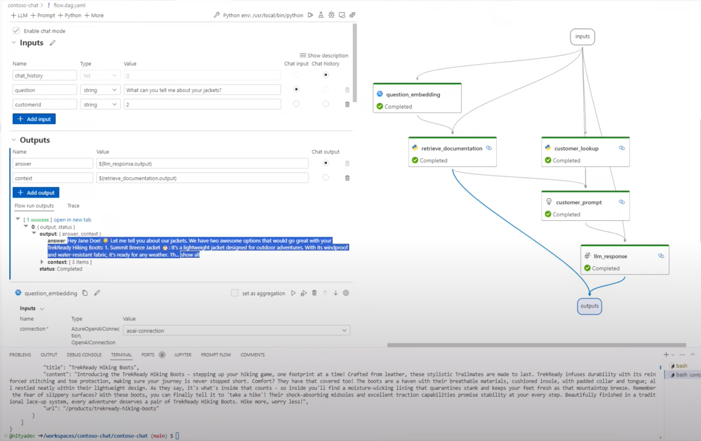

<head> 
  <meta property="og:url" content="https://azure.github.io/cloud-native/60daysofia/build-contoso-chat-end-to-end"/>
  <meta property="og:type" content="website"/> 
  <meta property="og:title" content="Build Intelligent Apps | AI Apps on Azure"/> 
  <meta property="og:description" content="Building generative AI applications poses new challenges for streamlining end-to-end application development - from prompt engineering, to LLM Ops. In this post we introduce Contoso Chat, a sample application for building a copilot with your data - using the Azure AI platform with prompt flow."/> 
  <meta property="og:image" content="https://github.com/Azure/Cloud-Native/blob/main/website/static/img/ogImage.png"/> 
  <meta name="twitter:url" content="https://azure.github.io/Cloud-Native/60daysofIA/build-contoso-chat-end-to-end" /> 
  <meta name="twitter:title" content="Build Intelligent Apps | AI Apps on Azure" />
 <meta name="twitter:description" content="Building generative AI applications poses new challenges for streamlining end-to-end application development - from prompt engineering, to LLM Ops. In this post we introduce Contoso Chat, a sample application for building a copilot with your data - using the Azure AI platform with prompt flow." />
  <meta name="twitter:image" content="https://azure.github.io/Cloud-Native/img/ogImage.png" /> 
  <meta name="twitter:card" content="summary_large_image" /> 
  <meta name="twitter:creator" content="@devanshidiaries" /> 
  <link rel="canonical" href="https://azure.github.io/Cloud-Native/60daysofIA/build-contoso-chat-end-to-end" /> 
</head> 

<!-- End METADATA -->

**Welcome to Day 1️⃣ of Azure AI week on #60DaysOfIA** 

In today's post, we'll introduce you to the [Contoso Chat](https://aka.ms/aitour/contoso-chat) sample - a comprehensive end-to-end reference sample that walks you through the journey of building the customer support AI application we talked about in our kickoff post yesterday. By the end of this tutorial, you will be able to:
 - explain how to build a copilot app end-to-end on Azure AI
 - explain what Retrieval Augmented Generation does for copilot apps
 - explain what prompt flow is and how it streamlines your workflow
 - describe the Azure AI platform and Azure AI SDK capabilities

_Ready? Let's go!_

## What You'll Learn Today
 * **Contoso Chat Sample**: Building a copilot with Azure AI and Prompt flow
 * **Retrieval Augmented Generation**: Design pattern for using custom data
 * **Prompt flow**: Open-source tooling for orchestrating end-to-end workflow
 * **Azure resources**: Provisioning Azure for the Contoso Chat AI project
 * **Hands-on lab**: Step-by-step tutorial to build & deploy Contoso Chat
 * **Exercise**: [_Fork the sample_](https://aka.ms/aitour/contoso-chat) then work through the hands-on tutorial.
 * **Resources**: [_Explore this collection_](https://aka.ms/ai-studio/collection?ocid=buildia24_60days_blogs) for samples, docs and training resources.

 

---

## Contoso Chat Sample

The [Contoso Chat](https://aka.ms/aitour/contoso-chat) sample provides a comprehensive end-to-end reference example for using Azure AI Studio and Prompt flow, to build a copilot application end-to-end. The sample implements a _customer support chat AI_ experience - allowing customers on the Contoso Outdoors website to ask questions about related products and receive relevant responses based on their query and purchase history. The illustrated guide below gives you a high-level overview of the steps involved in building the application - from provisioning Azure resources to deploying and using the chat AI endpoint. To learn more about the application scenario, refer to our [kickoff post](https://azure.github.io/Cloud-Native/60DaysOfIA/fuel-your-intelligent-apps-with-azure-ai) for this week.

## RAG Design Pattern

Our first step is to define the application architecture for Contoso Chat. We know we want to have our copilot _grounded in our data_ so that customer queries return responses that reflect the product catalog or customer purchase history.

The challenge is that Large Language Models (LLM) are trained on massive datasets so the default responses may not be _relevant_ or _accurate_ with respect to your data. This is where prompt engineering and design patterns like Retrieval Augmented Generation (RAG) come in. RAG is a design pattern that uses an information _retrieval_ component to get data relevant to the user prompt, then _augments_ the prompt with that context before sending it to the LLM, as illustrated below.

We can break down the workflow into the following steps:
 1. User asks a question ("User prompt")
 1. The question is sent to an information retrieval component ("AI Search")
 1. This vectorizes the query ("Embedding Model")
 1. And uses the vector to retrieve relevant results ("Product Index")
 1. Results are used to augment User prompt ("Model prompt")
 1. The enhanced prompt is sent to the LLM ("Chat completion")

The answer is then returned to the user, who now sees a response that is more relevant to the products in your catalog, and personalized to their purchase history. Note that this basic copilot workflow requires us to deploy two large language models:
 1. Text-Embedding model (e.g., `text-embedding-ada-002`) that vectories the user query 
 1. Text-Generation model (e.g., `gpt-35-turbo`) that generates the final response

## Prompt flow Orchestration

Implementing the RAG pattern requires a number of interactions between the language model deployments and the data sources used (e.g., search index for products, cusomer database for purchase history), and _coordination_ of intermediate steps before the final response can be delivered. This is where frameworks like Prompt flow, LangChain and Semantic kernel come in.

The Contoso Chat sample makes extensive use of Prompt flow - an [open-source project](https://github.com/microsoft/promptflow) on GitHub, with its own SDK and VS Code extension. Prompt flow provides a comprehensive solution that simplifies the process of prototyping, experimenting, iterating, and deploying your AI applications. It is [recommended for use as a feature within Azure AI Studio](https://learn.microsoft.com/azure/ai-studio/how-to/prompt-flow?ocid=buildia24_60days_blogs), making it a natural first choice for building our Contoso Chat application. The figure shows a high-level architecture diagram showcasing the Azure components used with Prompt flow as the orchestration layer.

With Prompt flow, your application is defined as a a directed acyclic graph of _nodes_ (`flow.dag.yaml`) that connect _input_ (prompt) and final _output_ (response) - with intermediate nodes implemented as Python _functions_ (tools) that process or transform the data flowing through them. The Prompt flow extension in VS Code provides a rich _visual editor_ capability as shown below, making it easy to define, debug, run, and test, your application in a local development environment. _This view also helps us see how the RAG pattern is implemented in practice, in our copilot_.

## Azure Provisioning

The Contoso Chat sample comes with a [`provision.sh`](https://github.com/Azure-Samples/contoso-chat/blob/main/provision.sh) script that will pre-provision many of the Azure resources for you, for use in the development workflow. To get started with the implementation, follow the instructions in the [README](https://github.com/Azure-Samples/contoso-chat/blob/main/README.md) file in the repo by doing the following:
 1. [Fork the sample](https://github.com/Azure-Samples/contoso-chat/fork) to your own GitHub account
 2. [Setup development environment](https://github.com/Azure-Samples/contoso-chat/blob/main/README.md#3-development-environment) using GitHub Codespaces
 3. [Authenticate](https://github.com/Azure-Samples/contoso-chat/tree/main#41-authenticate-with-azure) with your Azure subscription
 4. [Run the Provisioning script](https://github.com/Azure-Samples/contoso-chat/tree/main#42-run-provisioning-script) and verify your setup is complete

At this point, you should have an Azure resource group created for your project with the following resources created for your application. Note that in order to complete this step, you must have a valid Azure subscription that has been given access to the relevant Azure OpenAI services. You must also have available quota for model deployments in the specific regions that we use in the provisioning script.

## Hands-on Lab

You can now complete the step-by-step tutorial in the [README](https://github.com/Azure-Samples/contoso-chat/blob/main/README.md) to build, evaluate and deploy the application. Let's quickly review the main steps involved in the end-to-end workflow.

| Stage | Description |
|:---|:---|
| 1. Build a Copilot. | Get familiar with the application codebase. Check out the `data/` folder to see the data we will be using for customer order (history) and product catalog (index). |
| 2. Provision Azure. | Run the `./provision.sh` script or manually provision the required resources. This should setup an Azure AI hub (manage), an Azure AI project (build), an Azure Cosmos DB resource  (customer data) and an Azure AI Search resource (product index). Verify you have a `config.json` created (for local Azure configuration) and an `.env` file (for relevant keys and endpoints for access). |
| 3. Add Models & Data. | The provisioning script does the model deployments - but review them now. Make sure you have a chat completion model (gpt-35-turbo), a chat evaluation model (gpt-4) and a text-embeddings model (text-embedding-ada-02). Use the provided notebooks to populate the data in Azure Cosmos DB and Azure AI Search. |
| 4. Add Connections | The `devcontainer` configuration ensures you have the Prompt flow extension installed in VS Code, and the `pf` too for command-line, by default. Use the provided notebooks to setup _connection configurations_ from prompt flow to key services (Azure OpenAI, Azure AI Search, Azure Cosmos DB) for use in related notes of the prompt flow graph. Use the `pf` tool to validate these were setup correctly (on VS Code). The provision script may have setup some of these for you in the cloud (Azure) for use in later stages (deploy) - take a minute to verify and correct these as described in README. |
| 5. Build Prompt Flow| You are all set to run the prompt flow with your data in Azure.  Explore the components of the prompt flow. Click the _stylized P_ icon in the sidebar to see the Prompt Flow extension activity menu. Open the `contoso-chat/flow.dag.yaml` file in VS Code, then click the _Visual Editor_ option to see the view shown in the earlier screeshot above. Run it to validate it works - then explore the nodes, outputs and code.|
| 6. Evaluate Prompt Flow| You can complete a local evaluation by opening the relevant notebook and running it _cell-by-cell_. Review the code in each cell of the notebook, then analyze the output to understand what the relevant metrics are telling you about the quality of the basic flow. The _batch run_ step takes a while and requires Azure connection setup so consider that an optional step. Switch periodically to the _Azure AI Studio_ website view to see how the relevant Azure AI project pages are updated to show the status of various activities or configurations. |
| 7. Deploy Prompt Flow| Deploying the prompt flow is a 2-step process. First, we need to upload the flow (code, assets) to Azure AI Studio. Do this using the provided notebook, or you can try to do this manually using the _import_ option in Azure AI Studio under the _Prompt Flow_ section. Once uploaded, you need to select a runtime ("automatic") and start it to get a compute instance provisioned to execute your flow. Use that to _test_ that your flow was imported successfully. Then click the _Deploy_ option to deploy the flow. This will take a while - refresh the _Deployments_ page to get updates. Once deployment is successful, use the built-in testing feature to try a simple question against the hosted API endpoint. **Congratulations** Your chat AI endpoint is ready for use! |
| 8. Summary & Clean up | This was a lot. Note that almost every step of this process can be achieved using code (SDK), command-line (CLI) or UI (Studio website) so explore the documentation. _Note that Azure AI Studio is in preview_ so the features are constantly evolving and things may break unexpectedly - send feedback if so! Finally, don't forget to **delete your codespaces and your Azure resources for this lab** to avoid unnecessary charges. And watch the sample repo for updates on workshop content and exercises to extend this further. |
| | |

Completing this workshop can take 60-90 minutes based on your level of familiarity with the tools. In the _next_ blog post, we'll dive a bit deeper into the process with specific focus on the **Azure AI SDK** to understand _how_ you can implement core steps of the workflow from your Python application. And, in the _final_ post of this week, we'll return to the Contoso Chat sample to explore deployment and evaluation in more detail - with additional guidance for ensuring responsible AI usage in your generative AI applications.

## Exercise

Congratulations! You made it to the end of this whirlwind tour of the Contoso Chat sample. Now it's time for you to do the hard work of building this yoursel!! Start by [_forking the sample_](https://aka.ms/aitour/contoso-chat) - then follow the step-by-step instructions in the README.

## Resources

We've referenced a number of links and samples in this post. Bookmark the [_Azure AI Studio: Code-First Collection_](https://aka.ms/ai-studio/collection?ocid=buildia24_60days_blogs) and revisit it regularly for an updated list of resources for code-first development of generative AI applications on Azure.