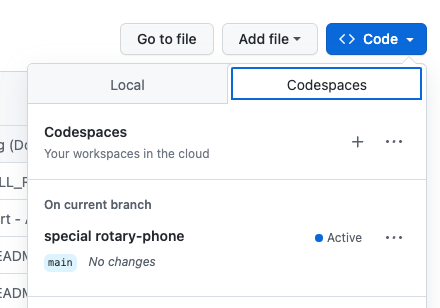

<head> 
  <meta property="og:url" content="https://azure.github.io/cloud-native/60daysofia/build-a-copilot-code-first-with-the-azure-ai-python-sdk"/>
  <meta property="og:type" content="website"/> 
  <meta property="og:title" content="Build Intelligent Apps | AI Apps on Azure"/> 
  <meta property="og:description" content="Have a generative AI application you want to build, but don't know where to start? In this blog post, we introduce the Azure AI Studio Python Quickstart Sample, explain the end-to-end development workflow, then show you how you can get started customizing it, to explore your own application requirements."/> 
  <meta property="og:image" content="https://github.com/Azure/Cloud-Native/blob/main/website/static/img/ogImage.png"/> 
  <meta name="twitter:url" content="https://azure.github.io/Cloud-Native/60daysofIA/build-a-copilot-code-first-with-the-azure-ai-python-sdk" /> 
  <meta name="twitter:title" content="Build Intelligent Apps | AI Apps on Azure" />
 <meta name="twitter:description" content="Have a generative AI application you want to build, but don't know where to start? In this blog post, we introduce the Azure AI Studio Python Quickstart Sample, explain the end-to-end development workflow, then show you how you can get started customizing it, to explore your own application requirements." />
  <meta name="twitter:image" content="https://azure.github.io/Cloud-Native/img/ogImage.png" /> 
  <meta name="twitter:card" content="summary_large_image" /> 
  <meta name="twitter:creator" content="@devanshidiaries" /> 
  <link rel="canonical" href="https://azure.github.io/Cloud-Native/60daysofIA/build-a-copilot-code-first-with-the-azure-ai-python-sdk" /> 
</head> 

<!-- End METADATA -->

**Welcome to Day 2️⃣ of the Azure AI week on #60DaysOfIA** 

Let's recap what we learned so far. In our _kickoff_ post we set the stage by describing our application scenario (Contoso Chat), the paradigm shift for generative AI apps (LLM Ops) and the unified platform for streamlining development (Azure AI Studio). In the next post we walked through the signature [Contoso Chat](https://aka.ms/aitour/contoso-chat) application sample to understand how we can implement that scenario using Azure AI Studio and Prompt flow - from building the chat function, to evaluating it, deploying it to a hosted endpoint, then testing that API in a chat client.

But what if you want to get started building your own application scenario? Over the next three posts, we'll look at _starter samples_ that will get you from ideation (define chat function) to operationalization (deploy chat API) using different tools and frameworks to simplify orchestration.

Ready? Let's go!

## What You'll Learn Today
 * What is the copilot architecture?
 * What is the Azure AI SDK?
 * What is the Quickstart sample?
 * How can I customize and extend this for my scenario?
 * **Challenge:** Fork [this quickstart](https://github.com/Azure-Samples/aistudio-python-quickstart-sample) and build it, then extend it with your data.
 * **Resources:** Bookmark [this collection](https://aka.ms/ai-studio/collection?ocid=buildia24_60days_blogs) for training & documentation.

<br/>


---

<!-- ************************************** -->
<!--  AUTHORS: WRITE BLOG POST CONTENT HERE -->
<!-- ************************************** -->


## 1 | Learning Objectives

The [copilot ai-sdk quickstart](https://github.com/Azure-Samples/aistudio-python-quickstart-sample) is a Python-based starter sample for a code-first approach to building a copilot experience on the Azure AI platform. Since this is the foundational sample, we'll use it to explore some of the details of the implementation and set the stage for you to explore customizing it further for your application requirements.

By the end of this tutorial you should be able to:

1. Explain the functional components of the copilot architecture
1. Explain the Azure resources required to implement a copilot
1. Explain the core functionality provided by the Azure AI SDK
1. Build, run, evaluate, and deploy, a basic copilot with Azure AI Studio.
1. Explore the Azure AI curated VS Code environment to customize the sample

Keep in mind that this is a _quickstart sample_ and is **not meant for production use**. We encourage you to extend and customize the sample to understand the platform capabilities and end-to-end development workflow. Make sure to validate the responses yourself and evaluate its suitability for your application needs in context.

## 2| Copilot Architecture

Let's first revisit the high-level application architecture for our copilot and familiarize ourselves with the core functional components. Our goal is to **build the chat function** component and deploy it to get a hosted **Copilot API** endpoint that we can integrate into front-end applications to provide a conversational chatbot capability grounded in our data.


Let's review what we will need to implement this architecture:

1. **Model Deployments** - we need deployed models for chat and embeddings.
1. **Search Index** - we need a search index populated with our product data.
1. **Azure Resources** - we need to setup and configure our Azure AI project.
1. **App Evaluation** - we need to evaluate copilot quality for responsible AI.
1. **App Deployment** - we need to deploy the copilot for a hosted API endpoint.

The [copilot ai-sdk quickstart](https://github.com/Azure-Samples/aistudio-python-quickstart-sample) provides a starter codebase that implements this chat function using the Retrieval Augmented Generation (RAG) pattern with custom data. The implementation makes use of Azure AI Studio and the [Azure AI SDK (Python)](https://aka.ms/aistudio/docs/sdk?ocid=buildia24_60days_blogs) for a code-first approach. Since these technologies are currently in preview, we expect the sample to keep evolving quickly and **recommend following the README-based tutorial there** for the latest instructions.

## 3 | Azure AI SDK

Before we dive into the sample, let's take a moment to learn about the [Azure AI SDK for Python (preview)](https://learn.microsoft.com/python/api/overview/azure/ai?view=azure-python-preview?ocid=buildia24_60days_blogs). The SDK consists of two packages:
 - [azure-ai-generative](https://pypi.org/project/azure-ai-generative/) - which provides the functionality needed for building, evaluating and deploying Generative AI applications. This has extra packages (index, evaluate, promptflow) you can use for enhanced local development capabilities - or optionally, remove if unused.
 - [azure-ai-resources](https://pypi.org/project/azure-ai-resources/) - which provides the functionality for connecting to, and managing, your Azure AI projects and resources. Use this for control plane operations to create and manage data, indexes, models and deployments.

The generative package makes use of the resources package to [create an `AIClient` instance](https://learn.microsoft.com/azure/ai-studio/how-to/sdk-generative-overview#connecting-to-projects?ocid=buildia24_60days_blogs) that can be used for connecting to the Azure AI project resources.

```python
from azure.ai.resources.client import AIClient
from azure.identity import DefaultAzureCredential

ai_client = AIClient(
    credential=DefaultAzureCredential(),
    subscription_id='subscription_id',
    resource_group_name='resource_group',
    project_name='project_name'
)
```

Once connected, you can use the generative package to build an index, run a local evaluation, or deploy chat functions and prompt flows, using the imports shown:

```python
from azure.ai.generative.index import build_index
from azure.ai.generative.evaluate import evaluate
from azure.ai.resources.entities.deployment import Deployment
```

To get started, you will need to [install the SDK](https://learn.microsoft.com/en-us/azure/ai-studio/how-to/sdk-install?ocid=buildia24_60days_blogs) in your local development environment. When you use the quickstart sample with GitHub Codespaces or the Azure AI curated VS Code environment, the SDK comes pre-installed and ready to use. 

## 4 | Using the Quickstart Sample

The [copilot ai-sdk quickstart](https://github.com/Azure-Samples/aistudio-python-quickstart-sample) provides a comprehensive **README.md** document that describes the step-by-step process for building, running, evaluating, and deploying, a starter copilot sample.

### 4.1 | Pre-Requisites

To get started, you will need an active Azure subscription and have access to the Azure OpenAI service to create and deploy the required models for chat completion, chat evaluation and embedddings. You will also need a GitHub account. 

### 4.2 | Setup Dev Environment

The fastest way to get started exploring the sample is to fork the repo to your personal profile, then launch GitHub Codespaces by navigating to the "Codespaces" tab under the "Code" dropdown and creating a new codespace. Active codespaces are listed as shown below. 



Once the Codespace is ready, you will see the Visual Studio Code editor view in your browser tab. Open the **README.md** in the editor, then follow the instructions to complete the tutorial.


### 4.3 | Initialize Azure AI Resources

To build the copilot, we need to provision the Azure resources listed below. 
 - An [Azure AI hub resource](https://learn.microsoft.com/azure/ai-studio/concepts/ai-resources?ocid=buildia24_60days_blogs) to provide a working _team_ environment and manage resource access, billing and more.
 - An [Azure AI project resource](https://learn.microsoft.com/azure/ai-studio/how-to/create-projects?ocid=buildia24_60days_blogs) to organize the data, models, and deployments for _an application_, and save its state for future use.
 - An [Azure AI Search resource](https://learn.microsoft.com/en-us/azure/search/?ocid=buildia24_60days_blogs) to host the search index for our product data.
 - An [Azure OpenAI resource](https://learn.microsoft.com/azure/openai?ocid=buildia24_60days_blogs) to deploy the models for chat completion, chat evaluation and embeddings.

For now, we will be creating these resources from the [Azure AI Studio UI](https://ai.azure.com?ocid=buildia24_60days_blogs) and [Azure Portal](https://portal.azure.com?ocid=buildia24_60days_blogs) UI in the browser. However, we expect future support for a command-line (CLI) based approach for efficiency and automation. Refer to the sample README for the step-by-step guidance.

### 4.4 | Initialize Azure Configuration

Once we've created the Azure resources, we need to configure our Visual Studio Code environment to connect to the cloud.  The repo comes with a `config.sample.json` that shows you the properties that need to be configured. The easiest way to set these is to download the `config.json` file from your Azure AI project resource and place it in the root folder. This information is then used to initialize the`AIClient` in the code, to support interactions with those resources, as explained earlier.

```json
{
    "subscription_id": "your_subscription_id",
    "resource_group": "your_resource_group",
    "project_name": "your_project_name"
}
```

### 4.5 | Configure Environment Variables

The codebase comes with a sample `.env.sample` file that shows the environment variables you will need to configure, to run the sample. Copy this to `.env` then replace the placeholder strings with the values from the respective Azure resources you provisioned earlier. These environment variables will be used by the Azure AI SDK, to connect to relevant services (by endpoint) with required authentication (key) when implementing the chat function.

```bash
AZURE_SUBSCRIPTION_ID=replace_with_azure_subscription_id
OPENAI_API_TYPE=azure
OPENAI_API_KEY=replace_with_openai_key
OPENAI_API_BASE=replace_with_openai_base
OPENAI_API_VERSION=replace_with_openai_version
AZURE_AI_SEARCH_ENDPOINT=replace_with_aisearch_target
AZURE_AI_SEARCH_KEY=replace_with_aisearch_key
AZURE_AI_SEARCH_INDEX_NAME=replace_with_aisearch_index_name
AZURE_OPENAI_CHAT_MODEL=gpt-35-turbo-16k
AZURE_OPENAI_CHAT_DEPLOYMENT=gpt-35-turbo-16k-0613
AZURE_OPENAI_EVALUATION_MODEL=gpt-35-turbo-16k
AZURE_OPENAI_EVALUATION_DEPLOYMENT="gpt-35-turbo-16k-0613"
AZURE_OPENAI_EMBEDDING_MODEL=text-embedding-ada-002
AZURE_OPENAI_EMBEDDING_DEPLOYMENT=text-ada-embedding-002-2
```

### 4.6 | Explore Custom Data

At this point, the base system configuration is done and we just need to populate the data (for the search index) and then run, evaluate, and iterate, the chat function till the response quality is acceptable. Let's take a minute to explore the codebase `data/` folder to see the sample data we provide in the starter. We only use the product catalog data (to build the index) in _this_ sample but you can explore usage of the other data types for advanced features or integrations later.

| Data Folder | Data Description |
| --- | --- |
| `data/0-misc` | General information - e.g., customer policies for org. |
| `data/1-customer-info`| Customer purchase records  - for 13 fictional customers |
| `data/2-chat-history`| Customer conversation history - for a subset of customers |
| `data/3-product-info` | Product catalog data - for 20 items in 7 categories |
| `data/4-scores` | Test data - for use in evaluations  |
| `data/5-prompt-templates` | Example templates - for different contexts |

### 4.7 | Explore The Codebase

Here are the main files you need to be aware of:

| File | Description |
| --- | --- |
| `src/run.py` | The main entry point for executing core operations |
| `src/streaming_utils.py` | Functions for use in interactive conversation |
| `src/copilot_aisdk/chat.py` | The chat function implementation. |
| `src/system-message.jinja2` | The prompt template with system context (assistant) |

You can now execute the various steps of the end-to-end workflow as follows:
- `python src/run.py --build-index` - to build the search index
- `python src/run.py --question "which tent is the most waterproof?"` - to test the chat function
- `python src/run.py --evaluate` - to evaluate the chat function
- `python src/run.py --deploy` - to deploy the chat function
- `python src/run.py --invoke` - to test the deployed chat API endpoint

Note that the exact syntax and parameters used in these commands may evolve over time - so check the README in the sample for the latest instructions.

### 4.8 | Explore The Chat Function

Let's briefly talk about the custom code for the copilot, found in the `src/chat.py` file. 
- The main entry point is the `chat_completion` function that takes a list of messages representing the conversation history.
- The `get_documents` function extracts the last message ("user question") and uses it to retrieve relevant search results using the OpenAI embeddings model and the Azure AI Search client respectively, in a _retrieval augmented generation_ (RAG) pattern.
- The `chat_completion` function then takes the returned response and crafts an enhanced prompt (with the system context template, initial user message, and returned search results) and sends the request to the OpenAI chat model for completion.
- The returned response is then returned to the user either interactively, or by adding it to the conversation thread (in stream mode).

## 5 | Operationalization

The starter sample provides a simple sequence of command-line operations to build, run, evaluate, deploy, and test, the chat function. However, in a real-world scenario, you would integrate the deployed app with a front-end chat UI (like the Contoso Outdoors website) - and use the Azure AI Studio platform to further evaluate the chat function (batch runs), configure content filters (content safety), and monitor usage (performance) for iterative improvement. We'll discuss some of these tools and practices in the final post of this series.


## 6 | Customizing the Sample

The quickstart sample is a great starting point for exploring your own application scenarios using your own data. Note that the sample is not designed for production use - you will need to do your own validation and evaluation of responses to determine if the chat function is suitable for your application needs. 

However, this is a great time to introduce you to the _cloud development environment_ provided by the [Azure AI curated Visual Studio Code environment](https://learn.microsoft.com/azure/ai-studio/how-to/develop-in-vscode?ocid=buildia24_60days_blogs).This allows you to open your fork of the sample directly from Azure AI Studio, creating a compute instance with a development environment that has the Azure AI SDK and other dependencies pre-installed. Watch this video from the Azure AI Studio team to see how that works - then replicate the process to jumpstart your application exploration journey. 

<iframe width="600" height="400" src="https://www.youtube.com/embed/UbJg7RNLi7E" title="Build generative AI applications using custom code with Azure AI" frameborder="0" allowfullscreen></iframe>

## Resources

We've referenced a number of links and samples in this post. Bookmark the [_Azure AI Studio: Code-First Collection_](https://aka.ms/ai-studio/collection?ocid=buildia24_60days_blogs) and revisit it regularly for an updated list of resources for code-first development of generative AI applications on Azure.