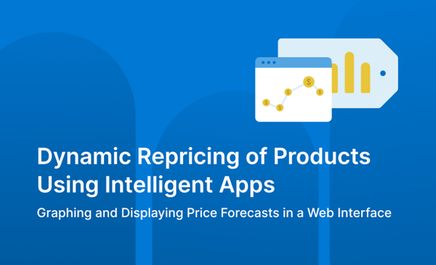

<head> 
  <meta property="og:url" content="https://azure.github.io/cloud-native/60daysofia/dynamic-repricing-of-products-using-intelligent-apps-part-3"/>
  <meta property="og:type" content="website"/> 
  <meta property="og:title" content="Build Intelligent Apps | AI Apps on Azure"/> 
  <meta property="og:description" content="In this series, you’ll learn why Cosmos DB is an ideal choice for powering such applications—and how it makes building Intelligent Apps accessible and approachable."/> 
  <meta property="og:image" content="https://github.com/Azure/Cloud-Native/blob/main/website/static/img/ogImage.png"/> 
  <meta name="twitter:url" content="https://azure.github.io/Cloud-Native/60daysofIA/dynamic-repricing-of-products-using-intelligent-apps-part-3" /> 
  <meta name="twitter:title" content="Build Intelligent Apps | AI Apps on Azure" />
 <meta name="twitter:description" content="In this series, you’ll learn why Cosmos DB is an ideal choice for powering such applications—and how it makes building Intelligent Apps accessible and approachable." />
  <meta name="twitter:image" content="https://azure.github.io/Cloud-Native/img/ogImage.png" /> 
  <meta name="twitter:card" content="summary_large_image" /> 
  <meta name="twitter:creator" content="@devanshidiaries" /> 
  <link rel="canonical" href="https://azure.github.io/Cloud-Native/60daysofIA/dynamic-repricing-of-products-using-intelligent-apps-part-3" /> 
</head> 

<!-- End METADATA -->



*This three-part series demonstrates how to use Azure Cosmos DB to build an Intelligent App that uses historical pricing and product data to forecast future price fluctuations for specific products. In the final article of the series, you’ll build a web interface to graph and display the Intelligent App’s price forecasts.*

## Dynamic Repricing of Products Using Intelligent Apps Part 3: Graphing and Displaying Price Forecasts in a Web Interface

In [​​Part 1](https://azure.github.io/Cloud-Native/60DaysOfIA/dynamic-repricing-of-products-using-intelligent-apps-part-1) of this series, you set up an Azure Cosmos DB database and populated the database with pricing data. Then, in ​[​Part 2](https://azure.github.io/Cloud-Native/60DaysOfIA/dynamic-repricing-of-products-using-intelligent-apps-part-2), you successfully set up an Azure Machine Learning model and deployed it as a web service.

In this final article of the series, you’ll create a web application using Flask that interacts with the Azure Machine Learning endpoint to retrieve predictions and display them using a simple graph.

### Prerequisites

Before proceeding, ensure you have the following:  

- [Python](https://www.python.org/downloads/) version 3.10 or greater
- Flask (`pip install flask`)
- Requests (`pip install requests`)
- Matplotlib (`pip install matplotlib`)
- Access to the Azure Machine Learning endpoint created in Part 2
- [Docker](https://docs.docker.com/get-docker/), including the [Docker command-line interface](https://docs.docker.com/engine/reference/commandline/cli/) (CLI), installed. You’ll use this to build a container image to run the web app on Azure Kubernetes Service (AKS).
- The [Azure CLI](https://docs.microsoft.com/cli/azure/install-azure-cli?ocid=buildia24_60days_blogs) installed. You’ll use this for deployment to AKS.

For a preview of the completed Intelligent App, take a look at the [​project code](https://aka.ms/intelligent-apps/60daysofIA/3.3projectcode).

:::info
Complete the **[Data Skills Challenge](https://aka.ms/intelligent-apps/data-csc?ocid=buildia24_60days_blogs)** to compete for the leaderboard and earn a Microsoft Learn Badge.
:::

### Building the Web Interface

It only takes a few steps to create a simple web app that queries the Azure Machine Learning endpoint, retrieves predictions, and displays the resulting prediction in a graph. Let’s dive in!

```
/your-flask-app
    /templates
        index.html
    app.py
```

The `app.py` file is the backbone of the Flask application. So, add the following code to it:

```
from flask import Flask, render_template, request
import requests
import json
import matplotlib.pyplot as plt
import io
import base64
from datetime import datetime, timedelta
```

```
app = Flask(__name__)
```

```
# Replace with your actual Azure ML endpoint and key
scoring_uri = '<your_azure_ml_endpoint>'
api_key = '<your_api_key>'  # Replace with your actual key if needed
```
```
def generate_future_dates(start_date, periods=3, freq='M'):
    # Generate future dates for the next 'periods' months
    future_dates = [(start_date + timedelta(days=30 * i)).strftime('%Y%m') for i in range(1, periods + 1)]
    return future_dates
```

```
def get_predictions(dates):
    # Prepare the data in JSON format
    data = {"data": [[date] for date in dates]}
    headers = {'Content-Type': 'application/json'}
    if api_key:
        headers['Authorization'] = f'Bearer {api_key}'

    # Send the request to the Azure ML endpoint
    response = requests.post(scoring_uri, json=data, headers=headers)
    if response.status_code == 200:
        return response.json()
    else:
        raise Exception(f"Failed to fetch prediction: {response.text}")
```

```
@app.route('/', methods=['GET', 'POST'])
def index():
    graph_url = None
    if request.method == 'POST':
        start_date = datetime.utcnow()
        future_dates = generate_future_dates(start_date)
        predictions = get_predictions(future_dates)
```

```
        # Plotting the predictions
        plt.figure(figsize=(10, 5))
        plt.plot(future_dates, predictions, marker='o', linestyle='-')
        plt.title('Future Price Predictions for Jackets')
        plt.xlabel('Date (YYYYMM)')
        plt.ylabel('Predicted Price')
        plt.grid(True)

        # Save plot to a BytesIO buffer
        img = io.BytesIO()
        plt.savefig(img, format='png', bbox_inches='tight')
        img.seek(0)
        graph_url = base64.b64encode(img.getvalue()).decode('utf8')
        plt.close()
```
```
    return render_template('index.html', graph_url=graph_url)
```
```
if __name__ == '__main__':
    app.run(debug=True)
```

This simple Flask app accepts incoming requests and queries the Azure Machine Learning endpoint for the next few months of price forecasts for jackets. When it receives the predictions, it generates a graph using `matplotlib`, encoding it with base64 so it can display it in the HTML template. In a larger app, you could save the image to disk and then load it in the web page instead of base64 encoding it—but we’ve skipped that here to keep things simple.

Next, create an `index.html` file in the templates directory. Add the following code for the user interface:

```
<!DOCTYPE html>
<html lang="en">
<head>
    <meta charset="UTF-8">
    <meta name="viewport" content="width=device-width, initial-scale=1.0">
    <title>Price Forecast Visualization</title>
    <!-- Load Tailwind CSS from CDN -->
    <link href="https://cdn.jsdelivr.net/npm/tailwindcss@2.2.19/dist/tailwind.min.css" rel="stylesheet">
</head>
<body class="bg-gray-100 flex flex-col justify-center items-center min-h-screen">
    <div class="w-full bg-blue-800 text-white">
        <div class="container mx-auto py-4">
            <h1 class="text-center text-xl md:text-3xl font-bold">Price Forecast for Jackets</h1>
        </div>
    </div>

    <div class="mt-8 mb-4">
        <form method="post">
            <button type="submit" class="bg-blue-500 hover:bg-blue-700 text-white font-bold py-2 px-4 rounded">
                Get Future Price Predictions
            </button>
        </form>
    </div>

    
        <div class="shadow-xl bg-white rounded-lg p-8">
            <h2 class="text-lg md:text-xl font-semibold mb-4 text-center">Price Prediction Graph</h2>
            <div class="flex justify-center">
                
            </div>
        </div>
    
</body>
</html>
```

To run your Flask app, navigate to the directory containing your `app.py` file and execute the following command:

```
flask run
```

Your web application should now be accessible at `http://127.0.0.1:5000`. Users can input feature data, submit it, and see both the predicted price and a simple graph comparing the current and predicted prices.

:::info
Check out the **[Azure Cosmos DB Ask The Expert](https://aka.ms/intelligent-apps/ate-cosmos?ocid=buildia24_60days_blogs)** session to learn how to build RAG solutions, manage chat history by seamlessly connecting with *Azure OpenAI*, as well as explore the power of *Azure Cosmos DB's copilot*.

The experts also cover how to seamlessly integrate your operational and transactional data with AI frameworks and sdks like Semantic Kernel, Langchain, and LlamaIndex.
:::

### Deploying to Azure Kubernetes Service (AKS)

Running locally is great, but in production, you’ll probably want to deploy to the cloud. Fortunately, Azure makes this easy. Let’s review how to deploy your Flask app using AKS.

First, you need to containerize the Flask app and push it to an Azure Container Registry. Then, you’ll create an AKS cluster and deploy the container image to it.

#### Create a Dockerfile

Start by creating a file named `Dockerfile` in the Flask app’s root folder. Add the following contents:

```
FROM python:3.11-slim
```
```
WORKDIR /usr/src/app
```
```
RUN pip install --no-cache-dir Flask
```
```
COPY . .
```
```
CMD ["flask", "run"]
```

#### Create a Container Registry

Next, create a container registry to store the container image. Use the Azure CLI to create a new resource group if you don’t already have one you’d like to use:

```
az group create --name my-container-resources --location eastus
```

Then, create a container registry in the resource group:

```
az acr create --resource-group my-container-resources --name my-registry --sku Basic
```

You’re now ready to build the container and push it to the registry.

#### Build and Push the Container Image

Build the container image using the following command:

```
docker build -t my-app-image .
```

Then, push the image to your container registry:

```
docker push my-registry.azurecr.io/my-app-image
```

#### Create an AKS Cluster

Now, it’s time to create an AKS cluster. Run the following:

```
az aks create --name my-aks-cluster --resource-group my-resource-group --node-count 3 --node-vm-size Standard_B2s --location eastus
```

It may take a few minutes for Azure to spin up your cluster. Once it’s ready, you can deploy the Flask app.

#### Deploy the Application to AKS

Create a Kubernetes deployment file named `deployment.yaml` in the project’s root folder with the following contents. Update the image field to match the name of your registry and container image.

```
apiVersion: apps/v1
kind: Deployment
metadata:
  name: my-app-deployment
spec:
  replicas: 1
  selector:
    matchLabels:
      app: my-app
  template:
    metadata:
      labels:
        app: my-app
    spec:
      containers:
      - name: my-app
        image: my-registry.azurecr.io/my-app-image
        ports:
        - containerPort: 5000
```

Finally, deploy the application to the AKS cluster using the following command:

```
kubectl get pods
```

You should see a pod named `my-app` in the `Running` state.

To access the application, port-forward the service using the following command: 

```
kubectl port-forward svc/my-app-service 5000:5000
```

Finally, navigate to `http://localhost:5000` in a web browser to verify the application is running.

### Conclusion

In the final part of this series, you learned how to create a simple Flask web app that interacts with the Azure Machine Learning endpoint to provide real-time price predictions and visualize them. By integrating cloud-based artificial intelligence (AI) models with a web interface like this, businesses can dynamically adjust their pricing—helping them remain competitive and stand out from the rest.

If you like what you’ve seen in this series, try the **[Intelligent Apps Cloud Skill Challenge](https://aka.ms/intelligent-apps/csc)**. You can also register for **AKS [Customer](https://aka.ms/aks-day) and [Lab](https://aka.ms/aks-lab-day) Days** at the premier conference for cloud-native technologies, *KubeCon EU 2024*.