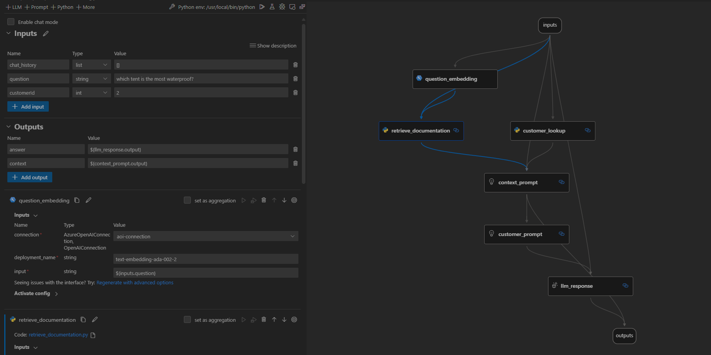
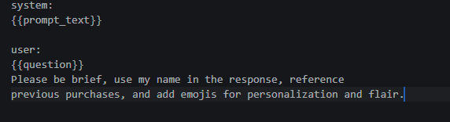
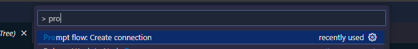

<head> 
  <meta property="og:url" content="https://azure.github.io/cloud-native/60daysofia/build-a-copilot-on-azure-code-first-with-prompt-flow"/>
  <meta property="og:type" content="website"/> 
  <meta property="og:title" content="Build Intelligent Apps | AI Apps on Azure"/> 
  <meta property="og:description" content="This blog walks you through how you can build, evaluate, and test a custom copilot implementation using Prompt Flow and Azure AI SDK."/> 
  <meta property="og:image" content="https://github.com/Azure/Cloud-Native/blob/main/website/static/img/ogImage.png"/> 
  <meta name="twitter:url" content="https://azure.github.io/Cloud-Native/60daysofIA/build-a-copilot-on-azure-code-first-with-prompt-flow" /> 
  <meta name="twitter:title" content="Build Intelligent Apps | AI Apps on Azure" />
 <meta name="twitter:description" content="This blog walks you through how you can build, evaluate, and test a custom copilot implementation using Prompt Flow and Azure AI SDK." />
  <meta name="twitter:image" content="https://azure.github.io/Cloud-Native/img/ogImage.png" /> 
  <meta name="twitter:card" content="summary_large_image" /> 
  <meta name="twitter:creator" content="@devanshidiaries" /> 
  <link rel="canonical" href="https://azure.github.io/Cloud-Native/60daysofIA/build-a-copilot-on-azure-code-first-with-prompt-flow" /> 
</head> 

<!-- End METADATA -->

**Welcome to Day 3️⃣ of the Azure AI week on #60Days Of IA**
In the previous post, we learned about how to get started with the Azure AI SDK and using it to build a Copilot. In today's post we'll be covering `building a copilot with custom code and data using PromptFlow`.

## What You'll Learn Today
 * Quickstart Sample: Using PromptFlow to build a copilot.
 * What is "Prompt Flow" ? 
 * Build the Copilot
 * Evaluate and Test your flow
 * Deploy the Copilot
 * Challenge: [Try this Quickstart sample](https://github.com/Azure-Samples/aistudio-python-promptflow-sample)
 * Resources: [To learn more](https://learn.microsoft.com/en-us/azure/ai-studio/how-to/prompt-flow?ocid=buildia24_60days_blog)

 

<!-- FIXME: banner image -->

---

---

<!-- ************************************** -->
<!--  AUTHORS: WRITE BLOG POST CONTENT HERE -->
<!-- ************************************** -->

## 1 | Learning Objectives

This [quickstart tutorial](https://github.com/Azure-Samples/aistudio-python-promptflow-sample) walks you through the steps of creating a copilot app for the enterprise using custom Python code and Prompt Flow to ground the copilot responses in your company data and APIs. The sample is meant to provide a starting point that you can further customize to add additional intelligence or capabilities. By the end of this tutorial, you should be able to
1. Describe Prompt Flow and its components
1. Build a copilot code-first, using Python and Prompt Flow
1. Run the copilot locally, and test it with a question
1. Evaluate the copilot locally, and understand metrics
1. Deploy the copilot to Azure, and get an endpoint for integrations

Once you've completed the tutorial, try to customize it further for your application requirements, or to explore other platform capabilities. **This is not a production sample** so make sure you validate responses and evaluate the suitability of this sample for use in your application context.

## What is Prompt Flow? 

Prompt Flow is a tool that simplifies the process of building a fully-fledged AI Solution. It helps you prototype, experiment, iterate, test and deploy your AI Applications. Some of the tasks you can achieve with promptflow include:

* Create executable flows linking LLM prompts and Python tools through a graph
* Debug, share, and iterate through your flows with ease
* Create prompt variants and evaluate their performance through testing
* Deploy a real-time endpoint that unlocks the power of LLMs for your application.

## 2 | Pre-Requisites

Completing the [tutorial](https://github.com/Azure-Samples/aistudio-python-promptflow-sample) requires the following:

1. An Azure subscription - [Create one for free](https://azure.microsoft.com/free/cognitive-services?ocid=buildia24_60days_blog)
2. Access to Azure OpenAI in the Azure Subscription - [Request access here](https://aka.ms/oai/access?ocid=buildia24_60days_blog)
3. Custom data to ground the copilot - [Sample product-info data is provided](./../data/3-product-info/)
4. A GitHub account - [Create one for free](https://github.com/signup)
5. Access to GitHub Codespaces - [Free quota should be sufficient](https://docs.github.com/en/billing/managing-billing-for-github-codespaces/about-billing-for-github-codespaces#monthly-included-storage-and-core-hours-for-personal-accounts)

The tutorial uses Azure AI Studio which is currently in public preview.

 - Read [the documentation](https://learn.microsoft.com/azure/ai-studio/reference/region-support#azure-public-regions?ocid=buildia24_60days_blog) to learn about regional availability of Azure AI Studio (preview)
 - Read the [Azure AI Studio FAQ](https://learn.microsoft.com/azure/ai-studio/faq?ocid=buildia24_60days_blog?ocid=buildia24_60days_blog) for answers to some commonly-asked questions.

## Components of our Prompt Flow

* **Flows:** LLM apps essentially involve a series of calls to external services. For instance, our application connects to AI Search, Embeddings Model, and GPT-35-turbo LLM. A flow in PromptFlow are merely...... There are two types of flows:
    * **Standard flow:** This is a flow for you to develop you LLM application.
    * **Chat flow:** This is similiar to standard flow but the difference is you can define the `chat_history`, `chat_input` and `chat_output` for our flow, enhancing the flow for conversations. 
    * **Evaluation Flow:** this flow allows you to test and evaluate the quality of your LLM application. It runs on the output of yout flow and computes metrics that can be used to determine whether the flow performs well.

> The flow is defined in `src/copilot_proptflow/flow.dag.yaml`, where you will find all the inputs, nodes and outputs. 

* **Tools:** these are the fundamental building blocks (nodes) of a flow. The three basic tools are:
    * **LLM:** allows you to customize your prompts and leverage LLMs to achieve specific goals
    * **Python:** enables you to write custom Python functions to perform various tasks
    * **Prompt:** allows you to prepare a prompt as a string for more complex use cases.

*LLM Response .jinja2 file*

*Customer lookup .py file*

The `source code` in `.py` or `.jinja2` defines tools used by the flow.

* **Connections** these are for storing information about how you can access external services such as LLM endpoints, API keys, databases, and custom connections e.g. Azure Cosomos DB. You can add your connection as follows using `Prompt flow: Create connection` command:

Once created, you can then update your new connection in you flow:

* **Variants:** they are used to tune your prompts, for instance utilizing different variants for prompts to evaluate how your model responds to different inputs to get the most suitable combination for your application.
* **Running our code:** You can run by clicking run on the visual editor.

## Test and evaluate our PromptFlow

Once you have built your flow, you need to evaluate the quality of your LLM app response to see if it is performing up to expectations. Some of the metrics you can include in your evaluation are:

* Groundedness: how well does the generated responses align with the source data?
* Relevance: to what extent is the model's generated responses directly related to the questions/input?
* Coherence: to what extent does the generated response sound natural, fluent and human like?
* Fluency: how grammatically proficient is the output generated by the AI?

During local evaluation you can explore one metric e.g. groundedness or multiple metrics to evaluate your application. We will evaluate Groundedness by using the evaluation flow as shown below:

## Exercise

We have covered the building blocks of PromptFlow and how you can ground your data and build your AI Application. Next, once you are satisfied with the performance of your model, you can go ahead and deploy your application. You can do this using either *Azure AI Studio* or *Azure AI Python SDK.*

> 🚀 **EXERCISE**
>
> Deploy the PromptFlow either using the Azure AI Studio UI or using the Azure AI SDK

## Resources

* [AI Studio Prompt Flow Quickstart Sample:](https://github.com/Azure-Samples/aistudio-promptflow-quickstart-sample) Code-first approach to building, running, evaluating, and deploying, a **prompt flow based** Copilot application _using your own data_.
* [AI Tour Workshop 4:](https://aka.ms/aitour/contoso-chat/workshop) Comprehensive step-by-step instructions for building the Contoso Chat production RAG app with Prompt Flow and Azure AI Studio
* [Azure AI Studio - Documentation:](https://learn.microsoft.com/en-us/azure/ai-studio/?ocid=buildia24_60days_blog) Build cutting-edge, market-ready, responsible applications for your organization with AI