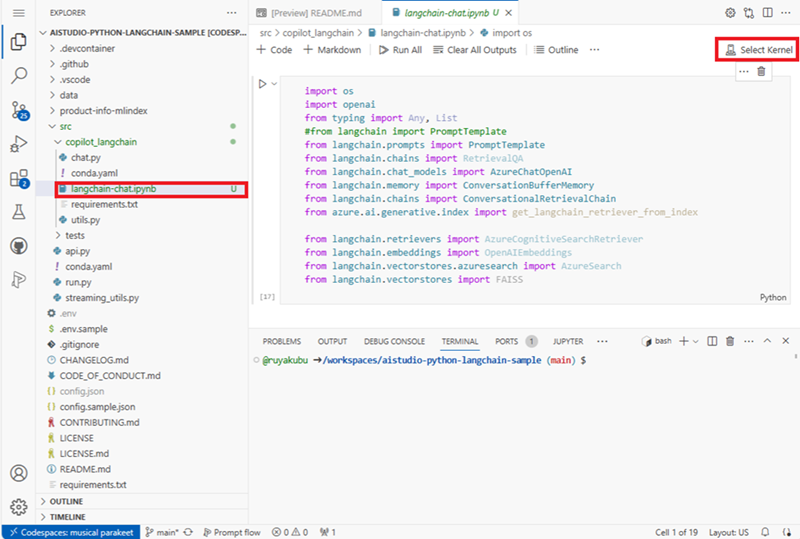
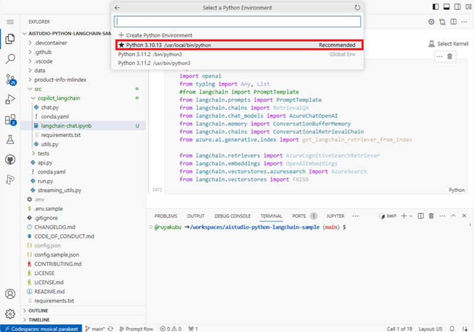
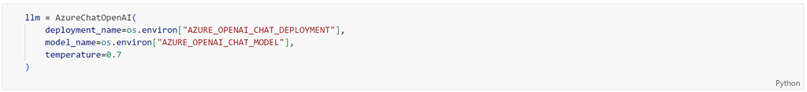

<head> 
  <meta property="og:url" content="https://azure.github.io/cloud-native/60daysofia/build-a-copilot-on-azure-code-first-with-langchain"/>
  <meta property="og:type" content="website"/> 
  <meta property="og:title" content="Build Intelligent Apps | AI Apps on Azure"/> 
  <meta property="og:description" content="This project uses the AI Search service to create a vector store for a custom department store data.  To enable the user to ask questions our data in a conversational format, we'll using Langchain to connect our prompt template with our Azure Open AI LLM."/> 
  <meta property="og:image" content="https://github.com/Azure/Cloud-Native/blob/main/website/static/img/ogImage.png"/> 
  <meta name="twitter:url" content="https://azure.github.io/Cloud-Native/60daysofIA/build-a-copilot-on-azure-code-first-with-langchain" /> 
  <meta name="twitter:title" content="Build Intelligent Apps | AI Apps on Azure" />
 <meta name="twitter:description" content="This project uses the AI Search service to create a vector store for a custom department store data.  To enable the user to ask questions our data in a conversational format, we'll using Langchain to connect our prompt template with our Azure Open AI LLM." />
  <meta name="twitter:image" content="https://azure.github.io/Cloud-Native/img/ogImage.png" /> 
  <meta name="twitter:card" content="summary_large_image" /> 
  <meta name="twitter:creator" content="@devanshidiaries" /> 
  <link rel="canonical" href="https://azure.github.io/Cloud-Native/60daysofIA/build-a-copilot-on-azure-code-first-with-langchain" /> 
</head> 

<!-- End METADATA -->


**Welcome to Day 4️⃣ of the Azure AI week on #60Days Of IA**
In the previous post, we learned about how to get started with the Azure AI SDK and Prompt Flow to build a Copilot. In today's post we'll be covering `building a copilot with custom code and data using Langchain`.


## What You'll Learn Today
 * Quickstart Sample: Using Langchain to build a copilot.
 * What is "Langchain" ? 
 * Build the Copilot
 * Evaluate the Copilot
 * Deploy the Copilot
 * **Challenge**: [Try this quickstart sample](https://github.com/Azure-Samples/aistudio-python-langchain-sample/tree/main)
 * **Resources**: To learn more
    - [Azure AI Studio](https://aka.ms/azureaistudio?ocid=buildia24_60days_blogs) - UI to explore, build & manage AI solutions.
    - [Azure AI Studio Docs](https://learn.microsoft.com/azure/ai-studio?ocid=buildia24_60days_blogs) - Azure AI Studio documentation.
    - [Azure AI Services](https://learn.microsoft.com/azure/ai-services/what-are-ai-services?ocid=buildia24_60days_blogs) - Azure AI Services documentation.
    - [Training: Using vector search in Azure Cognitive Search](https://learn.microsoft.com/training/modules/improve-search-results-vector-search?ocid=buildia24_60days_blogs) 
    - [Tutorial: Deploy a web app for chat on your data](https://learn.microsoft.com/azure/ai-studio/tutorials/deploy-chat-web-app?ocid=buildia24_60days_blogs) 

<br/>

<!-- FIXME: banner image -->


---

<!-- ************************************** -->
<!--  AUTHORS: WRITE BLOG POST CONTENT HERE -->
<!-- ************************************** -->

## 1 | Introduction 

This project use the AI Search service to create a vector store for a custom department store data.  We will be using Azure Open AI's text-embedding-ada-002 deployment for embedding the data in vectors. The vector representation of your data is stored in [Azure AI Search](https://learn.microsoft.com/en-us/azure/search/search-what-is-azure-search?ocid=buildia24_60days_blogs) (formerly known as "Azure Cognitive Search").  

To enable the user to ask questions our data in a conversational format, we'll using Langchain to connect our prompt template with our Azure Open AI LLM.


We'll use Retrieval Augmented Generation (RAG), a pattern used in AI which uses an LLM to generate answers with your own data. In addition, we'll  construct prompt template to provide the scope of our dataset, as well as the context to the submit questions. Lastly, we'll maintain the state of the conversation by store the chat history in the prompt.

**Custom Data:** The sample data that we'll be using in this project is a department store dataset.  The dataset contains a list of customers, orders, products and their descriptions, and their prices.  We'll be using this dataset to create a copilot that can answer questions about the products in the dataset.

## What is Langchain?

Langchain is a framework for developing applications powered by language models. It enables you to connect a language model such as Azure OpenAI to a prompt template including: prompt instructions, chat history, context of the chat conversation, few shot examples, content to ground its response in, etc.).  This helps facilitate end-users to interact with the application to ask questions and language models to generate responses in a conversational format.

In this exercise, we'll be using ConversationalRetrievalChain, which is a subclass of langchain that handles chats that are based on retrieving data from documents or vector datasources. We will use it to connect the Azure OpenAI model, retriever, prompt template and chat memory in order to search the AI Search database to retrieve the most relevant response. To activate the instance you need an LLM model (ex. gpt-35-turbo) to retrieve response, the prompt template rules, and chat history. 

## 2 | Pre-Requisites

Completing the [tutorial](https://github.com/Azure-Samples/aistudio-python-langchain-sample/tree/main) requires the following:

1. An Azure subscription - [Create one for free](https://azure.microsoft.com/free/cognitive-services?ocid=buildia24_60days_blogs)
2. Access to Azure OpenAI in the Azure Subscription - [Request access here](https://aka.ms/oai/access?ocid=buildia24_60days_blogs)
3. Custom data to ground the copilot - [Sample product-info data is provided](https://github.com/Azure-Samples/aistudio-python-langchain-sample/tree/main/data/3-product-info)
4. A GitHub account - [Create one for free](https://github.com/signup)
5. Access to GitHub Codespaces - [Free quota should be sufficient](https://docs.github.com/en/billing/managing-billing-for-github-codespaces/about-billing-for-github-codespaces#monthly-included-storage-and-core-hours-for-personal-accounts)

The tutorial uses Azure AI Studio which is currently in public preview.

 - Read [the documentation](https://learn.microsoft.com/azure/ai-studio/reference/region-support#azure-public-regions?ocid=buildia24_60days_blogs) to learn about regional availability of Azure AI Studio (preview)
 - Read the [Azure AI Studio FAQ](https://learn.microsoft.com/azure/ai-studio/faq?ocid=buildia24_60days_blogs) for answers to some commonly-asked questions.


## Open the copilot with Jupiter notebook

We'll be using Python SDK to create our copilot for the Contoso outdoor/camping gear AI Chat application.

Let's begin by opening the `copilot_langchain.ipynb` notebook in the visual studio code (VS code) editor.



In VS code, click on **Select Kernel**. Then under Python Environments, select the **Python 3.10.13** environment you just created




## Connect to azure resources

In order to access the resources you created in your project in AI studio, we'll use the python SDK to authenticate and connect to them.


To find the most relevant results from the vector database, we'll be using Langchain's retriever to search content from Azure AI Search. 


## Create Prompt Template

Prompt engineering is an integral part of providing good user experience and relevant answers.  To achieve that you'll need to define a prompt template that includes system prompt rules, restrictions, chat history, input questions and context of conversation.


## Add Langchain to connect Azure OpenAI and Prompt template

To process the search results and apply the system rules, you need it initialize the LLM.  In our case, we'll using AzureChatOpenAI class to specify the GPT-35-Turbo model deployment and settings we need for the chat.



All the dialogue that the end-user has with the chat needs retained to maintain the context of the conversation.  That's why we are using the ConversationMemoryBuffer class to store the chat history.


To search the AI search database, we'll use a subclass of langchain to connect the Azure OpenAI, datasource retriever, prompt template and memory together.  When an instance of the langchain is invoke with an user input prompt, the retriever is used to search your data in AI Search.  The Azure OpenAI uses the prompt rules to process the response back to the user.


## Run the copilot with Jupiter notebook

To run a single question & answer through the sample copilot:

Click on **Run All** to run the notebook.


## Validate your copilot by asking a question about your custom data.

Enter a question about the outdoor/camping gear and clothing products. For example:

```shell
Which of your sleeping bags are polyester?
```


`The CozyNights Sleeping Bag (item_number: 7) and the MountainDream Sleeping Bag (item_number: 14) are both made of polyester.`

Try asking another question. For example:

```shell
which tent is the most waterproof?
```


## Conclusion

In this exercise you learned how to use Azure AI Search to create and load your data into a vector store.  Next, you learned how to use prompt engineering by constructing *System Prompt* with instructions on how to engage with the user, the scope of the subject area to enforce grounding which prevents the LLM from providing responses that are not relevent to your data.  You should now be able to build AI applications using Lanchain to connect Azure OpenAI, your prompts, chat history, context and retriever of your data source.  You've now gained the knowledge on how to use the Retrieval Augmented Generation (RAG) pattern in AI which uses LLMs to generate answers with your own data.
