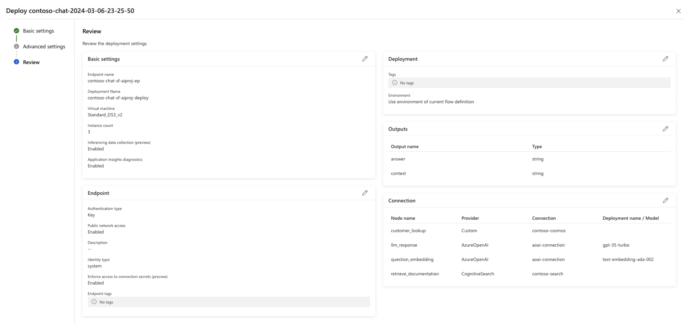
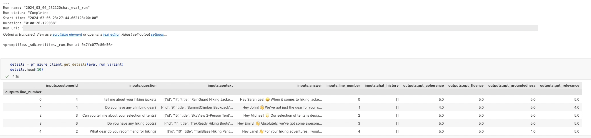

<head> 
  <meta property="og:url" content="https://azure.github.io/cloud-native/60daysofia/deploying-your-copilot-on-azure"/>
  <meta property="og:type" content="website"/> 
  <meta property="og:title" content="Build Intelligent Apps | AI Apps on Azure"/> 
  <meta property="og:description" content="You've build a RAG-based copilot application on Azure AI with Prompt flow. Now it's time to deploy it, test it, and integrated it into your chat UI experience. Let's dive in!"/> 
  <meta property="og:image" content="https://github.com/Azure/Cloud-Native/blob/main/website/static/img/ogImage.png"/> 
  <meta name="twitter:url" content="https://azure.github.io/Cloud-Native/60daysofIA/deploying-your-copilot-on-azure" /> 
  <meta name="twitter:title" content="Build Intelligent Apps | AI Apps on Azure" />
 <meta name="twitter:description" content="You've build a RAG-based copilot application on Azure AI with Prompt flow. Now it's time to deploy it, test it, and integrated it into your chat UI experience. Let's dive in!" />
  <meta name="twitter:image" content="https://azure.github.io/Cloud-Native/img/ogImage.png" /> 
  <meta name="twitter:card" content="summary_large_image" /> 
  <meta name="twitter:creator" content="@devanshidiaries" /> 
  <link rel="canonical" href="https://azure.github.io/Cloud-Native/60daysofIA/deploying-your-copilot-on-azure" /> 
</head> 

<!-- End METADATA -->

Welcome to `Day 5️⃣` of our journey **Building An AI App End-to-End On Azure!**. It's time to wrap-up the week with a look at two key topics - _deployment_ and _responsible AI_! Ready? Let's go!

## What You'll Learn In This Post
 * Deploying the chat AI (Contoso Chat)
 * Deploying the chat UI (Contoso Web)
 * Automate Deployments (CI/CD)
 * Accelerate Solutions (Enterprise)
 * Evaluate & Mitigate Harms (Responsible AI)
 * Exercise: Explore training resources.   
 * Resources: [**Azure AI Studio Code-First Collection**](https://aka.ms/ai-studio/collection?ocid=buildia24_60days_blogs) 

 

---
## 1. Revisiting Contoso Chat

We started the week by talking about LLM Ops, and identifying the three core phases of the end-to-end lifecycle for a generative AI application. In the previous posts, we've mostly focused on the first two phases: **ideating** (building & validating a starter app) and **augmenting** (evaluating & iterating app for quality). In this post, we'll focus on phase 3: **operationalizing** the application to get it ready for real-world usage.

First, let's remind ourselves of the high-level architecture for a copilot application. Our solution has two components:
 - **Backend**: The _chat AI_ app that is deployed to provide a hosted API endpoint.
 - **Frontend**: The _chat UI_ app that is deployed to support user interactions with API.

Let's look at what deployment means in each case:

## 2. Deploy your chat AI app

In our example, the chat AI is implemented by the [Contoso Chat](https://aka.ms/aitour/contoso-chat?ocid=buildia24_60days_blogs) sample. Deploying this chat AI solution involves [**three steps**](https://learn.microsoft.com/azure/ai-studio/concepts/deployments-overview?ocid=buildia24_60days_blogs).
 1. Deploy the Models
 1. Deploy the Flows
 1. Deploy the Web App

Let's look at the first two in this section, starting with **[model deployment](https://learn.microsoft.com/azure/ai-studio/concepts/deployments-overview#deploying-models?ocid=buildia24_60days_blogs)**. Azure AI Studio has a rich model catalog from providers including OpenAI, HuggingFace, Meta and Microsoft Research. Some models can be deployed _as a service_ (with a pay-as-you-go subscription) while others require _hosted, managed infra_ (with a standard Azure subscription). Our chat AI uses three models, all of which used the hosted, managed option.
  - `gpt-35-turbo` - for chat completion (core function)
  - `text-embedding-ada-002` - for embeddings (query vectorization)
  - `gpt-4` - for chat evaluation (responsible AI)

Next, let's talk about **[deploying flows](https://learn.microsoft.com/azure/ai-studio/how-to/flow-deploy?tabs=azure-studio?ocid=buildia24_60days_blogs)**. There are two kinds of flows we'll use in our chat AI - _completion flows_ (that we'll use for real-time inference) and _evaluation flows_ (that we'll use for quality assessment). Azure AI Studio provides [low-code deployment](https://learn.microsoft.com/en-us/azure/ai-studio/how-to/flow-deploy?tabs=azure-studio#create-an-online-deployment?ocid=buildia24_60days_blogs) via the UI and [code-first deployment](https://learn.microsoft.com/en-us/azure/ai-studio/how-to/flow-deploy?tabs=python#create-an-online-deployment?ocid=buildia24_60days_blogs) using the Azure AI SDK. In our Contoso Chat sample, we use the SDK to [upload the flow](https://github.com/Azure-Samples/contoso-chat/blob/main/deployment/push_and_deploy_pf.ipynb) to Azure, then deploy it using the UI as shown.
  

Finally, let's talk about **[deploying web apps](https://learn.microsoft.com/azure/ai-studio/concepts/deployments-overview#deploying-web-apps?ocid=buildia24_60days_blogs)**. Here, the web app is a _chat UI_ that can invoke requests on the deployed chat AI and validate the functionality in production. There are three options to consider:
1. **Built-in Testing UI**. When you deploy your flow via Azure AI Studio, you can visit the deployment details page and navigate to the _Test_ tab, to get a built-in testing sandbox as shown. This provides a quick way to test prompts with each new iteration, in a manual (interactive) way.
  
1. **Deploy as Web App**. Azure AI Studio also provides a _Playground_ where you can deploy models directly (for chat completion) and _add your data (preview)_ (for grounding responses) using Azure AI Search and Blob Storage resources, to customize that chat experience. Then _deploy a new web app_ directly from that interface, to an Azure App Service resource.
  
3. **Dedicated Web App**. This is the option we'll explore in the next section.

## 3. Deploy your chat UI app

The Contoso Chat sample comes with a dedicated [Contoso Web](https://github.com/Azure-Samples/contoso-web) application that is implemented using the Next.js framework with support for static site generation. This provides a rich "Contoso Outdoors" website experience for users as shown below.

To use that application, simply [setup the endpoint variables](https://github.com/Azure-Samples/contoso-web?tab=readme-ov-file#setting-up-endpoints) for Contoso Chat and deploy the app to Azure App Service. Alternatively, you can use [this fork of the application](https://github.com/nitya/contoso-web/tree/main-codespaces-swa?tab=readme-ov-file) to explore a version that can be run in GitHub Codespaces (for development) and deployed to Azure Static Web Apps (for production) using GitHub Actions for automated deploys. Once deployed, you can click the _chat_ icon onscreen *bottom right) to see the chat dialog as shown in the screenshot above, and interact with the deployed Contoso chat AI.

## 4. Automate your chat AI deployment

The [Contoso Chat sample](https://github.com/Azure-Samples/contoso-chat) is a **constantly-evolving** application sample that is updated regularly to reflect both the changes to Azure AI Studio (preview) and showcase new capabilities for end-to-end development workflows. You can currently explore two additional capabilities implemented in the codebase, to streamline your deployment process further.
 1. **Using GitHub Actions**. The sample has instructions to [Deploy with GitHub Actions](https://github.com/Azure-Samples/contoso-chat?tab=readme-ov-file#9-deploy-with-github-actions) instead of the manual Azure AI Studio based deployment step we showed earlier. By setting up the actions workflow, you can automated deployments on every commit or PR, and get a baseline CI/CD pipeline for your chat AI, to build on later.
 1. **Using Azure Developer CLI**. The sample was [just azd-enabled](https://github.com/Azure-Samples/contoso-chat/pull/74) recently, making it possible to use the [Azure Developer CLI](https://learn.microsoft.com/en-us/azure/developer/azure-developer-cli/azd-templates?tabs=csharp?ocid=buildia24_60days_blogs) as a unified tool to accelerate the end-to-end process from _provisioning_ the resources to _deploying_ the solution. The [azd template](https://github.com/Azure-Samples/contoso-chat/blob/main/azure.yaml) adds support for _infrastructure-as-code_, allowing your application to have a consistent and repeatable deployment blueprint for all users. You can also [browse the azd template gallery](https://azure.github.io/awesome-azd/?tags=ai&tags=chatgpt) for other _ChatGPT_ style application examples.

Note that the Contoso Chat sample is a _demo application_ sample that is designed to showcase the capabilities of Azure AI Studio and Azure AI services. It is not a production-ready application, and should be used primarily as a learning tool and starting point for your own development. 

---

## 5. Enterprise Architecture Options

The objective of this series was to familiarize you with the Azure AI Studio (preview) platform and the capabilities it provides for building generative AI applications. And to give you a sense of how to build, run, test and deploy, your chat AI application for real-world use. But the platform is still in preview (and evolving rapidly). So what are your options if you want to build and deploy generative AI solutions at enterprise scale **today**? How can you design it using a well-architected cloud framework with **cloud-native technologies** like Azure Container Apps or Azure Kubernetes Service? 

Here are some open-source samples and guidance you can explore to start with:
1. [ChatGPT + Enterprise data with Azure Open AI and AI Search (Python)](https://github.com/Azure-Samples/azure-search-openai-demo/) - open-source sample that uses Azure App Service, Azure Open AI, Azure AI Search and Azure Blob Storage, for an enterprise-grade solution grounded in your (documents) data.
1. [ChatGPT + Enterprise data with Azure Open AI and AI Search (.NET)](https://github.com/Azure-Samples/azure-search-openai-demo-csharp) - open-source sample chat AI for a fictitious company called "Contoso Electronics" using the application architecture shown below. [This blog post](https://devblogs.microsoft.com/dotnet/transform-business-smart-dotnet-apps-azure-chatgpt/?ocid=buildia24_60days_blogs) provides more details.
  
1. [Chat with your data Solution Accelerator](https://github.com/Azure-Samples/chat-with-your-data-solution-accelerator) - uses Azure App Service, Azure Open AI, Azure AI Search and Azure Blob Storage, for an end-to-end baseline RAG sample that goes beyond the [Azure OpenAI Service On Your Data](https://techcommunity.microsoft.com/t5/ai-azure-ai-services-blog/on-your-data-is-now-generally-available-in-azure-openai-service/ba-p/4059514?ocid=buildia24_60days_blogs) feature (GA in Feb 2024).''
1. [Built a private ChatGPT style app with enterprise-ready architecture](https://techcommunity.microsoft.com/t5/microsoft-mechanics-blog/build-your-own-private-chatgpt-style-app-with-enterprise-ready/ba-p/4069529?ocid=buildia24_60days_blogs) - a blog post from the Microsoft Mechanics team that uses an [open-source chat UI sample](https://aka.ms/GitHubChatBotUI?ocid=buildia24_60days_blogs) and discusses how to [enhance the chat experience with Azure AI Studio](https://www.youtube.com/watch?v=IKcuod-JFYU&t=252s) and streamline setup by [using Azure Landing Zones](https://www.youtube.com/watch?v=IKcuod-JFYU&t=404s).

We covered a lot today - but there's one last thing we should talk about before we wrap up. **Responsible AI**.

---

## 6. Responsible AI In Practice

### 6.1 Principles of Responsible AI

By [one definition](https://learn.microsoft.com/azure/machine-learning/concept-responsible-ai?view=azureml-api-2?ocid=buildia24_60days_blogs), Responsible AI is _approach to developing, assessing, and deploying AI systems in a safe, trustworthy, and ethical way_. The [Responsible AI standard](https://www.microsoft.com/ai/principles-and-approach?ocid=buildia24_60days_blogs) was developed by Microsoft as a framework for building AI systems, using 6 principles to guide our design thinking.

|Principle|Description|
|---|---|
|Fairness|How might an AI system allocate opportunities, resources, or information in ways that are fair to the humans who use it?|
|Reliability & Safety|How might the system function well for people across different use conditions and contexts, including ones it was not originally intended for?|
|Privacy & Security|How might the system be designed to support privacy and security?.|
|Inclusiveness|How might the system be designed to be inclusive of people of all abilities?|
|Transparency|How might people misunderstand, misuse, or incorrectly estimate the capabilities of the system?|
|Accountability|How can we create oversight so that humans can be accountable and in control?|

### 6.2 Implications for Generative AI

The [Fundamentals of Responsible Generative AI](https://learn.microsoft.com/en-us/training/modules/responsible-generative-ai/?ocid=buildia24_60days_blogs) describes core guidelines for building  generative AI solutions _responsibly_ as a 4-step process:
1. **Identify** potential harms relevant to your solution.
1. **Measure** presence of these harms in outputs generated by your solution.
1. **Mitigate** harms at multiple layers to minimize impact, and ensure transparent communication about potential risks to users.
1. **Operate** your solution responsibly by defining and following a deployment and operational readiness plan.

### 6.3 Identify Potential Harms

The first step of the process is to identify potential harms in your application domain using a 4-step process:
 1. Identify potential harms (offensive, unethical, fabrication) that may occur in generated content.
 1. Assess likelihood of each occurrence, and severity of impact.
 1. Test and verify if harms occur, and under what conditions.
 1. Document and communicate potential harms to stakeholders.

### 6.4 Measure Presence of Harms

[Evaluation of generative AI applications](https://learn.microsoft.com/en-us/azure/ai-studio/concepts/evaluation-approach-gen-ai?ocid=buildia24_60days_blogs) is the process of measuring the presence of identified harms in the generated output. Think of it as a 3-step process:

 1. Prepare a diverse selection of input prompts that may result in the potential harms documented.
 1. Submit prompts to your AI application and retrieve generated output
 1. **Evaluate** those responses using pre-defined criteria.

Azure AI Studio provides many features and pathways to support evaluation. Start with _manual evaluation_ (small set of inputs, interactive) to ensure coverage and consistency. Then scale to _automated evaluation_ (larger set of inputs, flows) for increased coverage and operationalization.

But what _metrics_ can we use to quantify the quality of generated output? Quantifying accuracy is now complicated _because we don't have access to a ground truth or deterministic answer_ that can serve as a baseline. Instead, we can use [AI-assisted metrics](https://learn.microsoft.com/en-us/azure/ai-studio/concepts/evaluation-metrics-built-in?ocid=buildia24_60days_blogs) - where we _instruct_ another LLM to score your generated output **for quality and safety** using the guidelines and criteria you provide.
- **Quality** is measured using metrics like _relevance, coherence and fluency_.
- **Safety** is measured using metrics like _groundedness and content harms_.

In our _Contoso Chat_ app sample, we [show examples](https://github.com/Azure-Samples/contoso-chat/blob/main/eval/evaluate-chat-prompt-flow.ipynb) of local evaluation (with single and multiple metrics) and batch runs (for automated evaluation in the cloud). Here's an exmaple of what the output from the local evaluation looks like:

### 6.5 Content Safety for Mitigation

One of the most effective ways to mitigate harmful responses from generative AI models in Azure OpenAI is to use [Content Filtering](https://learn.microsoft.com/en-us/azure/ai-studio/concepts/content-filtering?ocid=buildia24_60days_blogs) powered by the [Azure AI Content Safety](https://learn.microsoft.com/en-us/azure/ai-services/content-safety/overview?ocid=buildia24_60days_blogs) service. The service works by running the user input (prompt) and the generated output (completion) through _an ensemble of classification models_ that are trained to detect, and act on, identified caegories of harmful content. 

Azure AI Studio provides a default content safety filter, and allows you to create custom content filters with more tailored configurations if you opt-in to that capability first. These filters can then be _applied_ to a model or app deployment to ensure that inputs and outputs are gated to meet your content safety requirements.

The screenshot shows the [different content filtering categories](https://learn.microsoft.com/en-us/azure/ai-studio/concepts/content-filtering#content-filtering-categories-and-configurability?ocid=buildia24_60days_blogs) and the level of configurability each provides. This allows us to identify and mitigate different categories of issues (Violence, Hate, Sexual and Self-harm) by **automatically detecting** these in both user prompts (input) and model completions (output). An additional filter (optional) lets you enable filters for more advanced usage scenarios including _jailbreaks, protected content or code_ as [described here](https://learn.microsoft.com/en-us/azure/ai-studio/concepts/content-filtering#more-filters-for-generative-ai-scenarios?ocid=buildia24_60days_blogs).

Once the filters are applied, the deployment can be opened up in the Playground, or using an integrated web app, to validate that the filters work. Check out [this #MSIgnite session](https://ignite.microsoft.com/en-US/sessions/5db0e51a-d8b1-4234-b149-31671a633ffc?source=sessions?ocid=buildia24_60days_blogs) from the Responsible AI team for strategies and examples for responsible AI practices with prompt engineering and retrieval augmented generation patterns in context.

## 7. Exercise: 

We covered a lot today - and that also brings us to the end of our journey into Azure AI in this series. Want to get hands-on experience with some of these concepts? Here are some suggestions:

1. Walk through the [Contoso Chat](https://aka.ms/aitour/contoso-chat?ocid=buildia24_60days_blogs) sample end-to-end, and get familiar with the Azure AI Studio platform and the LLM Ops workflow for generative AI solutions.
1. Explore the [Responsible AI Developer Hub](https://aka.ms/rai-hub/website?ocid=buildia24_60days_blogs) and try out the Content Safety and Prompt flow Evaluation workshops to get familiar with the Responsible AI principles and practices for generative AI.

## 8. Resources

We covered a lot this week!! But your learning journey with Generative AI development and Azure AI is just beginning. Want to keep going? Here are three resources to help you:

1. [Azure AI Studio for Developers](https://aka.ms/ai-studio/collection?ocid=buildia24_60days_blogs)
1. [Responsible AI For Developers](https://aka.ms/rai-hub/collection?ocid=buildia24_60days_blogs)
1. [Contoso Chat Sample](https://aka.ms/aitour/contoso-chat?ocid=buildia24_60days_blogs)
