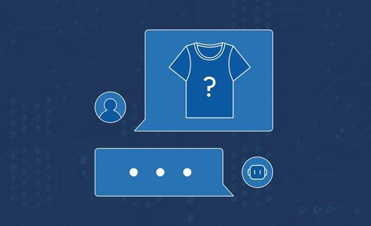

<head> 
  <meta property="og:url" content="https://azure.github.io/cloud-native/60daysofia/creating-a-virtual-stylist-chatbot-part-2"/>
  <meta property="og:type" content="website"/> 
  <meta property="og:title" content="Build Intelligent Apps | AI Apps on Azure"/> 
  <meta property="og:description" content="In this four-part series, you’ll build a virtual stylist chatbot that uses AI to analyze images and suggest clothing items. In this second installment, you’ll design the chatbot’s interface."/> 
  <meta property="og:image" content="https://github.com/Azure/Cloud-Native/blob/main/website/static/img/ogImage.png"/> 
  <meta name="twitter:url" content="https://azure.github.io/Cloud-Native/60daysofIA/creating-a-virtual-stylist-chatbot-part-2" /> 
  <meta name="twitter:title" content="Build Intelligent Apps | AI Apps on Azure" />
 <meta name="twitter:description" content="In this four-part series, you’ll build a virtual stylist chatbot that uses AI to analyze images and suggest clothing items. In this second installment, you’ll design the chatbot’s interface." />
  <meta name="twitter:image" content="https://azure.github.io/Cloud-Native/img/ogImage.png" /> 
  <meta name="twitter:card" content="summary_large_image" /> 
  <meta name="twitter:creator" content="@devanshidiaries" /> 
  <link rel="canonical" href="https://azure.github.io/Cloud-Native/60daysofIA/creating-a-virtual-stylist-chatbot-part-2" /> 
</head> 

<!-- End METADATA -->



## Creating a Virtual Stylist Chatbot — Part 2: Adding a Chatbot Interface

Welcome to part 2 of this tutorial series on creating a virtual stylist chatbot using Azure OpenAI Service.  

In [part 1](https://azure.github.io/Cloud-Native/60DaysOfIA/creating-a-virtual-stylist-chatbot-part-1), you built the chatbot app’s back end using Azure Functions, Azure AI Services, and GPT-4 Vision with Azure OpenAI Service. That tutorial covered using these services to analyze an image of a fashion item or outfit and generate natural language responses and recommendations based on it.

In this second installment, you’ll create a chatbot interface for your virtual stylist app using Vite, Vue, TypeScript, and vue-advanced-chat. You’ll learn how to use these tools to build a web application that allows you to interact with your stylist bot conversationally.

### Prerequisites

Before you start, ensure you have:

* An Azure subscription with access to [Azure OpenAI Service](https://azure.microsoft.com/products/ai-services/openai-service?ocid=buildia24_60days_blogs)
* [Azure command-line interface (CLI)](https://learn.microsoft.com/cli/azure/?ocid=buildia24_60days_blogs) installed
* [Azure Functions Core Tools](https://github.com/Azure/azure-functions-core-tools) installed
* An Azure OpenAI Service resource with a GPT-4 Vision model deployed
* The deployment name, endpoint, and API key for your OpenAI Service
* The [Fashion Product Images dataset](https://www.kaggle.com/datasets/paramaggarwal/fashion-product-images-small) from Kaggle
* [Node.js 20](https://nodejs.org/en/download/) or later installed on your local machine 
* A text editor that supports Vue and TypeScript. If you use Visual Studio Code, consider installing the [TypeScript Vue Plugin](https://marketplace.visualstudio.com/items?itemName=Vue.vscode-typescript-vue-plugin) to ensure the editor understands all the files you’re about to create. 

For a preview, refer to the complete code for [part 1 available on GitHub](https://github.com/rogerwinter/Microsoft-Creating-a-Virtual-Stylist-Chatbot/tree/main/stylist-backend).


### Creating a Chatbot Interface for Your Virtual Stylist

In this section, you’ll create a chatbot interface for the virtual stylist app using Vue and vue-advanced-chat. You’ll use Vue to create the main components of the app, including the header, the footer, the chat window, and the image upload button. You’ll also use the vue-advanced-chat library to create the chat messages, chat input, and other chat options, using Tailwind CSS to style the app.

:::info
Complete the **[Intelligent Apps Skills Challenge](https://aka.ms/intelligent-apps/apps-csc?ocid=buildia24_60days_blogs)** to compete for the leaderboard and earn a Microsoft Learn Badge.
:::

#### Setting Up the Project

The first step is creating a new Vue project using Vite. Vite is a fast and lightweight build tool that provides a smooth developer experience and supports features like hot module replacement, code splitting, and tree shaking.

To create a new Vue project with Vite, run the following command in your terminal:

```
npm init vite@latest virtual-stylist-chat -- --template vue-ts
```

This builds a new folder, `virtual-stylist-chat`, with the following structure:

```
virtual-stylist-chat 
├── index.html 
├── package.json 
├── public 
│   └── favicon.svg 
├── src 
│   ├── App.vue 
│   ├── assets 
│   │   └── logo.svg 
│   ├── components 
│   │   └── HelloWorld.vue 
│   ├── main.ts 
│   └── shims-vue.d.ts 
└── tsconfig.json 
```

Next, add a few dependencies:

* [vue-advanced-chat](https://github.com/advanced-chat/vue-advanced-chat), a feature-rich and highly customizable Vue chat component library that provides many out-of-the-box features for chat interfaces. These include images, videos, files, voice messages, emojis, link previews, typing indicators, reactions, markdown text formatting, online presence indicators, delivery and read receipts, theming and customization options, and responsive design.
* [Tailwind CSS](https://tailwindcss.com/), [PostCSS](https://postcss.org/), and [autoprefixer](https://www.npmjs.com/package/autoprefixer) to simplify styling the app
* [uuid](https://www.npmjs.com/package/uuid) to generate unique IDs for each message

To install the required packages, run the following command:

```
npm install --save vue-advanced-chat tailwindcss@latest postcss@latest autoprefixer@latest uuid @types/uuid 
```

This command adds vue-advanced-chat, Tailwind, and PostCSS as dependencies in the `package.json` file.

Now that you’ve set up the project and installed the dependencies, check that it builds as expected by running `npm run dev`. The app should build and provide an address to view it in a web browser. Load it, and you should see the default welcome screen:


Next, generate the `tailwind.config.js` and `postcss.config.js` files using the following command:

```
npx tailwindcss init -p
```

Edit the `tailwind.config.js` file and add the paths to your template files in the `content` property:

```
// tailwind.config.js
export default {
  content: ["./index.html", "./src/**/*. {vue,js,ts,jsx,tsx}"],
  theme: {
    extend: {},
  },
  plugins: [],
};
```

Then, replace the content of `style.css` file in the `src` folder with the following code to import Tailwind CSS using the `@tailwind` directives:

```
@tailwind base;
@tailwind components;
@tailwind utilities;
```

Then, import the `styles.css` file in the `main.ts` file and remove the unused import:

```
import { createApp } from "vue";
import App from "./App.vue";
import "./styles.css"; // import Tailwind CSS

createApp(App).mount("#app");
```

Finally, copy the images from the [dataset](https://www.kaggle.com/datasets/paramaggarwal/fashion-product-images-small) you downloaded in the first part of this series. Using your preferred CLI or file manager, create a new folder called `Images` inside the project’s `public` folder, and then copy all the images from the dataset’s `images_compressed` folder to the `Images` folder. The stylist bot will use these images to make recommendations based on the image IDs it returns.

The result should look like this:

```
virtual-stylist-chat 
├── index.html 
├── package.json 
├── public 
│   ├── favicon.svg 
│   └── images 
│       ├── 10001.jpg 
│       ├── 10002.jpg 
│       ├── 10003.jpg 
│       ├── ... 
│       ├── 19998.jpg 
│       ├── 19999.jpg 
│       └── 20000.jpg 
├── src
│   ├── App.vue
│   ├── assets
│   │   └── logo.svg
│   ├── components
│   │   └── HelloWorld.vue
│   ├── main.ts
│   ├── styles.css
│   ├── tailwind.config.js
│   ├── postcss.config.js
│   └── shims-vue.d.ts
└── tsconfig.json
```

Now, it’s time to start coding the chatbot interface.

