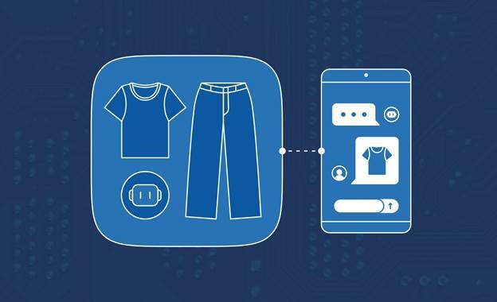

<head> 
  <meta property="og:url" content="https://azure.github.io/cloud-native/60daysofia/creating-a-virtual-stylist-chatbot-part-3"/>
  <meta property="og:type" content="website"/> 
  <meta property="og:title" content="Build Intelligent Apps | AI Apps on Azure"/> 
  <meta property="og:description" content="In this four-part series, you’ll build a virtual stylist chatbot that uses AI to analyze images and suggest clothing items. In the final article of this series, you’ll deploy and test the Intelligent App."/> 
  <meta property="og:image" content="https://github.com/Azure/Cloud-Native/blob/main/website/static/img/ogImage.png"/> 
  <meta name="twitter:url" content="https://azure.github.io/Cloud-Native/60daysofIA/creating-a-virtual-stylist-chatbot-part-3" /> 
  <meta name="twitter:title" content="Build Intelligent Apps | AI Apps on Azure" />
 <meta name="twitter:description" content="In this four-part series, you’ll build a virtual stylist chatbot that uses AI to analyze images and suggest clothing items. In the final article of this series, you’ll deploy and test the Intelligent App." />
  <meta name="twitter:image" content="https://azure.github.io/Cloud-Native/img/ogImage.png" /> 
  <meta name="twitter:card" content="summary_large_image" /> 
  <meta name="twitter:creator" content="@devanshidiaries" /> 
  <link rel="canonical" href="https://azure.github.io/Cloud-Native/60daysofIA/creating-a-virtual-stylist-chatbot-part-3" /> 
</head> 

<!-- End METADATA -->



## Creating a Virtual Stylist Chatbot—Part 3: Deploying the App

In [part 1](https://azure.github.io/Cloud-Native/60DaysOfIA/creating-a-virtual-stylist-chatbot-part-1) of this series, you used AI to analyze images of clothing and generate a text description of each piece. Then, in [part 2](https://azure.github.io/Cloud-Native/60DaysOfIA/creating-a-virtual-stylist-chatbot-part-2), you designed the chatbot’s interface.

In this third and final installment, you’ll deploy the app as an Azure Static Web App using the Azure command-line interface (CLI). The Azure Static Web Apps service provides a hassle-free means of hosting static web apps with serverless APIs. It also features global distribution, custom domains, SSL certificates, authentication, authorization, and GitHub integration.

### Prerequisites

To follow along, ensure you have:

* The complete code from [part 2](https://azure.github.io/Cloud-Native/60DaysOfIA/creating-a-virtual-stylist-chatbot-part-2)
* The Azure CLI installed and signed in to your Azure account
* A GitHub account, [an empty repository](https://docs.github.com/en/repositories/creating-and-managing-repositories/quickstart-for-repositories) to push the app’s code to, and a [personal access token](https://docs.github.com/en/enterprise-server@3.9/authentication/keeping-your-account-and-data-secure/managing-your-personal-access-tokens#creating-a-personal-access-token) granting read and write access to the repository

For a preview of the project, check out the [complete project code available on GitHub](https://github.com/rogerwinter/Microsoft-Creating-a-Virtual-Stylist-Chatbot/).

### Pushing the App to GitHub

You can set up Azure Static Web Apps to deploy automatically every time you push a new commit to GitHub. Before proceeding, create a GitHub repository for the web app and push all its code to the repo.

:::info
Register for [Episode 3](https://aka.ms/serverless-learn-live/ep3?ocid=buildia24_60days_blogs) of the new learning series on **Intelligent Apps with Serverless on Azure**. Join the community along with MVPs, and the Azure Product Group on how to leverage AI with Serverless on Azure technologies –Azure Functions and Azure Container Apps – to build intelligent applications.
:::

### Creating an Azure Static Web Resource

Next, you’ll create an Azure Static Web App resource using the Azure CLI. The Azure Static Web App resource is the container for the app and its settings.

To create it, run the following command in your terminal:

```
az staticwebapp create \
  --name virtual-stylist-chat \
  --resource-group <your resource group> \
  --location westus2 \
  --source virtual-stylist-chat \
  --branch main \
  --app-location / \
  --output-location dist \
  --login-with-github
```

This command will create an Azure Static Web App resource with the following parameters:

* **`--name`**—The name of the resource, which must be globally unique
* **`--resource-group`**—The name of the resource group to contain the resource
* **`--location`** —The location of the resource
* **`--source`**—The name of the GitHub repository that contains the app code
* **`--branch`**—The name of the GitHub branch that contains the app code
* **`--app-location`**—The location of the app code in the repository
* **`--output-folder`**—The folder where the app output is generated
* **`--login-with-github`**—The GitHub personal access token that grants access to the repository

The command creates a GitHub Actions workflow file in the repository that triggers the app build and deployment whenever a change is pushed to the branch. It also outputs some information about the resource, like this:

```
{ 
  "defaultHostname": "orange-beach-0c471f710.azurestaticapps.net",
  "id": "/subscriptions/xxxxxxxx-xxxx-xxxx-xxxx-xxxxxxxxxxxx/resourceGroups/virtual-stylist-chat-rg/providers/Microsoft.Web/staticSites/virtual-stylist-chat",
  "location": "West US 2",
  "name": "virtual-stylist-chat",
  "repositoryUrl": "https://github.com/username/virtual-stylist-chat",
  "resourceGroup": "virtual-stylist-chat-rg",
  "sku": "Free",
  "type": "Microsoft.Web/staticSites",
  "userId": "username",
  "workflowFileUrl": "https://github.com/username/virtual-stylist-chat/blob/main/.github/workflows/azure-static-web-apps-virtual-stylist-chat.yml"
}
```

You’ve now created an Azure Static Web App resource and a GitHub Actions workflow for the app.

To link the function app from part 1 as the back end for the Azure Static Web App, you use [`az staticwebapp backends link`](https://learn.microsoft.com/cli/azure/staticwebapp/backends?view=azure-cli-latest&ocid=buildia24_60days_blogs#az-staticwebapp-backends-link). This command links a pre-existing back end with a static web app, also known as “Bring your own API.” You need to provide the function app’s resource ID, the static web app’s resource group, and the back-end region.

Link the function app as the back end for the static web app by running the following:

```
az staticwebapp backends link \
  --backend-resource-id "/subscriptions/<subscription-id>/resourceGroups/<resource-group>/providers/Microsoft.Web/sites/<function-app-name>" \
  --name virtual-stylist-chat \
  --resource-group <your-resource-group> \
  --backend-region westus
```

### Testing the App

Now, you’ll test the app by uploading some images of clothing items or outfits to see how the stylist bot responds and makes recommendations. You’ll also witness how the app handles different types of inputs, such as images and text messages.

#### Uploading an Image of a Fashion Item

To start, you’ll upload an image of a blue denim jacket to see how the bot responds.

Click **Upload** at the bottom of the chat window. Then, select the image file from your local machine. Alternatively, you can drag and drop the image file to the chat window.

The app will display the image as a chat message and send it to the back-end function. This function will analyze the image and generate a natural language response and recommendations using Azure Functions, Azure AI Services, and GPT-4 Vision using Azure OpenAI Service. It will then display the response and its recommendations as another chat message. Your result will look something like this:


As you can see, the stylist bot correctly identified the fashion item as a red t-shirt and provided some information and tips about it. It also suggested some images of other items to pair with red t-shirts, including blue jeans and a red hat:


You can click the images to view them full-size:


If you don’t like the suggestions or just want to see more, you can reply with additional details or questions, and it will generate new suggestions based on the information you provide.

:::info
Join the Azure Functions product group for an **[Ask The Expert](https://aka.ms/intelligent-apps/ate-functions?ocid=buildia24_60days_blogs)** session on how to focus on the pieces of code that matter most to you in AI application development, while Azure Functions handles the rest for you at extreme scale.
:::

### Conclusion

In this tutorial series, you learned how to create a virtual stylist chatbot app using Azure and OpenAI. You built the app’s back end using Azure Functions, Azure AI, and GPT-4 Vision on Azure OpenAI Service. You then learned how to use these services to analyze images and generate natural language responses and recommendations based on the images. Next, you created the chatbot interface for our app using Vite, Vue, TypeScript, Tailwind CSS, and vue-advanced-chat.

You learned how to use these tools to build a web application that allows you conversationally interact with your stylist bot. Finally, you deployed the app as an Azure Static Web App using the Azure CLI.

Get your hands on the newly released [Azure Functions Flex Consumption Plan](https://aka.ms/flexconsumption/signup?ocid=buildia24_60days_blogs) for private networking, instance size selection, concurrency control, and fast and large scale out features on a serverless compute model.