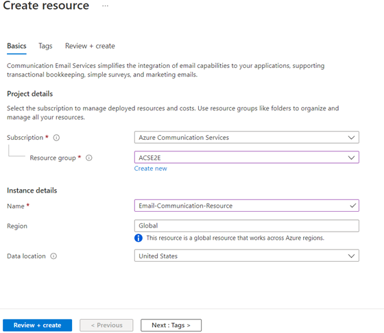
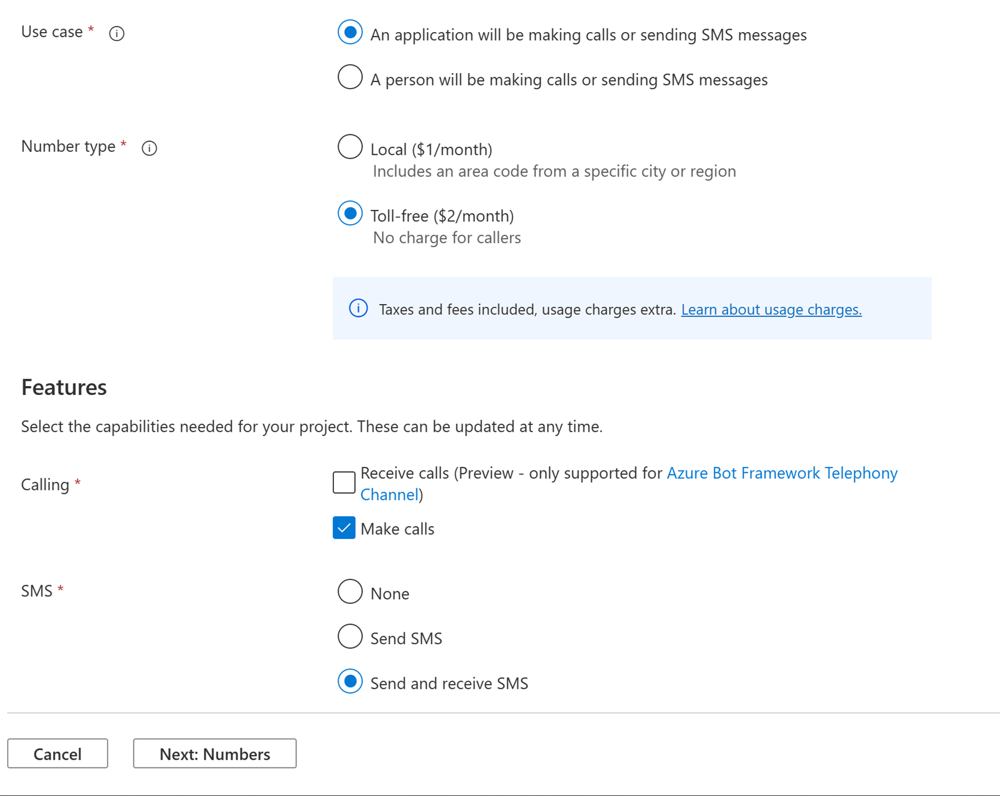
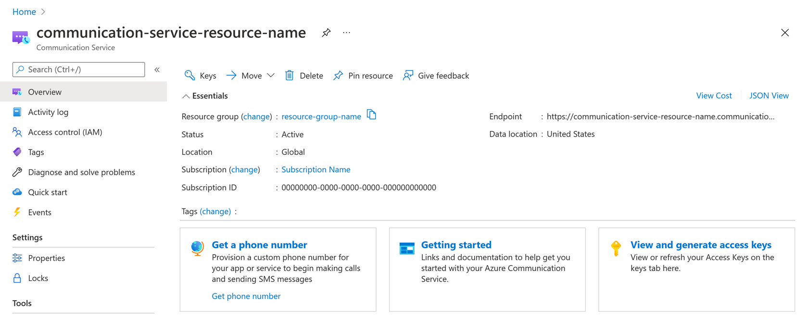
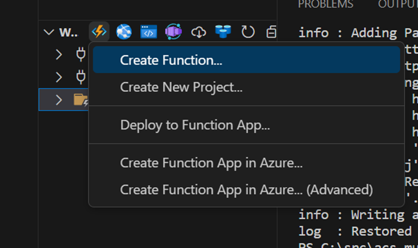

<head> 
  <meta property="og:url" content="https://azure.github.io/cloud-native/60daysofia/building-a-multichannel-notification-system-1"/>
  <meta property="og:type" content="website"/> 
  <meta property="og:title" content="Build Intelligent Apps | AI Apps on Azure"/> 
  <meta property="og:description" content="This blog post outlines a step-by-step guide on building such a multichannel notification system with Azure Functions and Azure Communication Services."/> 
  <meta property="og:image" content="https://github.com/Azure/Cloud-Native/blob/main/website/static/img/ogImage.png"/> 
  <meta name="twitter:url" content="https://azure.github.io/Cloud-Native/60daysofIA/building-a-multichannel-notification-system-1" /> 
  <meta name="twitter:title" content="Build Intelligent Apps | AI Apps on Azure" />
 <meta name="twitter:description" content="This blog post outlines a step-by-step guide on building such a multichannel notification system with Azure Functions and Azure Communication Services." />
  <meta name="twitter:image" content="https://azure.github.io/Cloud-Native/img/ogImage.png" /> 
  <meta name="twitter:card" content="summary_large_image" /> 
  <meta name="twitter:creator" content="@devanshidiaries" /> 
  <link rel="canonical" href="https://azure.github.io/Cloud-Native/60daysofIA/building-a-multichannel-notification-system-1" /> 
</head> 

<!-- End METADATA -->

## Building a Multichannel Notification System with Azure Functions and Azure Communication Services (1)

In the interconnected digital era, it's crucial for businesses and services to communicate effectively with their audience. A robust notification system that spans various communication channels can greatly enhance user engagement and satisfaction. This blog post outlines a step-by-step guide on building such a multichannel notification system with Azure Functions and Azure Communication Services.

Leveraging serverless architecture and the reach of Azure Communication Services, your application can dynamically generate and send messages via SMS, Email, and WhatsApp. By incorporating OpenAI GPTs, the system can create content that is not only relevant and timely but personalized, making communication more impactful.


Architecture Diagram


Here are some practical scenarios where a multichannel notification system is valuable: 

  1. **Financial Alerts**: Banks and financial services can send fraud alerts, transaction confirmations, and account balance updates.
  2. **Healthcare Reminders**: Clinics and pharmacies can notify patients about appointment schedules, vaccinations, or prescription refills.
  3. **Security Verification**: Services requiring secure authentication can utilize two-factor authentication prompts sent via SMS or WhatsApp.
  4. **Marketing and Promotions**: Retailers can craft and distribute targeted marketing messages and promotions, thereby driving customer engagement.
  5. **Infrastructure Notifications**: Utility companies can alert customers about service disruptions, maintenance schedules, or conservation tips.
  6. **E-commerce Updates**: Online retailers can inform customers about order confirmations, shipping details, and delivery tracking.

The foundation of this solution is [Azure Functions](https://docs.microsoft.com/azure/azure-functions/?ocid=buildia24_60days_blogs), a flexible, event-driven platform for running scalable applications with minimal overhead. We will utilize [Azure Communication Services](https://docs.microsoft.com/azure/communication-services/?ocid=buildia24_60days_blogs), which provides reliable APIs for Email, SMS, and WhatsApp messaging. To generate content, we use [OpenAI GPTs](https://openai.com/blog/introducing-gpts), which enables the creation of sophisticated, context-aware text that can be used in notifications.

By following this tutorial, you will gain the knowledge and practical experience necessary to implement a scalable multichannel notification platform that can serve a wide array of communication needs. Let's get started on your path to building a cutting-edge, serverless messaging system on Azure.

### Prerequisites

Before we dive into building our multichannel notification system with Azure Functions and Azure Communication Services, you will need to ensure that the following tools and accounts set up: 

  1. **Azure Account**: You'll need a Microsoft Azure account to create and manage resources on Azure. If you haven't got one yet, you can [create a free account here](https://azure.microsoft.com/free/?ocid=buildia24_60days_blogs).
  2. **Visual Studio Code**: We'll be using Visual Studio Code (VS Code) as our Integrated Development Environment (IDE) for writing and debugging our code. Download and install it from [here](https://code.visualstudio.com/).
  3. **Azure Functions Extension for Visual Studio Code**: This extension provides you with a seamless experience for developing Azure Functions. It can be installed from the [VS Code marketplace](https://marketplace.visualstudio.com/items?itemName=ms-azuretools.vscode-azurefunctions).
  4. **C# Dev Kit**: Since we're writing our Azure Functions in C#, this extension is necessary for getting C# support in VS Code. You can install it from the [VS Code marketplace](https://marketplace.visualstudio.com/items?itemName=ms-dotnettools.csdevkit).
  5. **Azure CLI**: The Azure Command-Line Interface (CLI) will be used to create and manage Azure resources from the command line. For installation instructions, visit the Azure CLI installation [documentation page](https://docs.microsoft.com/cli/azure/install-azure-cli?ocid=buildia24_60days_blogs).
  6. **Postman**: Although not strictly necessary, Postman is a handy tool for testing our HTTP-triggered Azure Functions without having to write a front-end application. You can download Postman from [getpostman.com](https://www.getpostman.com/).

With the prerequisites in place, you're ready to set up your development environment, which we will cover in the following section.

:::info
Register for **[Episode 4](https://aka.ms/serverless-learn-live/ep4?ocid=buildia24_60days_blogs)** of the new hands-on live learning series with an SME **on Intelligent Apps with Serverless on Azure**.
:::

Join the community along with MVPs, and the Azure Product Group on how to leverage AI with Serverless on Azure technologies –Azure Functions and Azure Container Apps –to build intelligent applications.

### Creating Resources

To get started with building a multichannel notification system, we'll need to create several resources within Azure. This section will walk you through setting up your Azure environment using the Azure CLI. Ensure that you have the Azure CLI installed on your machine and that you're logged into your Azure account.

#### Azure Communication Services

  1. Azure Communication Services (ACS) provides the backbone for our notification system, allowing us to send SMS, Email, and WhatsApp messages. The steps below create resources for all three communication channels. However, you can choose one or more depending upon your preference. **Log in to Azure**:

`bash`
  
```
az login 
```

  2. **Create a Resource Group (if necessary)**: This groups all your resources in one collection.

`bash`

```
az group create --name <YourResourceGroupName> --location <PreferredLocation>
```
Replace `<YourResourceGroupName>` with a name for your new resource group and `<PreferredLocation>` with the Azure region you prefer (e.g., eastus).

  3. **Create ACS Resource**: This will be the main ACS resource where we manage communications capabilities.

`bash`

```
az communication create --name <YourACSResourceName> --location Global --data-location UnitedStates --resource-group <YourResourceGroupName>
```

Replace `<YourACSResourceName>` with a unique name for your ACS resource and `<YourResourceGroupName>` with the name of your resource group.

After creating the resource, retrieve the connection string as you will need it to connect your Azure Function to ACS. Copy the one marked as primary.

`bash`

```
az communication list-key --name <YourACSResourceName> --resource-group <YourResourceGroupName>
```

#### Azure Communication Services for Email

To set up Azure Communication Services Email, you'll need to follow a few steps in the Azure Portal:

  1. **Create the Email Communications Service resource using the portal**: Provision a new Email Communication Services resource in [Azure portal](https://portal.azure.com/) using the instructions [here](https://learn.microsoft.com/azure/communication-services/quickstarts/email/create-email-communication-resource?ocid=buildia24_60days_blogs). Make sure to select the same resource group as your ACS resource.




  2. **Configure the Email Communications Service**: You will need to configure domains and sender authentication for email. Provision an [Azure Managed Domain](https://learn.microsoft.com/azure/communication-services/quickstarts/email/add-azure-managed-domains?ocid=buildia24_60days_blogs) or set up your [Custom Verified Domain](https://learn.microsoft.com/azure/communication-services/quickstarts/email/add-custom-verified-domains?ocid=buildia24_60days_blogs) depending on your use case.


#### Azure Communication Services for SMS

To send SMS messages, you will need to acquire a phone number through ACS. The phone number has a cost associated with it. If you want to avoid that, continue with Email and WhatsApp only.

  1. **Get a Phone Number**: Navigate to the **Phone Numbers** blade in your ACS resource on the [Azure portal](https://portal.azure.com/) and follow the steps to [get a phone number](https://learn.microsoft.com/azure/communication-services/quickstarts/telephony/get-phone-number?ocid=buildia24_60days_blogs) that's capable of sending and receiving SMS.



  2. **Note the Phone Number**: After acquiring a phone number, note it down as it will be used to send SMS messages from your Azure Function.



#### WhatsApp for Business

Sending WhatsApp messages requires setting up a WhatsApp Business account. 

  1. **Set up a WhatsApp Business Account**: Follow the instructions for connecting a [WhatsApp business account](https://learn.microsoft.com/azure/communication-services/quickstarts/advanced-messaging/whatsapp/connect-whatsapp-business-account?ocid=buildia24_60days_blogs) with Azure Communication Services.
  2. **Note the WhatsApp Configuration**: Once set up, make a note of the necessary configuration details such as the phone number and WhatsApp Business API credentials, as they will be needed in your Azure Function.


By following these steps, you will have created the necessary resources to build a multichannel notification system that can reach users through SMS, Email, and WhatsApp. Next, we'll proceed with setting up your Azure Function and integrating these services into it.

### Setting Up Environment

With the prerequisites out of the way, let's prepare our environment to develop our multichannel notification system using Azure Functions and Azure Communication Services.

#### Creating the Function App Project

Open Visual Studio Code and follow these steps to create a new Azure Functions project:

  1. Click on the Azure icon in the Activity Bar on the side of Visual Studio Code to open the Azure Functions extension.
  2. In the Azure Functions extension, click on the 'Create New Project' icon, choose a directory for your project, and select 'Create New Project Here'.


  3. Choose the language for your project. We will select C# for this tutorial.
  4. Select the template for your first function. For this project, an HTTP-triggered function is a good starting point since we want to receive HTTP requests to send out notifications.
  5. Provide a function name, such as `EmailTrigger`, and set the authorization level to anonymous or function, depending on your security preference.

After you have completed these steps, your Azure Functions project will be set up with all the necessary files in the chosen directory.

#### Installing the Necessary Packages

Now it’s time to add the packages necessary for integrating Azure Communication Services:

  1. Open the integrated terminal in Visual Studio Code by clicking on 'Terminal' in the top menu and then selecting 'New Terminal'.
  2. Add the Azure Communication Services packages to your project:

`bash`
```
dotnet add package Azure.Communication.Email
dotnet add package Azure.Communication.Sms
dotnet add package Azure.Communication.Messages --prerelease
```

#### Setting Up Environment Variables

You should store configuration details like connection strings and phone numbers as environment variables instead of hardcoding them into your functions. To do so in Azure Functions, add them to the `local.settings.json` file, which is used for local development.

Edit the `local.settings.json` file to include your Azure Communication Services (ACS) connection string and phone numbers:

`json`
```
{ 
  "IsEncrypted": false,
  "Values": {
    "AzureWebJobsStorage": "",
    "FUNCTIONS_WORKER_RUNTIME": "dotnet",
    "COMMUNICATION_SERVICES_CONNECTION_STRING": "<acs_connection_string>",
    "SENDER_PHONE_NUMBER": "<acs_sms_phone_number>",
    "WHATSAPP_NUMBER": "<acs_whatsapp_number>", 
    "SENDER_EMAIL_ADDRESS": "<acs_email_address>"
  }
}
```

Be sure to replace `<acs_connection_string>`, `<acs_sms_phone_number>`, `<acs_whatsapp_number>`, and `<acs_email_address>` with your actual Azure storage account connection string, Azure Communication Services connection string, SMS phone number, WhatsApp number, and sending email address. 

Remember not to commit the `local.settings.json` file to source control if it contains sensitive information. Configure similar settings in the Application Settings for your Azure Function when you deploy to Azure.

### Coding the EmailTrigger

Creating a functional `EmailTrigger` Azure Function involves starting from the default template provided by Azure Functions for C# and enhancing it with the necessary logic and services to handle email sending. In this section, we guide you through the steps to transform the default template into the finished `EmailTrigger` function.

#### Step 1: Set Up the Function Template

Start by using the default HTTP triggered function template provided by Visual Studio Code for creating an Azure Functions project. It will have the necessary usings, function name attribute, and a simple HTTP trigger that returns a welcome message. Select your project in the Workspace pane and click on the 'Create Function' button in the Azure Functions extension. Choose 'HTTP trigger' as the template and provide a name for the function, such as `EmailTrigger`. Set the authorization level to anonymous or function, depending on your security preference.



#### Step 2: Add Azure Communication Services Email Reference

Add a reference to using Azure.Communication.Email then create a property in the EmailTrigger class to hold an instance of EmailClient and a property to hold the email sender address.

`csharp`
```
private readonly EmailClient _emailClient;
private string? sender = Environment.GetEnvironmentVariable("SENDER_EMAIL_ADDRESS");
```

#### Step 3: Read Configuration and Initialize EmailClient

Within the `EmailTrigger` class constructor, read the Azure Communication Services connection string from the environment variables using `Environment.GetEnvironmentVariable()` method and initialize an instance of `EmailClient` with the connection string.

Make sure to handle the possibility that the environment variable may be null and throw an appropriate exception if it is not set.

`csharp`
```
string? connectionString = Environment.GetEnvironmentVariable("COMMUNICATION_SERVICES_CONNECTION_STRING");
if (connectionString is null)
{
    throw new InvalidOperationException("COMMUNICATION_SERVICES_CONNECTION_STRING environment variable is not set.");
}
_emailClient = new EmailClient(connectionString);
```

#### Step 4: Define the Request Model

Create a request model class `EmailRequest` inside the `EmailTrigger` class to represent the expected payload. This model includes the subject, HTML content, and recipient email address.

`csharp`
```
public class EmailRequest 

{
    public string Subject { get; set; } = string.Empty;
    public string HtmlContent { get; set; } = string.Empty;
    public string Recipient { get; set; } = string.Empty;
}
```

#### Step 5: Parse the Request Body

Modify the `Run` function to be async since we'll be performing asynchronous operations.

`csharp`
```
public async Task<IActionResult> Run([HttpTrigger(AuthorizationLevel.Anonymous, "post")] HttpRequest req)
```

Use `StreamReader` to read the request body and deserialize it into the `EmailRequest` object using `System.Text.Json.JsonSerializer`. 

Handle the case where the deserialization fails by returning a `BadRequestResult`.

`csharp`
```
string requestBody = await new StreamReader(req.Body).ReadToEndAsync();
EmailRequest? data = JsonSerializer.Deserialize<EmailRequest>(requestBody, new JsonSerializerOptions() {
                PropertyNamingPolicy = JsonNamingPolicy.CamelCase
            });
if (data is null)
{
    return new BadRequestResult();
}
```

#### Step 6: Define the Sender and Send the Email

Instantiate a sender email address string that will be passed to the `SendAsync` method of the EmailClient instance. Replace the static email 'DoNotReply@effaa622-a003-4676-b27e-6b9e7a783581.azurecomm.net' with your configured sender address in the actual implementation. 

Use a try-catch block to send the email using the `SendAsync` method and catch any `RequestFailedException` to log any errors.

`csharp`

```
_logger.LogInformation("Sending email...");
EmailSendOperation emailSendOperation = await _emailClient.SendAsync(
    Azure.WaitUntil.Completed,
    sender,
    data.Recipient,
    data.Subject,
    data.HtmlContent
); 

_logger.LogInformation($"Email Sent. Status = {emailSendOperation.Value.Status}");
_logger.LogInformation($"Email operation id = {emailSendOperation.Id}");
```

#### Step 7: Return a Success Response

Once the email send operation is completed, return an `OkObjectResult` indicating the success of the operation.

`csharp`
```
return new OkObjectResult("Email sent successfully!");
}
```

#### Final Code

After completing all the above steps, your `EmailTriggerAzure Function` should look as follows:

`csharp`
```
using System;
using System.IO;
using System.Text.Json;
using System.Threading.Tasks;
using Azure;
using Azure.Communication.Email;
using Microsoft.AspNetCore.Mvc;
using Microsoft.Azure.Functions.Worker;
using Microsoft.Extensions.Logging;

namespace ACSGPTFunctions
{ 
    public class EmailTrigger
    { 
        private readonly ILogger<EmailTrigger> _logger;
        private readonly EmailClient _emailClient;

        public EmailTrigger(ILogger<EmailTrigger> logger)
        {
            _logger = logger;
            string? connectionString = Environment.GetEnvironmentVariable("COMMUNICATION_SERVICES_CONNECTION_STRING");
            if (connectionString is null)
            {
                throw new InvalidOperationException("COMMUNICATION_SERVICES_CONNECTION_STRING environment variable is not set.");
            }
            _emailClient = new EmailClient(connectionString);
        } 

        public class EmailRequest
        {
            public string Subject { get; set; } = string.Empty;
            public string HtmlContent { get; set; } = string.Empty;
            public string Recipient { get; set; } = string.Empty;
        }

        [Function("EmailTrigger")]
        public async Task<IActionResult> Run([HttpTrigger(AuthorizationLevel.Anonymous, "post")] HttpRequest req) 
        {
            _logger.LogInformation("Processing request.");

            string requestBody = await new StreamReader(req.Body).ReadToEndAsync();
            EmailRequest? data = JsonSerializer.Deserialize<EmailRequest>(requestBody, new JsonSerializerOptions() {
                PropertyNamingPolicy = JsonNamingPolicy.CamelCase
            });

            if (data is null)
            {
                return new BadRequestResult();
            }

            var sender = "DoNotReply@effaa622-a003-4676-b27e-6b9e7a783581.azurecomm.net";

            try 
            {
                _logger.LogInformation("Sending email...");
                EmailSendOperation emailSendOperation = await _emailClient.SendAsync(
                    Azure.WaitUntil.Completed,
                    sender,
                    data.Recipient,
                    data.Subject,
                    data.HtmlContent
                );  

                _logger.LogInformation($"Email Sent. Status = {emailSendOperation.Value.Status}");
                _logger.LogInformation($"Email operation id = {emailSendOperation.Id}");
            }
            catch (RequestFailedException ex)
            {
                _logger.LogInformation($"Email send operation failed with error code: {ex.ErrorCode}, message: {ex.Message}");
                return new ObjectResult(new { error = ex.Message }) { StatusCode = 500 };
            }

            return new OkObjectResult("Email sent successfully!");
        }
    }
}
```

This completed `EmailTriggerAzure` Function is now ready to be part of a multichannel notification system, handling the email communication channel.

### Next Steps

Continue to the next part of this topic to further explore building, deploying and testing your intelligent app for a multichannel notification system.


