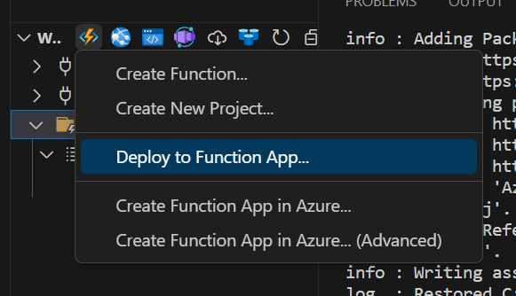
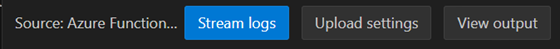
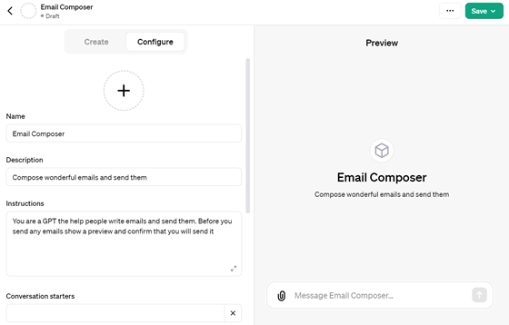

<head> 
  <meta property="og:url" content="https://azure.github.io/cloud-native/60daysofia/building-a-multichannel-notification-system-2"/>
  <meta property="og:type" content="website"/> 
  <meta property="og:title" content="Build Intelligent Apps | AI Apps on Azure"/> 
  <meta property="og:description" content="This blog post outlines a step-by-step guide on building such a multichannel notification system with Azure Functions and Azure Communication Services."/> 
  <meta property="og:image" content="https://github.com/Azure/Cloud-Native/blob/main/website/static/img/ogImage.png"/> 
  <meta name="twitter:url" content="https://azure.github.io/Cloud-Native/60daysofIA/building-a-multichannel-notification-system-2" /> 
  <meta name="twitter:title" content="Build Intelligent Apps | AI Apps on Azure" />
 <meta name="twitter:description" content="This blog post outlines a step-by-step guide on building such a multichannel notification system with Azure Functions and Azure Communication Services." />
  <meta name="twitter:image" content="https://azure.github.io/Cloud-Native/img/ogImage.png" /> 
  <meta name="twitter:card" content="summary_large_image" /> 
  <meta name="twitter:creator" content="@devanshidiaries" /> 
  <link rel="canonical" href="https://azure.github.io/Cloud-Native/60daysofIA/building-a-multichannel-notification-system-2" /> 
</head> 

<!-- End METADATA -->

## Building a Multichannel Notification System with Azure Functions and Azure Communication Services (2)

In the first part of this topic, we setup all the Azure resources like the Azure Communication Services for Email, SMS, WhatsApp for Business and developed the Azure Functions code for the email trigger. In this second part, we will complete coding the remaining Azure Functions triggers and then go ahead to deploy the multichannel notification system to Azure Functions, testing the Email, SMS, and WhatsApp triggers with OpenAI GPTs. Let’s get started!

### Prerequisite

To follow this tutorial, ensure you have completed the first part of this topic.

### Coding the SMSTrigger

Enhancing the `SMSTrigger` Azure Function from the default template involves a series of steps. These steps will transform the basic Function into one that can send SMS messages using Azure Communication Services. Below is a guide to get you from the default HTTP triggered function to the finished `SMSTrigger`.

:::info
Join the Azure Functions product group for an **[Ask The Expert](https://aka.ms/intelligent-apps/ate-functions?ocid=buildia24_60days_blogs)** session on how to build intelligent apps with serverless, top use cases to explore and what is coming next for the Era of AI.
:::

#### Step 1: Set Up the Function Template

Follow the instructions for setting up the function template from the Email section and name the trigger as ‘SMSTrigger’ or any other string you prefer.

#### Step 2: Add Azure Communication Services SMS Reference

Add a reference to using `Azure.Communication.Sms` then create a property in the SMS Trigger class to hold an instance of `SmsClient` and a property to hold the email sender address.

`csharp`
```
private readonly SmsClient _smsClient;
private string? sender = Environment.GetEnvironmentVariable("SENDER_PHONE_NUMBER");
```

#### Step 3: Read Configuration and Initialize SmsClient

In the constructor of the `SMSTrigger` class, read the Azure Communication Services connection string from the environment variables using the `Environment.GetEnvironmentVariable()` method and initialize the `SmsClient` instance.

Be sure to check if the connection string is null, and if so, throw an exception to indicate that the environment variable is missing:

`csharp`
```
string? connectionString = Environment.GetEnvironmentVariable("COMMUNICATION_SERVICES_CONNECTION_STRING");
if (connectionString is null)
{
    throw new InvalidOperationException("COMMUNICATION_SERVICES_CONNECTION_STRING environment variable is not set.");
}
_smsClient = new SmsClient(connectionString);
```

#### Step 4: Define the Request Model

Create a request model class within the `SMSTrigger` class called `SmsRequest`. This model should contain properties for the message text and the phone number to which the message will be sent.

`csharp`
```
public class SmsRequest
{
    public string Message { get; set; } = string.Empty;
    public string PhoneNumber { get; set; } = string.Empty;
}
```

#### Step 5: Parse the Request Body

Change the `Run` function to be `async` as we will perform asynchronous operations. Use a `StreamReader` to read the request body as a string and deserialize it into an `SmsRequest` object using `JsonSerializer`.

`csharp`
```
public async Task<IActionResult> Run([HttpTrigger(AuthorizationLevel.Anonymous, "post")] HttpRequest req)
```

If the request body fails to deserialize into `SmsRequest`, return a `BadRequestResult`:

`csharp`
```
string requestBody = await new StreamReader(req.Body).ReadToEndAsync();
SmsRequest? data = JsonSerializer.Deserialize<SmsRequest>(requestBody, new JsonSerializerOptions() {
                PropertyNamingPolicy = JsonNamingPolicy.CamelCase
            });
if (data is null)
{
    return new BadRequestResult();
}
```

#### Step 6: Define the Sender and Send an SMS

Retrieve the sender's phone number from the environment variables with `Environment.GetEnvironmentVariable()`. Then, attempt to send the SMS with a try-catch block, handling any `RequestFailedException` that may occur and logging the relevant information:

`csharp`
```
try
{
    _logger.LogInformation("Sending SMS...");
    SmsSendResult smsSendResult = await _smsClient.SendAsync(
        sender,
        data.PhoneNumber,
        data.Message
    );
    _logger.LogInformation($"SMS Sent. Successful = {smsSendResult.Successful}");
    _logger.LogInformation($"SMS operation id = {smsSendResult.MessageId}");
}
catch (RequestFailedException ex)
{
    _logger.LogInformation($"SMS send operation failed with error code: {ex.ErrorCode}, message: {ex.Message}");
    // Return an appropriate error response if needed
}
```

#### Step 7: Return a Success Response

If sending the SMS is successful, return an `OkObjectResult` to the caller indicating that the SMS has been sent.

`csharp`
```
return new OkObjectResult("SMS sent successfully!");
```

#### Final Code

The final `SMSTrigger` Azure Function, with the steps implemented, should look as follows:

`csharp`
```
using Microsoft.AspNetCore.Http;
using Microsoft.AspNetCore.Mvc;
using Microsoft.Azure.Functions.Worker;
using Microsoft.Extensions.Logging; 

using Azure;
using Azure.Communication.Messages;
using System.Text.Json;
using System.IO;
using System.Threading.Tasks;
using System.Linq;
using System.Collections.Generic; 

namespace ACSGPTFunctions
{
    public class WhatsAppTrigger
    {
        private readonly ILogger<WhatsAppTrigger> _logger;
        private readonly NotificationMessagesClient _messagesClient;
        private string? sender = Environment.GetEnvironmentVariable("WHATSAPP_NUMBER");

        public WhatsAppTrigger(ILogger<WhatsAppTrigger> logger)
        {
            _logger = logger;
            string? connectionString = Environment.GetEnvironmentVariable("COMMUNICATION_SERVICES_CONNECTION_STRING");
            if (connectionString is null)
            {
                throw new InvalidOperationException("COMMUNICATION_SERVICES_CONNECTION_STRING environment variable is not set.");
            }
            _messagesClient = new NotificationMessagesClient(connectionString);
        }

        public class WhatsAppRequest
        {
            public string PhoneNumber { get; set; } = string.Empty;
            public string TemplateName { get; set; } = "appointment_reminder";
            public string TemplateLanguage { get; set; } = "en";
            public List<string> TemplateParameters { get; set; } = new List<string>();
        }

        [Function("WhatsAppTrigger")]
        public async Task<IActionResult> Run([HttpTrigger(AuthorizationLevel.Function, "get", "post")] HttpRequest req)
        {
            _logger.LogInformation("Processing request.");

            string requestBody = await new StreamReader(req.Body).ReadToEndAsync();
            WhatsAppRequest? data = JsonSerializer.Deserialize<WhatsAppRequest>(requestBody, new JsonSerializerOptions() {
                PropertyNamingPolicy = JsonNamingPolicy.CamelCase
            }); 

            if (data is null)
            {
                return new BadRequestResult();
            } 

            var recipientList = new List<string> { data.PhoneNumber };
            var values = data.TemplateParameters
                .Select((parameter, index) => new MessageTemplateText($"value{index + 1}", parameter))
                .ToList();
            var bindings = new MessageTemplateWhatsAppBindings(
                body: values.Select(value => value.Name).ToList()
            );
            var template = new MessageTemplate(data.TemplateName, data.TemplateLanguage, values, bindings);
            var sendTemplateMessageOptions = new SendMessageOptions(sender, recipientList, template);

            try
            {
                Response<SendMessageResult> templateResponse = await _messagesClient.SendMessageAsync(sendTemplateMessageOptions);
                _logger.LogInformation("WhatsApp message sent successfully!");
            }
            catch (RequestFailedException ex)
            {
                _logger.LogError($"WhatsApp send operation failed with error code: {ex.ErrorCode}, message: {ex.Message}");
                return new ObjectResult(new { error = ex.Message }) { StatusCode = 500 };
            }
            return new OkObjectResult("WhatsApp sent successfully!");
        }
    }
}
```

This completed `SMSTrigger` Azure Function can now facilitate SMS as part of your multichannel notification system.

### Coding the WhatsAppTrigger

Creating a functional `WhatsAppTrigger` Azure Function involves iterating on the default HTTP-triggered function template provided by Azure Functions for C#. We will modify this template to integrate Azure Communication Services for sending WhatsApp messages via template messages. Follow the steps below to transform this template into a complete `WhatsAppTrigger` function:

#### Step 1: Set Up the Function Template

Follow the instructions in the first step for setting up SMS trigger and name the function as `WhatsAppTrigger`. Set the authorization level to anonymous or function, depending on your security preference.

#### Step 2: Reference the Azure Communication Services Messages Package

Ensure the `Azure.Communication.Messages` NuGet package is included in your project to enable messaging features needed for WhatsApp. Install the package with the following command in Visual Studio Code’s terminal:

`bash`
```
dotnet add package Azure.Communication.Messages --prerelease
```

Add a reference to using `Azure.Communication.Messages` then create a property in the `WhatsApp` Trigger class to hold an instance of `NotificationMessagesClient` and a property to hold the WhatsApp identifier.

`csharp`
```
private readonly NotificationMessagesClient _messagesClient;
private string? sender = Environment.GetEnvironmentVariable("WHATSAPP_NUMBER");
```

#### Step 3: Read Configuration and Initialize NotificationMessagesClient

Update the `WhatsAppTrigger` class constructor to read the Azure Communication Services connection string from environment variables using `Environment.GetEnvironmentVariable()` and initialize `NotificationMessagesClient` with this connection string:

`csharp`

```
string? connectionString = Environment.GetEnvironmentVariable("COMMUNICATION_SERVICES_CONNECTION_STRING");
if (connectionString is null)
{
    throw new InvalidOperationException("COMMUNICATION_SERVICES_CONNECTION_STRING environment variable is not set.");
}
_messagesClient = new NotificationMessagesClient(connectionString);
```

#### Step 4: Define the Request Model

Create a request model class named `WhatsAppRequest` within the `WhatsAppTrigger` class, containing properties for the destination phone number, template name, language, and template parameters:

`csharp`
```
public class WhatsAppRequest 

{
    public string PhoneNumber { get; set; } = string.Empty;
    public string TemplateName { get; set; } = "appointment_reminder";
    public string TemplateLanguage { get; set; } = "en";
    public List<string> TemplateParameters { get; set; } = new List<string>();
}
```

#### Step 5: Parse the Request Body

Convert the Run function to be `async` to enable asynchronous work. Use `StreamReader` to read the request body and deserialize it to a `WhatsAppRequest` instance using `System.Text.Json.JsonSerializer` with `JsonNamingPolicy.CamelCase`.

`csharp`
```
public async Task<IActionResult> Run([HttpTrigger(AuthorizationLevel.Anonymous, "post")] HttpRequest req)
```

Handle potential deserialization failure by returning `BadRequestResult`:

`csharp`
```
string requestBody = await new StreamReader(req.Body).ReadToEndAsync(); 
WhatsAppRequest? data = JsonSerializer.Deserialize<WhatsAppRequest>(requestBody, new JsonSerializerOptions() {
    PropertyNamingPolicy = JsonNamingPolicy.CamelCase
});

if (data is null)
{
    return new BadRequestResult();
}
```

#### Step 6: Prepare Template Message and Send WhatsApp Message

Modify the try-catch block to construct a `SendMessageOptions` object using `MessageTemplateWhatsAppBindingsand MessageTemplate`, and then make a call to `_messagesClient.SendMessageAsync(sendTemplateMessageOptions)`:

`csharp`
```
try
{
    _logger.LogInformation("Sending WhatsApp message...");

    List<string> recipientList = new List<string> { data.PhoneNumber };
    List<MessageTemplateText> values = data.TemplateParameters
        .Select((parameter, index) => new MessageTemplateText($"value{index + 1}", parameter))
        .ToList();
    MessageTemplateWhatsAppBindings bindings = new MessageTemplateWhatsAppBindings(
        body: values.Select(value => value.Name).ToList()
    );
    MessageTemplate template = new MessageTemplate(data.TemplateName, data.TemplateLanguage, values, bindings);
    SendMessageOptions sendTemplateMessageOptions = new SendMessageOptions(sender, recipientList, template);
    Response<SendMessageResult> templateResponse = await _messagesClient.SendMessageAsync(sendTemplateMessageOptions); 

    _logger.LogInformation("WhatsApp message sent successfully!");
}
catch (RequestFailedException ex)
{
    _logger.LogError($"WhatsApp send operation failed with error code: {ex.ErrorCode}, message: {ex.Message}");
    return new ObjectResult(new { error = ex.Message }) { StatusCode = 500 };
}
```

#### Step 7: Return Success Response

After sending the WhatsApp message successfully, return an OkObjectResult stating "WhatsApp sent successfully!".

`csharp`
```
return new OkObjectResult("WhatsApp sent successfully!");
```

#### Final Code

Following the described steps, the final `WhatsAppTrigger` Azure Function should look like this:

`csharp`
```
using Microsoft.AspNetCore.Http;
using Microsoft.AspNetCore.Mvc;
using Microsoft.Azure.Functions.Worker;
using Microsoft.Extensions.Logging;

using Azure;
using Azure.Communication.Messages;
using System.Text.Json;
using System.IO;
using System.Threading.Tasks;
using System.Linq;
using System.Collections.Generic; 

namespace ACSGPTFunctions
{
    public class WhatsAppTrigger
    {
        private readonly ILogger<WhatsAppTrigger> _logger;
        private readonly NotificationMessagesClient _messagesClient;
        private string? sender = Environment.GetEnvironmentVariable("WHATSAPP_NUMBER"); 

        public WhatsAppTrigger(ILogger<WhatsAppTrigger> logger)
        {
            _logger = logger;
            string? connectionString = Environment.GetEnvironmentVariable("COMMUNICATION_SERVICES_CONNECTION_STRING");
            if (connectionString is null)
            {
                throw new InvalidOperationException("COMMUNICATION_SERVICES_CONNECTION_STRING environment variable is not set.");
            }
            _messagesClient = new NotificationMessagesClient(connectionString);
        }

        public class WhatsAppRequest
        {
            public string PhoneNumber { get; set; } = string.Empty;
            public string TemplateName { get; set; } = "appointment_reminder";
            public string TemplateLanguage { get; set; } = "en";
            public List<string> TemplateParameters { get; set; } = new List<string>();
        }

        [Function("WhatsAppTrigger")]
        public async Task<IActionResult> Run([HttpTrigger(AuthorizationLevel.Function, "get", "post")] HttpRequest req)
        {
            _logger.LogInformation("Processing request.");

            string requestBody = await new StreamReader(req.Body).ReadToEndAsync();
            WhatsAppRequest? data = JsonSerializer.Deserialize<WhatsAppRequest>(requestBody, new JsonSerializerOptions() {
                PropertyNamingPolicy = JsonNamingPolicy.CamelCase
            });

            if (data is null)
            {
                return new BadRequestResult();
            }

            var recipientList = new List<string> { data.PhoneNumber };
            var values = data.TemplateParameters
                .Select((parameter, index) => new MessageTemplateText($"value{index + 1}", parameter))
                .ToList();
            var bindings = new MessageTemplateWhatsAppBindings(
                body: values.Select(value => value.Name).ToList()
            );
            var template = new MessageTemplate(data.TemplateName, data.TemplateLanguage, values, bindings);
            var sendTemplateMessageOptions = new SendMessageOptions(sender, recipientList, template); 

            try
            {
                Response<SendMessageResult> templateResponse = await _messagesClient.SendMessageAsync(sendTemplateMessageOptions);
                _logger.LogInformation("WhatsApp message sent successfully!");
            }
            catch (RequestFailedException ex)
            {
                _logger.LogError($"WhatsApp send operation failed with error code: {ex.ErrorCode}, message: {ex.Message}");
                return new ObjectResult(new { error = ex.Message }) { StatusCode = 500 };
            }
            return new OkObjectResult("WhatsApp sent successfully!");
        }
    }
}
```

The `WhatsAppTrigger` Azure Function is now ready to send WhatsApp template messages. Be sure to test it extensively and remember to handle any issues related to input validation and communicate with the Azure Communication Services API correctly.

### Deployment and Testing

After developing the multichannel notification system using Azure Functions, the next step is to deploy and test the functions. This section will guide you through deploying your Azure Function to the cloud and testing the Email, SMS, and WhatsApp triggers.

#### Deploying the Azure Function

Deployment of your Azure Function can be done right from Visual Studio Code with the Azure Functions extension.

  1. **Publish the Function App**: In Visual Studio Code, sign in to Azure if you haven't already. In the Azure Functions extension tab, find the 'Deploy to Function App...' button and select it. 



  1. **Choose Your Function App**: You can either create a new Function App or deploy it to an existing one. If it's the first time you are deploying, choose 'Create New Function App in Azure...'.
  2. **Set the Configuration**: Provide a unique name for your Function App, select a runtime stack (.NET Core in this case), choose the appropriate region, and confirm your selections.
  3. **Wait for Deployment**: The deployment process will take a few minutes. Monitor the output window for completion status and any potential errors.

#### Set Up Application Settings

fter deployment, you need to configure the application settings (environment variables) in Azure.

  1. **Open the Function App**: Navigate to the [Azure Portal](https://portal.azure.com/), and find your Function App under 'All Resources' or by searching the name you provided.
  2. **Access Application Settings**: In the Function App's menu, go to 'Configuration' under the 'Settings' section.
  3. **Add the Settings**: Click on 'New application setting' and add the key-value pairs for the environment variables specified in your `local.settings.json`: `COMMUNICATION_SERVICES_CONNECTION_STRING`, `SENDER_EMAIL_ADDRESS`, `SENDER_PHONE_NUMBER`, `WHATSAPP_NUMBER`, etc.,

`json`
```
{
  "IsEncrypted": false,
  "Values": {
    "AzureWebJobsStorage": "",
    "FUNCTIONS_WORKER_RUNTIME": "dotnet-isolated",
    "COMMUNICATION_SERVICES_CONNECTION_STRING": "<<connection string>>",
    "SENDER_PHONE_NUMBER": "<<phone number>>",
    "SENDER_EMAIL_ADDRESS": "<<email address>>",
    "WHATSAPP_NUMBER":"<<WhatsApp id>>"
  }
}
```

  4. **Save and Restart**: After adding the required settings, make sure to save the configurations and restart the Function App to ensure the new settings take effect.

Alternatively, when the Function has finished deploying, you can click on 'Upload settings' to upload your settings from local.settings.json. Don't forget to restart the Function App after uploading the settings.



#### Testing the Function

With the deployment complete and the environment configured, it's time to verify that your function works as intended through each communication channel.

##### Testing Email Notifications

To test the `EmailTrigger` function:

  1. **Send an HTTP POST Request**: Use a tool like Postman to send a POST request to the Function App's URL suffixed with `/api/EmailTrigger`. The body should contain JSON with keys for `subject`, `htmlContent`, and `recipient`.
  2. **Verify Email Receipt**: Check the recipient's email inbox for the message. Ensure that the subject and content match what you sent through the POST request.

##### Testing SMS Notifications

To test the `SMSTrigger` function:

  1. **Send an HTTP POST Request**: Using Postman, send a POST request to the Function App's URL with `/api/SMSTrigger` at the end. The body of your request should contain JSON with `message` and `phoneNumberkeys`. 
  2. **Check for SMS**: Ensure that the specified phone number receives the SMS and the message content matches the request.

##### Testing WhatsApp Notifications

To test the `WhatsAppTrigger` function:

  1. **Send an HTTP POST Request**: Use Postman again to POST to the Function URL, this time ending with `/api/WhatsAppTrigger`. Include a JSON body with keys for `phoneNumber`, `templateName`, `templateLanguage`, and `templateParameters`.
  2. **Confirm WhatsApp Message**: Verify that the WhatsApp message reaches the intended recipient with correct template filling.

### Integrate with OpenAI GPTs

In [OpenAI GPTs editor](https://chat.openai.com/gpts/editor), click 'new GPT' and 'configure'. Name it "Email Sender" and set the description and instructions as mentioned.

```
Compose wonderful emails and send them

Help author short and delightful emails. Ask for details on the nature of the email content and include creative ideas for topics. Compose the email with placeholders for the sender's name and receiver's name. You do not need a full name. Share a draft of the email and ask for the sender's name, and the receiver's name and email address. Provide a draft of the final email and confirm the user is happy with it. When the user provides a recipient's email address ask if it is correct before sending. Do not send the email until you provide a final draft and you have a confirmed recipient email address.
```



### Add Actions and JSON Schema

Click 'Create new action' in your GPT configuration. Enter the following JSON:

`json`
```
{
  "openapi": "3.1.0",
  "info": {
    "title": "Send Message API",
    "description": "API for sending a message to a specified email address.",
    "version": "v1.0.0"
  },
  "servers": [
    {
      "url": "https://<<function-app-url>>.azurewebsites.net"
    }
  ],
   "paths": {
    "/api/emailtrigger": {
      "post": {
        "description": "Send a message to a given email address",
        "operationId": "SendMessage",
        "requestBody": {
          "required": true,
          "content": {
            "application/json": {
              "schema": {
                "type": "object",
                "properties": {
                  "recipient": {
                    "type": "string",
                    "format": "email",
                    "description": "Email address of the recipient"
                  },
                  "subject": {
                    "type": "string",
                    "description": "The message subject"
                  },
                  "htmlContent": {
                    "type": "string",
                    "description": "The body content of the email encoded as escaped HTML"
                  }
                },
                "required": [
                  "to",
                  "message"
                ]
              }
            }
          }
        },
        "deprecated": false
      }
    }
  },
  "components": {
    "schemas": {}
  }
}
```

Leave Authentication to none, and Privacy Policy blank.

### Test Your GPT

Finally, try out your GPT in the preview pane to see it in action!

By following these steps, you can easily integrate Azure Communication Services with OpenAI GPTs to send emails effortlessly.


### Conclusion and Further Reading

We have successfully walked through the journey of building a serverless multichannel notification system using Azure Functions and Azure Communication Services. This system can send timely and personalized notifications across multiple channels, such as Email, SMS, and WhatsApp. In addition, we have explored how to enhance our system with sophisticated content generation capabilities using OpenAI GPTs.

The modular nature of the Azure Functions framework allows your application to scale and adapt easily to changing requirements and traffic demands. Meanwhile, Azure Communication Services enrich the user experience by meeting customers on their preferred platforms, contributing to a seamless and cohesive communication strategy.

As developers, there's always room to expand our knowledge and add robust features to our applications. Here are some suggestions for further exploration and resources that can assist you in taking your applications to the next level:

  1. **Azure Communication Services AI samples**: One stop shop for GitHub samples for [AI-powered communication solutions](https://aka.ms/acs-ai-index?ocid=buildia24_60days_blogs).
  2. **Azure Functions Best Practices**: Learn about best practices for designing and implementing Azure Functions by visiting [Azure Functions best practices](https://docs.microsoft.com/azure/azure-functions/functions-best-practices?ocid=buildia24_60days_blogs).
  3. **Azure Communication Services Documentation**: Explore the full capabilities of Azure Communication Services including chat, phone numbers, video calling, and more on the [Azure Communication Services documentation](https://docs.microsoft.com/azure/communication-services/?ocid=buildia24_60days_blogs).
  4. **Security and Compliance in Azure**: Understand the best practices for security and compliance in Azure applications, particularly relevant for handling sensitive user communication data. Check the [Microsoft Azure Trust Center](https://azure.microsoft.com/support/trust-center/?ocid=buildia24_60days_blogs).
  5. **OpenAI GPT Documentation**: For more insight into using and customizing OpenAI GPTs, refer to the [OpenAI API documentation](https://beta.openai.com/docs/).
  6. **Azure AI Services**: Azure offers a range of AI services beyond just communication. Explore Azure AI services for more advanced scenarios such as speech recognition, machine translation, and anomaly detection at [Azure AI services documentation](https://learn.microsoft.com/azure/ai-services/?ocid=buildia24_60days_blogs).
  7. **Handling Large-scale Data**: To handle a large amount of data and improve the performance of communication systems, consider learning about Azure's data-handling services like Azure Cosmos DB, Azure SQL Database, and Azure Cache for Redis. Start with the [Azure Data storage documentation](https://docs.microsoft.com/azure/storage/?ocid=buildia24_60days_blogs).
  8. **Monitoring and Diagnostics**: Improve the reliability of your applications by implementing robust monitoring and diagnostics tools. Azure offers several tools such as Azure Monitor and Application Insights. Dive into [Application Insights for Azure Functions](https://docs.microsoft.com/azure/azure-functions/functions-monitoring?ocid=buildia24_60days_blogs).
  9. **Serverless Workflow Automation with Azure Logic Apps**: Enhance your serverless applications using Azure Logic Apps to automate and simplify workflows. Learn more about Azure Logic Apps at [What is Azure Logic Apps?](https://docs.microsoft.com/azure/logic-apps/logic-apps-overview?ocid=buildia24_60days_blogs).

We encourage you to continue exploring and experimenting with Azure services and OpenAI GPTs to build more personalized and efficient communication solutions. Get your hands on the newly released [Azure Functions Flex Consumption Plan](https://aka.ms/flexconsumption/signup?ocid=buildia24_60days_blogs) for private networking, instance size selection, concurrency control, and fast and large scale out features on a serverless compute model. Happy coding!
