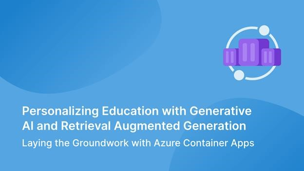
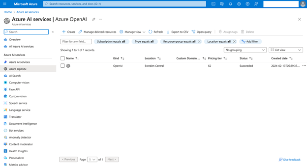
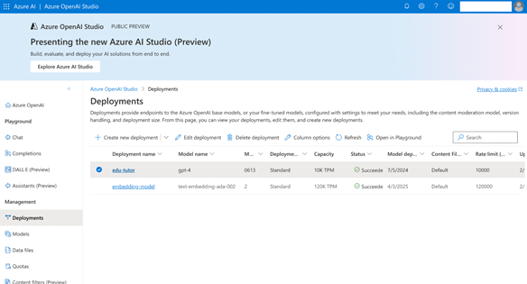
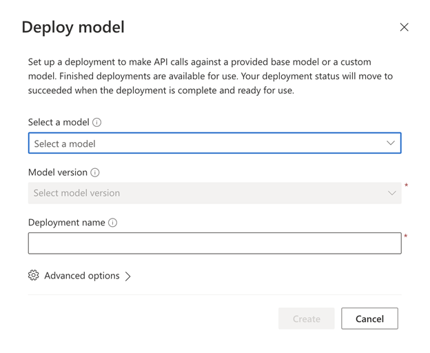

<head> 
  <meta property="og:url" content="https://azure.github.io/cloud-native/60daysofia/personalizing-education-with-generative-ai-and-retrieval-augmented-generation-1"/>
  <meta property="og:type" content="website"/> 
  <meta property="og:title" content="Build Intelligent Apps | AI Apps on Azure"/> 
  <meta property="og:description" content="In this three-part series, you’ll use Azure Container Apps, Azure OpenAI Service, and Retrieval Augmented Generation to create a personal tutor chatbot that dynamically adjusts educational materials and quizzes based on user interactions. This article shows how to set up the core Azure AI services required to build your Intelligent App."/> 
  <meta property="og:image" content="https://github.com/Azure/Cloud-Native/blob/main/website/static/img/ogImage.png"/> 
  <meta name="twitter:url" content="https://azure.github.io/Cloud-Native/60daysofIA/personalizing-education-with-generative-ai-and-retrieval-augmented-generation-1" /> 
  <meta name="twitter:title" content="Build Intelligent Apps | AI Apps on Azure" />
 <meta name="twitter:description" content="In this three-part series, you’ll use Azure Container Apps, Azure OpenAI Service, and Retrieval Augmented Generation to create a personal tutor chatbot that dynamically adjusts educational materials and quizzes based on user interactions. This article shows how to set up the core Azure AI services required to build your Intelligent App." />
  <meta name="twitter:image" content="https://azure.github.io/Cloud-Native/img/ogImage.png" /> 
  <meta name="twitter:card" content="summary_large_image" /> 
  <meta name="twitter:creator" content="@devanshidiaries" /> 
  <link rel="canonical" href="https://azure.github.io/Cloud-Native/60daysofIA/personalizing-education-with-generative-ai-and-retrieval-augmented-generation-1" /> 
</head> 

<!-- End METADATA -->

## Personalizing Education with Generative AI and Retrieval Augmented Generation Part 1: Laying the Groundwork with Azure Container Apps

Tired of one-size-fits-all learning? Imagine a virtual tutor that adjusts to your specific needs and helps you understand complex topics. That’s the power of Intelligent Apps — apps that leverage machine learning (ML), data analytics, and predictive/generative artificial intelligence (AI) to create dynamic, interactive user experiences.

In this three-part series, you’ll build an education app that uses generative AI and Retrieval Augmented Generation (RAG) to create customized lessons, answer users’ questions in detail, and generate quizzes that adapt to their progress. You’ll use several exciting Azure technologies:

* [Azure OpenAI Service](https://azure.microsoft.com/products/ai-services/openai-service?ocid=buildia24_60days_blogs) — Provides the core AI capabilities for your app
* [Azure AI Search](https://azure.microsoft.com/products/ai-services/ai-search?ocid=buildia24_60days_blogs) — Offers a knowledge base that your app can access using RAG, allowing the large language model (LLM) to provide more accurate explanations
* [Azure Container Apps](https://azure.microsoft.com/products/container-apps?ocid=buildia24_60days_blogs) — Lets you easily package and run apps in a flexible and scalable environment.

Let’s get started!

### Prerequisites

To follow this tutorial, ensure you have the following:

* Python 3.10 or later
* Dave Kuhlman’s open-source Python knowledge base downloaded as an HTML file
* An Azure subscription with access to the Azure OpenAI Service. Note that you need to request access to this service.
* The Azure command-line interface (CLI) installed
An Azure resource group

### Build a Personal Tutor with AI and Azure Container Apps

In this first part of the series, you’ll build the foundation for an AI-powered Python tutor. This tutor will use a knowledge base to answer your Python questions of varying difficulties and create tailored quizzes.

#### Creating an Azure Storage Account for RAG Data

Start by creating a space to store the knowledge base that your chatbot will use for RAG. Sign in to the Azure portal and search “Storage accounts” in the search bar. Click + **Create** to start a new storage account.

On the **Basics** tab, set the following configurations:

* **Subscription** — Select the same subscription as your resource group.
* **Resource group** — Select the resource group you created earlier.
* **Storage account name** — Enter a unique name for your storage account.
* **Region** — Choose a region according to your preference.
* **Pricing tier** — Select Standard S0.

For the other tabs, keep the default settings.

Finally, click **Review + Create**, and then **Create**.

Next, you’ll upload the knowledge base linked in this tutorial’s prerequisites. Use HTML formatting for this project.

Once you have created your storage account, navigate to it from the Azure portal and click **Upload**. In the window that appears, create a new container, give it a descriptive name, and check **Private (no anonymous access)**. Select the newly created container and click **Browse for files**. Select the file or folder you want to upload. Then, click **Upload** to upload the blob.

:::info
Register for **[Episode 4](https://aka.ms/serverless-learn-live/ep4?ocid=buildia24_60days_blogs)** of the new learning series on **Intelligent Apps with Serverless on Azure**.
:::

Join the community along with MVPs, and the Azure Product Group on how to leverage AI with Serverless on Azure technologies—Azure Container Apps and Azure Functions—to build intelligent applications.

#### Creating an Azure OpenAI Service

With your knowledge base ready, you’ll now set up the core AI component: an Azure OpenAI service that uses RAG to access this knowledge base and generate customized lessons and quizzes.

In the Azure portal search bar, search “Azure OpenAI.” Click + **Create** to start a new service.

Match the **Basics** tab configurations to the following:

* **Subscription** and **Resource group** — Ensure these match your previous Azure resources for consistency.
* **Region** — This demonstration uses Sweden Central as the region. Note that some models are only available in [limited regions](https://learn.microsoft.com/en-us/azure/ai-services/openai/concepts/models#gpt-4-and-gpt-4-turbo-preview), so be sure to select the right region.
* **Name** — Create a unique name for your OpenAI resource.
* **Pricing tier** — Select **Standard S0**.

Click **Next**.

On the **Networking** tab, select **All networks, including the internet, can access this resource**. 

Finally, click **Review + Create**, and then **Create**. 

Once your Azure OpenAI service is ready, you’ll set up the necessary AI models. Within your Azure OpenAI resource, click **Go to Azure OpenAI Studio**. Then, under **Management** on the left pane, select **Deployments**.

Click **+ Create new deployment**. You’ll deploy two models for your application:

* `text-embedding-ada-002` to create the embeddings of the knowledge base
* GPT-4 to generate personalized courses and quizzes

#### Creating an Azure AI Search Resource

With your AI models in place, it’s time to make your knowledge base easily accessible to them.

In the Azure OpenAI Studio, navigate to **Playground** and select **Chat**. Locate the **Add your data** option and click + **Add a data source**.

A window will open where you can connect to the Azure Blob Storage you created earlier. Use the following configurations for the data source:

* **Select data source** — Select **Azure Blob Storage**.
* **Subscription** — Choose the same subscription as your other services.
* **Select Azure Blob storage resource** — Select the storage account you created.
* **Select storage container** — Select the container that has your knowledge base.
* **Select Azure AI Search resource** — Create a new Azure AI Search resource.

![Screenshot of the for to select or add  a data source . It includes the following fields: Select data source, Subscription. Select Azure Blob storage resource, Select storage container, Select Azure AI Search resource, Enter the index name, and Index schedule. There's a checkbox, selected here, for Add vector search to this search resource. Below is an Embedding model heading, with a Select an embedding model field below. Azure OpenAI - embedding-model is selected. Below is a checkbox, selected, for acknowledging you'll incur costs for usage. The bottom of the page has two buttons: Next and Cancel.](../../static/img/60-days-of-ia/blogs/2024-04-08/7-1-10.png)

Since you don’t have an existing Search resource, select **Create a new Azure AI Search resource**, hyperlinked under the **Select Azure AI Search resource** dropdown. Azure AI Search makes the content of your knowledge base searchable by converting the data into numeric representations called vectors. These vectors capture the meaning and relationships between words.

On the **Basics** tab, configure the resource as follows:

* **Subscription** and **Resource Group** — Choose the same subscription and resource group as your other services.
* **Service name** — Enter a name for your search service.
* **Location** — Choose a location according to your preference.
* **Pricing tier** — Select **Basic**.

